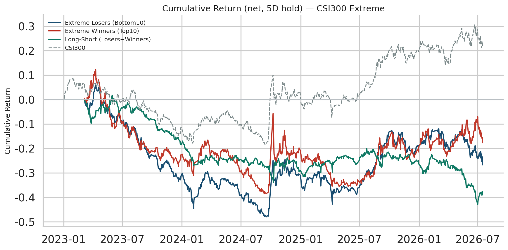
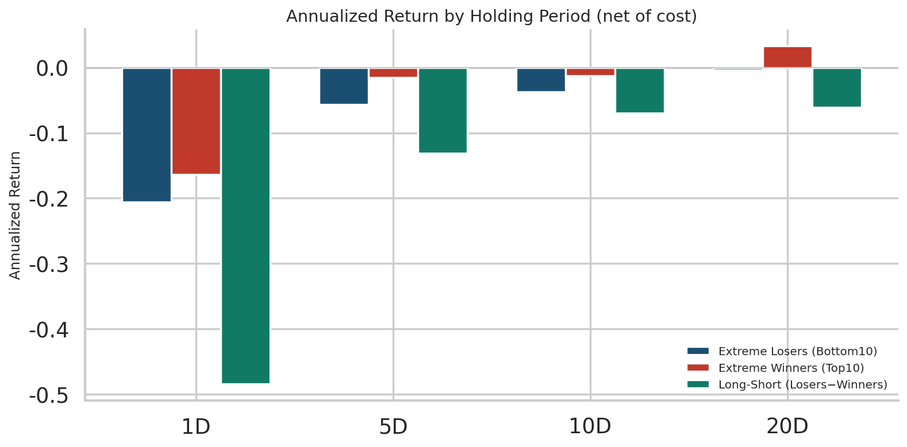
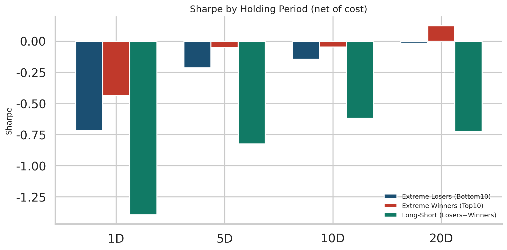
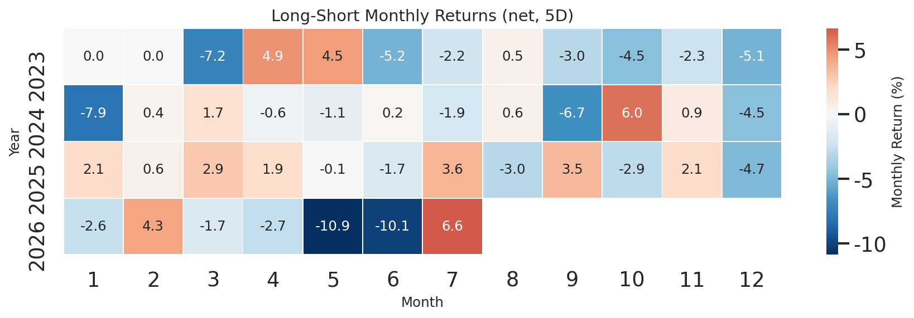
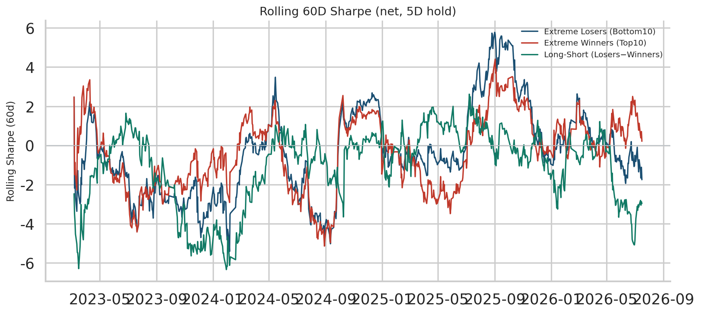
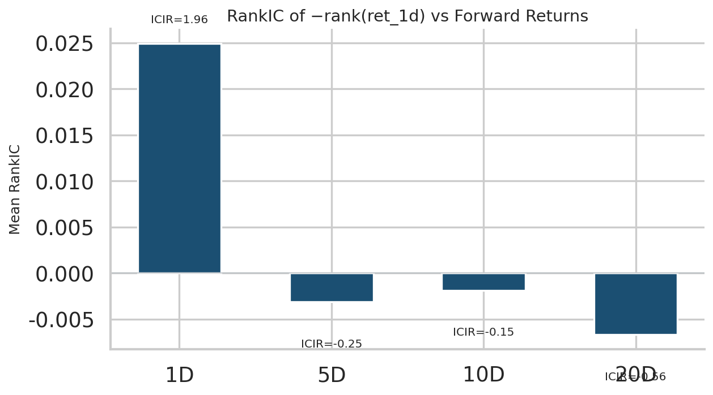
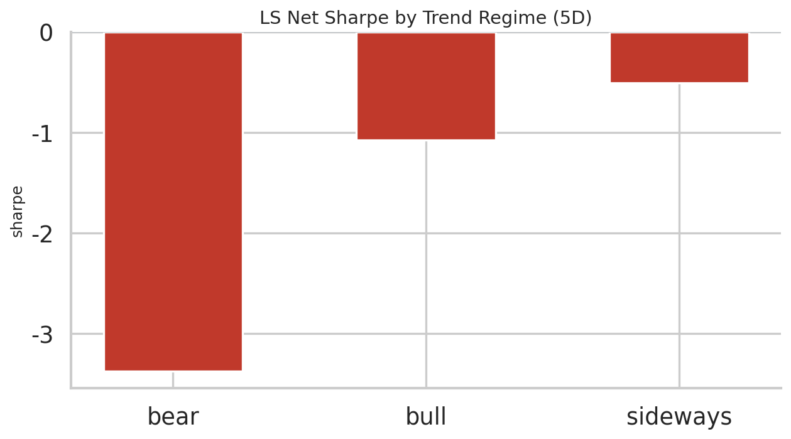
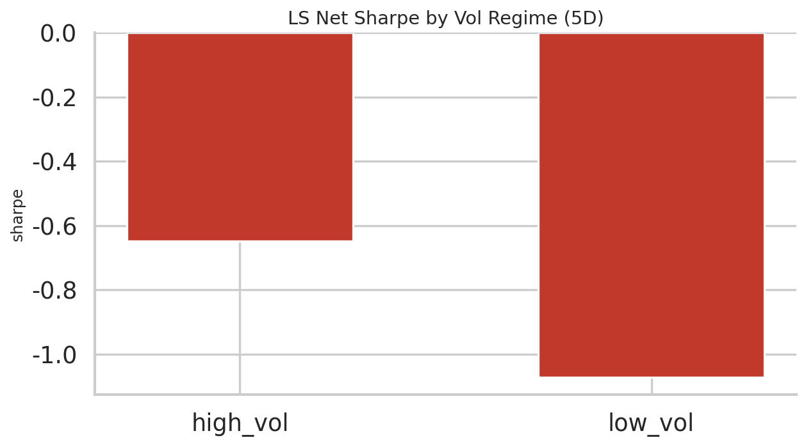

# Extreme Return Effect in CSI300

**Study:** CSI300 Extreme Return Effect Study v1  
**Universe:** CSI300 dynamic constituents (`000300.SH`)  
**Sample:** 2023-01-01 → 2026-07-16  
**Selection:** daily Top/Bottom 10 by close-to-close return  
**Execution:** next-day open (open-to-open overlapping holds; entry_lag=2 on o2o index)  
**Transaction cost:** 10 bps one-way  

---

## 1. Motivation

A classic microstructure / behavioral question:

> In CSI300, do intraday / end-of-day extreme moves exhibit short-term **reversal** or **momentum**?

This note is a clean **behavioral anomaly baseline** (event / extreme-movement family).  
It is intentionally simple — equal-weight Top/Bottom 10 — so that later Alpha Factory factors
(TGD, flow density, volume/liquidity shocks) can be compared against this baseline.

---

## 2. Data

| Field | Source |
|---|---|
| OHLCV | Wind `ASHAREEODPRICES` via project `factor_data_loaders` |
| CSI300 membership | Historical daily weights `AINDEXHS300WEIGHT` (no survivorship bias) |
| Index benchmark | Wind `AINDEXEODPRICES` / `000300.SH` |
| Tradability | not limit-up/down, not ST, not suspended, IPO seasoning ≥60d |

**Universe diagnostics**

- Mean daily CSI300 names with valid return: **300.0**
- Min / Max: **300** / **300**

---

## 3. Methodology

**Signal (formation day t)**

\[
r_{i,t} = \frac{Close_{i,t}}{Close_{i,t-1}} - 1
\]

- Extreme losers \(L_t\): bottom 10 by \(r_{i,t}\) inside CSI300 + tradable filter  
- Extreme winners \(W_t\): top 10

**No look-ahead:** portfolios enter at next open (`entry_lag=2` on o2o
return index: formation close t → buy open t+1 → first return open[t+2]/open[t+1]-1), returns use open-to-open.

**Overlapping holds:** for horizon H, H overlapping cohorts are equally blended (Jegadeesh–Titman style).

---

## 4. Portfolio Construction

| Strategy | Definition |
|---|---|
| Bottom10 | Equal-weight long extreme losers |
| Top10 | Equal-weight long extreme winners |
| Long-short | Bottom10 − Top10 |

Holding periods: **1 / 5 / 10 / 20** trading days.

Net return:

\[
NetReturn_t = GrossReturn_t - Turnover_t \times Cost
\]

---

## 5. Performance

### Headline answers (net of cost, 5D hold)

| Question | Answer |
|---|---|
| Does extreme **loser reversal** exist? | **Weak / No** — LS mean daily -0.00052, Bottom vs Top annu -5.66% vs -1.52% |
| Does extreme **winner momentum** exist? | **No** — Top10 mean daily -0.00006 |
| Best holding period (LS net Sharpe) | **10D** (Sharpe -0.62) |
| Robust after 10bps cost? | **No / Marginal** — LS net Sharpe -0.82 (gross -0.26) |
| Best market regime (trend) | **sideways** |

### Gross of cost

| Strategy | Hold | Annu Ret | Vol | Sharpe | MDD | WinRate | Avg TO |
|---|---:|---:|---:|---:|---:|---:|---:|
| bottom10 | 1D | 1.63% | 28.68% | 0.06 | -51.71% | 45.85% | 0.887 |
| long_short | 1D | -4.11% | 34.74% | -0.12 | -52.17% | 48.54% | 1.771 |
| top10 | 1D | 5.74% | 37.41% | 0.15 | -44.68% | 46.32% | 0.884 |
| bottom10 | 5D | -1.14% | 26.50% | -0.04 | -47.78% | 46.08% | 0.181 |
| long_short | 5D | -4.11% | 15.92% | -0.26 | -26.54% | 44.91% | 0.360 |
| top10 | 5D | 2.97% | 29.26% | 0.10 | -41.47% | 46.08% | 0.179 |
| bottom10 | 10D | -1.43% | 25.68% | -0.06 | -45.05% | 44.80% | 0.091 |
| long_short | 10D | -2.40% | 11.24% | -0.21 | -18.93% | 47.02% | 0.182 |
| top10 | 10D | 0.98% | 27.47% | 0.04 | -44.88% | 44.91% | 0.091 |
| bottom10 | 20D | 0.77% | 24.72% | 0.03 | -39.22% | 45.50% | 0.048 |
| long_short | 20D | -3.70% | 8.39% | -0.44 | -21.05% | 45.96% | 0.094 |
| top10 | 20D | 4.47% | 26.82% | 0.17 | -40.15% | 45.85% | 0.047 |

### Net of cost (10 bps one-way)

| Strategy | Hold | Annu Ret | Vol | Sharpe | MDD | WinRate | Avg TO |
|---|---:|---:|---:|---:|---:|---:|---:|
| bottom10 | 1D | -20.55% | 28.67% | -0.72 | -69.14% | 43.51% | 0.887 |
| long_short | 1D | -48.39% | 34.75% | -1.39 | -87.00% | 43.16% | 1.771 |
| top10 | 1D | -16.36% | 37.41% | -0.44 | -61.58% | 43.63% | 0.884 |
| bottom10 | 5D | -5.66% | 26.50% | -0.21 | -51.13% | 45.73% | 0.181 |
| long_short | 5D | -13.10% | 15.92% | -0.82 | -43.89% | 42.69% | 0.360 |
| top10 | 5D | -1.52% | 29.26% | -0.05 | -45.20% | 45.50% | 0.179 |
| bottom10 | 10D | -3.71% | 25.68% | -0.14 | -46.85% | 44.56% | 0.091 |
| long_short | 10D | -6.95% | 11.24% | -0.62 | -25.35% | 46.32% | 0.182 |
| top10 | 10D | -1.29% | 27.47% | -0.05 | -46.68% | 44.80% | 0.091 |
| bottom10 | 20D | -0.42% | 24.72% | -0.02 | -40.23% | 45.38% | 0.048 |
| long_short | 20D | -6.06% | 8.39% | -0.72 | -26.06% | 45.26% | 0.094 |
| top10 | 20D | 3.29% | 26.82% | 0.12 | -41.13% | 45.85% | 0.047 |

---

## 6. Transaction Cost Analysis

Default one-way cost = **10 bps**.  
Extreme portfolios turn over aggressively (near-full replacement most days for 1D hold), so net results are the economically relevant ones.

Primary 5D long-short:

- Gross Sharpe: **-0.26**
- Net Sharpe: **-0.82**
- Avg daily turnover (one-way): **0.360**

---

## 7. IC Analysis

Signal orientation: **−rank(ret_1d)** so positive RankIC ⇒ loser reversal into forward returns.

| Horizon | Mean RankIC | ICIR | Win Rate | N |
|---|---:|---:|---:|---:|
| 1D | 0.0250 | 1.96 | 56.32% | 854 |
| 5D | -0.0031 | -0.25 | 46.47% | 850 |
| 10D | -0.0019 | -0.15 | 48.76% | 845 |
| 20D | -0.0067 | -0.56 | 46.71% | 835 |

---

## 8. Regime Analysis

Long-short net PnL (5D hold), split by market state.

### Trend regime (60d cumulative CSI300)

| Regime | N days | Annu Ret | Sharpe | WinRate |
|---|---:|---:|---:|---:|
| bear | 77 | -37.36% | -3.38 | 37.66% |
| bull | 160 | -23.20% | -1.07 | 45.62% |
| sideways | 618 | -7.47% | -0.51 | 42.56% |

### Volatility regime (20d vol median split)

| Regime | N days | Annu Ret | Sharpe | WinRate |
|---|---:|---:|---:|---:|
| high_vol | 423 | -11.63% | -0.65 | 45.15% |
| low_vol | 423 | -14.85% | -1.07 | 41.13% |

### Same-day market sign

| Regime | N days | Annu Ret | Sharpe | WinRate |
|---|---:|---:|---:|---:|
| down_day | 431 | -18.30% | -1.15 | 41.53% |
| up_day | 424 | -7.82% | -0.49 | 43.87% |

---

## 9. Figures

---

## 10. Conclusion

1. **Reversal vs momentum:** Cross-sectional RankIC at 1D is mildly positive (reversal-oriented, Mean IC≈0.025 / ICIR≈1.96), but equal-weight extreme Top/Bottom-10 portfolios do **not** deliver a robust long-short after next-open execution — and winners do not show clean net momentum either.
2. **Horizon:** Among {1,5,10,20}, net LS Sharpe is least bad at **10D** (still ≤0 in this sample).
3. **Costs matter:** 1D turnover ≈0.9 one-way/day; 10 bps kills gross edges. Prefer ≥5–10D if conditioning this baseline further.
4. **Regime:** Least-bad trend bucket in-sample: **sideways** (still negative LS).
5. **Alpha Factory link:** Treat as baseline family **D6: Event / Extreme Movement**. Next: condition on volume/liquidity shocks, intraday timing (TGD), L2 flow density — the raw extreme-return cut alone is not a standalone alpha in 2023–2026 CSI300.

---

*Generated by `research/extreme_return_study/run_study.py`*
