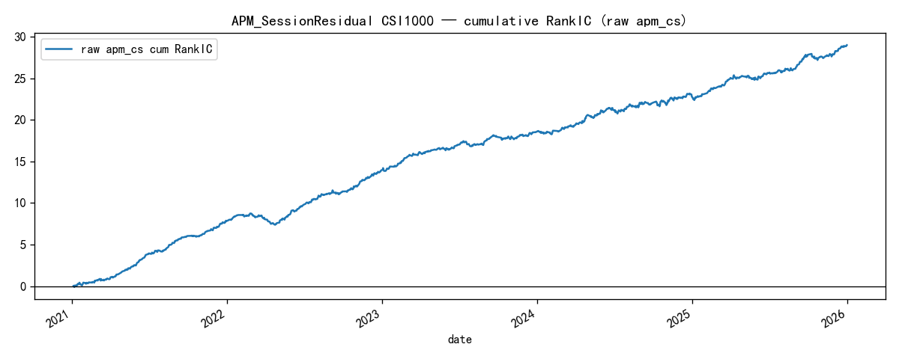
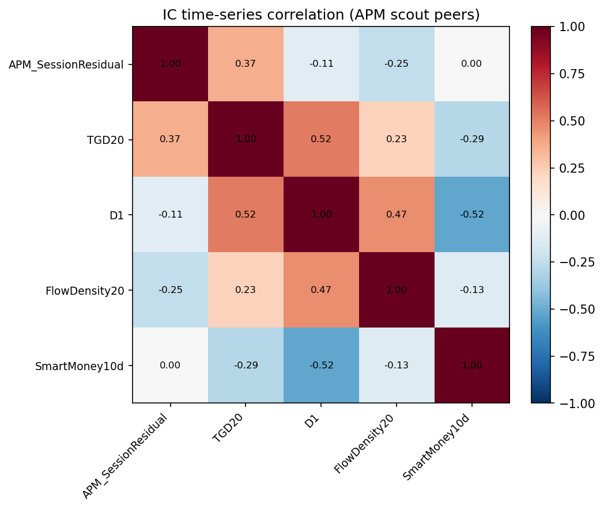

# Executive Summary

## 0.1 Project objective

Build an institutional-grade **A-share alpha factor research pipeline** whose primary deliverable is a **Factor Library**: single-factor assets with identity, frozen formula, validation, and execution evidence — **before** Similarity / Composite / Portfolio optimization.

```text
Research idea
  → Factor identity & formula freeze
  → Implementation / panel
  → Sanity (coverage, PIT, direction)
  → IC / RankIC / ICIR / quantile / stability
  → Execution (turnover, cost, buffer)
  → Factor Pack v1
  → Library row
```

## 0.2 What has been delivered (as of 2026-07-21)

| Tier | Factors | Role |
|------|---------|------|
| Validated | **TGD20** | SI ICIR **11.29**; exact Group10 excess Sharpe **2.16** vs ALL EW |
| Candidate | **D1**, **FlowDensity20** | Independent liquidity / flow sources with Pack v1 |
| Testing candidate | **APM_SessionResidual** | Adapted paper APM; SI ICIR **6.55**, frozen recipe Net **1.50**, TO≈0.28 |
| Testing | **IdealReversal**, **IdealAmplitude** | Cutting-family paper factors; strong ICIR, weak mono → not production |
| Research (parked) | **SmartMoney10d** | Strong abs ICIR; daily execution fails Net bar → parked |
| Design only | **SUE_ConsensusEPS** | C2 identity accepted; scout deferred until after this report |

Source: [`factor_library.csv`](../factors/factor_library.csv) + Pack `summary.yaml` headlines.

## 0.3 Library snapshot (headline metrics)

| Factor | Family | Status | RankIC | ICIR | Long-book excess Sharpe | Notes |
|--------|--------|--------|--------|------|----------------------|-------|
| TGD20 | temporal | validated | +4.15% SI | 11.29 SI | **2.16 exact** | Formula frozen |
| D1_LiquidityQuality60d | liquidity | candidate | +5.73% raw | 6.01 raw | pending exact | Legacy H–L Net 1.38 |
| FlowDensity20 | flow | candidate | +2.36% SI | 4.85 SI | **0.50 exact** | Raw long-book excess ≈ −0.05 |
| APM_SessionResidual | session | testing_candidate | +2.25% SI | 6.55 SI | pending exact | Legacy H–L Net 1.50 |
| IdealReversal | behavior | testing | −3.31% SI | −9.46 SI | pending exact | Mono weak (0.44) |
| IdealAmplitude | behavior | testing | −4.75% SI | −9.97 SI | pending exact | Mono very weak (0.11) |
| SmartMoney10d | microstructure | research | −4.53% raw | −6.09 raw | not required | Parked |

### Example Pack experiment figures (click through Section 4 for full set)

TGD20 IC (Pack):


APM IC (Pack / scout):



Peer IC correlation (from APM scout CSV):



## 0.4 Strategic stance (this report)

1. **Deliver first.** This memo packages what already exists into a reviewer-ready asset.
2. **Figures link to Pack / scout artifacts** — not duplicated schematic copies (see Section 4).
3. **Do not over-claim.** Testing / research factors stay labeled as such.
4. **Combination is illustrative only.** Full TGD paper composite and Similarity→Composite v2 are Stage 2+ (see Section 6 / TODO).

## 0.5 How to read the rest

- Sections 1–3: framework & methodology (shared evaluation language).
- Section 4: one memo per factor (**images = Pack experiment PNGs**).
- Sections 5–8: overlap, light combination, risk, final library classification.
- Appendix + TODO: formulas, code map, missing artifacts.
