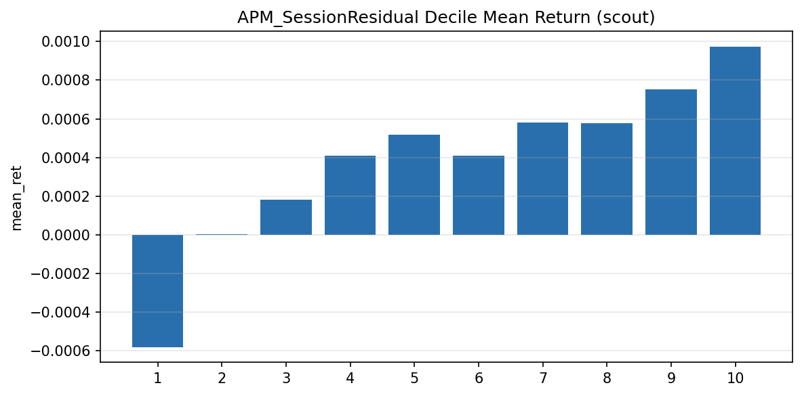
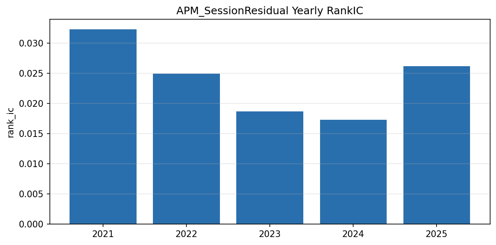
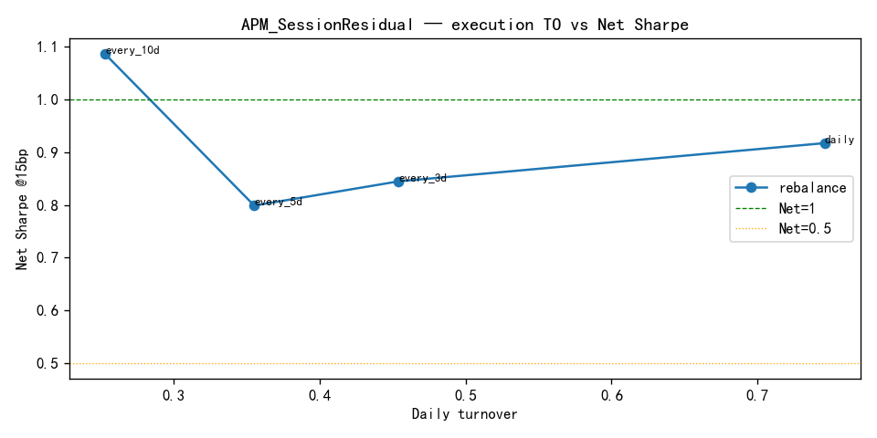

# 4.4 APM_SessionResidual

**Status:** `testing_candidate` · **Family:** session_behavior · **Source:** paper_adapted  
**Pack:** [`research/reports/factors/APM_SessionResidual/`](../../../factors/APM_SessionResidual/)  
**Scout run:** [`research/reports/apm_session_v1/`](../../../apm_session_v1/)  
**Identity:** adapted replication (EOD daytime index proxy)

## 1. Motivation

Overnight vs afternoon (PM) residual α vs index, then CS residual vs Ret20. Captures **session trader mix / timing attribution** — not order-flow Active_* imbalance, not ActiveTradeProxy, not SmartMoney knife.

## 2. Formula (frozen, adapted)

\[
\begin{aligned}
\alpha_{\mathrm{on}} &= R^{\mathrm{stk}}_{\mathrm{on}} - R^{\mathrm{idx}}_{\mathrm{on}} \\
\alpha_{\mathrm{pm}} &= R^{\mathrm{stk}}_{\mathrm{pm}} - R^{\mathrm{idx}}_{\mathrm{day\,proxy}} \\
\Delta\alpha &= \alpha_{\mathrm{on}} - \alpha_{\mathrm{pm}} \\
\mathrm{APM\_stat} &= t\text{-stat}_{20}(\Delta\alpha) \\
\mathrm{apm\_cs} &= \mathrm{CS\text{-}residual}(\mathrm{APM\_stat} \mid \mathrm{Ret20})
\end{aligned}
\]

- Stock PM: Bartime ∈ [13:01, 15:00], first available PM bar rule  
- Index day proxy: `IdxClose/IdxOpen−1` (**adapted** — full daytime, not true PM)  
- Eval signal: `apm_cs`, **positive** direction, **no sign flip**, `shift(1)`

## 3. Implementation

| Item | Value |
|------|-------|
| Universe | CSI1000 |
| Period | 2021-01-01 → 2025-12-31 (1212d) |
| Index | 000852.SH |
| Modules | `apm_session_panel_builder.py`, `apm_session_signal.py` |
| Runners | `run_milestone_c1_apm_session_{panel,sanity,scout,execution}.py` |

## 4. Validation (headline)

| Metric | Value |
|--------|-------|
| RankIC raw / SI | 0.0239 / **0.0225** |
| ICIR raw / SI | 4.10 / **6.55** |
| HL Gross Sharpe | 3.28 |
| Net daily plain @15bp | 0.92 |
| Best Net (frozen recipe) | **1.50** |
| Best daily TO | 0.280 |
| Monotonicity | 0.778 |
| Yearly RankIC + | 5/5 |
| Peer signal corr Flow / TGD / SM | 0.006 / 0.426 / −0.062 |

Frozen recipe: `highAPM | daily | buffer_10_30` @15bp.

### Figures (Pack / scout experiment artifacts)

IC curve (scout → Pack) — `factors/APM_SessionResidual/ic_analysis/ic_curve.png`  
(= `apm_session_v1/scout/ic/ic_curve.png`)

Decile (from scout `decile_return.csv`) — `factors/APM_SessionResidual/quantile_analysis/decile_return.png`

Yearly RankIC (from scout `yearly_ic.csv`) — `factors/APM_SessionResidual/stability/stability_yearly.png`

Turnover / execution curve — `factors/APM_SessionResidual/execution/turnover_curve.png`  
(= `apm_session_v1/execution/turnover_curve.png`)

**Note:** APM Pack currently has no cumulative long-short PNG from the scout runner; CSV-backed decile/yearly plots above are rendered from the same scout CSVs.

## 5. Verdict discipline

Scout class: research-strong / invest requires buffer. Status remains **testing_candidate** — not Registry, not validated.
