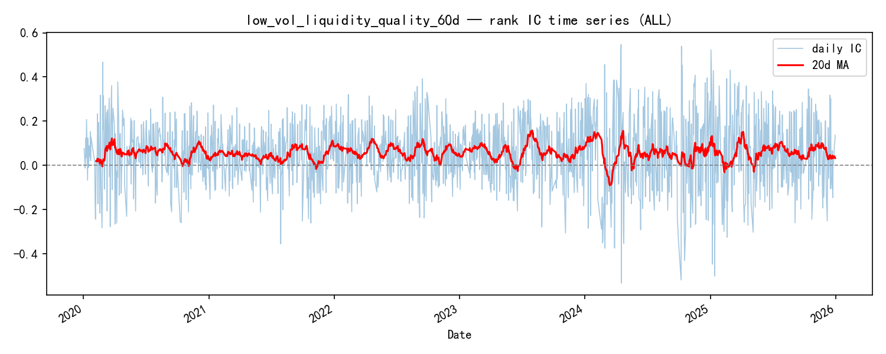
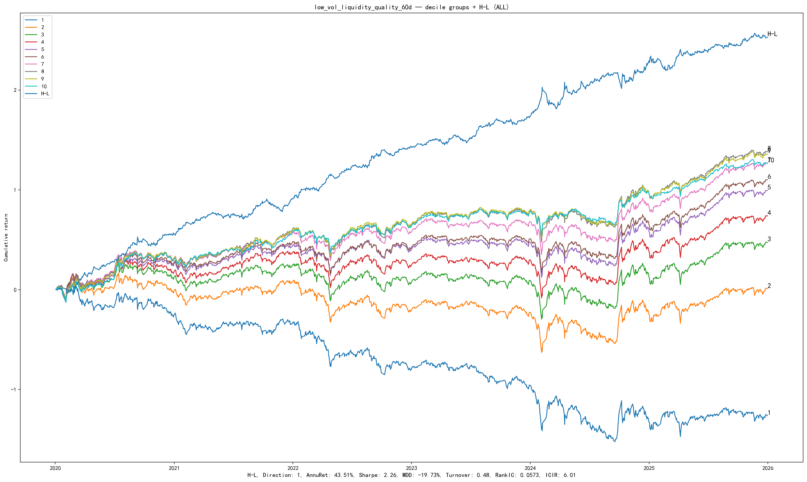
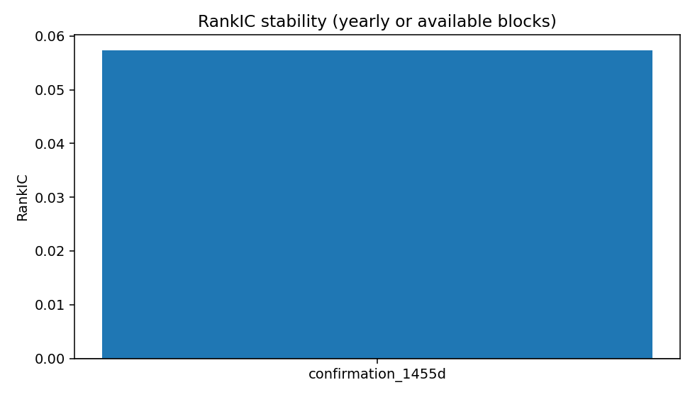
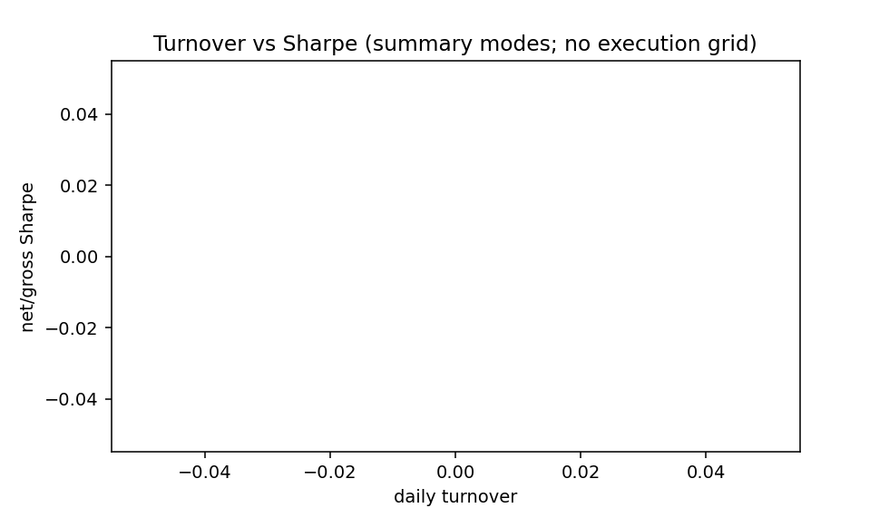

# 4.2 D1_LiquidityQuality60d

**Status:** `candidate` · **Family:** liquidity · **Source:** internal (Base3 D1)  
**Pack:** [`research/reports/factors/D1_LiquidityQuality60d/`](../../../factors/D1_LiquidityQuality60d/)

## 1. Motivation

Low volatility combined with **stable liquidity participation** earns a cross-sectional premium — classical EOD liquidity-quality base, historically stronger on broad ALL than CSI300.

## 2. Formula (frozen)

\[
\mathrm{D1} = \mathrm{CS\text{-}rank\text{-}mean}\big(-\mathrm{vol}_{60d},\; -\mathrm{amount\_cv}_{20d}\big)
\]

Evaluation signal: raw CS z-score; size+industry production signal pending protocol rerun. `shift(1)`.

## 3. Implementation

| Item | Value |
|------|-------|
| Data | EOD OHLCV |
| Modules | `factor_formulas_liquidity_d1.py`, `factor_formulas_eod_engine.py` |
| Period | confirmation_1455d harvest |
| Spec | `factor_specs/D1_LiquidityQuality60d.yaml` |

## 4. Validation (headline)

| Metric | Value |
|--------|-------|
| RankIC raw | **0.0573** |
| ICIR raw | **6.0135** |
| RankIC / ICIR SI | null (pending) |
| HL Sharpe raw | 2.2614 |
| Best Net Sharpe | **1.3777** |
| Best daily TO | 0.2343 |
| Monotonicity | 0.8 |

### Figures (Pack experiment artifacts)

IC — `factors/D1_LiquidityQuality60d/ic_analysis/ic_curve.png`

Decile — `factors/D1_LiquidityQuality60d/quantile_analysis/decile_return.png`

Long-short — `factors/D1_LiquidityQuality60d/quantile_analysis/cumulative_long_short.png`

Yearly stability — `factors/D1_LiquidityQuality60d/stability/stability_yearly.png`

Turnover — `factors/D1_LiquidityQuality60d/execution/turnover.png`

## 5. Caveats

- Do not retune D1 windows under this id.
- Do not claim SI metrics until protocol rerun completes.
- Distinct information family from TGD / Flow / APM (see Section 5 IC corr).
