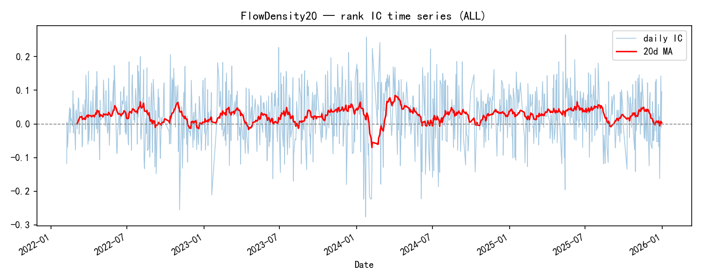
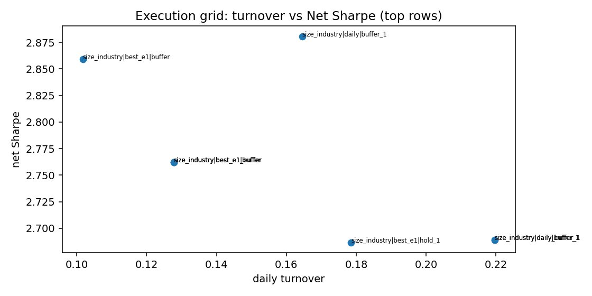

# 4.3 FlowDensity20

**Status:** `candidate` · **Family:** flow / microstructure · **Source:** paper/internal  
**Pack:** [`research/reports/factors/FlowDensity20/`](../../../factors/FlowDensity20/)

## 1. Motivation

Net active flow density scaled by mktcap predicts returns as a **Flow × Liquidity** interaction — not pure directional “smart money.” Amount-orthogonal tests can flip sign; treat mechanism carefully.

## 2. Formula

\[
\mathrm{FlowDensity20} = \mathrm{cs\_zscore}\Big(\mathrm{MA}_{20}\sum(\mathrm{net\_active\_flow}/\mathrm{mktcap})\Big)
\]

`shift(1)`. Headline neutralization: size+industry when available. **Not equal to:** pure smart-money flow; amount channel alone.

## 3. Implementation

| Item | Value |
|------|-------|
| Data | L2 active flow |
| Modules | `factor_formulas_l2_flow_p2.py`, `l2_data_loaders.py` |
| Period actual | 2022-01-28 → 2025-12-31 (951d) |
| Spec | `factor_specs/FlowDensity20.yaml` |

## 4. Validation (headline)

| Metric | Value |
|--------|-------|
| RankIC raw / SI | 0.0178 / **0.0236** |
| ICIR raw / SI | 2.07 / **4.85** |
| HL Sharpe raw / SI | 1.52 / 3.38 |
| **Group10 excess Sharpe vs exact ALL EW, raw / SI** | −0.05 / **0.50** |
| Group10 excess annual return / MDD, SI | 3.98% / −16.77% |
| H–L Net Sharpe SI @15bp | 1.85 (execution diagnostic) |
| Best optimized H–L Net | 2.88 (execution diagnostic) |
| Best daily TO | 0.1645 |
| Yearly RankIC + | 4/4 |

### Figures (Pack experiment artifacts)

IC — `factors/FlowDensity20/ic_analysis/ic_curve.png`

Decile — `factors/FlowDensity20/quantile_analysis/decile_return.png`

Long-short — `factors/FlowDensity20/quantile_analysis/cumulative_long_short.png`

Yearly stability — `factors/FlowDensity20/stability/stability_yearly.png`

Turnover — `factors/FlowDensity20/execution/turnover.png`

## 5. Caveats

- `formula_frozen: false` in summary — mechanism still under orth review.
- Raw Group10 has no market-relative alpha; the positive long-book result
  depends on size/industry neutralization.
- Do not equal-weight with TGD by default without residual / orth analysis.
