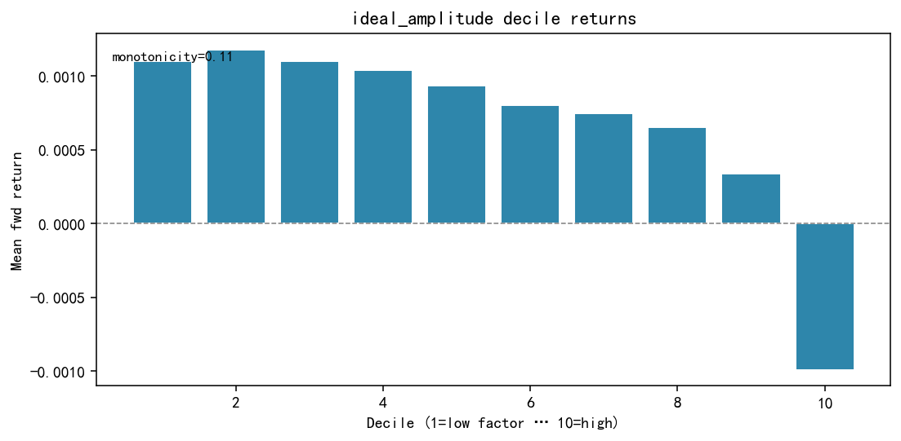
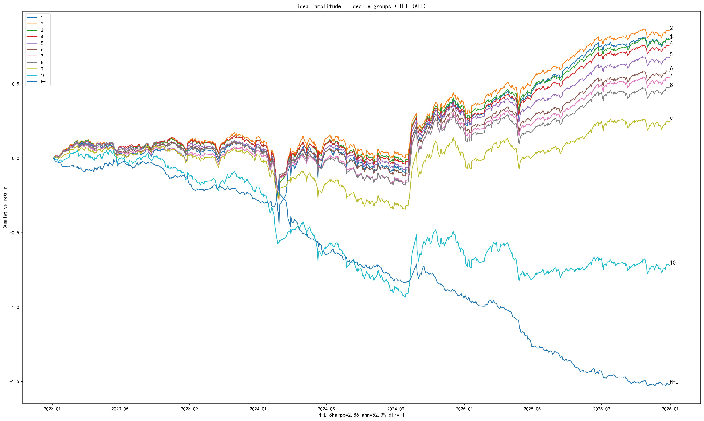
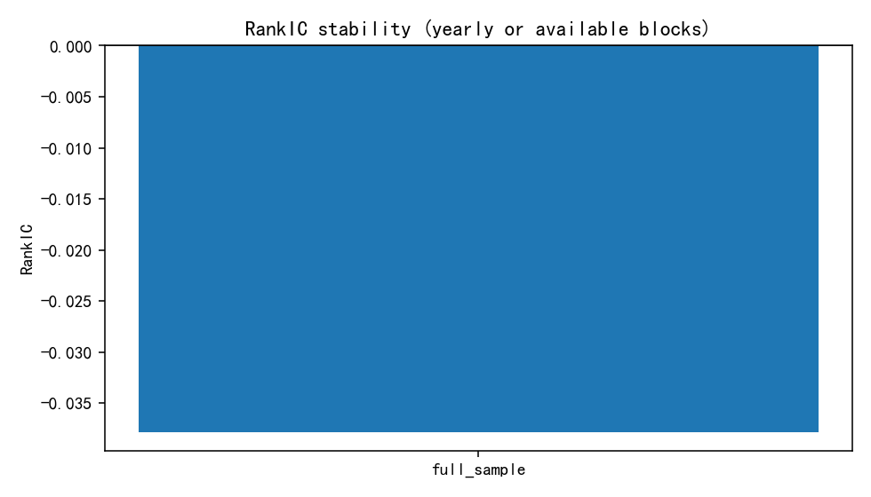
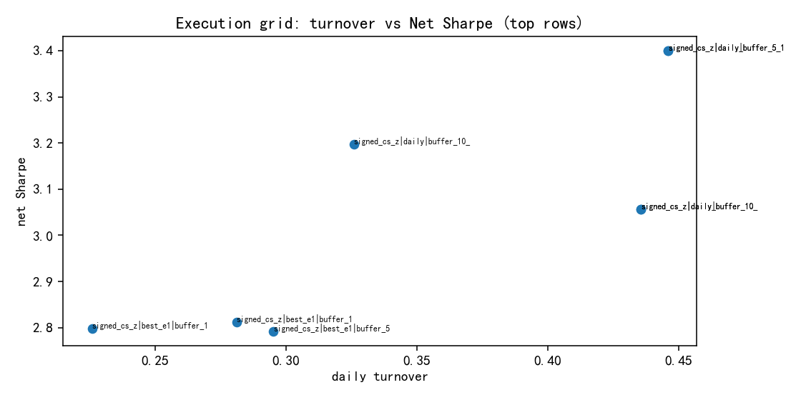

# 4.6 IdealAmplitude

**Status:** `testing` · **Family:** behavior / microstructure · **Source:** paper  
**Pack:** [`research/reports/factors/IdealAmplitude/`](../../../factors/IdealAmplitude/)

## 1. Motivation

Daily amplitude split by close-price state. High close-state amplitude embeds stronger negative alpha; spread \(V = V_{\mathrm{high}} - V_{\mathrm{low}}\) purifies vs uncut Amp20.

## 2. Formula

- Object: \(\mathrm{Amp} = \mathrm{high}/\mathrm{low} - 1\)  
- Knife: close price state; quantile_split \(\lambda=0.25\) in 20d window  

\[
V = \mathrm{mean}(\mathrm{amp}\mid\mathrm{high\text{-}close}) - \mathrm{mean}(\mathrm{amp}\mid\mathrm{low\text{-}close})
\]

Direction: **negative** RankIC. `shift(1)`.

## 3. Validation (headline)

| Metric | Value |
|--------|-------|
| RankIC raw / SI | −0.0378 / −0.0475 |
| ICIR raw / SI | −7.66 / **−9.97** |
| HL Sharpe raw | 3.44 |
| Best Net Sharpe | **3.40** |
| Best daily TO | 0.446 |
| Monotonicity | **0.111** (very weak) |
| Yearly RankIC negative | 16/16 (2010–2025) |

### Figures (Pack experiment artifacts)

IC — `factors/IdealAmplitude/ic_analysis/ic_curve.png`

Decile — `factors/IdealAmplitude/quantile_analysis/decile_return.png`

Long-short — `factors/IdealAmplitude/quantile_analysis/cumulative_long_short.png`

Yearly stability — `factors/IdealAmplitude/stability/stability_yearly.png`

Turnover — `factors/IdealAmplitude/execution/turnover.png`

## 4. Library note

Strong ICIR/Sharpe but **weak decile monotonicity** — do not promote to validated without mono fix. Related to IdealReversal cutting family.
