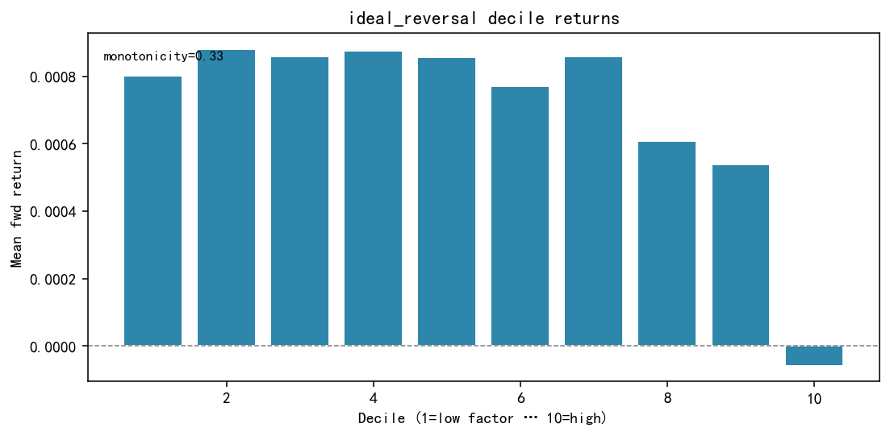
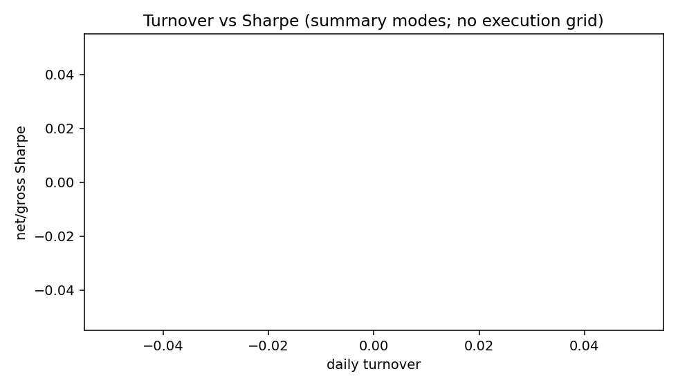

# 4.5 IdealReversal

**Status:** `testing` · **Family:** behavior / microstructure · **Source:** paper (factor cutting)  
**Pack:** [`research/reports/factors/IdealReversal/`](../../../factors/IdealReversal/)

## 1. Motivation

20-day returns split by average trade size (ATS). High-ATS days embed institutional participation → stronger reversal; low-ATS days are noise. Spread \(M = M_{\mathrm{high}} - M_{\mathrm{low}}\) purifies the signal.

## 2. Formula

- Object: Ret20 (additive daily returns)  
- Knife: ATS = amount / trade_count; rank_split 10/10 in 20d window  

\[
M = \sum(r \mid \mathrm{high\,ATS}) - \sum(r \mid \mathrm{low\,ATS})
\]

Direction: **negative** RankIC (short high \(M\)). `shift(1)`.

## 3. Validation (headline)

| Metric | Value |
|--------|-------|
| RankIC raw / SI | −0.0311 / −0.0331 |
| ICIR raw / SI | −8.60 / **−9.46** |
| HL Sharpe raw | 1.70 |
| Best Net Sharpe | 1.70 |
| Best daily TO | 0.153 |
| Monotonicity | **0.444** (soft bar fail) |
| Yearly RankIC negative | 7/7 (2019–2025) |

### Figures (Pack experiment artifacts)

IC — `factors/IdealReversal/ic_analysis/ic_curve.png`

Decile — `factors/IdealReversal/quantile_analysis/decile_return.png`

Long-short — `factors/IdealReversal/quantile_analysis/cumulative_long_short.png`

Yearly stability — `factors/IdealReversal/stability/stability_yearly.png`

Turnover — `factors/IdealReversal/execution/turnover.png`

## 4. Library note

Mechanism passes; production track deferred until mono improved. Same cutting family as IdealAmplitude — do not treat as independent alpha without residual analysis.
