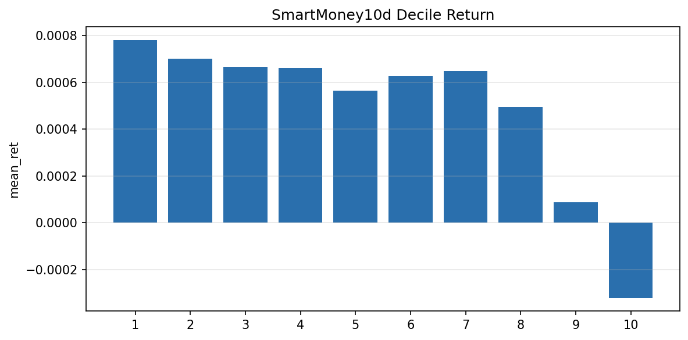
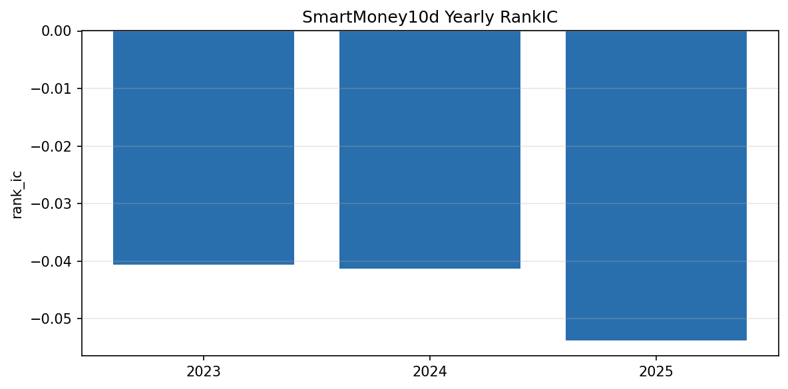

# 4.7 SmartMoney10d (research only)

**Status:** `research` (parked) · **Family:** microstructure · **Source:** paper  
**Artifacts:** [`research/reports/smart_money_v1/`](../../../smart_money_v1/) — **no Pack v1 yet**

## 1. Motivation / verdict

Cross-sectional efficiency / smart-money style signal shows **strong predictive IC**, but **daily execution fails** the investable Net Sharpe bar after realistic turnover. Parked as research candidate; not a library production asset.

## 2. Headline metrics (phase2a / phase2a1)

| Metric | Value | Source |
|--------|-------|--------|
| RankIC raw | −0.0453 | `phase2a/ic_summary.csv` |
| ICIR raw (signed) | −6.09 (abs 6.09) | same |
| RankIC SI | −0.0365 | same |
| ICIR SI (signed) | −8.37 (abs 8.37) | same |
| Best Net Sharpe @15bp | **0.310** (`lowQ\|every_5d\|buffer_10_30`) | `phase2a1_horizon/execution_ranked.csv` |
| Corresponding daily TO | 0.165 | same row |
| Daily plain Net | negative (e.g. daily Net ≈ −0.93) | same file |

## 3. Figures (from phase2a experiment CSVs)

Decile — `smart_money_v1/phase2a/figures/decile_return.png` (from `phase2a/decile_return.csv`)

Yearly RankIC — `smart_money_v1/phase2a/figures/stability_yearly.png` (from `phase2a/yearly_stability.csv`)

**Missing:** scout-native `ic_curve.png` / cumulative LS time series were not exported by the SmartMoney runner (only summary CSVs). See report `TODO.md`.

## 4. Contrast with APM

| | APM_SessionResidual | SmartMoney10d |
|--|---------------------|---------------|
| IC | strong (+) | strong (−) |
| Best Net @15bp | **1.50** | **~0.31** |
| Library status | testing_candidate | research parked |
| Peer signal corr (APM↔SM) | ≈ −0.06 | — |

APM is the session-behavior testing candidate; SmartMoney remains research-only.
