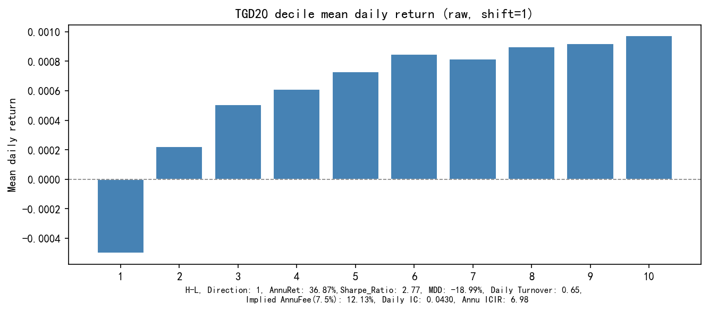
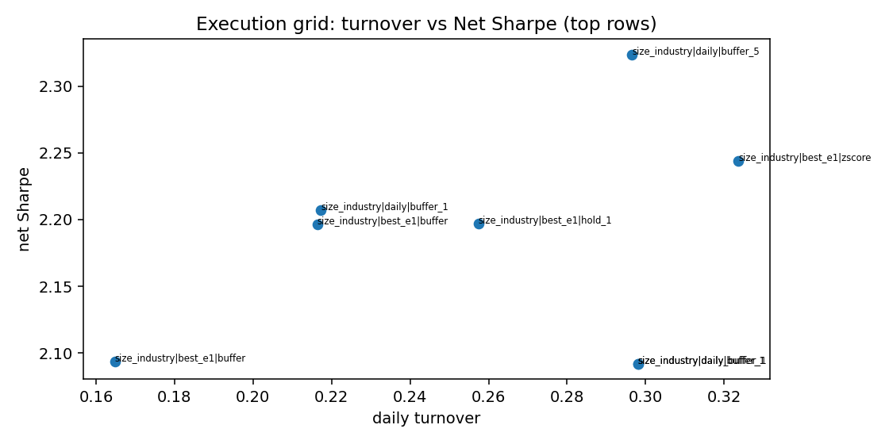

# 4.1 TGD20 — Temporal Gradient Density

**Status:** `validated` · **Family:** temporal · **Source:** paper replication  
**Pack:** [`research/reports/factors/TGD20/`](../../../factors/TGD20/) · **Spec:** `factor_specs/TGD20.yaml`

## 1. Motivation

Intraday returns are not uniformly distributed through trading time. The **timing** of upside vs downside moves carries information beyond the day’s net return.

## 2. Original paper idea

- Paper: 《日内分钟收益率的时序特征：逻辑讨论与因子增强》
- Colloquial: 时间重心偏移因子
- Economic object: residual downside timing after return-structure controls — **not** raw \(G_d - G_u\).

## 3. Formula (frozen)

Primitives (return-weighted time centers over 240 trading minutes):

\[
G_u = \frac{\sum_{r_t>0} t\cdot r_t}{\sum_{r_t>0} r_t},\quad
G_d = \frac{\sum_{r_t<0} t\cdot |r_t|}{\sum_{r_t<0} |r_t|}
\]

Residualize with paper-style controls → \(\varepsilon_u, \varepsilon_d\). Frozen traded signal:

\[
\mathrm{TGD20} = \mathrm{MA}_{20}\big(\mathrm{CS\text{-}residual}(\varepsilon_d \mid \varepsilon_u)\big)
\]

Signal evaluated with `shift(1)`. **Not equal to:** \(G_d-G_u\), \(|G_d-G_u|\).

Full write-up: Pack [`formula.md`](../../../factors/TGD20/formula.md).

## 4. Implementation

| Item | Value |
|------|-------|
| Data | Minute L2 → Gu/Gd lineage |
| Modules | `core/l2_features/return_timing.py`, `timing_residual.py`, `tgd.py`, `tgd_panel_builder.py` |
| Universe (research) | ALL |
| Period (actual) | 2022-01-28 → 2025-12-31 (951d); coverage exception noted |

## 5. Validation (headline from `summary.yaml`)

| Metric | Value |
|--------|-------|
| RankIC raw / SI | 0.0430 / **0.0415** |
| ICIR raw / SI | 6.98 / **11.29** |
| HL Sharpe raw / SI | 2.77 / 4.06 |
| **Group10 excess Sharpe vs exact ALL EW, raw / SI** | 1.24 / **2.16** |
| Group10 excess annual return / MDD, SI | 8.81% / −5.04% |
| H–L Net Sharpe SI @15bp | 1.72 (execution diagnostic) |
| Best optimized H–L Net Sharpe | 2.32 (execution diagnostic) |
| Best daily turnover | 0.297 |
| Monotonicity | 0.988 |
| Yearly RankIC positive | 6/6 |

### Figures (Pack experiment artifacts)

IC curve — `factors/TGD20/ic_analysis/ic_curve.png`

Decile return — `factors/TGD20/quantile_analysis/decile_return.png`

Long-short cumulative — `factors/TGD20/quantile_analysis/cumulative_long_short.png`

Yearly stability — `factors/TGD20/stability/stability_yearly.png`

Turnover — `factors/TGD20/execution/turnover.png`

## 6. Execution

Headline portfolio result is Group10 market-relative Sharpe **2.16** for the
size/industry-neutralized signal. The 2.32 optimized H–L Net Sharpe is retained
only as an execution diagnostic. Formula and residual controls are frozen.

## 7. Library note

First complete paper-replication Pack; template for subsequent packs. Remains the only **validated** asset in Library v1.
