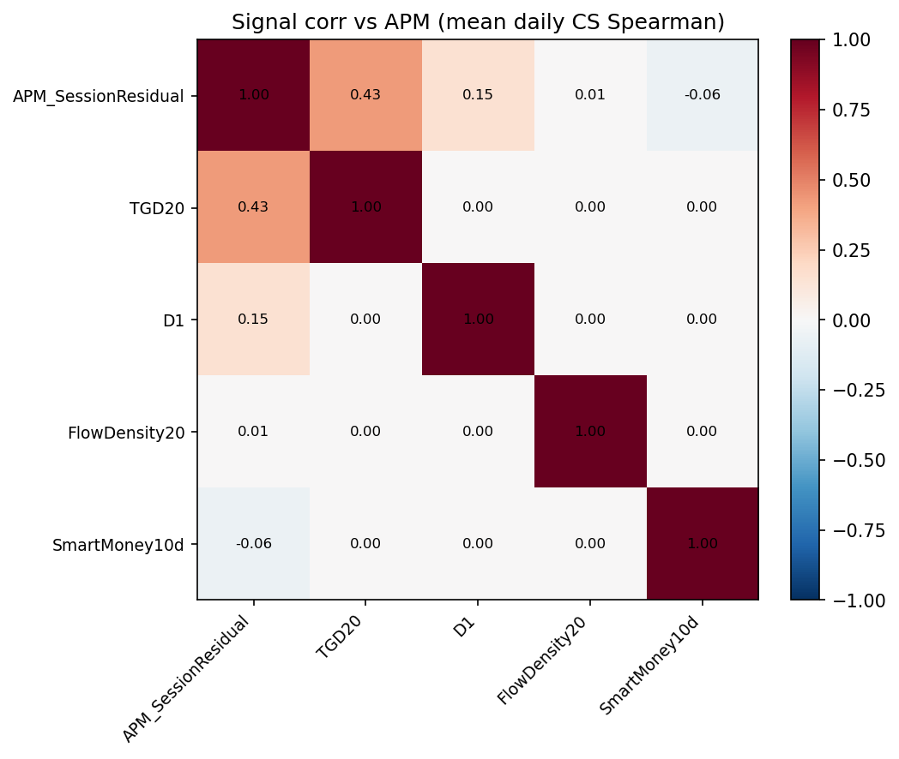

# 5. Cross-Factor Analysis

Purpose: document **overlap**, not build a production composite.

All heatmaps below are rendered from **APM scout peer CSVs** stored in the Pack (same files as `apm_session_v1/scout/similarity/`).

## 5.1 Signal correlation (partial)

Source CSV: [`factors/APM_SessionResidual/ic_analysis/peer_signal_corr.csv`](../../../factors/APM_SessionResidual/ic_analysis/peer_signal_corr.csv)

| Peer | Corr with APM_SessionResidual |
|------|-------------------------------|
| TGD20 | 0.426 |
| D1 | 0.149 |
| FlowDensity20 | 0.006 |
| SmartMoney10d | −0.062 |

Heatmap (from that CSV):

**Limitation:** Full pairwise signal matrix across Ideal* / all packs is **not** yet computed on a joint panel.

## 5.2 IC time-series correlation

Source CSV: [`factors/APM_SessionResidual/ic_analysis/peer_ic_corr.csv`](../../../factors/APM_SessionResidual/ic_analysis/peer_ic_corr.csv)

|  | APM | TGD20 | D1 | Flow | SmartMoney |
|--|-----|-------|----|------|------------|
| APM | 1.00 | 0.37 | −0.11 | −0.25 | 0.00 |
| TGD20 | 0.37 | 1.00 | 0.52 | 0.23 | −0.29 |
| D1 | −0.11 | 0.52 | 1.00 | 0.47 | −0.52 |
| Flow | −0.25 | 0.23 | 0.47 | 1.00 | −0.13 |
| SmartMoney | 0.00 | −0.29 | −0.52 | −0.13 | 1.00 |

### Readout (descriptive, not a combination decision)

- APM ≈ orthogonal to Flow / SmartMoney on signal; moderate overlap with TGD (~0.43 signal / ~0.37 IC).
- TGD–D1 IC corr ~0.52 → related but not identical; residual IC still needed before equal-weight claims.
- Ideal* not in this peer matrix yet.

## 5.3 Information source map

Schematic only (not a backtest figure) — see `figures/cross_factor/information_source_map.png` if needed for slides. Factor families are listed in Section 2 / 8.

## 5.4 What this section does **not** authorize

- Promoting APM+TGD as “proven independent alpha”
- Skipping residual IC / Similarity Stage 2
- Treating IdealReversal + IdealAmplitude as two library slots without family residual
