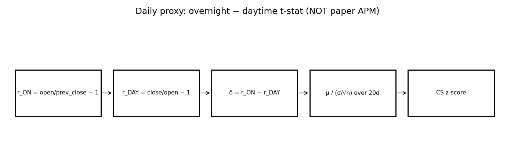
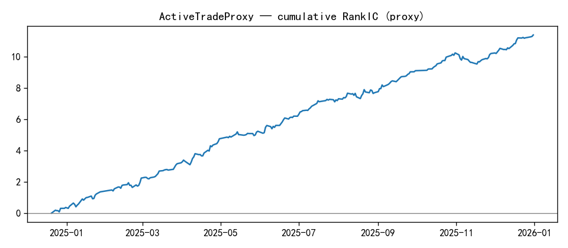
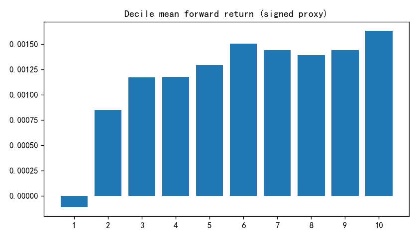
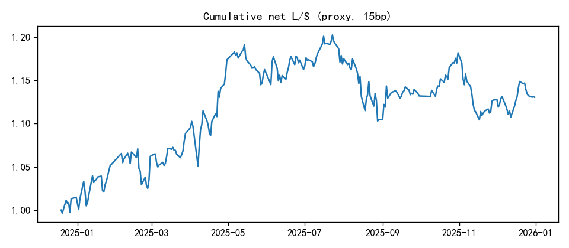
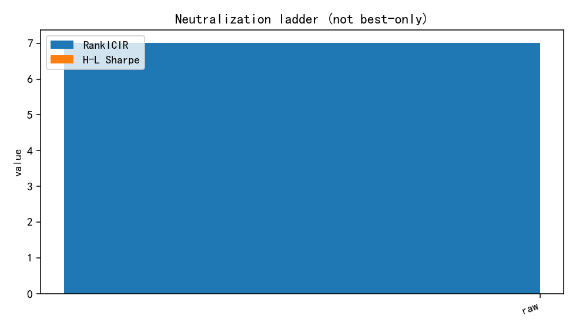
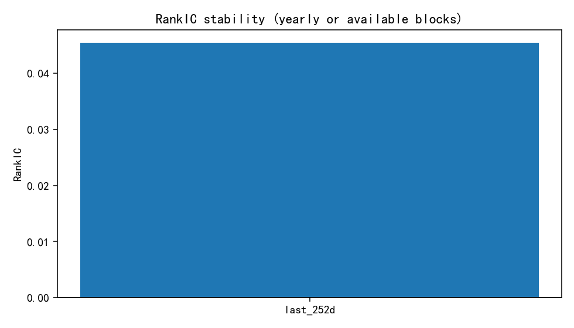
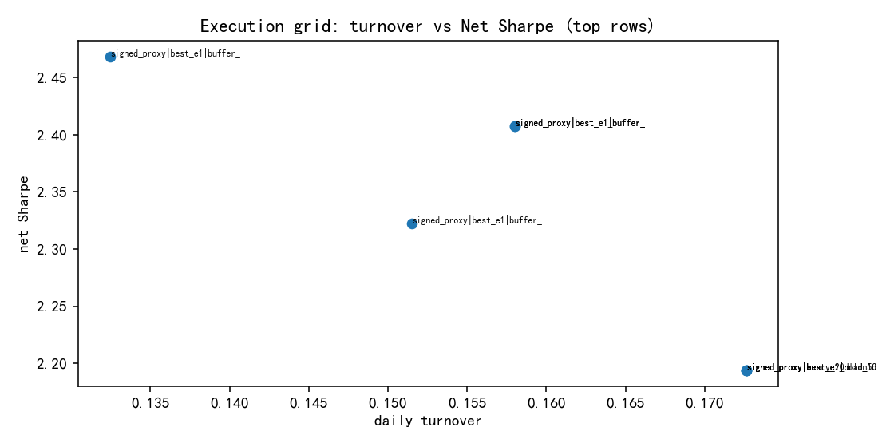

# ActiveTradeProxy — Factor Research Report (Template v2)

> **schema_version:** `factor_report_v2` · Research Pack (schema-driven)  
> **Harvest only** — formulas not recomputed. Metric Union: N/A never silently dropped.

**Factor Identity:** `ActiveTradeProxy` is a **daily research proxy**, not paper APM.
Do not register session residuals or Ret20 controls as separate factor_ids.
Paper ActiveTrade / APM remains stub until minute/session layer.

**Boss reading guide**

| Lens | Look at |
|------|---------|
| Research | RankIC, RankICIR, Gross Sharpe, MDD, Monotonicity |
| Admission | Net Sharpe, Turnover, Implied Fee, Execution |
| Not factors | Mechanism diagnostics · Execution implementation labels |

---

# 1. Executive Summary

ActiveTrade in the Kaiyuan cutting series maps to **APM / 主动买卖**, which requires
overnight vs afternoon **index residuals** and CS residualization vs Ret20 on
**session/minute** data.

This pack ships the documented **daily smoke-test proxy**:
\(t = \mathrm{mean}(r_{ON}-r_{DAY}) / (\mathrm{std}/\sqrt{n})\) over 20 days.
It closes the cutting-family OS slot honestly as `testing` / `research_proxy`.
**Do not** treat metrics as paper replication success.

### Core metrics (Metric Union headline)

| Metric | Value |
| --- | --- |
| RankIC | 0.0454 |
| IC | N/A (not_computed) |
| RankICIR | 7.0174 |
| ICIR | 7.0174 |
| IC_tstat | N/A (not_computed) |
| IC_positive_ratio | N/A (not_in_artifacts) |
| Annualized_RankIC | 0.7177 |
| Sharpe | 2.8860 |
| net_Sharpe | 0.9489 |
| MDD | -0.0552 |
| daily_turnover | 0.8086 |
| monotonicity | 0.7778 |

---

# 2. Factor Thesis

If overnight–daytime return imbalance carries active-trading information, a rolling
t-stat of that imbalance may predict forward returns even without index residualization.
This is a hypothesis probe — not the paper estimator.

---

# 3. Economic Intuition

Overnight and daytime sessions embed different participant mixes. A persistent
overnight-minus-daytime imbalance may proxy inventory / aggression imbalance.
True APM isolates this after market residualization; the proxy skips that step.

---

# 4. Formula Construction

## 4.1 Raw variables

Open, close (daily).

## 4.2 Intermediate variables

$$r^{ON}_t = O_t / C_{t-1} - 1,\qquad r^{DAY}_t = C_t / O_t - 1$$
$$\delta_t = r^{ON}_t - r^{DAY}_t$$

## 4.3 Transformations / residualization

Over window \(N=20\):
$$t = \frac{\overline{\delta}}{s_\delta / \sqrt{n}}$$

## 4.4 Final investable signal

Daily panel of \(t\), then CS z-score for evaluation.
Paper direction claimed positive IC; confirm sign in eval.

---

# 5. Signal Pipeline

```
daily OHLC
      ↓
overnight − daytime return
      ↓
20d t-stat (proxy)
      ↓
CS z-score
      ↓
[paper path deferred: session residual vs index → CS residual vs Ret20]
```



---

# 6. Mechanism Validation

> **Layer:** diagnostic variants / signal representations that test *why* `ActiveTradeProxy` works.  
> **Not** competing `factor_id`s. Registry still has only `ActiveTradeProxy`.

Cutting-family completeness requires an ActiveTrade / APM slot. Admitting the daily
proxy with loud honesty is better than fake paper metrics. Upgrade path: MinuteFeatureStore
→ true APM → replace or supersede this factor_id.

### Verdict table

| Hypothesis | Test | Result | Conclusion |
| --- | --- | --- | --- |
| Proxy has non-zero RankIC | RankICIR on last-Nd book | see pack metrics | informational probe only |
| This equals paper APM | session residual + Ret20 residual | NOT implemented | fail as paper replication — keep research_proxy label |
| Soft bar for candidate | Sharpe / mono / Dual Benchmark | proxy pack — auto-fail paper admission | stay testing |

### Mechanism chain

```
diagnostics → see verdict table
ActiveTradeProxy → accepted investable expression (sole factor_id)
```

### Full mechanism artifact (diagnostics — not sibling factors)

| signal | category | rank_ic | icir | hl_sharpe | net_sharpe | monotonicity | daily_turnover |
| --- | --- | --- | --- | --- | --- | --- | --- |
| overnight_minus_day_tstat | research_proxy | 0.0454 | 7.0174 | N/A | 0.9489 | 0.7778 | 0.8086 |
| paper_APM | stub_needs_minute | N/A | N/A | N/A | N/A | N/A | N/A |

---

# 7. IC Analysis




---

# 8. Portfolio Analysis






---

# 9. Risk Adjustment


**All neutralization modes (not best-only):**

| Mode | RankIC | RankICIR | H-L Sharpe | MDD | Net Sharpe |
| --- | --- | --- | --- | --- | --- |
| raw | 0.0454 | 7.0174 | N/A | N/A | 0.9489 |
| size | N/A | N/A | N/A | N/A | N/A |
| industry | N/A | N/A | N/A | N/A | N/A |
| size_industry | N/A | N/A | N/A | N/A | N/A |



---

# 10. Stability


_no stability_



---

# 11. Execution (Portfolio Implementation)

> **Layer:** how to trade the **same** `ActiveTradeProxy` signal (rebalance / buffer / hold).  
> Labels below are implementation variants — not new factors.

Execution grid on signed CS-z proxy (Phase III A3). Metrics are for the **proxy**, not paper APM.

Top implementation rows (full grid in `execution/execution_summary.csv`):

| label | gross Sharpe | net Sharpe | daily TO | implied fee | MDD net |
| --- | --- | --- | --- | --- | --- |
| signed_proxy|best_e1|buffer_10_30 | 2.8860 | 2.4680 | 0.1325 | 0.0248 | -0.0552 |
| signed_proxy|best_e1_buffer_5_15 | 2.8015 | 2.4074 | 0.1580 | 0.0296 | -0.0668 |
| signed_proxy|best_e1|buffer_5_15 | 2.8015 | 2.4074 | 0.1580 | 0.0296 | -0.0668 |
| signed_proxy|best_e1|buffer_10_20 | 2.7723 | 2.3226 | 0.1515 | 0.0284 | -0.0566 |
| signed_proxy|best_e1|hold_5d | 2.6851 | 2.1937 | 0.1726 | 0.0324 | -0.0577 |
| signed_proxy|every_20d | 2.6851 | 2.1937 | 0.1726 | 0.0324 | -0.0577 |
| signed_proxy|best_e1_plain | 2.6851 | 2.1937 | 0.1726 | 0.0324 | -0.0577 |
| signed_proxy|best_e1|hold_10d | 2.6851 | 2.1937 | 0.1726 | 0.0324 | -0.0577 |
| signed_proxy|best_e1|hold_1d | 2.6851 | 2.1937 | 0.1726 | 0.0324 | -0.0577 |
| signed_proxy|daily_buffer_5_15 | 2.9824 | 1.9254 | 0.3963 | 0.0743 | -0.0696 |



---

# 12. Limitations

- Not paper APM (no index residual, no afternoon session split, no Ret20 residual).
- May overlap overnight / reversal families — residual matrix deferred.
- Do not promote to candidate as ActiveTrade replication.

### Missing Artifacts

- `charts/ic_curve.png (no legacy figure found)`
- `charts/decile_return.png (no legacy figure found)`
- `charts/cumulative_long_short.png (no legacy figure found)`

---

# 13. Final Verdict

**Status: testing (research_proxy).** Slot filled for III-A microstructure map.
Paper ActiveTrade remains open until minute/session implementation.

---

# Appendix A. Complete Metric Dump (union)

| metric_id | value | source | note/missing_reason |
| --- | --- | --- | --- |
| Annualized_IC | 0.7177 | factor_summary.csv:raw |  |
| Annualized_RankIC | 0.7177 | factor_summary.csv:raw |  |
| Calmar | N/A |  | not_computed |
| HL_Sharpe | 2.8860 | factor_summary.csv:execution_best |  |
| HL_return | 0.3378 | factor_summary.csv:execution_best |  |
| IC | N/A |  | not_computed |
| ICIR | 7.0174 | factor_summary.csv:raw |  |
| IC_mean | N/A |  | not_in_artifacts |
| IC_positive_ratio | N/A |  | not_in_artifacts |
| IC_std | N/A |  | not_in_artifacts |
| IC_tstat | N/A |  | not_computed |
| MDD | -0.0552 | factor_summary.csv:execution_best |  |
| RankIC | 0.0454 | factor_summary.csv:raw |  |
| RankICIR | 7.0174 | factor_summary.csv:raw | Mapped from legacy icir (Spearman-based) |
| Sharpe | 2.8860 | factor_summary.csv:execution_best |  |
| Sortino | N/A |  | not_computed |
| annual_return | 0.3378 | factor_summary.csv:execution_best |  |
| annual_turnover | 16.5573 | execution_summary.csv:best |  |
| cumulative_return | N/A |  | not_in_artifacts |
| daily_turnover | 0.8086 | factor_summary.csv:raw |  |
| decile_spread | N/A |  | not_in_artifacts |
| direction | 1 | factor_summary.csv:execution_best |  |
| excess_return | N/A |  | not_in_artifacts |
| gross_Sharpe | 2.8860 | factor_summary.csv:execution_best |  |
| implied_fee | 0.0248 | factor_summary.csv:execution_best |  |
| long_leg_return | N/A |  | not_in_artifacts |
| monotonicity | 0.7778 | factor_summary.csv:raw |  |
| net_Sharpe | 0.9489 | factor_summary.csv:raw |  |
| short_leg_return | N/A |  | not_in_artifacts |
| signal_decay | N/A |  | not_in_artifacts |
| stability_score | N/A |  | not_in_artifacts |
| volatility | N/A |  | not_in_artifacts |

---

# Appendix B. Data Dictionary & Code Map

| Item | Path |
| --- | --- |
| Report content | `factor_specs/ActiveTradeProxy_report_content.yaml` |
| Factor spec | `factor_specs/ActiveTradeProxy.yaml` |
| Metric registry | `docs/schemas/metric_registry.yaml` |
| Chart registry | `docs/schemas/chart_registry.yaml` |
| Pack schema | `docs/schemas/factor_report.schema.yaml` |
| Implementation | `factor_cutting/active_trade.py` |
| Paper definition | `research/factor_cutting/factor_definition.yaml (apm)` |
| Eval script | `run_milestone_3_0_active_trade_proxy.py` |
