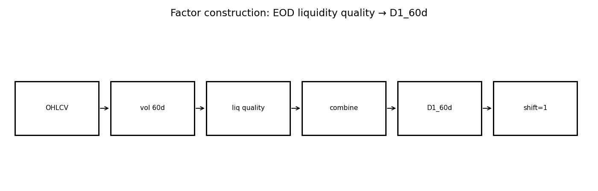
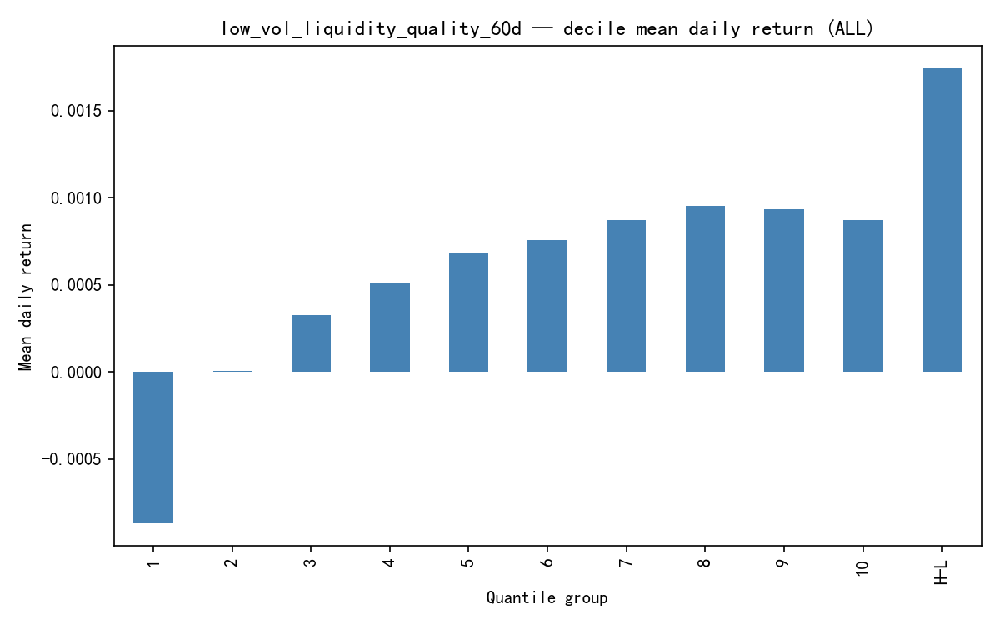
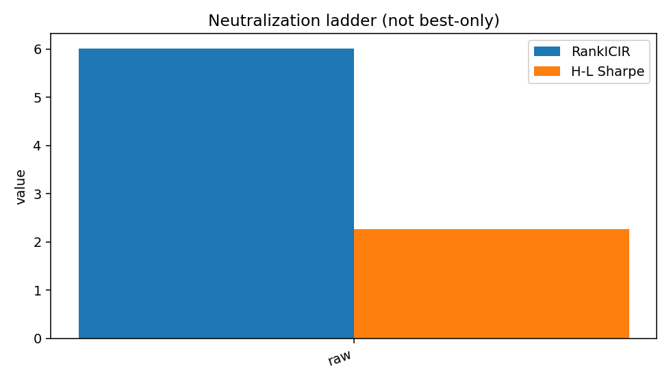

# D1_LiquidityQuality60d — Factor Research Report (Template v2)

> **schema_version:** `factor_report_v2` · Research Pack (schema-driven)  
> **Harvest only** — formulas not recomputed. Metric Union: N/A never silently dropped.

**Factor Identity:** `D1_LiquidityQuality60d` is the only investable factor_id.
Universe modes (ALL / CSI1000 / …) are **evaluation diagnostics**, not separate factors.

**Boss reading guide**

| Lens | Look at |
|------|---------|
| Research | RankIC, RankICIR, Gross Sharpe, MDD, Monotonicity |
| Admission | Net Sharpe, Turnover, Implied Fee, Execution |
| Not factors | Mechanism diagnostics · Execution implementation labels |

---

# 1. Executive Summary

D1 Liquidity Quality (60d) is a classical **EOD liquidity / low-vol quality** base factor from
the frozen OHLCV library. On the confirmation_1455d harvest it clears the soft quality screen
(H–L Sharpe ≈ 2.26, RankICIR ≈ 6.01, monotonicity ≈ 0.80) with broader strength on ALL than on
CSI300 — consistent with a liquidity-quality phenomenon that is weaker in mega-cap space.

This pack validates Template v2 on a **simple formula family** without L2 residual ladders.
Neutralization-mode ladder is largely N/A here; universe ladder is the diagnostic analogue.

### Core metrics (Metric Union headline)

| Metric | Value |
| --- | --- |
| RankIC | 0.0573 |
| IC | N/A (not_computed) |
| RankICIR | 6.0135 |
| ICIR | 6.0135 |
| IC_tstat | N/A (not_computed) |
| IC_positive_ratio | N/A (not_in_artifacts) |
| Annualized_RankIC | 0.9060 |
| Sharpe | 2.2614 |
| net_Sharpe | 1.3777 |
| MDD | -0.1973 |
| daily_turnover | 0.4822 |
| monotonicity | 0.8000 |

---

# 2. Factor Thesis

Stocks that combine low volatility with stable liquidity characteristics earn a persistent
cross-sectional premium (liquidity quality / anti-churn state), used as Base3 leg D1.

---

# 3. Economic Intuition

Unstable, high-activity names embed short-horizon noise and crowding. Low-vol names with
steadier liquidity profiles may embed a slower-moving risk/behavioral premium that ranks
well in the cross-section.

---

# 4. Formula Construction

## 4.1 Raw variables

Daily OHLCV fields used by the D1 library implementation (returns, volume/amount, volatility
windows — see `factor_formulas_liquidity_d1.py` / frozen library ids).

## 4.2 Intermediate variables

Rolling volatility and liquidity-stability components over a 60-day window (library definition).

## 4.3 Transformations / residualization

Cross-sectional combination into a single quality score (equal or specified blend inside the
frozen D1 constructor — **not retuned in this harvest**).

## 4.4 Final investable signal

$$\mathrm{D1}_t = \mathrm{low\_vol\_liquidity\_quality\_60d}_t,\qquad \mathrm{signal}_t=\mathrm{D1}_{t-1}$$

---

# 5. Signal Pipeline

```
OHLCV
  ↓
vol + liquidity stability features (60d)
  ↓
D1 quality score
  ↓
CS rank / portfolio (10 decile)
```



---

# 6. Mechanism Validation

> **Layer:** diagnostic variants / signal representations that test *why* `D1_LiquidityQuality60d` works.  
> **Not** competing `factor_id`s. Registry still has only `D1_LiquidityQuality60d`.

Unlike TGD, D1 does not claim an intraday residual channel. Its “mechanism” evidence in this
pack is **structural**: soft-bar metrics, universe comparative strength, and frozen-library
role as Base3 production_base. Redundant cousins (e.g. amount_stability) should not be
double-counted as independent validated sources.

### Verdict table

| Hypothesis | Test | Result | Conclusion |
| --- | --- | --- | --- |
| D1 is a return-alpha base (not only a risk filter) | ALL confirmation RankICIR / H-L Sharpe / mono | RankIC ≈ 5.73% · ICIR ≈ 6.01 · Sharpe ≈ 2.26 · mono 0.80 | pass soft quality screen — production_base in frozen pool |
| Edge is only a CSI300 large-cap effect | Universe ladder CSI300 vs ALL | CSI300 Sharpe ≈ 0.62 vs ALL ≈ 2.26 | stronger outside mega-cap — not a CSI300-only artifact |
| L2 residual mechanism required | Artifact inventory | No Gu/Gd-style residual ladder | N/A — classical EOD factor; mechanism section is structural |

### Mechanism chain

```
diagnostics → see verdict table
D1_LiquidityQuality60d → accepted investable expression (sole factor_id)
```

### Full mechanism artifact (diagnostics — not sibling factors)

| signal | category | rank_ic | icir | hl_sharpe | net_sharpe | monotonicity | daily_turnover |
| --- | --- | --- | --- | --- | --- | --- | --- |
| low_vol_liquidity_quality_60d | canonical | 0.0573 | 6.0135 | 2.2614 | N/A | 0.8000 | 0.4822 |

---

# 7. IC Analysis

RankIC mean ≈ 5.73% with ICIR ≈ 6.01 and IC+ ratio ≈ 65% on ALL confirmation. IC decay table
(diagnostics) shows RankIC rising with horizon out to 20d on the harvested report — diagnostic
only; Production horizon remains Protocol 20D when re-run.


---

# 8. Portfolio Analysis

H–L Sharpe ≈ 2.26, ann. return ≈ 43.5%, MDD ≈ −19.7%, turnover ≈ 0.48, monotonicity 0.80.
Decile pattern is orderly but not perfect (80% mono).




---

# 9. Risk Adjustment

Size/industry neutralization ladder was **not** in the confirmation pack artifacts → modes
other than raw are N/A under Metric Union. Universe ladder (CSI300/500/1000/ALL) is provided
in diagnostics as the available risk/coverage stress.

**All neutralization modes (not best-only):**

| Mode | RankIC | RankICIR | H-L Sharpe | MDD | Net Sharpe |
| --- | --- | --- | --- | --- | --- |
| raw | 0.0573 | 6.0135 | 2.2614 | -0.1973 | N/A |
| size | N/A | N/A | N/A | N/A | N/A |
| industry | N/A | N/A | N/A | N/A | N/A |
| size_industry | N/A | N/A | N/A | N/A | N/A |



---

# 10. Stability

Only a confirmation block summary is harvested (not a full yearly panel). Marked as limited
stability evidence pending Protocol re-run.

_no stability_


---

# 11. Execution (Portfolio Implementation)

> **Layer:** how to trade the **same** `D1_LiquidityQuality60d` signal (rebalance / buffer / hold).  
> Labels below are implementation variants — not new factors.

Milestone 1D.7 added an execution_layer grid on the frozen D1 library signal
(`low_vol_liquidity_quality_60d`).

**Signal identity (do not mix versions):**
- Evaluation / execution signal (1D.7): **raw cross-sectional z-score**
- Intended production candidate signal: **size+industry neutralized** (Protocol Production Track; not yet re-run)

Baseline daily H–L (research) has high turnover; investability improves under buffers.
Best Net Sharpe on the 1D.7 **raw** grid: **≈ 1.38** (`raw|daily|buffer_5_15`) with daily TO ≈ 0.23
(gross Sharpe ≈ 1.81). This is portfolio implementation on the same factor_id — not a
formula retune. Net Sharpe remains below TGD/Flow execution leaders; treat as candidate
investability evidence, not validated production admission.

Top implementation rows (full grid in `execution/execution_summary.csv`):

| label | gross Sharpe | net Sharpe | daily TO | implied fee | MDD net |
| --- | --- | --- | --- | --- | --- |
| raw|daily_buffer_5_15 | 1.8101 | 1.3777 | 0.2343 | 0.0439 | -0.2202 |
| raw|daily|buffer_5_15 | 1.8101 | 1.3777 | 0.2343 | 0.0439 | -0.2202 |
| raw|best_e1_buffer_5_15 | 1.6015 | 1.2636 | 0.1830 | 0.0343 | -0.2362 |
| raw|best_e1|buffer_5_15 | 1.6015 | 1.2636 | 0.1830 | 0.0343 | -0.2362 |
| raw|daily|buffer_10_30 | 1.6056 | 1.2520 | 0.1597 | 0.0299 | -0.2007 |
| raw|daily_buffer_10_20 | 1.7129 | 1.2426 | 0.2182 | 0.0409 | -0.2021 |
| raw|daily|buffer_10_20 | 1.7129 | 1.2426 | 0.2182 | 0.0409 | -0.2021 |
| raw|best_e1|buffer_10_20 | 1.5057 | 1.1361 | 0.1719 | 0.0322 | -0.2219 |
| raw|best_e1|buffer_10_30 | 1.4107 | 1.1333 | 0.1262 | 0.0237 | -0.2171 |
| raw|best_e1|hold_1d | 1.6427 | 1.0927 | 0.2676 | 0.0502 | -0.2375 |


---

# 12. Limitations

- No size+industry ladder in source confirmation artifacts (universe ladder used instead).
- Execution Net Sharpe ≈ 1.38 — investable improvement vs raw TO drag, but not yet TGD-class.
- Stability yearly panel incomplete.
- Must not be confused with redundant amount_stability variants.

### Missing Artifacts

None

---

# 13. Final Verdict

**Status: candidate.** Classical EOD pack now has protocol charts + execution grid (1D.7).
Soft research metrics clear; execution Net Sharpe is positive but modest. Eligible for
Registry as `candidate` — not `validated`. Formula remains frozen.

---

# Appendix A. Complete Metric Dump (union)

| metric_id | value | source | note/missing_reason |
| --- | --- | --- | --- |
| Annualized_IC | 0.9060 | factor_summary.csv:raw |  |
| Annualized_RankIC | 0.9060 | factor_summary.csv:raw |  |
| Calmar | N/A |  | not_computed |
| HL_Sharpe | 2.2614 | factor_summary.csv:raw |  |
| HL_return | 0.4351 | factor_summary.csv:raw |  |
| IC | N/A |  | not_computed |
| ICIR | 6.0135 | factor_summary.csv:raw |  |
| IC_mean | N/A |  | not_in_artifacts |
| IC_positive_ratio | N/A |  | not_in_artifacts |
| IC_std | N/A |  | not_in_artifacts |
| IC_tstat | N/A |  | not_computed |
| MDD | -0.1973 | factor_summary.csv:raw |  |
| RankIC | 0.0573 | factor_summary.csv:raw |  |
| RankICIR | 6.0135 | factor_summary.csv:raw | Mapped from legacy icir (Spearman-based) |
| Sharpe | 2.2614 | factor_summary.csv:raw |  |
| Sortino | N/A |  | not_computed |
| annual_return | 0.4351 | factor_summary.csv:raw |  |
| annual_turnover | 29.2851 | execution_summary.csv:best |  |
| cumulative_return | N/A |  | not_in_artifacts |
| daily_turnover | 0.4822 | factor_summary.csv:raw |  |
| decile_spread | N/A |  | not_in_artifacts |
| direction | 1 | factor_summary.csv:execution_best |  |
| excess_return | N/A |  | not_in_artifacts |
| gross_Sharpe | 2.2614 | factor_summary.csv:raw |  |
| implied_fee | 0.0904 | factor_summary.csv:raw |  |
| long_leg_return | N/A |  | not_in_artifacts |
| monotonicity | 0.8000 | factor_summary.csv:raw |  |
| net_Sharpe | 1.3777 | factor_summary.csv:execution_best |  |
| short_leg_return | N/A |  | not_in_artifacts |
| signal_decay | N/A |  | not_in_artifacts |
| stability_score | N/A |  | not_in_artifacts |
| volatility | N/A |  | not_in_artifacts |

---

# Appendix B. Data Dictionary & Code Map

| Item | Path |
| --- | --- |
| Report content | `factor_specs/D1_LiquidityQuality60d_report_content.yaml` |
| Factor spec | `factor_specs/D1_LiquidityQuality60d.yaml` |
| Metric registry | `docs/schemas/metric_registry.yaml` |
| Chart registry | `docs/schemas/chart_registry.yaml` |
| Pack schema | `docs/schemas/factor_report.schema.yaml` |
| Implementation | `factor_formulas_liquidity_d1.py / frozen OHLCV library (D1_low_vol_liquidity_quality_60d)` |
| Confirmation harvest | `research/reports/d1_liquidity_density_v1/confirmation_1455d/low_vol_liquidity_quality_60d/` |
