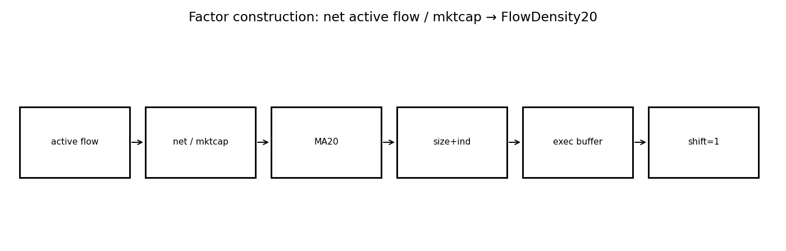
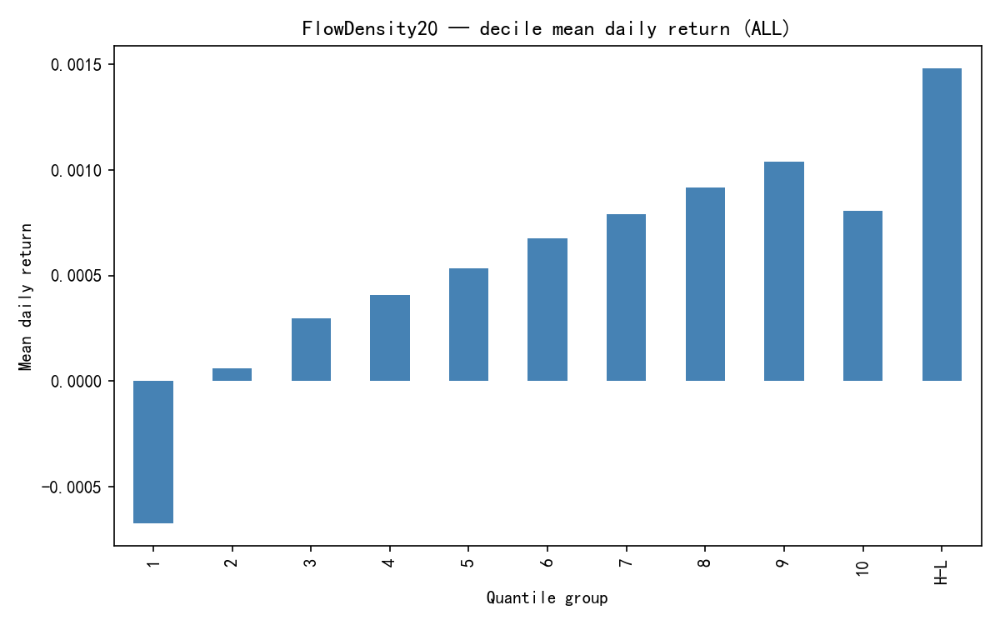
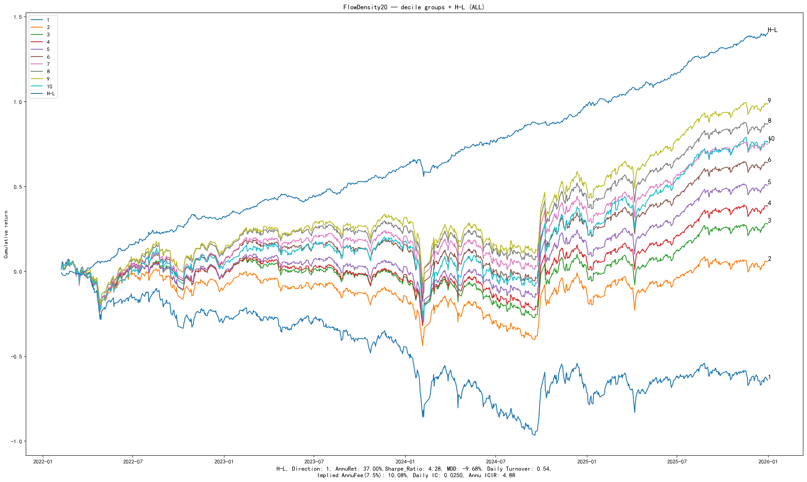
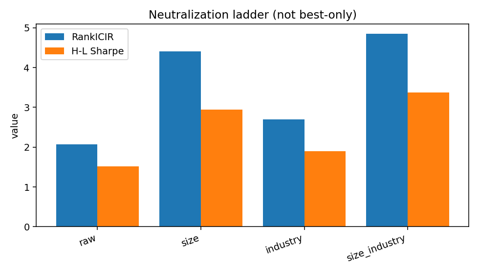
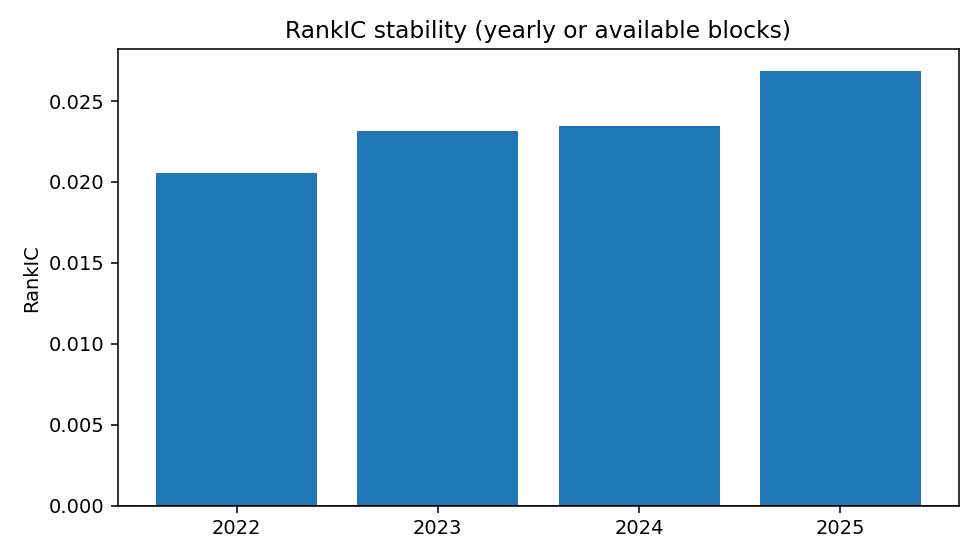

# FlowDensity20 — Factor Research Report (Template v2)

> **schema_version:** `factor_report_v2` · Research Pack (schema-driven)  
> **Harvest only** — formulas not recomputed. Metric Union: N/A never silently dropped.

**Factor Identity:** `FlowDensity20` is the only Registry / investable factor_id for this pack.
Amount / GrossActive / Flow⊥Amount rows are **mechanism diagnostics** (channel tests).
Execution buffer labels are **portfolio implementations** of the same signal.

**Boss reading guide**

| Lens | Look at |
|------|---------|
| Research | RankIC, RankICIR, Gross Sharpe, MDD, Monotonicity |
| Admission | Net Sharpe, Turnover, Implied Fee, Execution |
| Not factors | Mechanism diagnostics · Execution implementation labels |

---

# 1. Executive Summary

FlowDensity20 is a **microstructure × liquidity interaction** signal: net active flow
scaled by market cap (20d). On the confirmation harvest it shows meaningful RankICIR after
size+industry neutralization, and execution buffers raise Net Sharpe substantially by
cutting turnover — without claiming a pure “smart money” story.

Mechanism evidence is decisive: amount/gross-activity channels are strongly **negative**
ICIR, while Flow⊥Amount **flips sign**. The tradable alpha is therefore not pure flow
direction; it is entangled with anti-activity / liquidity structure.

| Lens | Snapshot (legacy ALL / 2022–2025) |
|------|-----------------------------------|
| Research | RankICIR size+ind ≈ **4.85** · Gross Sharpe ≈ 3.38 · Mono ≈ 0.88 |
| Admission | Execution-best Net Sharpe ≈ **2.88** · TO ≈ 0.165 |

### Core metrics (Metric Union headline)

| Metric | Value |
| --- | --- |
| RankIC | 0.0178 |
| IC | N/A (not_computed) |
| RankICIR | 2.0735 |
| ICIR | 2.0735 |
| IC_tstat | N/A (not_computed) |
| IC_positive_ratio | N/A (not_in_artifacts) |
| Annualized_RankIC | 0.2819 |
| Sharpe | 1.5150 |
| net_Sharpe | -0.1777 |
| MDD | -0.1903 |
| daily_turnover | 0.5148 |
| monotonicity | N/A (not_in_artifacts) |

---

# 2. Factor Thesis

Active buy/sell imbalance normalized by size should forecast returns if informed flow
is slow to reverse. The research question is whether the measured “flow” is economically
a directional flow factor or a **flow conditioned on liquidity/activity**.

---

# 3. Economic Intuition

High net active flow in low-activity names can look like conviction; the same signed flow
in high-amount names may just be churn. Amount-orthogonal tests show that stripping the
activity channel destroys (and can reverse) the edge — hence interaction, not pure flow.

---

# 4. Formula Construction

## 4.1 Raw variables

Daily active buy/sell amounts and market capitalization (L2 / broker-derived active flow fields
as used in the FlowDensity v1 pipeline).

## 4.2 Intermediate variables

$$\mathrm{NetActiveFlow}_t,\qquad \mathrm{MktCap}_t,\qquad \mathrm{Amount}_t$$

## 4.3 Transformations / residualization

Size scaling and 20-day smoothing (implementation-frozen for this harvest):

$$F_t = \mathrm{MA}_{20}\left(\frac{\mathrm{NetActiveFlow}_t}{\mathrm{MktCap}_t}\right)$$

Amount-orthogonal diagnostic: cross-sectional residual \(F \perp \mathrm{Amount}\).

## 4.4 Final investable signal

$$\mathrm{FlowDensity20}_t = F_t,\qquad \mathrm{signal}_t = F_{t-1}$$

---

# 5. Signal Pipeline

```
active buy/sell + mktcap
      ↓
net active flow / mktcap
      ↓
MA20 → FlowDensity20
      ↓
diagnostics: neutralize amount / size+industry
```



---

# 6. Mechanism Validation

> **Layer:** diagnostic variants / signal representations that test *why* `FlowDensity20` works.  
> **Not** competing `factor_id`s. Registry still has only `FlowDensity20`.

FlowDensity should be catalogued as **liquidity_flow_interaction**, not pure smart-money flow.
Residualizing on amount removes the positive edge — the opposite of a pure directional flow story.

### Verdict table

| Hypothesis | Test | Result | Conclusion |
| --- | --- | --- | --- |
| Pure flow direction is the alpha | Flow⊥Amount RankICIR | ICIR ≈ −2.49 (sign flip) | fail as pure flow — interaction with liquidity/activity |
| Anti-activity / amount channel dominates | Amount / GrossActive RankICIR | ICIR ≈ −8.6 | strong liquidity anomaly; entangled with FlowDensity |
| FlowDensity raw remains tradable after size+industry | size+ind RankICIR / H-L Sharpe | ICIR ≈ 4.85 · Gross Sharpe ≈ 3.38 | accept as candidate interaction factor (formula not frozen) |

### Mechanism chain

```
diagnostics → see verdict table
FlowDensity20 → accepted investable expression (sole factor_id)
```

### Full mechanism artifact (diagnostics — not sibling factors)

| signal | family | rank_ic | icir | hl_sharpe | net_sharpe | daily_turnover | direction | note | residual_ic_t | cs_corr_with_anchor |
| --- | --- | --- | --- | --- | --- | --- | --- | --- | --- | --- |
| active_buy_mktcap_20d | component | -0.0476 | -8.7264 | 3.8392 | 3.4296 | 0.1492 | -1 | size+industry | N/A | N/A |
| active_sell_mktcap_20d | component | -0.0473 | -8.5877 | 4.0805 | 3.6187 | 0.1410 | -1 | size+industry | N/A | N/A |
| net_active_flow_mktcap_20d | canonical | 0.0236 | 4.8495 | 3.3807 | 1.9240 | 0.4633 | 1 | size+industry | N/A | N/A |
| gross_active_mktcap_20d | component | -0.0476 | -8.6664 | 3.9928 | 3.5228 | 0.1427 | -1 | size+industry | N/A | N/A |
| amount_mktcap_20d | component | -0.0475 | -8.6584 | 3.9463 | 3.5537 | 0.1425 | -1 | size+industry | N/A | N/A |
| amount_eod_mktcap_20d | component | -0.0474 | -8.6607 | 3.6864 | 3.5579 | 0.1420 | -1 | size+industry | N/A | N/A |
| volume_mktcap_20d | component | -0.0252 | -4.9914 | 2.7996 | 2.2475 | 0.1245 | -1 | size+industry | N/A | N/A |
| active_buy_share_20d | component | 0.0036 | 0.8819 | 1.1814 | -1.3445 | 0.6059 | 1 | size+industry | N/A | N/A |
| net_size_resid | style_residual | 0.0271 | 4.4107 | 2.9474 | 1.6056 | 0.4744 | 1 | Flow ⊥ size | N/A | N/A |
| net_size_industry_resid | style_residual | 0.0236 | 4.8495 | 3.3807 | 1.9240 | 0.4633 | 1 | Flow ⊥ size+industry (same as confirmation) | N/A | N/A |
| net_active_flow_mktcap_20d|raw | canonical_raw | 0.0178 | 2.0735 | 1.5150 | 0.1136 | 0.5148 | 1 | raw cs_z | N/A | N/A |
| Flow_perp_Amount | residual | -0.0058 | -1.6610 | N/A | N/A | N/A | -1 | ⊥ L2 amount/mktcap 20d | -3.2362 | -0.6166 |
| Flow_perp_AmountEOD | residual | -0.0058 | -1.6464 | N/A | N/A | N/A | -1 | ⊥ EOD amount/mktcap 20d | -3.2078 | -0.6160 |
| Flow_perp_Volume | residual | 0.0149 | 3.1281 | N/A | N/A | N/A | 1 | ⊥ L2 volume/mktcap 20d | 6.0945 | -0.4684 |
| Flow_perp_GrossActive | residual | -0.0057 | -1.6416 | N/A | N/A | N/A | -1 | ⊥ undirected gross active flow | -3.1984 | -0.6145 |
| Flow_perp_Buy | residual | -0.0036 | -1.0228 | N/A | N/A | N/A | -1 | ⊥ buy leg | -1.9928 | -0.5741 |
| Flow_perp_Sell | residual | -0.0076 | -2.2092 | N/A | N/A | N/A | -1 | ⊥ sell leg | -4.3042 | -0.6501 |

---

# 7. IC Analysis

Primary harvest uses RankIC / RankICIR. Raw RankICIR is weaker (~2.07); size and size+industry
lift RankICIR to ~4.4–4.85. Pearson IC is N/A in artifacts.


---

# 8. Portfolio Analysis

Size+industry Gross Sharpe ≈ 3.38 with MDD ≈ −9.5%. Monotonicity ≈ 0.88 on the mechanism table
for the canonical signal. Direction = +1 on the confirmation book.





---

# 9. Risk Adjustment

Neutralization **improves** measured RankICIR versus raw — alpha appears to survive size/industry
controls on this sample. Still, amount-orthogonal diagnostics show the economic channel is
not “pure flow.” Show the full ladder; do not advertise only the best cell.

**All neutralization modes (not best-only):**

| Mode | RankIC | RankICIR | H-L Sharpe | MDD | Net Sharpe |
| --- | --- | --- | --- | --- | --- |
| raw | 0.0178 | 2.0735 | 1.5150 | -0.1903 | -0.1777 |
| size | 0.0271 | 4.4107 | 2.9474 | -0.1029 | 1.5951 |
| industry | 0.0152 | 2.6925 | 1.9043 | -0.1293 | 0.0841 |
| size_industry | 0.0236 | 4.8495 | 3.3807 | -0.0951 | 1.8497 |



---

# 10. Stability

Yearly stability CSV is harvested from the FlowDensity pack; treat as Research Track evidence
pending Protocol Production re-run.

| Year | RankIC | RankICIR | IC+ ratio | n_days |
| --- | --- | --- | --- | --- |
| 2022 | 0.0206 | 4.5344 | N/A | 223 |
| 2023 | 0.0231 | 4.8055 | N/A | 242 |
| 2024 | 0.0234 | 4.2066 | N/A | 242 |
| 2025 | 0.0268 | 6.0482 | N/A | 243 |



---

# 11. Execution (Portfolio Implementation)

> **Layer:** how to trade the **same** `FlowDensity20` signal (rebalance / buffer / hold).  
> Labels below are implementation variants — not new factors.

Execution-best row lifts Net Sharpe to ≈ 2.88 while cutting daily turnover to ≈ 0.165.
This is portfolio-construction efficiency on a fixed signal, not a new predictive formula.

Top implementation rows (full grid in `execution/execution_summary.csv`):

| label | gross Sharpe | net Sharpe | daily TO | implied fee | MDD net |
| --- | --- | --- | --- | --- | --- |
| size_industry|daily|buffer_10_30 | 3.7145 | 2.8806 | 0.1645 | 0.0308 | -0.0982 |
| size_industry|best_e1|buffer_10_30 | 3.3829 | 2.8592 | 0.1018 | 0.0191 | -0.1074 |
| size_industry|best_e1_buffer_10_20 | 3.3964 | 2.7621 | 0.1277 | 0.0240 | -0.0933 |
| size_industry|best_e1_buffer_10_20_hold5 | 3.3964 | 2.7621 | 0.1277 | 0.0240 | -0.0933 |
| size_industry|best_e1|buffer_10_20 | 3.3964 | 2.7621 | 0.1277 | 0.0240 | -0.0933 |
| size_industry|daily_buffer_10_20 | 3.7454 | 2.6892 | 0.2196 | 0.0412 | -0.0937 |
| size_industry|daily|buffer_10_20 | 3.7454 | 2.6892 | 0.2196 | 0.0412 | -0.0937 |
| size_industry|best_e1|hold_10d | 3.5314 | 2.6865 | 0.1786 | 0.0335 | -0.0919 |
| size_industry|best_e1|hold_5d | 3.5314 | 2.6865 | 0.1786 | 0.0335 | -0.0919 |
| size_industry|best_e1_plain | 3.5314 | 2.6865 | 0.1786 | 0.0335 | -0.0919 |


---

# 12. Limitations

- Formula not frozen; naming/economics still tagged interaction.
- Legacy ALL / 2022–2025 harvest — not Protocol CSI1000 Production Track.
- Equal-rank blend with TGD underperforms TGD alone (see orthogonality diagnostics).
- Pearson IC / Sortino / Calmar N/A.
- Protocol charts filled in Milestone 1D.7 from confirmation size+industry signal (evaluation only).

### Missing Artifacts

None

---

# 13. Final Verdict

**Status: candidate.** Research pack complete for interaction microstructure alpha
(mechanism + execution + protocol charts). Do not treat as pure flow; do not default 50/50
with TGD. Eligible for Registry as `candidate` after human review — not auto-validated.

---

# Appendix A. Complete Metric Dump (union)

| metric_id | value | source | note/missing_reason |
| --- | --- | --- | --- |
| Annualized_IC | 0.2819 | factor_summary.csv:raw |  |
| Annualized_RankIC | 0.2819 | factor_summary.csv:raw |  |
| Calmar | N/A |  | not_computed |
| HL_Sharpe | 1.5150 | factor_summary.csv:raw |  |
| HL_return | 0.2338 | factor_summary.csv:raw |  |
| IC | N/A |  | not_computed |
| ICIR | 2.0735 | factor_summary.csv:raw |  |
| IC_mean | N/A |  | not_in_artifacts |
| IC_positive_ratio | N/A |  | not_in_artifacts |
| IC_std | N/A |  | not_in_artifacts |
| IC_tstat | N/A |  | not_computed |
| MDD | -0.1903 | factor_summary.csv:raw |  |
| RankIC | 0.0178 | factor_summary.csv:raw |  |
| RankICIR | 2.0735 | factor_summary.csv:raw | Mapped from legacy icir (Spearman-based) |
| Sharpe | 1.5150 | factor_summary.csv:raw |  |
| Sortino | N/A |  | not_computed |
| annual_return | 0.2338 | factor_summary.csv:raw |  |
| annual_turnover | 20.5630 | execution_summary.csv:best |  |
| cumulative_return | N/A |  | not_in_artifacts |
| daily_turnover | 0.5148 | factor_summary.csv:raw |  |
| decile_spread | N/A |  | not_in_artifacts |
| direction | 1 | factor_summary.csv:execution_best |  |
| excess_return | N/A |  | not_in_artifacts |
| gross_Sharpe | 1.5150 | factor_summary.csv:raw |  |
| implied_fee | 0.0965 | factor_summary.csv:raw |  |
| long_leg_return | N/A |  | not_in_artifacts |
| monotonicity | N/A |  | not_in_artifacts |
| net_Sharpe | -0.1777 | factor_summary.csv:raw |  |
| short_leg_return | N/A |  | not_in_artifacts |
| signal_decay | N/A |  | not_in_artifacts |
| stability_score | N/A |  | not_in_artifacts |
| volatility | N/A |  | not_in_artifacts |

---

# Appendix B. Data Dictionary & Code Map

| Item | Path |
| --- | --- |
| Report content | `factor_specs/FlowDensity20_report_content.yaml` |
| Factor spec | `factor_specs/FlowDensity20.yaml` |
| Metric registry | `docs/schemas/metric_registry.yaml` |
| Chart registry | `docs/schemas/chart_registry.yaml` |
| Pack schema | `docs/schemas/factor_report.schema.yaml` |
| Implementation | `research/reports/l2_flow_density_v1/ (+ flow density confirmation pipeline)` |
| Mechanism long-form | `research/reports/l2_flow_density_v1/mechanism/` |
| Orthogonality | `research/reports/factor_orthogonality/TGD20_FlowDensity20/` |
