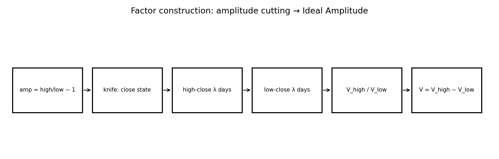
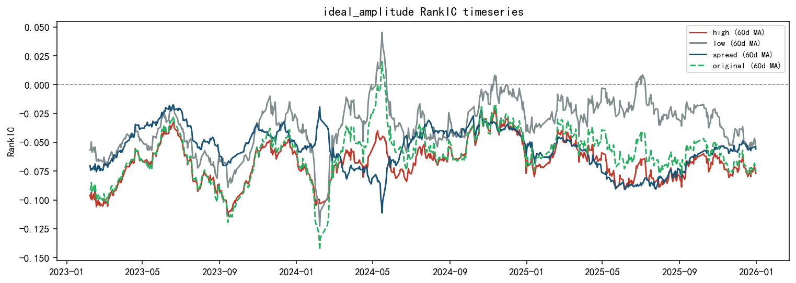
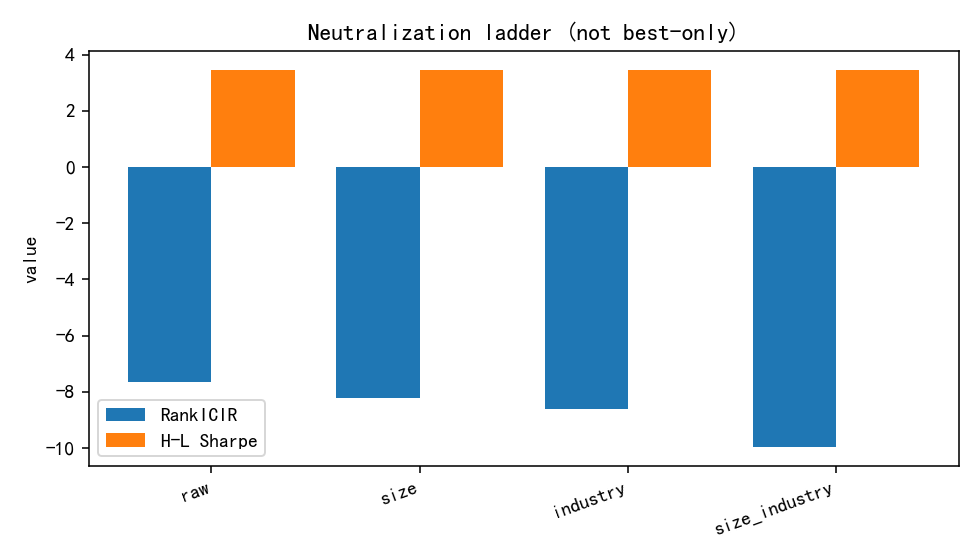

# IdealAmplitude — Factor Research Report (Template v2)

> **schema_version:** `factor_report_v2` · Research Pack (schema-driven)  
> **Harvest only** — formulas not recomputed. Metric Union: N/A never silently dropped.

**Factor Identity:** `IdealAmplitude` (spread \(V\)) is the only investable factor_id.
`V_high` / `V_low` / Amp20 baseline are **cutting / mechanism legs**, not Registry siblings.

**Boss reading guide**

| Lens | Look at |
|------|---------|
| Research | RankIC, RankICIR, Gross Sharpe, MDD, Monotonicity |
| Admission | Net Sharpe, Turnover, Implied Fee, Execution |
| Not factors | Mechanism diagnostics · Execution implementation labels |

---

# 1. Executive Summary

Ideal Amplitude is a **paper-replication / cutting** factor from 《振幅因子的隐藏结构》:
daily amplitude is partitioned by close-price state within a 20-day window; the spread
\(V = V_{high} - V_{low}\) concentrates amplitude information in the high-price state.

Cutting_v1 harvest (3885d): RankICIR ≈ −7.7, H–L Sharpe ≈ 3.44, **monotonicity ≈ 0.11**
(soft bar fail on mono). Pack admits as `testing` — strong ICIR/Sharpe, weak decile shape.

### Core metrics (Metric Union headline)

| Metric | Value |
| --- | --- |
| RankIC | -0.0378 |
| IC | N/A (not_computed) |
| RankICIR | -7.6601 |
| ICIR | -7.6601 |
| IC_tstat | N/A (not_computed) |
| IC_positive_ratio | N/A (not_in_artifacts) |
| Annualized_RankIC | -0.5982 |
| Sharpe | 3.4380 |
| net_Sharpe | 3.3996 |
| MDD | -0.0504 |
| daily_turnover | 0.4461 |
| monotonicity | 0.1111 |

---

# 2. Factor Thesis

Raw Amp20 mixes high-price and low-price amplitude regimes. Cutting by close level
isolates the amplitude contribution of elevated-price days versus depressed-price days;
the difference purifies a tradable amplitude anomaly.

---

# 3. Economic Intuition

High close-state days embed different inventory / attention dynamics than low close-state
days. If amplitude alpha concentrates when price is elevated, \(V_{high}\) should dominate
and the spread should beat the uncut Amp20 object.

---

# 4. Formula Construction

## 4.1 Raw variables

High, low, close over a 20-day window. Optionally drop one-word limit days.

## 4.2 Intermediate variables

$$\mathrm{Amp}_t = \frac{H_t}{L_t} - 1$$

Partition by close quantile state (\(\lambda=0.25\)) within the lookback.

## 4.3 Transformations / residualization

$$V_{high} = \mathrm{mean}(\mathrm{Amp} \mid \text{high-close}),\quad
  V_{low} = \mathrm{mean}(\mathrm{Amp} \mid \text{low-close})$$

## 4.4 Final investable signal

$$V = V_{high} - V_{low}$$

Paper direction: negative IC (sign handled in evaluation).

---

# 5. Signal Pipeline

```
Amp object (high/low − 1)
      ↓
knife: close price state (λ=0.25)
      ↓
V_high vs V_low
      ↓
V = V_high − V_low
      ↓
CS z-score / neutralization diagnostics
```



---

# 6. Mechanism Validation

> **Layer:** diagnostic variants / signal representations that test *why* `IdealAmplitude` works.  
> **Not** competing `factor_id`s. Registry still has only `IdealAmplitude`.

Cutting claim holds on IC decomposition (high leg stronger; spread ICIR strong).
Decile monotonicity remains the admission blocker — document honestly, do not retune.

### Verdict table

| Hypothesis | Test | Result | Conclusion |
| --- | --- | --- | --- |
| High-close leg carries amplitude alpha | V_high RankICIR | ICIR ≈ −6.4 | pass — information locus in high-close state |
| Low-close leg weaker | V_low RankICIR | ICIR ≈ −2.7 | pass — knife separates regimes |
| Spread purifies vs Amp20 | V spread ICIR | spread ICIR ≈ −7.7 | pass cutting claim |
| Soft quality bar (Sharpe>2, mono>0.8) | H-L Sharpe / monotonicity | Sharpe ≈ 3.44 · mono ≈ 0.11 | fail soft bar on mono — keep testing |

### Mechanism chain

```
diagnostics → see verdict table
IdealAmplitude → accepted investable expression (sole factor_id)
```

### Full mechanism artifact (diagnostics — not sibling factors)

| signal | category | rank_ic | icir | hl_sharpe | net_sharpe | monotonicity | daily_turnover |
| --- | --- | --- | --- | --- | --- | --- | --- |
| V_high | cutting_leg | -0.0507 | -6.4359 | N/A | N/A | N/A | N/A |
| V_low | cutting_leg | -0.0227 | -2.6808 | N/A | N/A | N/A | N/A |
| V_spread | cutting_output | -0.0378 | -7.6601 | 3.4380 | N/A | 0.1111 | N/A |
| Amp20_baseline | object | -0.0596 | -4.4400 | N/A | N/A | N/A | N/A |

---

# 7. IC Analysis




---

# 8. Portfolio Analysis


---

# 9. Risk Adjustment


**All neutralization modes (not best-only):**

| Mode | RankIC | RankICIR | H-L Sharpe | MDD | Net Sharpe |
| --- | --- | --- | --- | --- | --- |
| raw | -0.0378 | -7.6601 | 3.4380 | N/A | N/A |
| size | -0.0523 | -8.2114 | 3.4380 | N/A | N/A |
| industry | -0.0499 | -8.6216 | 3.4380 | N/A | N/A |
| size_industry | -0.0475 | -9.9687 | 3.4380 | N/A | N/A |



---

# 10. Stability


_no stability_


---

# 11. Execution (Portfolio Implementation)

> **Layer:** how to trade the **same** `IdealAmplitude` signal (rebalance / buffer / hold).  
> Labels below are implementation variants — not new factors.

Execution grid filled in Phase III A2 (last 252d confirmation-style window).
See `execution/execution_summary.csv`. Soft-bar mono failure unchanged — Registry `testing`.

Top implementation rows (full grid in `execution/execution_summary.csv`):

| label | gross Sharpe | net Sharpe | daily TO | implied fee | MDD net |
| --- | --- | --- | --- | --- | --- |
| signed_cs_z|daily|buffer_5_15 | 4.6631 | 3.3996 | 0.4461 | 0.0836 | -0.0504 |
| signed_cs_z|daily_buffer_5_15 | 4.6631 | 3.3996 | 0.4461 | 0.0836 | -0.0504 |
| signed_cs_z|daily|buffer_10_30 | 4.3439 | 3.1976 | 0.3259 | 0.0611 | -0.0407 |
| signed_cs_z|daily_buffer_10_20 | 4.4928 | 3.0559 | 0.4357 | 0.0817 | -0.0434 |
| signed_cs_z|daily|buffer_10_20 | 4.4928 | 3.0559 | 0.4357 | 0.0817 | -0.0434 |
| signed_cs_z|best_e1|buffer_10_20 | 3.8381 | 2.8116 | 0.2811 | 0.0527 | -0.0347 |
| signed_cs_z|best_e1|buffer_10_30 | 3.6460 | 2.7975 | 0.2259 | 0.0424 | -0.0350 |
| signed_cs_z|best_e1|buffer_5_15 | 3.7162 | 2.7913 | 0.2952 | 0.0554 | -0.0405 |
| signed_cs_z|best_e1_buffer_5_15 | 3.7162 | 2.7913 | 0.2952 | 0.0554 | -0.0405 |
| signed_cs_z|best_e1|hold_5d | 4.1483 | 2.7645 | 0.3983 | 0.0747 | -0.0375 |


---

# 12. Limitations

- Weak decile monotonicity (~0.11) — not candidate-ready.
- Same microstructure / trading-behavior family as IdealReversal — check residual later.
- Protocol PNG harvest may be thin (cutting_v1 CSV-rich, PNG-sparse).

### Missing Artifacts

None

---

# 13. Final Verdict

**Status: testing (paper replication).** Cutting claim holds on ICIR/Sharpe; mono soft bar
fails. Phase III A2 admits pack + Registry as `testing` only.

---

# Appendix A. Complete Metric Dump (union)

| metric_id | value | source | note/missing_reason |
| --- | --- | --- | --- |
| Annualized_IC | -0.5982 | factor_summary.csv:raw |  |
| Annualized_RankIC | -0.5982 | factor_summary.csv:raw |  |
| Calmar | N/A |  | not_computed |
| HL_Sharpe | 3.4380 | factor_summary.csv:raw |  |
| HL_return | 0.4007 | factor_summary.csv:raw |  |
| IC | N/A |  | not_computed |
| ICIR | -7.6601 | factor_summary.csv:raw |  |
| IC_mean | N/A |  | not_in_artifacts |
| IC_positive_ratio | N/A |  | not_in_artifacts |
| IC_std | N/A |  | not_in_artifacts |
| IC_tstat | N/A |  | not_computed |
| MDD | -0.0504 | factor_summary.csv:execution_best |  |
| RankIC | -0.0378 | factor_summary.csv:raw |  |
| RankICIR | -7.6601 | factor_summary.csv:raw | Mapped from legacy icir (Spearman-based) |
| Sharpe | 3.4380 | factor_summary.csv:raw |  |
| Sortino | N/A |  | not_computed |
| annual_return | 0.4007 | factor_summary.csv:raw |  |
| annual_turnover | 55.7566 | execution_summary.csv:best |  |
| cumulative_return | N/A |  | not_in_artifacts |
| daily_turnover | 0.4461 | factor_summary.csv:execution_best |  |
| decile_spread | N/A |  | not_in_artifacts |
| direction | -1 | factor_summary.csv:execution_best |  |
| excess_return | N/A |  | not_in_artifacts |
| gross_Sharpe | 3.4380 | factor_summary.csv:raw |  |
| implied_fee | 0.0836 | factor_summary.csv:execution_best |  |
| long_leg_return | N/A |  | not_in_artifacts |
| monotonicity | 0.1111 | factor_summary.csv:raw |  |
| net_Sharpe | 3.3996 | factor_summary.csv:execution_best |  |
| short_leg_return | N/A |  | not_in_artifacts |
| signal_decay | N/A |  | not_in_artifacts |
| stability_score | N/A |  | not_in_artifacts |
| volatility | N/A |  | not_in_artifacts |

---

# Appendix B. Data Dictionary & Code Map

| Item | Path |
| --- | --- |
| Report content | `factor_specs/IdealAmplitude_report_content.yaml` |
| Factor spec | `factor_specs/IdealAmplitude.yaml` |
| Metric registry | `docs/schemas/metric_registry.yaml` |
| Chart registry | `docs/schemas/chart_registry.yaml` |
| Pack schema | `docs/schemas/factor_report.schema.yaml` |
| Implementation | `factor_cutting/ideal_amplitude.py` |
| Cutting harvest | `research/reports/factor_cutting_v1/ideal_amplitude/` |
| Eval script | `run_milestone_3_0_ideal_amplitude.py` |
