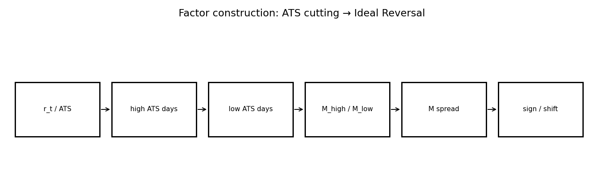
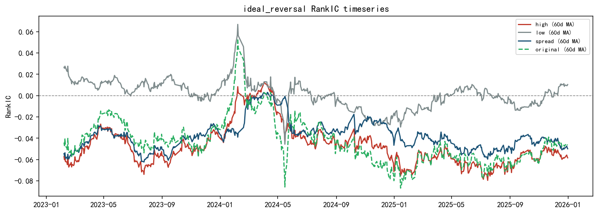
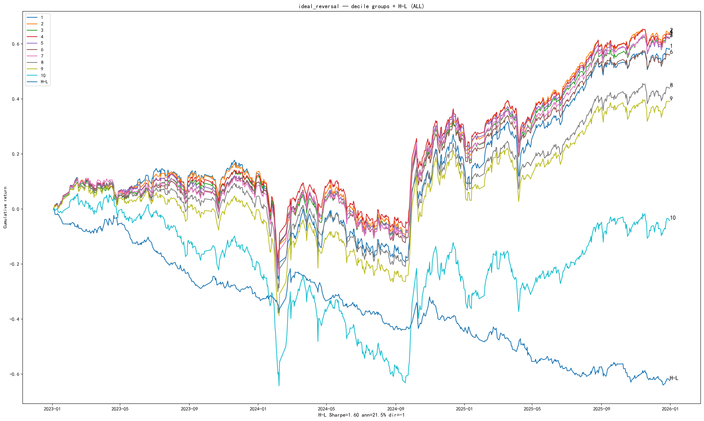
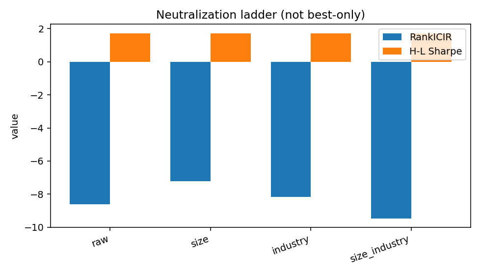
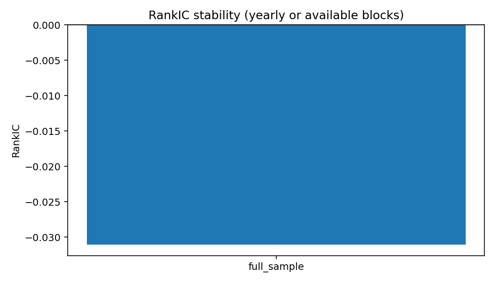

# IdealReversal — Factor Research Report (Template v2)

> **schema_version:** `factor_report_v2` · Research Pack (schema-driven)  
> **Harvest only** — formulas not recomputed. Metric Union: N/A never silently dropped.

**Factor Identity:** `IdealReversal` (spread \(M\)) is the only investable factor_id.
`M_high` / `M_low` / Ret20 baseline are **cutting / mechanism legs**, not Registry siblings.

**Boss reading guide**

| Lens | Look at |
|------|---------|
| Research | RankIC, RankICIR, Gross Sharpe, MDD, Monotonicity |
| Admission | Net Sharpe, Turnover, Implied Fee, Execution |
| Not factors | Mechanism diagnostics · Execution implementation labels |

---

# 1. Executive Summary

Ideal Reversal is a **paper-replication / cutting** factor: 20-day returns are split by
average trade size (ATS = amount / trade_count) into high/low legs; the spread
\(M = M_{high} - M_{low}\) purifies reversal information concentrated in the high-ATS state.

On the cutting_v1 harvest, the spread shows RankICIR ≈ −6.5 to −8.6 (signed book) with
H–L Sharpe ≈ 1.70 and **weak monotonicity (~0.44)**. This pack is a Template v2 stress test
for Object–Knife–Output documentation — **not** an automatic soft-bar pass (Sharpe < 2).

### Core metrics (Metric Union headline)

| Metric | Value |
| --- | --- |
| RankIC | -0.0311 |
| IC | N/A (not_computed) |
| RankICIR | -8.6011 |
| ICIR | -8.6011 |
| IC_tstat | N/A (not_computed) |
| IC_positive_ratio | N/A (not_in_artifacts) |
| Annualized_RankIC | -0.4911 |
| Sharpe | 1.6999 |
| net_Sharpe | N/A (not_in_artifacts) |
| MDD | N/A (not_in_artifacts) |
| daily_turnover | N/A (not_in_artifacts) |
| monotonicity | 0.4444 |

---

# 2. Factor Thesis

Traditional Ret20 mixes informative and noisy days. Cutting by ATS isolates the return
contribution of large-trade days versus small-trade days; the difference is a cleaner
reversal (or momentum) locus than the raw sum.

---

# 3. Economic Intuition

Large average trade size days are more likely to embed institutional / informed inventory
adjustment; small-trade days embed noise trading. If reversal is driven by the former,
\(M_{high}\) should dominate and \(M_{low}\) should be near noise — exactly the cutting claim.

---

# 4. Formula Construction

## 4.1 Raw variables

Daily return \(r_t\), amount, trade count over a 20-day window.

## 4.2 Intermediate variables

$$\mathrm{ATS}_t = \frac{\mathrm{Amount}_t}{\mathrm{TradeCount}_t}$$

Partition the last 20 days into high-ATS and low-ATS halves (10/10 in the paper recipe).

## 4.3 Transformations / residualization

$$M_{high} = \sum_{t \in HighATS} r_t,\qquad M_{low} = \sum_{t \in LowATS} r_t$$

## 4.4 Final investable signal

$$M = M_{high} - M_{low}$$

Investable signal uses the cutting validation sign convention (`direction=-1` on harvest).

---

# 5. Signal Pipeline

```
Ret20 object (additive daily returns)
      ↓
knife: ATS = amount / trade_count
      ↓
M_high vs M_low
      ↓
M = M_high − M_low
      ↓
neutralization / residual vs Base3 (diagnostics)
```



---

# 6. Mechanism Validation

> **Layer:** diagnostic variants / signal representations that test *why* `IdealReversal` works.  
> **Not** competing `factor_id`s. Registry still has only `IdealReversal`.

Ideal Reversal’s value in Alpha OS is methodological: Object–Knife–Output with an explicit
pass/fail on legs. It is a Template v2 representative for **paper replication**, even when
portfolio soft-bar metrics are incomplete.

### Verdict table

| Hypothesis | Test | Result | Conclusion |
| --- | --- | --- | --- |
| High-ATS leg carries the reversal alpha | M_high RankICIR | ICIR ≈ −5.7 (stronger than low leg) | pass — information locus in high ATS |
| Low-ATS leg is near noise | M_low RankICIR | ICIR ≈ +0.32 ~ 0 | pass — knife separates signal from noise |
| Spread purifies vs raw Ret20 | M spread vs Ret20 ICIR / purity | spread ICIR ≈ −6.5; purity ≈ 0.79 | pass cutting claim |
| Soft quality bar (Sharpe>2, mono>0.8) | H-L Sharpe / monotonicity | Sharpe ≈ 1.70 · mono ≈ 0.44 | fail soft bar — keep as testing / paper-replication pack |

### Mechanism chain

```
diagnostics → see verdict table
IdealReversal → accepted investable expression (sole factor_id)
```

### Full mechanism artifact (diagnostics — not sibling factors)

| signal | category | rank_ic | icir | hl_sharpe | net_sharpe | monotonicity | daily_turnover |
| --- | --- | --- | --- | --- | --- | --- | --- |
| M_high | cutting_leg | -0.0430 | -5.7340 | N/A | N/A | N/A | N/A |
| M_low | cutting_leg | 0.0020 | 0.3250 | N/A | N/A | N/A | N/A |
| M_spread | cutting_output | -0.0338 | -6.4839 | 1.6999 | N/A | 0.4444 | N/A |
| Ret20_baseline | object | -0.0437 | -4.0600 | N/A | N/A | N/A | N/A |

---

# 7. IC Analysis

Harvest RankIC ≈ −3.1% (factor-level) with RankICIR ≈ −8.6 on the summary.json primary row;
mechanism spread leg ICIR ≈ −6.48. IC+ ratio ≈ 27% (signed). Pearson IC N/A.



---

# 8. Portfolio Analysis

H–L Sharpe ≈ 1.70 with direction −1. Monotonicity ≈ 0.44 — **weak**; decile structure is not
yet institutional-grade on this harvest. Treat portfolio section as diagnostic.




---

# 9. Risk Adjustment

If neutralization.csv exists it is mapped into the risk ladder; otherwise size/industry modes
are N/A. Residual independence vs Base3 (from cutting notes) belongs in diagnostics, not as
a Production claim.

**All neutralization modes (not best-only):**

| Mode | RankIC | RankICIR | H-L Sharpe | MDD | Net Sharpe |
| --- | --- | --- | --- | --- | --- |
| raw | -0.0311 | -8.6011 | 1.6999 | N/A | N/A |
| size | -0.0374 | -7.2081 | 1.6999 | N/A | N/A |
| industry | -0.0334 | -8.1680 | 1.6999 | N/A | N/A |
| size_industry | -0.0331 | -9.4561 | 1.6999 | N/A | N/A |



---

# 10. Stability

Only full-sample block harvested (n_days ≈ 1703). Yearly panel not assembled — limited.

_no stability_



---

# 11. Execution (Portfolio Implementation)

> **Layer:** how to trade the **same** `IdealReversal` signal (rebalance / buffer / hold).  
> Labels below are implementation variants — not new factors.

No execution grid in cutting_v1 harvest → Net Sharpe / turnover N/A.

Top implementation rows (full grid in `execution/execution_summary.csv`):

_no execution_


---

# 12. Limitations

- Soft quality bar not passed (Sharpe/mono).
- Weak decile monotonicity.
- Missing execution and incomplete neutralization ladder.
- Sign/horizon conventions must stay tied to cutting validation scripts.

### Missing Artifacts

None

---

# 13. Final Verdict

**Status: testing (paper replication).** Template v2 successfully encodes cutting logic and
mechanism legs. Not Registry-validated. Next: fill Production Track + improve mono before
candidate promotion.

---

# Appendix A. Complete Metric Dump (union)

| metric_id | value | source | note/missing_reason |
| --- | --- | --- | --- |
| Annualized_IC | -0.4911 | factor_summary.csv:raw |  |
| Annualized_RankIC | -0.4911 | factor_summary.csv:raw |  |
| Calmar | N/A |  | not_computed |
| HL_Sharpe | 1.6999 | factor_summary.csv:raw |  |
| HL_return | 0.1663 | factor_summary.csv:raw |  |
| IC | N/A |  | not_computed |
| ICIR | -8.6011 | factor_summary.csv:raw |  |
| IC_mean | N/A |  | not_in_artifacts |
| IC_positive_ratio | N/A |  | not_in_artifacts |
| IC_std | N/A |  | not_in_artifacts |
| IC_tstat | N/A |  | not_computed |
| MDD | N/A |  | not_in_artifacts |
| RankIC | -0.0311 | factor_summary.csv:raw |  |
| RankICIR | -8.6011 | factor_summary.csv:raw | Mapped from legacy icir (Spearman-based) |
| Sharpe | 1.6999 | factor_summary.csv:raw |  |
| Sortino | N/A |  | not_computed |
| annual_return | 0.1663 | factor_summary.csv:raw |  |
| annual_turnover | N/A |  | not_in_artifacts |
| cumulative_return | N/A |  | not_in_artifacts |
| daily_turnover | N/A |  | not_in_artifacts |
| decile_spread | N/A |  | not_in_artifacts |
| direction | -1 | factor_summary.csv:raw |  |
| excess_return | N/A |  | not_in_artifacts |
| gross_Sharpe | 1.6999 | factor_summary.csv:raw |  |
| implied_fee | N/A |  | not_in_artifacts |
| long_leg_return | N/A |  | not_in_artifacts |
| monotonicity | 0.4444 | factor_summary.csv:raw |  |
| net_Sharpe | N/A |  | not_in_artifacts |
| short_leg_return | N/A |  | not_in_artifacts |
| signal_decay | N/A |  | not_in_artifacts |
| stability_score | N/A |  | not_in_artifacts |
| volatility | N/A |  | not_in_artifacts |

---

# Appendix B. Data Dictionary & Code Map

| Item | Path |
| --- | --- |
| Report content | `factor_specs/IdealReversal_report_content.yaml` |
| Factor spec | `factor_specs/IdealReversal.yaml` |
| Metric registry | `docs/schemas/metric_registry.yaml` |
| Chart registry | `docs/schemas/chart_registry.yaml` |
| Pack schema | `docs/schemas/factor_report.schema.yaml` |
| Implementation | `research/reports/factor_cutting_v1/ideal_reversal/ (Object–Knife–Output)` |
| Cutting framework | `research/reports/factor_cutting_v1/` |
