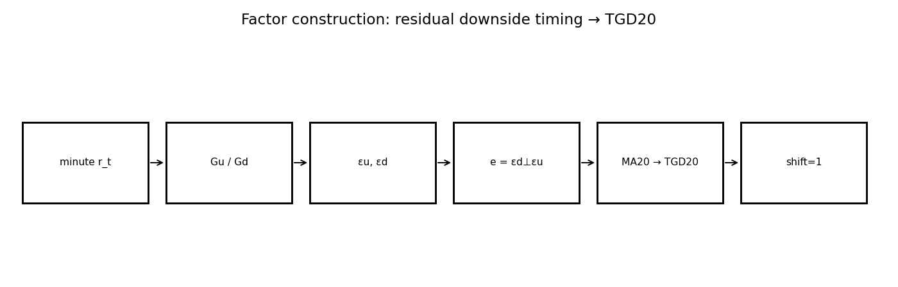
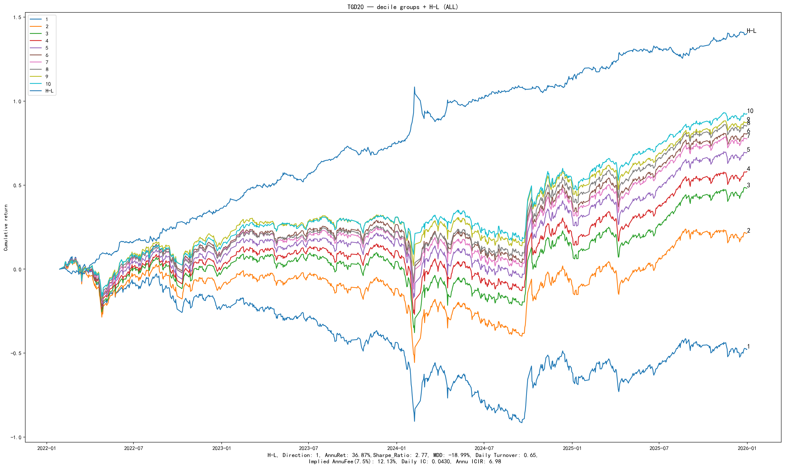
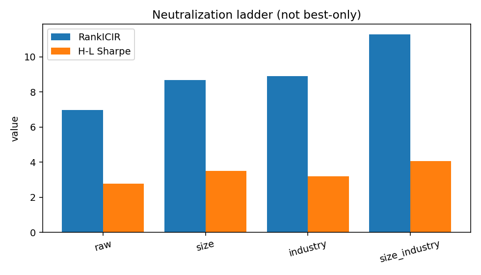
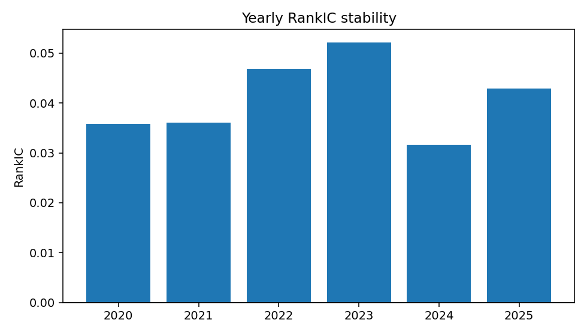

# TGD20 — Factor Research Report (Template v2)

> **schema_version:** `factor_report_v2` · Research Pack (schema-driven)  
> **Harvest only** — formulas not recomputed. Metric Union: N/A never silently dropped.

**Factor Identity:** `TGD20` is the only Registry / investable factor_id.

| Layer | Contents | Registry? |
|-------|----------|-----------|
| Identity | TGD20 = MA20(εd ⊥ εu) | **yes** |
| Signal construction | Gu, Gd, εu, εd, e | no — formula intermediates |
| Mechanism diagnostics | τ, υ, εu/εd (±MA20), tgd_eps | no — hypothesis tests |
| Portfolio implementation | daily / buffer_5_15 / … | no — trade the same signal |

Higher ICIR on unsmoothed `tgd_eps` does **not** create a second factor; it shows the
raw residual channel before MA20 trades ICIR for turnover / net Sharpe.

**Boss reading guide**

| Lens | Look at |
|------|---------|
| Research | RankIC, RankICIR, Gross Sharpe, MDD, Monotonicity |
| Admission | Net Sharpe, Turnover, Implied Fee, Execution |
| Not factors | Mechanism diagnostics · Execution implementation labels |

---

# 1. Executive Summary

TGD20 captures cross-sectional differences in **intraday downside return timing**.
After removing return-magnitude / open-session structure and orthogonalizing downside
residuals to upside residuals, the smoothed score remains predictive on the confirmation
sample. Performance **strengthens** after size and industry neutralization, suggesting
the alpha is not solely explained by common liquidity or style exposures.

Execution optimization does not invent new predictive power; it improves **trade
efficiency** — cutting raw turnover (~0.65 → ~0.30) and lifting Net Sharpe (~1.0 → **2.32**)
while preserving the size+industry signal.

| Lens | Snapshot (legacy ALL / 2022–2025 harvest) |
|------|-------------------------------------------|
| Research | RankIC ≈ 4.3% · RankICIR raw 6.98 → size+ind **11.29** · Gross Sharpe 2.77 → 4.06 · Mono ≈ 0.99 |
| Admission | Best execution Net Sharpe **2.32** (buffer 5/15) · see full neutralization + execution ladders below |

### Core metrics (Metric Union headline)

| Metric | Value |
| --- | --- |
| RankIC | 0.0430 |
| IC | N/A (not_computed) |
| RankICIR | 6.9795 |
| ICIR | 6.9795 |
| IC_tstat | N/A (not_computed) |
| IC_positive_ratio | 0.6892 |
| Annualized_RankIC | 0.6800 |
| Sharpe | 2.7686 |
| net_Sharpe | 0.9959 |
| MDD | -0.1899 |
| daily_turnover | 0.6471 |
| monotonicity | 0.9879 |

---

# 2. Factor Thesis

Classical price/volume factors answer *how much* prices moved. TGD asks *when* within
the trading day those moves concentrated — especially on the downside — after removing
mechanical return-structure effects. The economic claim is that **residual downside
timing** carries independent next-day cross-sectional information.

---

# 3. Economic Intuition

Stocks whose abnormal selling pressure arrives later in the session (conditional on
upside timing and amplitude controls) tend to exhibit subsequent relative outperformance
on the confirmation sample. This is **not** the naive story “fell late ⇒ bounce.”
Mechanism tests show that simple timing differences (τ, υ) fail, while residualized
downside timing (εd / TGD20) survives — i.e. the information is in the **orthogonalized**
timing residual, not the raw clock difference.

---

# 4. Formula Construction

## 4.1 Raw variables

Continuous auction minutes \(t \in \{0,\ldots,239\}\):

$$r_t = \frac{P_t}{P_{t-1}} - 1$$

Controls (return distribution / open structure): \(\bar R_u\), \(\bar R_d\), \(R_1\), \(R_2\), \(R_{\mathrm{ovn}}\).

## 4.2 Intermediate variables

Upside / downside timing centers:

$$G_u = \frac{\sum_{r_t>0} t\cdot r_t}{\sum_{r_t>0} r_t},\qquad
  G_d = \frac{\sum_{r_t<0} t\cdot |r_t|}{\sum_{r_t<0} |r_t|}$$

## 4.3 Transformations / residualization

Daily cross-sectional residualization (not time-series):

$$G_u = \alpha_u + \beta_u \bar R_u + \gamma_u R_1 + \delta_u R_2 + \eta_u R_{\mathrm{ovn}} + \varepsilon_u$$

$$G_d = \alpha_d + \beta_d \bar R_d + \gamma_d R_1 + \delta_d R_2 + \eta_d R_{\mathrm{ovn}} + \varepsilon_d$$

Then orthogonalize downside to upside:

$$\varepsilon_{d,i} = \alpha + \beta\,\varepsilon_{u,i} + e_i$$

## 4.4 Final investable signal

$$\mathrm{TGD20}_{i,t} = \frac{1}{20}\sum_{k=0}^{19} e_{i,t-k}$$

Point-in-time: \(\mathrm{signal}_t = \mathrm{TGD20}_{t-1}\) (`signal_shift=1`). Formula frozen — no MA retune.

---

# 5. Signal Pipeline

```
minute returns r_t
      ↓
   Gu / Gd  (timing centers)
      ↓
remove amplitude / open-session structure  →  εu, εd
      ↓
εd ⊥ εu  →  innovation e
      ↓
MA20(e) = TGD20
      ↓
signal_shift=1 → next-day cross-section
```



---

# 6. Mechanism Validation

> **Layer:** diagnostic variants / signal representations that test *why* `TGD20` works.  
> **Not** competing `factor_id`s. Registry still has only `TGD20`.

The mechanism ladder answers *why TGD20 has alpha*, not *which sibling factor wins*.

Gu / Gd are timing centers; τ = Gd−Gu and υ fail as tradable hypotheses.
After residualization, **εd** (downside timing abnormality) is the core channel;
εu is weaker. Unsmoothed `tgd_eps = εd−εu` can post higher RankICIR (~8.5) than
TGD20 (~7.0) but with daily turnover ~3.4 — not a separate factor, a pre-smoothing
representation. MA20 selects the investable point on the alpha/cost frontier.

Rows in the full mechanism CSV are **diagnostic variants** of one research chain.

### Verdict table

| Hypothesis | Test | Result | Conclusion |
| --- | --- | --- | --- |
| Simple timing difference τ = Gd − Gu carries alpha | τ_MA20 RankICIR / H-L Sharpe | RankICIR ≈ −0.56; Gross Sharpe ≈ 0.27 | fail — τ is not the alpha |
| Absolute timing distance υ = |Gd − Gu| carries alpha | υ_MA20 RankICIR / monotonicity | RankICIR ≈ −2.26; mono negative | fail — υ is noise / wrong signed structure |
| Upside residual εu alone is the driver | εu / εu_MA20 ICIR | εu ICIR ≈ 1.62; εu_MA20 ≈ 3.79 (weaker than TGD) | partial — not sufficient |
| Downside residual εd contains independent timing information | εd / εd_MA20 RankICIR | εd ICIR ≈ 5.80; εd_MA20 ≈ 4.74 | pass — downside residual is the core channel |
| Orthogonalized + smoothed TGD20 is the investable expression | TGD20 vs primitives after size+industry | RankICIR raw 6.98 → size+ind 11.29; mono ≈ 0.99 | accept — TGD20 is the validated expression |

### Mechanism chain

```
tau        → rejected
upsilon    → rejected
epsilon_u  → weak / partial
epsilon_d  → key driver
tgd_eps    → strong but high TO (pre-MA)
TGD20      → accepted investable expression
```

### Full mechanism artifact (diagnostics — not sibling factors)

| signal | category | rank_ic | icir | hl_sharpe | net_sharpe | monotonicity | daily_turnover |
| --- | --- | --- | --- | --- | --- | --- | --- |
| Gu_MA20 | primitive_family | 0.0447 | 4.2501 | 0.9008 | 0.4057 | 0.7333 | 0.3587 |
| Gd_MA20 | primitive_family | 0.0444 | 4.1617 | 0.9788 | 0.4613 | 0.9273 | 0.3192 |
| tau_MA20 | primitive_family | -0.0041 | -0.5556 | 0.2737 | -1.9205 | 0.3333 | 0.8080 |
| upsilon_MA20 | primitive_family | -0.0178 | -2.2607 | 0.5773 | -1.2207 | -0.8788 | 0.5656 |
| TGD20 | primitive_family | 0.0430 | 6.9795 | 2.7686 | 1.5832 | 0.9879 | 0.6471 |
| epsilon_u | mechanism_residual | 0.0107 | 1.6206 | 2.5813 | -8.6079 | -0.6000 | 3.1283 |
| epsilon_d | mechanism_residual | 0.0371 | 5.7993 | 1.0543 | -7.3634 | 0.7455 | 3.1202 |
| tgd_eps | mechanism_residual | 0.0474 | 8.5299 | 4.3302 | -4.6538 | 0.9273 | 3.4450 |
| epsilon_u_MA20 | mechanism_residual | 0.0370 | 3.7852 | 0.8197 | 0.0151 | 0.9515 | 0.3466 |
| epsilon_d_MA20 | mechanism_residual | 0.0458 | 4.7382 | 1.3852 | 0.7504 | 0.9152 | 0.3373 |

---

# 7. IC Analysis

Predictive power is evaluated primarily with **RankIC** (Spearman). On the raw book,
mean RankIC ≈ 4.3% with RankICIR ≈ 6.98 and high IC-positive years (2020–2025 all positive
in the yearly table). Pearson IC is **not computed** in current artifacts and is marked N/A
under Metric Union (not silently omitted).


---

# 8. Portfolio Analysis

The 10-decile long–short book is strongly monotonic (mono ≈ 0.99). Raw Gross Sharpe ≈ 2.77
with annualized H–L return ≈ 37% and MDD ≈ −19%. After size+industry neutralization,
Gross Sharpe rises to ≈ 4.06 while MDD compresses — consistent with a cleaner alpha book
rather than a pure size bet.




---

# 9. Risk Adjustment

Neutralization does **not** destroy the signal. RankICIR increases from 6.98 (raw) to
11.29 (size+industry). Therefore the effect **survives** common size/industry exposures
on this sample. Official Registry comparison should still use Protocol Production Track
(CSI1000 @ 20D) when re-run; this Golden Pack harvests the existing ALL confirmation ladder.

**All neutralization modes (not best-only):**

| Mode | RankIC | RankICIR | H-L Sharpe | MDD | Net Sharpe |
| --- | --- | --- | --- | --- | --- |
| raw | 0.0430 | 6.9795 | 2.7686 | -0.1899 | 0.9959 |
| size | 0.0443 | 8.6691 | 3.5180 | -0.0762 | 1.5069 |
| industry | 0.0408 | 8.8964 | 3.1893 | -0.1587 | 1.1633 |
| size_industry | 0.0415 | 11.2872 | 4.0559 | -0.0604 | 1.7190 |



---

# 10. Stability

Yearly RankIC is positive in every calendar year 2020–2025 in the stability table, with
RankICIR ranging roughly 4.3–9.1. Blocks 2022–2023 are the strongest; 2024 is the softest
but still positive — supporting persistence rather than a one-regime spike.

| Year | RankIC | RankICIR | IC+ ratio | n_days |
| --- | --- | --- | --- | --- |
| 2020 | 0.0358 | 8.0113 | 0.6983 | 242 |
| 2021 | 0.0360 | 6.6880 | 0.6543 | 243 |
| 2022 | 0.0469 | 9.1185 | 0.7273 | 242 |
| 2023 | 0.0521 | 8.9501 | 0.7314 | 242 |
| 2024 | 0.0317 | 4.2529 | 0.6405 | 242 |
| 2025 | 0.0429 | 7.0579 | 0.6831 | 243 |



---

# 11. Execution (Portfolio Implementation)

> **Layer:** how to trade the **same** `TGD20` signal (rebalance / buffer / hold).  
> Labels below are implementation variants — not new factors.

Same investable signal (`TGD20`); rows below are **portfolio implementation** experiments
(rebalance frequency, entry/exit buffers, hold rules) — not new factor_ids.

Raw daily turnover ≈ 0.65 implies large fee drag (Net Sharpe ≈ 1.0 on raw). Best grid
row (`size_industry|daily|buffer_5_15`) cuts turnover to ≈ 0.30 and lifts **Net Sharpe
to ≈ 2.32** (15bp round-trip). That is trade efficiency on a fixed signal, not a claim
that RankICIR 11 alone is the production book.

Top implementation rows (full grid in `execution/execution_summary.csv`):

| label | gross Sharpe | net Sharpe | daily TO | implied fee | MDD net |
| --- | --- | --- | --- | --- | --- |
| size_industry|daily|buffer_5_15 | 3.5057 | 2.3236 | 0.2965 | 0.0556 | -0.0810 |
| size_industry|best_e1|zscore | 3.4995 | 2.2438 | 0.3237 | 0.0607 | -0.1009 |
| size_industry|daily|buffer_10_30 | 3.3560 | 2.2072 | 0.2172 | 0.0407 | -0.0745 |
| size_industry|best_e1|hold_10d | 3.4072 | 2.1969 | 0.2574 | 0.0483 | -0.0914 |
| size_industry|best_e1|buffer_5_15 | 3.0392 | 2.1966 | 0.2164 | 0.0406 | -0.1029 |
| size_industry|best_e1|buffer_10_30 | 2.9403 | 2.0935 | 0.1648 | 0.0309 | -0.0892 |
| size_industry|daily_buffer_10_20 | 3.5484 | 2.0919 | 0.2980 | 0.0559 | -0.0755 |
| size_industry|daily|buffer_10_20 | 3.5484 | 2.0919 | 0.2980 | 0.0559 | -0.0755 |
| size_industry|best_e1|rank | 3.4373 | 2.0750 | 0.3107 | 0.0583 | -0.0951 |
| size_industry|best_e1_buffer_10_20_hold5 | 3.0896 | 2.0718 | 0.2092 | 0.0392 | -0.0915 |


---

# 12. Limitations

- Legacy confirmation uses universe **ALL** and period **2022–2025**, not yet Protocol
  Production Track (CSI1000, 2018–2025 target). Coverage exception documented on the card.
- Pearson IC / IC t-stat / Sortino / Calmar are absent from artifacts → N/A in Metric Union.
- Implied fee in v1 summaries used a 7.5bp convention in places; execution grid uses
  round_trip_cost=15bp — both are shown; do not mix without labeling.
- Orthogonality vs FlowDensity is diagnostic evidence (corr ≈ 0.22); equal-rank 50/50
  underperforms TGD alone — composite weights are out of scope for this pack.

### Missing Artifacts

None

---

# 13. Final Verdict

**Status: validated (formula frozen).** TGD20 is the Golden Pack for Report Template v2:
complete formula chain, mechanism pass/fail ladder, neutralization survival, yearly
stability, and execution Net Sharpe path. Ready as the research-asset reference for
batch migration (1D). Do not retune MA/residual controls under this factor_id.
Composite eligibility remains subject to Matrix + IC-weighted design (not 50/50).

---

# Appendix A. Complete Metric Dump (union)

| metric_id | value | source | note/missing_reason |
| --- | --- | --- | --- |
| Annualized_IC | 0.6800 | factor_summary.csv:raw |  |
| Annualized_RankIC | 0.6800 | factor_summary.csv:raw |  |
| Calmar | N/A |  | not_computed |
| HL_Sharpe | 2.7686 | factor_summary.csv:raw |  |
| HL_return | 0.3687 | factor_summary.csv:raw |  |
| IC | N/A |  | not_computed |
| ICIR | 6.9795 | factor_summary.csv:raw |  |
| IC_mean | N/A |  | not_in_artifacts |
| IC_positive_ratio | 0.6892 | yearly_stability.csv:mean_pos |  |
| IC_std | N/A |  | not_in_artifacts |
| IC_tstat | N/A |  | not_computed |
| MDD | -0.1899 | factor_summary.csv:raw |  |
| RankIC | 0.0430 | factor_summary.csv:raw |  |
| RankICIR | 6.9795 | factor_summary.csv:raw | Mapped from legacy icir (Spearman-based) |
| Sharpe | 2.7686 | factor_summary.csv:raw |  |
| Sortino | N/A |  | not_computed |
| annual_return | 0.3687 | factor_summary.csv:raw |  |
| annual_turnover | 37.0663 | execution_summary.csv:best |  |
| cumulative_return | N/A |  | not_in_artifacts |
| daily_turnover | 0.6471 | factor_summary.csv:raw |  |
| decile_spread | N/A |  | not_in_artifacts |
| direction | 1 | factor_summary.csv:execution_best |  |
| excess_return | N/A |  | not_in_artifacts |
| gross_Sharpe | 2.7686 | factor_summary.csv:raw |  |
| implied_fee | 0.1213 | factor_summary.csv:raw |  |
| long_leg_return | N/A |  | not_in_artifacts |
| monotonicity | 0.9879 | factor_summary.csv:raw |  |
| net_Sharpe | 0.9959 | factor_summary.csv:raw |  |
| short_leg_return | N/A |  | not_in_artifacts |
| signal_decay | N/A |  | not_in_artifacts |
| stability_score | N/A |  | not_in_artifacts |
| volatility | N/A |  | not_in_artifacts |

---

# Appendix B. Data Dictionary & Code Map

| Item | Path |
| --- | --- |
| Report content | `factor_specs/TGD20_report_content.yaml` |
| Factor spec | `factor_specs/TGD20.yaml` |
| Metric registry | `docs/schemas/metric_registry.yaml` |
| Chart registry | `docs/schemas/chart_registry.yaml` |
| Pack schema | `docs/schemas/factor_report.schema.yaml` |
| Implementation | `core/l2_features/` (return_timing, timing_residual, tgd) — **frozen** |
| Long-form essay | `research/reports/tgd_v1/日内分钟收益率时序特征_TGD20因子研究报告.md` |
| Orthogonality | `research/reports/factor_orthogonality/TGD20_FlowDensity20/` |
