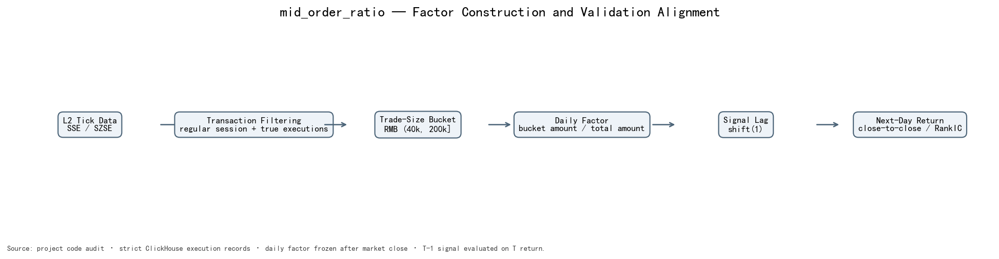
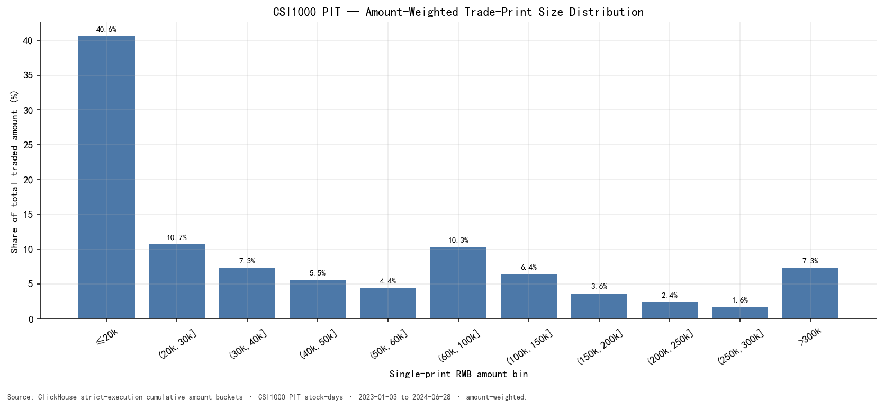

# 02 — Data and Factor Construction

## 1. 为什么必须使用 L2 Tick

不同频率的数据保留的信息不同：

```text
日频 OHLCV
  只知道一天的开高低收、总成交量和总成交额
  无法回答“总成交额由多大的单笔成交组成”

分钟数据
  知道每分钟价格与成交额
  仍把一分钟内的许多成交压缩成一条 bar
  只能构造平均单笔金额代理，不能恢复真实订单金额分布

Level-2 Tick
  每一笔成交均保留时间、价格、数量和金额
  可以逐笔分类后再聚合
  因而可以直接计算中单成交额占比
```

`mid_order_ratio` 的研究对象不是价格或总成交量，而是**总成交额的单笔金额构成**。该信息在 OHLCV 和分钟 bar 聚合时已经丢失，事后无法精确恢复。

## 2. 数据源

### ClickHouse 连接

- 配置：`COMMON_CONST.DATA_DB_HFDATA`
- host / port：`10.80.139.9:8123`
- database：`cmds`
- 表：
  - `cmds.SSE_AL_TICK_EXG`
  - `cmds.SZSE_AL_TICK_EXG`

连接由 `clickhouse_connect.get_client(**DATA_DB_HFDATA)` 创建。账号信息不在报告中展开。

### DolphinDB 连接

- 配置：`COMMON_CONST.DATA_DB_CONN`
- host / port：`10.12.180.9:8902`
- 统一入口：`core/ddb/connection.py::get_ddb_session`

DolphinDB 不负责构造本因子；它提供 Wind 日收益、指数成分、ST/涨跌停/停牌、行业、市值和换手率。

## 3. 字段使用审计

本报告核验的 Tick 字段及其在本因子中的实际用途：

| 字段 | 本因子是否使用 | 用途 |
|---|---|---|
| `Price` | 是 | 深市单笔金额 `Price × Volume`；同时过滤 `Price > 0` |
| `Volume` | 是 | 与 Price 相乘；过滤 `Volume > 0` |
| `Amount` | 仅上交所 | 上交所优先使用 `Amount`，缺失时回退 `Price × Volume` |
| `ExchTime` | 是 | 交易日、交易时段和聚合日期 |
| `BSFlag` | **否** | 可用于上交所主动买卖方向，但本因子不区分方向 |
| `BidOrderNo` | **是（深市筛选）** | 与 `AskOrderNo` 同时大于 0 时识别深市成交记录；不参与金额分档 |
| `AskOrderNo` | **是（深市筛选）** | 与 `BidOrderNo` 同时大于 0 时识别深市成交记录；不参与金额分档 |

这一区分很重要：`mid_order_ratio` 衡量**成交规模结构**，不是主动买卖方向。订单号用于判断深市记录是否为成交，不能省略；但买卖订单号的大小关系和 `BSFlag` 不进入因子数值。

## 4. 精确因子定义

对股票 \(i\)、交易日 \(t\)、成交 \(k\)：

\[
a_{i,t,k}=
\begin{cases}
\mathrm{ifNull}(\mathrm{Amount},\ \mathrm{Price}\times\mathrm{Volume}),
& \text{SSE}\\
\mathrm{Price}\times\mathrm{Volume},
& \text{SZSE}
\end{cases}
\]

\[
\mathrm{MediumAmount}_{i,t}
=\sum_k a_{i,t,k}\,
\mathbf{1}(40{,}000<a_{i,t,k}\le 200{,}000)
\]

\[
\mathrm{MidOrderRatio}_{i,t}
=\frac{\mathrm{MediumAmount}_{i,t}}
{\mathrm{TotalAmount}_{i,t}}
\]

边界为左开右闭：

- 小于等于 4 万元不计入中单；
- 4 万元以上、20 万元以下或等于 20 万元计入；
- 20 万元以上不计入。

### 为什么使用 4 万至 20 万元

需要区分**定义来源**与**经济解释**：

1. **定义来源：** `(4万, 20万]` 是本项目在本次验证前已经存在并冻结的研究公式，不是从当前 2023-01 至 2024-06 样本中挑选出的最优区间。订单规模 family 的标准五档以 5 万和 20 万为相邻边界，额外保留 4 万累计边界是为了不静默改写既有 `mid_order_ratio`；
2. **数据可用性：** 在 CSI1000 PIT 样本中，该区间约占总成交额的 30.2%，具有足够横截面质量，不是由极少数尾部成交主导的稀疏桶；
3. **研究直觉：** 该区间刻画小额成交与 20 万元以上较大成交之间的中等成交规模构成，可能对执行方式和短期交易环境的变化敏感。这个直觉只用于提出待检验假说，不是阈值的因果证明。

邻近的 25 组阈值全部保持负 IC，支持的是“结论不依赖 4 万/20 万这一孤立点”，而不是“4 万/20 万在经济上最优”。由于逐笔金额不能识别账户、母订单或交易动机，报告不采用“4 万以下等于散户噪声、20 万以上等于机构交易”这类身份映射。

## 5. SQL 聚合逻辑

`l2_factor_reproduction/python/ch_tick.py::fetch_tick_agg_by_date_range` 的核心逻辑可概括为：

```sql
SELECT
    Symbol,
    toDate(ExchTime) AS TradeDate,
    sum(amt) AS TotalAmount,
    sum(if(amt > 40000 AND amt <= 200000, amt, 0)) AS MediumAmount
FROM tick_table
WHERE ExchTime in regular_session
  AND Price > 0
  AND Volume > 0
  AND exchange_specific_trade_filter
GROUP BY Symbol, TradeDate
```

交易所级成交过滤为：

```text
SSE:  Type = 'T'
SZSE: Type = '011' AND BidOrderNo > 0 AND AskOrderNo > 0
```

交易窗口为：

```text
09:30:00 <= ExchTime < 15:00:01
timezone = Asia/Shanghai
```

该窗口条件现在对范围内**每一行、每一个交易日**显式施加。仅用
`ExchTime >= start 09:30` 和 `ExchTime < end 15:00:01` 只能约束区间首尾，
会让中间日期的盘前记录进入结果。

### 旧实现缺陷与修正影响

最初审计只比较了深市 `Type='011'` 与其他 `Type`，因其他类型几乎不存在而错误地判断影响很小。进一步核验发现，`Type='011'` 内仍同时包含非成交事件；必须要求买卖订单号均有效。

2024-06-27、697 只深市样本股的对照结果：

| Check | Legacy positive-price/volume rows | Strict executions |
|---|---:|---:|
| Rows | 29,836,521 | 11,916,224 |
| Amount | RMB 370.77bn | RMB 93.19bn |
| Strict amount / legacy amount | — | **25.13%** |

单日因子在两种口径下的 Spearman 相关为 **0.858**，平均绝对差为 **8.64 个百分点**。另一个时段审计显示，盘前/盘后记录占代表日金额约 **2.52%**。因此这不是文档层小风险，而是会改变构造的实质问题。

这些一次性查询结果已结构化保存为
`artifacts/strict_trade_filter_audit.json`。边界是：当时没有同时冻结精确股票列表和原始查询快照，因此该 JSON 是机器可读的 frozen audit record，不等同于完整可一键复算的原始证据。未来重跑时必须把 symbol list、SQL、原始结果和 checksum 一并落盘后再替换这些数字。

`ch_tick.py` 已同时修正：

1. 每个日期逐行施加 `09:30:00 <= ExchTime < 15:00:01`；
2. 深市限定 `Type='011'` 且买卖订单号均大于 0；
3. SSE、SZSE SQL 与边界公式增加无网络单元测试。

### 数据质量为什么会改变因子含义

这两个缺陷会同时污染分子和分母，但污染不会在比例中自动抵消：

```text
intended numerator   = amount of true trades in (40k, 200k]
intended denominator = amount of all true trades

legacy numerator / denominator
  = true trades
  + non-trade events admitted by the SZSE filter
  + off-session rows admitted by the date-range filter
```

非成交事件和盘外记录的金额分布不必与真实成交相同，因此其进入分子与分母的比例也不必相同。此时结果即使仍落在 `[0,1]`，也不再严格表示“真实成交中的中等金额占比”，而是混合事件的金额结构，原有经济标签随之失效。

代表日审计中，深市 strict amount 仅为 legacy amount 的 25.13%，单日因子 Spearman 为 0.858；全样本 legacy 与 strict 面板 Spearman 也只有 0.7996。这些差异说明数据治理不是形式检查，而是正式因子定义的一部分。

## 6. 为什么在 ClickHouse 内聚合

逐笔表的行数远高于股票日面板。若把 Tick 全量拉到 Python：

- 网络传输成为瓶颈；
- Python 内存占用随成交笔数增长；
- 中断后恢复成本高；
- 容易产生不同脚本各自实现分档的口径漂移。

将筛选、金额计算和 `GROUP BY (Symbol, TradeDate)` 下推后，Python 只接收每只股票每天一行的 `TotalAmount / MediumAmount`。严格报告缓存最终只有 1,805,656 个沪深 A 股股票日；原始逐笔记录不跨网络传到 Python。

## 7. 构造链路



```text
run_single_factor.py
  -> factor_runner.run_single_factor
  -> factor_builder._build_tick_order_size_factor
  -> ch_tick.fetch_tick_agg_by_date_range
  -> ch_tick.aggregate_wide_to_narrow
  -> factor_runner._save_narrow
  -> factor_narrow.parquet
```

这是当前代码的标准生成路径；仓库内既有 `factor_narrow.parquet` 生成于修正前，未被本报告复用。报告版审计路径为：

```text
build_mid_order_ratio_strict_cache.py
  -> corrected ch_tick.fetch_tick_bucketed
  -> tick_bucketed_strict_trade_2023-01-01_2024-06-30.parquet
  -> generate_mid_order_ratio_report_artifacts.py
```

窄表字段：

| 字段 | 含义 |
|---|---|
| `symbol` | Wind 股票代码 |
| `tradetime` | 交易日 + 09:30 的日频标记 |
| `factorname` | `mid_order_ratio` |
| `value` | 中单成交额 / 总成交额 |

09:30 是日频窄表的统一标记，不代表因子在当日 09:30 已知。因子使用全天成交，必须到收盘后才能完整计算；回测通过下一交易日对齐解决这一点。

## 8. No look-ahead

交易日 \(T-1\) 的 `mid_order_ratio` 需要汇总该日收盘前全部严格成交，因此只能在 \(T-1\) 收盘后完整获得。验证中统一使用：

```python
signal = factor.shift(1)
```

即 \(T-1\) 因子解释 \(T\) 日 close-to-close return。ST、涨跌停和停牌状态在因子形成日应用后随信号一起滞后，避免使用 \(T\) 日结束后才可确认的信息。日度 RankIC、decile、H-L 和所有稳健性检验均使用相同对齐。

## 9. 因子分布

严格成交缓存覆盖 1,805,656 个沪深 A 股股票日：

| 统计量 | 因子值 |
|---|---:|
| Mean | 0.2553 |
| Std | 0.0835 |
| 1% / 99% | 0.0751 / 0.4398 |
| 25% / Median / 75% | 0.1985 / 0.2583 / 0.3114 |

因子是 \([0,1]\) 内的比例变量，主体分布集中，不依赖极端大值。报告版不对原始因子 winsorize；中性化函数只对市值解释变量做 MAD 处理。

从 CSI1000 逐日成分的成交金额分布看，4万至20万元区间合计约占总成交额 **30.2%**，是有足够质量的中间分档，而不是极小尾部。



该图按成交金额加权，不是按成交笔数加权。

## 10. 旧口径与严格口径影响审计

报告版没有复用旧 `value` 列，而是从重新抽取的严格成交累计金额桶构造：

```text
(cum_200000 - cum_40000) / TotalAmount
```

与旧 `factor_narrow.parquet` 的共同股票日比较：

- 匹配行：463,087 / 463,102；
- Pearson：**0.8287**；
- Spearman：**0.7996**；
- 平均绝对差：**0.0349**；
- 99% 分位绝对差：**0.1485**；
- 仅 **0.99%** 的共同记录在 \(10^{-12}\) 内相同。

差异来自输入记录筛选修正，而不是比例公式改变。旧面板不能继续作为“等价重构”或正式证据。所有 headline、图表、中性化和稳健性结果统一使用严格缓存；其 SHA256 为
`ccd2f23475756052c60c32f8b56b8cbb648ab99508bf866c9b2424b7ff61cb1f`。

