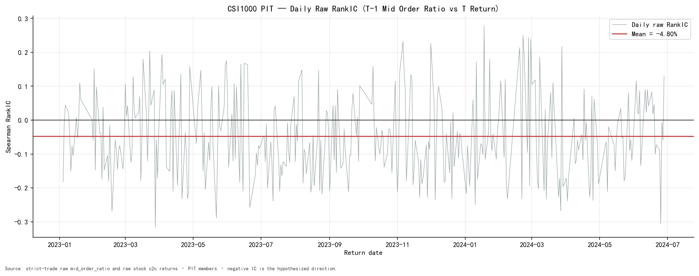
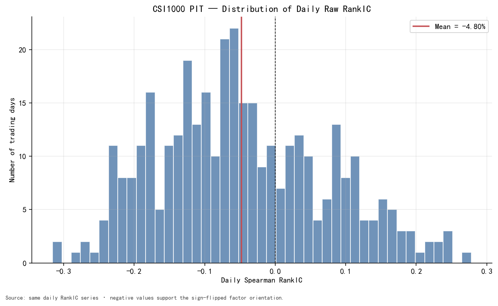
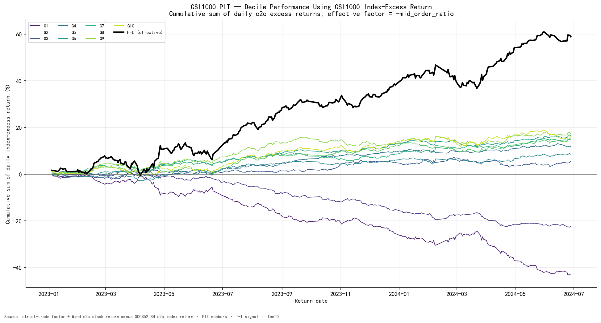
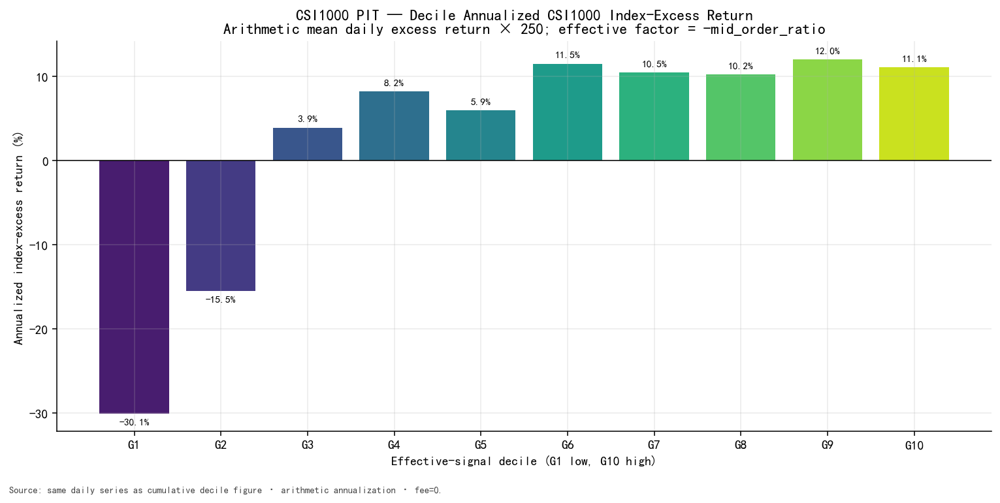

# 03 — Standalone Signal Validation

## 3.1 RankIC

### Validation design

每天在 CSI1000 point-in-time 有效股票截面计算：

\[
IC_t
=
\mathrm{Spearman}
\left(
\mathrm{MidOrderRatio}_{i,t-1},
r_{i,t}^{c2c}
\right)
\]

其中：

\[
r_{i,t}^{c2c}
=
\frac{Close_{i,t}}{PreClose_{i,t}}-1
\]

Spearman RankIC 使用排名而非原始尺度，因此主要检验因子能否预测下一交易日的横截面收益排序。所有结果均使用 T-1 信号、同一可交易性规则和 250 日年化。

### IC statistics

| Statistic | Raw factor result | Effective-direction equivalent |
|---|---:|---:|
| Mean RankIC | **-4.80%** | **+4.80%** |
| Daily IC std | 11.99% | 11.99% |
| IC t-stat | **-7.58** | **+7.58** |
| Annualized ICIR | **-6.33** | **+6.33** |
| Direction-consistent day ratio | IC < 0 on **67.9%** of days | IC > 0 on **67.9%** of days |
| Valid days | 358 | 358 |

负号是经济方向，不是有效性否定：

```text
raw mid_order_ratio higher
        ->
next-day cross-sectional return rank lower

effective signal = -mid_order_ratio
```

这里有三个不同层次，不能混为一谈：

1. **统计含义：** \(IC(f,r)<0\) 只说明高 raw factor 对应较低的未来收益排序；
2. **方向标准化：** factor library 同时保留 raw definition 和 `effective_direction=-1`，于是用于统一画图和构造 H-L 的信号为 \(-f\)。取负号不改变信息量、显著性或经济事实，只改变“高分是否代表高预期收益”的展示约定；
3. **机制解释：** 为什么高占比对应较低次日收益，不能由 IC 的符号本身推出。流动性压力、临时价格影响和反转均是后续待验证假说，而不是取负号的数学理由。

因此，`-mid_order_ratio` 应理解为**预测方向元数据**，不是一个经过额外加工后才“变得有效”的新因子。该方向在进入新样本外窗口前必须冻结，不能随新窗口表现反复翻转。



日度 IC 存在明显波动，但分布中心稳定落在 0 左侧。普通日度 t-stat 未调整自相关，因此本报告把它视为基础显著性证据，不把它解释为完整统计推断。



分布两侧均有尾部，说明该关系不是逐日确定规律；均值、方向一致日占比与时间稳定性需要联合阅读。

## 3.2 Decile Analysis

### Sorting convention

每天按有效方向 `-mid_order_ratio` 从低到高分成十组：

```text
G1  = effective signal lowest
    = raw mid_order_ratio highest

G10 = effective signal highest
    = raw mid_order_ratio lowest
```

图中单组收益为：

```text
stock close-to-close return
- CSI1000 index close-to-close return
= CSI1000 index-excess return
```

曲线是日超额收益的 cumulative sum，不是绝对收益或复利净值。该检验只用于观察单因子排序与尾部分离，不构成任何配置建议。



### Annualized decile return table

| Effective decile | Raw-factor meaning | Annualized CSI1000 index-excess return |
|---|---|---:|
| G1 | highest `mid_order_ratio` | **-30.07%** |
| G2 | higher | -15.51% |
| G3 |  | +3.89% |
| G4 |  | +8.21% |
| G5 |  | +5.95% |
| G6 |  | +11.48% |
| G7 |  | +10.48% |
| G8 |  | +10.22% |
| G9 | lower | +12.05% |
| G10 | lowest `mid_order_ratio` | **+11.05%** |



将组号 \(1,\ldots,10\) 与上表全样本年化指数超额收益做 Spearman 相关，得到：

\[
\rho_{\mathrm{decile}}
=
\mathrm{Spearman}(\mathrm{group},\ \overline r_{\mathrm{group}})
=
\mathbf{0.879}
\]

该数字是**聚合 decile monotonicity diagnostic**，机器结果见
`artifacts/csi1000_decile_summary.csv`，并可由日度 decile artifact 重算；它不是“87.9% 的日期单调”，也不能替代日度 RankIC。G10-G1 年化端点差为 41.12 个百分点，但中间组并非严格逐级单调，且 G9 略高于 G10。因此证据支持“尾部区分度较强、总体排序方向一致”，不支持“完美单调”。

## 3.3 H-L Spread

有效方向 H-L 定义为：

\[
H-L
=
r_{G10}-r_{G1}
\]

| Metric | Result | Definition |
|---|---:|---|
| Arithmetic annual return | **41.12% gross** | 日均 H-L × 250 |
| Sharpe | **2.74 gross** | mean / sample std × \(\sqrt{250}\)，risk-free rate = 0 |
| Maximum drawdown | **-9.68%** | 基于 H-L 日收益复利路径 |
| Daily turnover | **1.69** | G10 与 G1 相邻日权重变化绝对值之和 |

H-L 是对单因子横截面排序能力的两端诊断。其年化差中，高 raw factor 组的显著负超额贡献较大；不能只把它理解为低 raw factor 端的表现。

这里的换手定义没有除以 2：

\[
\mathrm{TO}^{H-L}_t
=
\sum_i |w^{G10}_{i,t}-w^{G10}_{i,t-1}|
+
\sum_i |w^{G1}_{i,t}-w^{G1}_{i,t-1}|
\]

例如，一条满仓腿卖出旧持仓的 50% 并买入等额新持仓，其绝对权重变化和为 1.0；若多空两腿都发生同样替换，H-L turnover 为 2.0。因此 1.69 表示两条单位权重腿合计的日均绝对权重变化，不等于“每天更换 169% 的股票数量”。

若仅作量纲敏感性锚点，以每单位换手 7.5 bps 机械相乘，则隐含年化成本负担约为
\(1.6884\times7.5\mathrm{bps}\times250=31.66\%\)。这不是成本后回测：它没有处理佣金结构、冲击、容量、涨跌停或执行时点，只说明高换手会显著限制 gross spread 的可交易外推。

所有 H-L 指标均为 `fee=0` gross。手续费、滑点、市场冲击和执行约束没有进入当前验证，因此这些数值只用于判断预测关系的强度和稳定性。

## 3.4 Exact-EW long-book diagnostic

H-L 可以检验两端排序，但会同时受 long 端和 short 端影响。作为补充，代码还直接计算有效 G10 相对**当日有效 CSI1000 股票等权组合**的 excess return，而不是用十组收益均值近似 benchmark：

| Metric | Exact-EW G10 result |
|---|---:|
| Annualized excess return | **8.32% gross** |
| Excess Sharpe | **1.41 gross** |
| Maximum drawdown | **-3.84%** |
| Average G10 names | **99.5** |

这个 long-book diagnostic 明显弱于 H-L Sharpe 2.74，进一步说明 headline H-L 的一部分来自高 raw factor 端的负收益。它仍是 `fee=0`、每日等权重构的研究诊断，不是生产组合结论。

## 3.5 Standalone validation conclusion

CSI1000 证据在三个层面一致：

1. raw RankIC 均值为负且 t-stat 显著；
2. 十分组总体按有效方向上升，两端分离明显；
3. H-L 路径具有正的风险调整诊断值，但换手较高。

因此当前样本支持 `mid_order_ratio` 具有统计显著的 standalone cross-sectional predictive relationship。该判断不依赖任何其他因子的加入。
