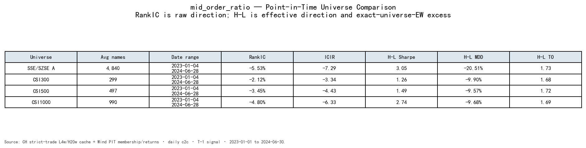
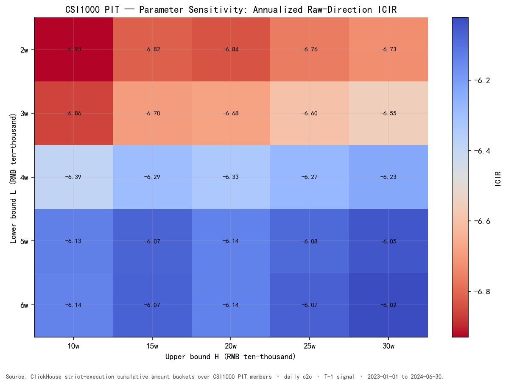
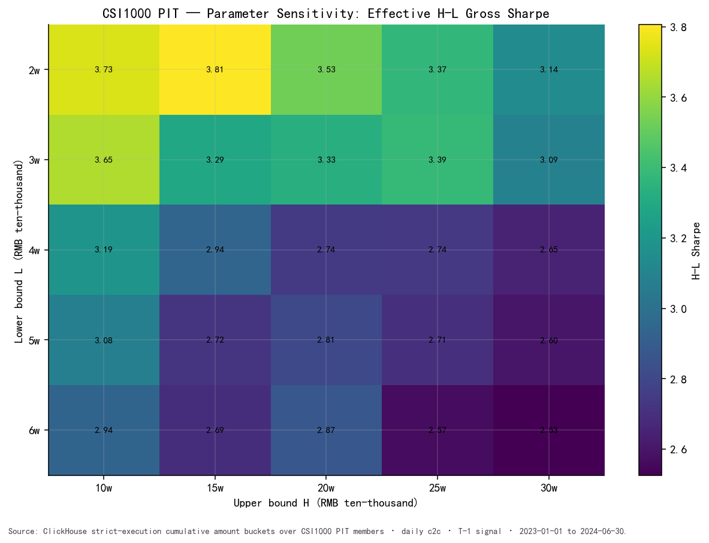
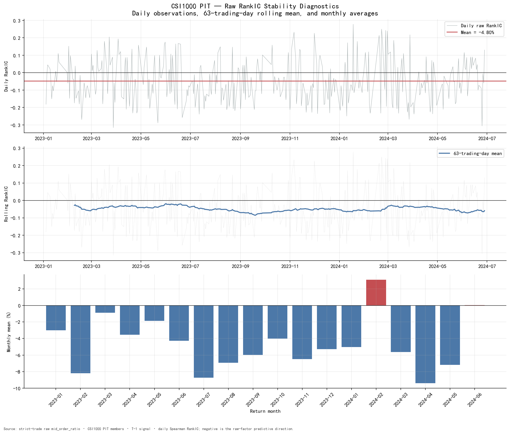
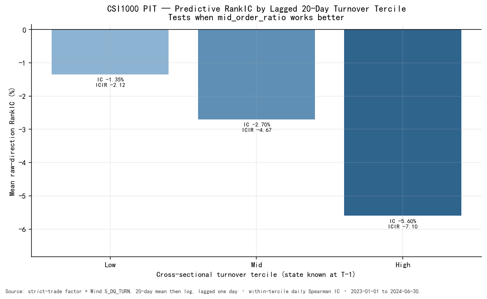
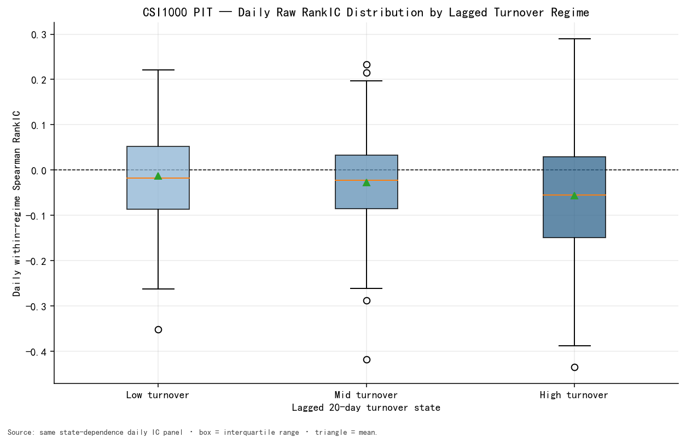

# 04 — Robustness Analysis

本章只检验单因子结论是否依赖特定股票池、阈值、日期或交易活跃状态。所有检验沿用同一 strict-trade 数据、T-1 对齐和 raw/effective direction 约定。

## 4.1 Cross-universe robustness

指数股票池使用 Wind 日度成分，而不是样本期成分并集。artifact 中的 `ALL` 仅指沪深交易所 A 股：Wind 收益面板与严格因子面板的当日有效交集，不包含北交所。

### Point-in-time universe 是什么

对每个因子形成日 \(t-1\)，代码读取该日 Wind 权重表中的真实历史成员集合
\(U_{t-1}\)，先施加成员与可交易性掩码，再将完整信号整体滞后到收益日 \(t\)：

\[
S_{i,t}
=
f_{i,t-1}\,
\mathbf{1}(i\in U_{t-1})\,
\mathbf{1}(i\text{ tradable at }t-1)
\]

因此，2023 年的测试不会使用 2024 年或当前的 CSI1000 名单回填历史。若改用“样本期最终名单”或当前名单，后来被调出、退市或不再满足指数条件的股票会被系统性遗漏，造成 survivorship bias。PIT 处理解决的是历史成员身份口径；它不等于成本、可成交容量或样本外验证。

这里还有一个实现细节：成员掩码取**信号形成日** \(t-1\)，并与信号一起 shift 到 \(t\)，不是事后使用收益日收盘才确认的集合。SSE/SZSE A-share 没有固定成分表，其每日 universe 定义为当日严格因子、Wind 收益和可交易性数据的有效交集。

| Universe | Raw RankIC | Raw ICIR | Effective H-L Sharpe | H-L MDD | H-L turnover |
|---|---:|---:|---:|---:|---:|
| SSE/SZSE A-share | **-5.53%** | -7.29 | 3.05 | -20.51% | 1.73 |
| CSI300 | **-2.12%** | -3.34 | 1.26 | -9.90% | 1.68 |
| CSI500 | **-3.45%** | -4.43 | 1.49 | -9.57% | 1.72 |
| CSI1000 | **-4.80%** | -6.33 | 2.74 | -9.68% | 1.69 |



四个 universe 的 raw RankIC 均为负，说明预测方向不是 CSI1000 特有。强度具有规模层级差异：CSI300 最弱，SSE/SZSE A-share 与 CSI1000 更强。因此可以判断方向具有跨股票池一致性，但不能假定强度在所有市值层级相同。

## 4.2 Parameter sensitivity

阈值网格为：

```text
Lower bound L ∈ {2, 3, 4, 5, 6} 万元
Upper bound H ∈ {10, 15, 20, 25, 30} 万元
```

每个单元使用：

\[
Ratio(L,H)
=
\frac{CumAmount(H)-CumAmount(L)}{TotalAmount}
\]

并在同一 CSI1000 PIT 样本、T-1 信号和评估函数下重新计算。





| Metric across 25 cells | Observed range |
|---|---:|
| Raw RankIC | **-5.12% to -4.22%** |
| Raw ICIR | **-6.93 to -6.02** |
| Effective H-L Sharpe | **2.53 to 3.81** |
| Effective H-L annual gross | 37.28% to 50.04% |

25 个单元全部保持负 IC，且相邻阈值变化平滑，没有只有一个孤立点有效的尖峰。L2w/H15w 的样本内 Sharpe 高于事前定义 L4w/H20w，但本报告不据此修改因子定义：

1. 4万/20万是事前研究口径；
2. 网格与主验证使用同一历史样本；
3. 选择样本内最高结果会引入 multiple-testing bias。

参数网格用于检验邻域稳定性，不用于寻找“最优参数”。

## 4.3 Time stability



| Time-stability diagnostic | Result |
|---|---:|
| Negative-IC months | **16 / 18** |
| Strongest negative month | 2024-04, **-9.39%** |
| Largest positive month | 2024-02, **+3.10%** |
| Full-sample RankIC | **-4.80%** |
| RankIC excluding 2024-01 | **-4.79%** |

日度 IC 波动较大，但 63 日滚动均值大部分时间低于 0；月度均值在 18 个月中有 16 个月为负。删除 2024-01 后均值仅变化 0.01 个百分点，说明结果不是由该月单独推动。

2024-02 和 2024-06 的非负月份同时表明该因子存在阶段性失效，不能描述为无条件规律。18 个月仍不足以覆盖完整市场周期。

## 4.4 State dependence

每天使用已知于 T-1 的 20 日平均 log turnover，将 CSI1000 有效股票分为三个状态，并在各状态内部计算 raw RankIC：

| Lagged turnover tercile | Raw RankIC | Raw ICIR | IC < 0 day ratio | Valid days |
|---|---:|---:|---:|---:|
| Low | -1.35% | -2.12 | 55.8% | 328 |
| Mid | -2.70% | -4.67 | 61.6% | 328 |
| High | **-5.60%** | **-7.10** | **67.1%** | 328 |





**Signal strength varies across trading activity environments.** 高换手状态中的 IC 约为低换手状态的 4.1 倍，但三个状态的分布仍有重叠，因此 turnover 是条件变量而不是确定性开关。状态变量使用样本前 60 个日历日预热，并在收益日前再滞后一天。

这里的 turnover 只用于回答“预测关系在何种交易活跃环境中更强”，不改变 `mid_order_ratio` 的定义。

## 4.5 Robustness conclusion

当前样本支持：

- raw IC 方向不依赖单一 universe；
- raw IC 方向不依赖单一合理阈值；
- 结果不由单月或少数日期完全驱动；
- 信号强度随交易活跃环境变化。

这些检验提高了 standalone signal 的可信度，但不替代更长历史和真正样本外验证。
