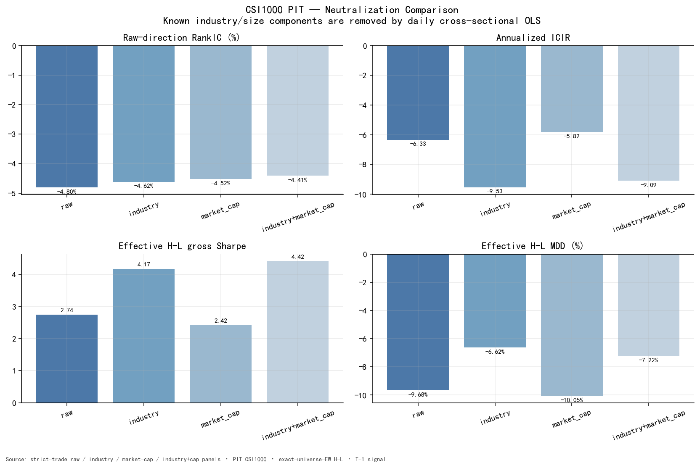
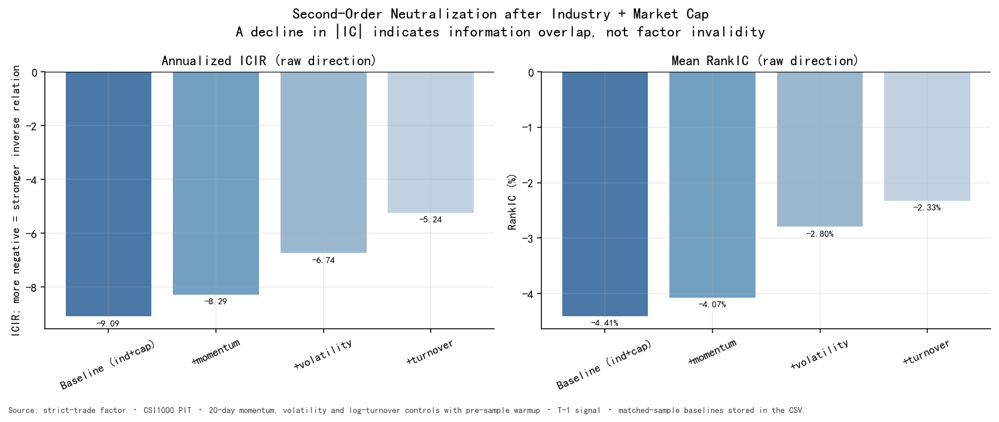

# 05 — Factor Exposure Diagnostics

本章不引入其他预测因子，也不构造联合信号。行业、市值和风格变量只作为解释变量，用于检验 `mid_order_ratio` 的预测关系是否可被常见特征完全解释。

## 5.1 Industry-dummy and Size Regression Residualization

逐日 CSI1000 PIT 截面回归：

\[
Factor_{i,t}
:=
\alpha_t
+\sum_j\gamma_{j,t}IndustryDummy_{i,j,t}
+\beta_t\log(MarketCap_{i,t})
+\varepsilon_{i,t}
\]

以残差 \(\varepsilon_{i,t}\) 重新进行同一 T-1 standalone validation。三种诊断分别删除：

1. **Industry residual：** `OLS(factor ~ intercept + CITICS Level-1 dummies)`；
2. **Market-cap residual：** `OLS(factor ~ intercept + standardized log total market cap)`；
3. **Industry + market-cap residual：** 在同一个每日截面回归中同时加入行业哑变量和市值。

市值变量进行 MAD 异常值处理和标准化；原始 `mid_order_ratio` 不 winsorize。

这里的“行业中性化”不是行业中位数扣除。对只有行业哑变量的回归，拟合值对应各行业截面均值，因此残差在数值上等价于行业均值去除；加入市值后则是联合 OLS 残差化。报告不解释单个行业回归系数，只使用残差检验预测关系是否仍存在。

| Method | Raw-direction RankIC | Raw ICIR | Effective H-L Sharpe | H-L MDD | Absolute IC retained |
|---|---:|---:|---:|---:|---:|
| Raw | **-4.80%** | -6.33 | 2.74 | -9.68% | 100% |
| Industry | **-4.62%** | -9.53 | 4.17 | -6.62% | 96% |
| Market cap | **-4.52%** | -5.82 | 2.42 | -10.05% | 94% |
| Industry + market cap | **-4.41%** | -9.09 | 4.42 | -7.22% | 92% |

行业和规模处理后，raw-direction RankIC 仍为负且保留 92%–96% 的绝对幅度。行业相关处理使日度 IC 标准差下降，因此 ICIR 和部分 H-L 路径指标改善；这不表示中性化“创造了信息”，也不构成选择更高 Sharpe 版本的依据。

### 为什么 industry + cap 后 Sharpe 从 2.74 升至 4.42

Sharpe 的变化应同时看均值和波动，而不能只读一个比率：

| H-L component | Raw | Industry + market cap |
|---|---:|---:|
| Arithmetic annual gross return | 41.12% | 40.62% |
| Implied annualized volatility (`annual return / Sharpe`) | 15.00% | 9.20% |
| Gross Sharpe | 2.74 | 4.42 |
| Absolute RankIC | 4.80% | 4.41% |

样本内平均 spread 没有增加，绝对 RankIC 反而略降；Sharpe 上升主要对应 H-L 日收益波动约下降 38.7%。一个与结果一致的解释是，行业与规模残差化减少了非目标截面共变，使排序路径更集中。但这只是**样本内分解**：组合成员和尾部排序也会随残差化改变，不能据此断言被删除的暴露必然是“噪声”，更不能把差值解释为被创造出来的 Alpha。是否能稳定降低风险仍需冻结方法后的样本外检验。

研究结论是：

> 行业和规模解释了部分因子水平差异，但不能完全解释 `mid_order_ratio` 与次日收益之间的横截面预测关系。

### Cross-universe exposure check

每个 universe 均在其当日 PIT 成员内部重新估计回归，而不是套用 CSI1000 系数：

| Universe | Raw | Industry residual | Cap residual | Industry + cap residual |
|---|---:|---:|---:|---:|
| SSE/SZSE A-share | -5.53% | -5.38% | -5.68% | -5.45% |
| CSI300 | -2.12% | -1.41% | -3.49% | -2.09% |
| CSI500 | -3.45% | -3.15% | -3.47% | -3.25% |
| CSI1000 | -4.80% | -4.62% | -4.52% | -4.41% |

16 组 RankIC 全部为负，说明“行业或规模完全造成主结论”的解释在四个股票池中均不成立。完整机器结果保留于 `artifacts/neutralization_by_universe.csv`；本报告不依据其中最高样本内 Sharpe 选择因子版本。

## 5.2 Style residual tests

在 CSI1000 industry + cap residual 基础上，再分别删除以下特征的线性解释：

- 20 日 momentum；
- 20 日 volatility；
- 20 日平均 log turnover。

三个控制变量均使用样本开始前 60 个日历日预热。每个 residual 版本只与**完全相同股票日支持集**上的 industry + cap baseline 比较，避免把控制变量缺失导致的样本变化误算成“被解释的 IC”。turnover 源覆盖较窄，因此其 matched comparison 有 332 个有效日；momentum 和 volatility 为 358 日。

该诊断只回答：

> 在相同样本支持上，`mid_order_ratio` 的剩余预测关系在多大程度上可被这些特征的线性项解释？

| Residual test | Valid days | Matched baseline RankIC | Residual RankIC | Raw ICIR | Effective H-L Sharpe | Absolute IC retained |
|---|---:|---:|---:|---:|---:|---:|
| Baseline: industry + cap | 358 | -4.41% | -4.41% | -9.09 | 4.42 | 100% |
| Remove momentum | 358 | -4.41% | -4.07% | -8.29 | 4.13 | 92% |
| Remove volatility | 358 | -4.41% | -2.80% | -6.74 | 3.58 | 63% |
| Remove turnover | 332 | **-4.76%** | **-2.33%** | **-5.24** | 3.41 | 49% |

### Momentum

删除 momentum 后保留约 92% 的绝对 IC，短期趋势不是主关系的充分解释。

### Volatility

删除 volatility 后保留约 63%，说明成交规模结构与波动状态共享部分信息。

### Turnover

在相同 332 日支持集上，删除 turnover 后绝对 RankIC 从 -4.76% 降至 -2.33%，保留约 49%，是三个特征中解释幅度最大的变量。这与状态检验中“高换手股票的 raw IC 更强”一致。

正确表述是：交易活跃度可以解释预测关系的一部分，但不能在当前线性残差检验中解释全部关系。该结果不证明任何变量之间的因果顺序。

## 5.3 Exposure diagnostic conclusion

1. 行业与规模不是主结果的充分解释；
2. momentum 的解释幅度较小；
3. volatility 的解释幅度中等；
4. turnover 的解释幅度最大；
5. 所有残差版本仍保持原始负向 IC。

因此，`mid_order_ratio` 可以继续作为 standalone research candidate；其经济解释必须明确包含交易活跃度条件。
