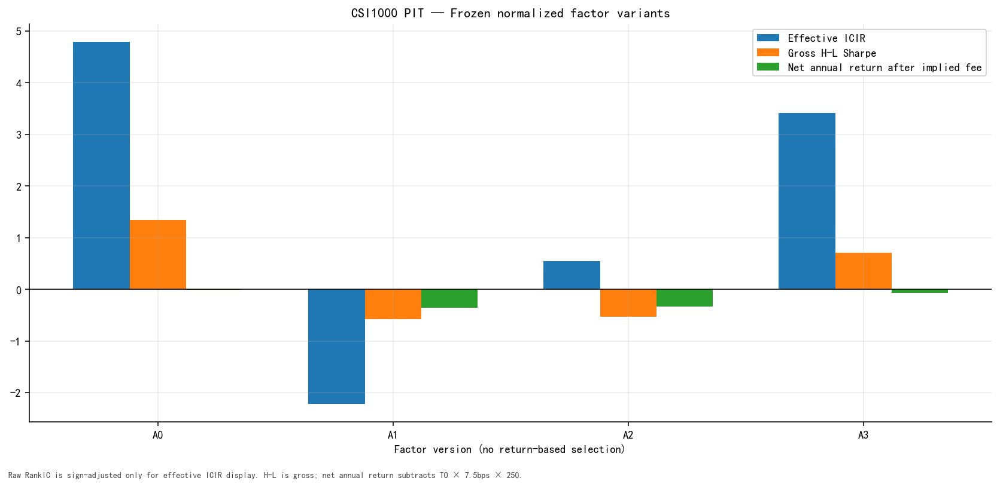
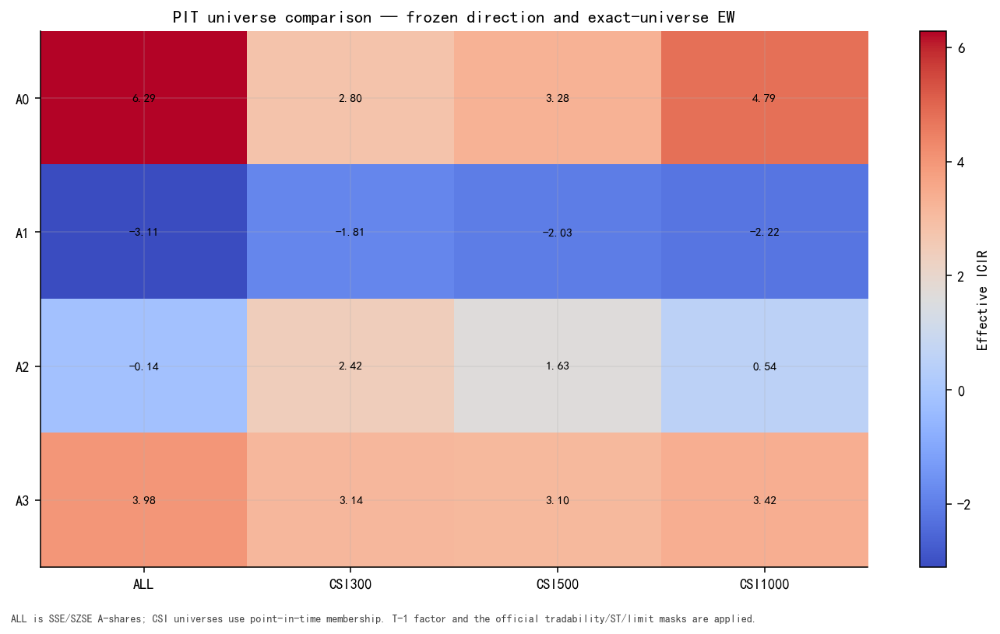

# 01 — Executive Summary

## Frozen five-way decision

**Decision: `only the fixed-RMB phenomenon remains`.**

The branch is selected from frozen OOS raw RankIC direction, its two-sided
5% t-stat threshold (`|t| >= 1.96` in the frozen direction), and
same-direction RankIC in all four PIT pools. Sharpe is shown as a diagnostic
and is not used to select the branch. A3 is a secondary P1 diagnostic and
does not alter this five-way A1/A2/A0 decision tree.

## A0/A1/A2/A3 definitions

| Role | Factor ID | Normalization | Frozen bucket |
| --- | --- | --- | --- |
| A0 | mid_trade_amount_share_abs_4w20w | fixed RMB | (40,000, 200,000] RMB |
| A1 | mid_trade_amount_share_adv20 | ADV20 lag-1 | (2.0, 20.0] bps of ADV |
| A2 | mid_trade_amount_share_ats20 | ATS20 lag-1 | (0.50, 2.00] × ATS20 |
| A3 | mid_trade_amount_share_rollq | same-day execution quantiles | (Q20, Q80] amount share; P1 diagnostic |

All four variants preserve raw-direction RankIC and use frozen effective
direction `-1` for H-L displays. No window is allowed to re-infer
the sign.

## CSI1000 full-common-sample metrics

| Role | RankIC | ICIR | IC t-stat | H-L Sharpe | H-L MDD | H-L turnover | Coverage |
| --- | --- | --- | --- | --- | --- | --- | --- |
| A0 | -4.24% | -4.79 | -8.91 | 1.34 | -30.12% | 1.63 | 99.99% |
| A1 | 2.70% | 2.22 | 4.13 | -0.58 | -50.16% | 1.14 | 97.73% |
| A2 | -0.58% | -0.54 | -1.01 | -0.53 | -64.38% | 1.10 | 97.73% |
| A3 | -3.60% | -3.42 | -6.36 | 0.71 | -40.16% | 1.18 | 100.00% |

RankIC and ICIR above are raw-direction statistics. H-L Sharpe, MDD and
turnover use the frozen effective direction. Coverage is persisted stock-day
factor coverage, not an estimate inserted by this renderer.

The one-way cost label is **7.5 bps**, i.e.
`turnover × 7.5/10,000 × 250` for the display-only implied annual fee.
Gross H-L returns remain fee-zero sorting diagnostics.

## Four PIT pools

| Role | Pool | RankIC | ICIR |
| --- | --- | --- | --- |
| A0 | ALL | -5.07% | -6.29 |
| A0 | CSI300 | -2.14% | -2.80 |
| A0 | CSI500 | -3.04% | -3.28 |
| A0 | CSI1000 | -4.24% | -4.79 |
| A1 | ALL | 2.91% | 3.11 |
| A1 | CSI300 | 2.14% | 1.81 |
| A1 | CSI500 | 2.59% | 2.03 |
| A1 | CSI1000 | 2.70% | 2.22 |
| A2 | ALL | 0.14% | 0.14 |
| A2 | CSI300 | -2.96% | -2.42 |
| A2 | CSI500 | -1.97% | -1.63 |
| A2 | CSI1000 | -0.58% | -0.54 |
| A3 | ALL | -3.57% | -3.98 |
| A3 | CSI300 | -3.98% | -3.14 |
| A3 | CSI500 | -3.77% | -3.10 |
| A3 | CSI1000 | -3.60% | -3.42 |

The pools are ALL SSE/SZSE A-shares, CSI300, CSI500 and CSI1000, with
point-in-time membership where applicable.

## A0 parity gate

- gate: `passed`;
- Pearson: `1.000000000000`;
- Spearman: `1.000000000000`;
- maximum absolute error: `1.457e-13`;
- mean absolute error: `1.096e-16`;
- share within `1e-12`: `100.00%`.

## Headline figures

### 01_factor_variant_summary — Factor variant summary

### 02_universe_variant_summary — PIT universe comparison

## Scope boundary

This is standalone single-factor evidence. It does not run factor-library
correlation, factor combination, incremental IC, portfolio optimization or
alpha stacking.
