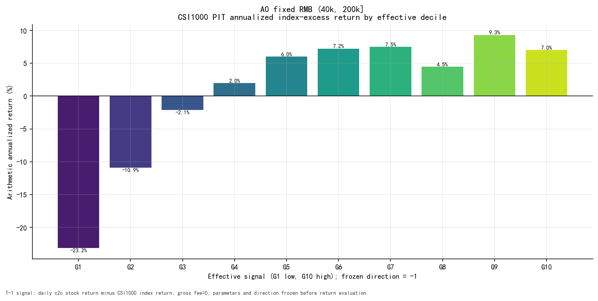
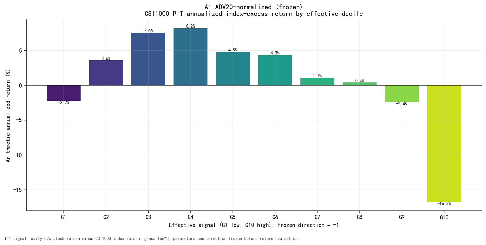
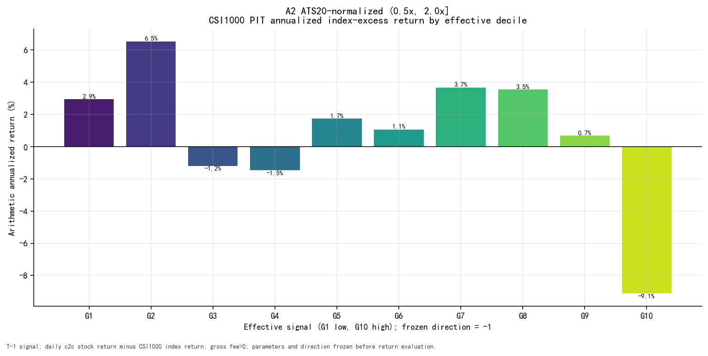
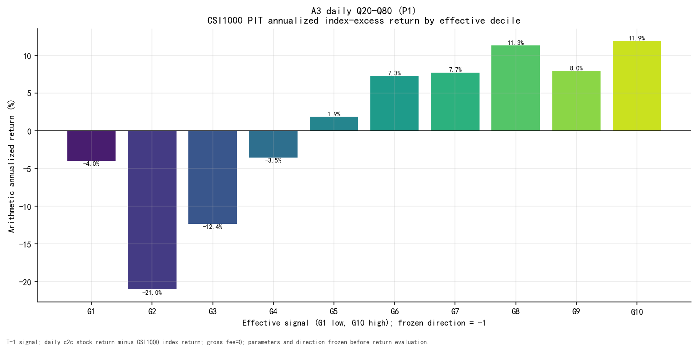
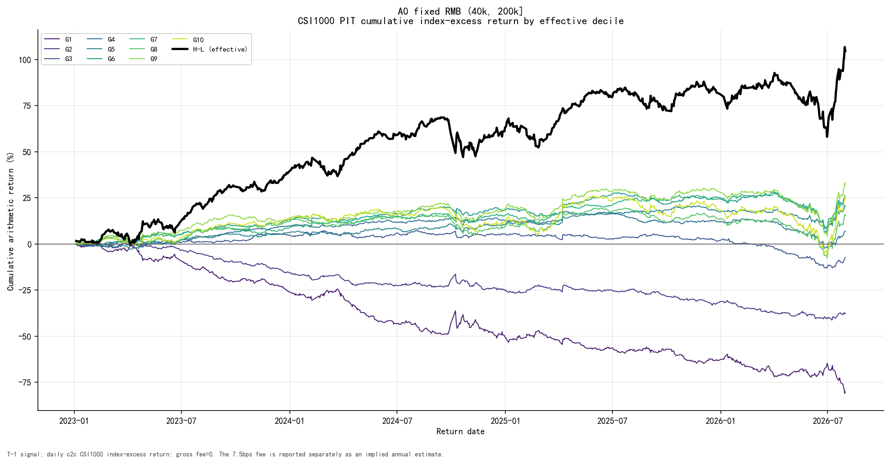
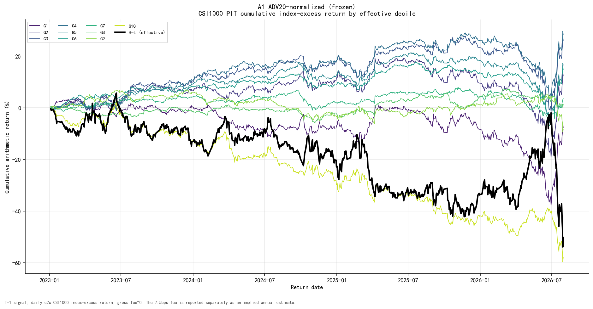
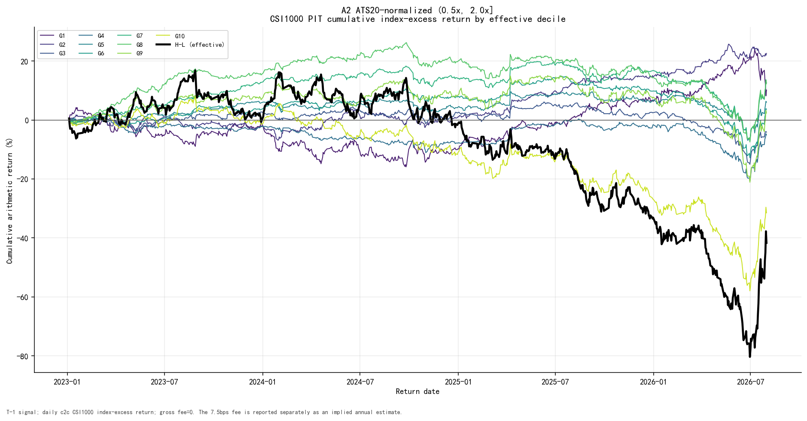
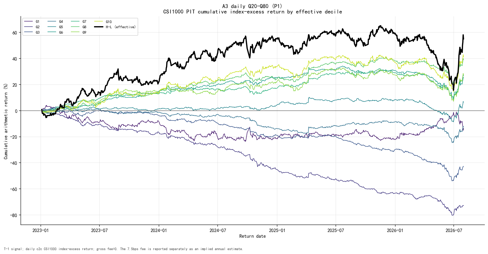

# 05 — Standalone Validation

## CSI1000 standalone and decile diagnostics

| Role | RankIC | ICIR | t-stat | H-L ann. return | Sharpe | MDD | Turnover | Decile mono. | Index-excess H-L | Decile turnover | Implied fee | Coverage |
| --- | --- | --- | --- | --- | --- | --- | --- | --- | --- | --- | --- | --- |
| A0 | -4.24% | -4.79 | -8.91 | 30.20% | 1.34 | -30.12% | 1.63 | 0.830 | 30.20% | 1.63 | 30.59% | 99.99% |
| A1 | 2.70% | 2.22 | 4.13 | -14.52% | -0.58 | -50.16% | 1.14 | -0.527 | -14.52% | 1.14 | 21.42% | 97.73% |
| A2 | -0.58% | -0.54 | -1.01 | -12.05% | -0.53 | -64.38% | 1.10 | -0.309 | -12.05% | 1.10 | 20.69% | 97.73% |
| A3 | -3.60% | -3.42 | -6.36 | 15.88% | 0.71 | -40.16% | 1.18 | 0.952 | 15.88% | 1.18 | 22.10% | 100.00% |

`Implied fee` is the persisted display-only annual deduction under a one-way
**7.5 bps** label. It is not a claim that the gross H-L sort is a
deployable strategy. RankIC, ICIR, Sharpe, MDD, turnover and coverage are
reported together so that a high Sharpe cannot hide weak information
coefficient evidence or sparse coverage.

## Four-pool validation

| Role | Pool | RankIC | t-stat | ICIR | Sharpe | MDD | Turnover |
| --- | --- | --- | --- | --- | --- | --- | --- |
| A0 | ALL | -5.07% | -11.70 | -6.29 | 2.20 | -25.35% | 1.69 |
| A0 | CSI300 | -2.14% | -5.20 | -2.80 | 0.55 | -32.30% | 1.58 |
| A0 | CSI500 | -3.04% | -6.10 | -3.28 | 0.48 | -37.35% | 1.65 |
| A0 | CSI1000 | -4.24% | -8.91 | -4.79 | 1.34 | -30.12% | 1.63 |
| A1 | ALL | 2.91% | 5.79 | 3.11 | -1.38 | -63.67% | 1.09 |
| A1 | CSI300 | 2.14% | 3.37 | 1.81 | 0.14 | -37.25% | 1.13 |
| A1 | CSI500 | 2.59% | 3.77 | 2.03 | -0.18 | -41.75% | 1.15 |
| A1 | CSI1000 | 2.70% | 4.13 | 2.22 | -0.58 | -50.16% | 1.14 |
| A2 | ALL | 0.14% | 0.27 | 0.14 | -0.85 | -62.85% | 1.16 |
| A2 | CSI300 | -2.96% | -4.50 | -2.42 | 0.39 | -46.47% | 0.94 |
| A2 | CSI500 | -1.97% | -3.04 | -1.63 | -0.06 | -57.45% | 0.99 |
| A2 | CSI1000 | -0.58% | -1.01 | -0.54 | -0.53 | -64.38% | 1.10 |
| A3 | ALL | -3.57% | -7.40 | -3.98 | 1.34 | -26.12% | 1.26 |
| A3 | CSI300 | -3.98% | -5.83 | -3.14 | 0.51 | -34.55% | 1.03 |
| A3 | CSI500 | -3.77% | -5.77 | -3.10 | 0.32 | -44.89% | 1.04 |
| A3 | CSI1000 | -3.60% | -6.36 | -3.42 | 0.71 | -40.16% | 1.18 |

The four-pool table uses exact valid-universe equal weighting. Cross-pool
direction is a decision input; the maximum Sharpe across pools is not.

## Per-variant decile figures

### 03_decile_annualized — Per-variant decile annualized return

### 04_decile_cumulative — Per-variant decile cumulative return

