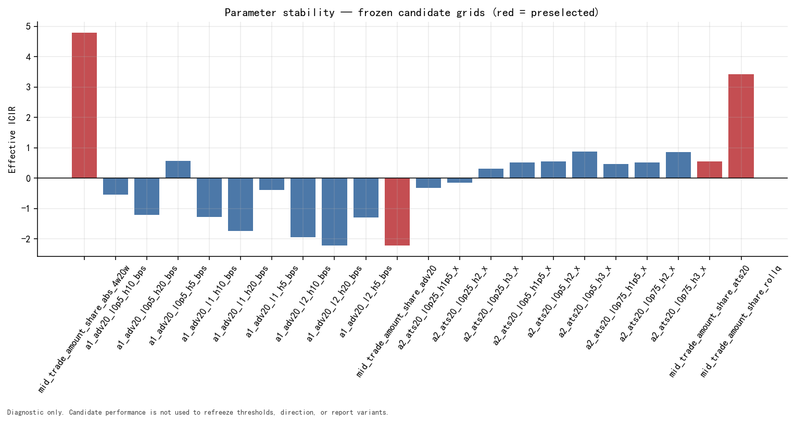

# 06 — Normalization Diagnostics

## Frozen A1 distribution calibration

The A1 bounds were selected from the 2023-H1 execution-size distribution,
without return data. Values below are persisted bps-of-ADV20 observations.

### Quantiles across four pools

| Pool | Quantile | bps of ADV |
| --- | --- | --- |
| ALL | 0.10 | 0.0277 |
| ALL | 0.25 | 0.0666 |
| ALL | 0.50 | 0.1822 |
| ALL | 0.75 | 0.5272 |
| ALL | 0.90 | 1.4415 |
| ALL | 0.95 | 2.6870 |
| ALL | 0.99 | 8.8401 |
| CSI1000 | 0.10 | 0.0319 |
| CSI1000 | 0.25 | 0.0715 |
| CSI1000 | 0.50 | 0.1809 |
| CSI1000 | 0.75 | 0.4931 |
| CSI1000 | 0.90 | 1.2817 |
| CSI1000 | 0.95 | 2.3138 |
| CSI1000 | 0.99 | 7.0045 |
| CSI300 | 0.10 | 0.0129 |
| CSI300 | 0.25 | 0.0315 |
| CSI300 | 0.50 | 0.0813 |
| CSI300 | 0.75 | 0.2144 |
| CSI300 | 0.90 | 0.5245 |
| CSI300 | 0.95 | 0.9101 |
| CSI300 | 0.99 | 2.7027 |
| CSI500 | 0.10 | 0.0239 |
| CSI500 | 0.25 | 0.0519 |
| CSI500 | 0.50 | 0.1330 |
| CSI500 | 0.75 | 0.3562 |
| CSI500 | 0.90 | 0.9028 |
| CSI500 | 0.95 | 1.6117 |
| CSI500 | 0.99 | 4.9388 |

### Median by CSI1000 market-cap quintile

| Cap quintile | Median bps of ADV |
| --- | --- |
| Q1 | 0.2488 |
| Q2 | 0.2117 |
| Q3 | 0.1995 |
| Q4 | 0.1780 |
| Q5 | 0.1325 |

## ADV candidate coverage grid

| L bps | H bps | Frozen | Coverage | A0 coverage | \|diff\| | Mean cap-Q \|diff\| | Min cap-Q | Max cap-Q |
| --- | --- | --- | --- | --- | --- | --- | --- | --- |
| 2.0 | 20.0 | yes | 31.03% | 31.92% | 0.89% | 6.32% | 24.39% | 41.53% |
| 1.0 | 5.0 | no | 32.97% | 31.92% | 1.05% | 5.10% | 29.05% | 37.19% |
| 2.0 | 10.0 | no | 25.85% | 31.92% | 6.07% | 5.10% | 20.82% | 33.46% |
| 1.0 | 10.0 | no | 41.61% | 31.92% | 9.69% | 12.72% | 35.45% | 49.63% |
| 2.0 | 5.0 | no | 17.21% | 31.92% | 14.71% | 12.90% | 14.42% | 21.02% |
| 1.0 | 20.0 | no | 46.79% | 31.92% | 14.87% | 18.58% | 39.02% | 57.70% |
| 0.5 | 5.0 | no | 48.41% | 31.92% | 16.49% | 18.35% | 44.85% | 51.19% |
| 0.5 | 10.0 | no | 57.06% | 31.92% | 25.14% | 27.91% | 51.25% | 63.41% |
| 0.5 | 20.0 | no | 62.24% | 31.92% | 30.32% | 33.77% | 54.82% | 71.48% |

The frozen row is selected by distribution coverage relative to A0, subject
to the persisted 10%–80% cap-quintile gate. Return, RankIC and Sharpe are not
inputs to this calibration.

## Frozen A1 coverage by market-cap bucket

| Bucket type | Bucket | A1 coverage | A0 coverage |
| --- | --- | --- | --- |
| market_cap | 1 | 41.53% | 29.05% |
| market_cap | 2 | 36.18% | 30.27% |
| market_cap | 3 | 34.53% | 30.94% |
| market_cap | 4 | 31.75% | 31.65% |
| market_cap | 5 | 24.39% | 33.88% |

## Missing-scale and factor coverage

| Role | Required scale | Expected stock-days | Factor stock-days | Coverage | Missing scale | Coverage given scale |
| --- | --- | --- | --- | --- | --- | --- |
| A0 | none | 4,413,448 | 4,413,099 | 99.99% | 0.00% | 99.99% |
| A1 | adv20_lag1 | 4,413,448 | 4,313,073 | 97.73% | 2.27% | 100.00% |
| A2 | ats20_lag1 | 4,413,448 | 4,313,073 | 97.73% | 2.27% | 100.00% |
| A3 | none | 4,413,448 | 4,413,448 | 100.00% | 0.00% | 100.00% |

ADV20 and ATS20 require exactly 20 lagged market trading dates. Missing
history remains missing; the renderer does not fill or extrapolate it.

## Return-side parameter stability

| Role | Factor ID | Bounds | Unit | Selected | RankIC | ICIR | t-stat |
| --- | --- | --- | --- | --- | --- | --- | --- |
| A0 | mid_trade_amount_share_abs_4w20w | (40000.00, 200000.00] | RMB_per_trade | yes | -4.24% | -4.79 | -8.91 |
| A1 | a1_adv20_l0p5_h5_bps | (0.50, 5.00] | bps_of_ADV20_lag1 | no | -0.52% | -0.56 | -1.04 |
| A1 | a1_adv20_l0p5_h10_bps | (0.50, 10.00] | bps_of_ADV20_lag1 | no | 0.56% | 0.54 | 1.01 |
| A1 | a1_adv20_l0p5_h20_bps | (0.50, 20.00] | bps_of_ADV20_lag1 | no | 1.36% | 1.22 | 2.26 |
| A1 | a1_adv20_l1_h5_bps | (1.00, 5.00] | bps_of_ADV20_lag1 | no | 0.40% | 0.39 | 0.72 |
| A1 | a1_adv20_l1_h10_bps | (1.00, 10.00] | bps_of_ADV20_lag1 | no | 1.45% | 1.28 | 2.37 |
| A1 | a1_adv20_l1_h20_bps | (1.00, 20.00] | bps_of_ADV20_lag1 | no | 2.06% | 1.74 | 3.23 |
| A1 | a1_adv20_l2_h5_bps | (2.00, 5.00] | bps_of_ADV20_lag1 | no | 1.44% | 1.30 | 2.42 |
| A1 | a1_adv20_l2_h10_bps | (2.00, 10.00] | bps_of_ADV20_lag1 | no | 2.30% | 1.94 | 3.60 |
| A1 | a1_adv20_l2_h20_bps | (2.00, 20.00] | bps_of_ADV20_lag1 | no | 2.70% | 2.22 | 4.13 |
| A1 | mid_trade_amount_share_adv20 | (2.00, 20.00] | bps_of_ADV20_lag1 | yes | 2.70% | 2.22 | 4.13 |
| A2 | a2_ats20_l0p25_h1p5_x | (0.25, 1.50] | multiple_of_ATS20_lag1 | no | 0.34% | 0.33 | 0.61 |
| A2 | a2_ats20_l0p25_h2_x | (0.25, 2.00] | multiple_of_ATS20_lag1 | no | 0.15% | 0.14 | 0.27 |
| A2 | a2_ats20_l0p25_h3_x | (0.25, 3.00] | multiple_of_ATS20_lag1 | no | -0.32% | -0.31 | -0.57 |
| A2 | a2_ats20_l0p5_h1p5_x | (0.50, 1.50] | multiple_of_ATS20_lag1 | no | -0.55% | -0.51 | -0.95 |
| A2 | a2_ats20_l0p5_h2_x | (0.50, 2.00] | multiple_of_ATS20_lag1 | no | -0.58% | -0.54 | -1.01 |
| A2 | mid_trade_amount_share_ats20 | (0.50, 2.00] | multiple_of_ATS20_lag1 | yes | -0.58% | -0.54 | -1.01 |
| A2 | a2_ats20_l0p5_h3_x | (0.50, 3.00] | multiple_of_ATS20_lag1 | no | -0.93% | -0.87 | -1.62 |
| A2 | a2_ats20_l0p75_h1p5_x | (0.75, 1.50] | multiple_of_ATS20_lag1 | no | -0.51% | -0.47 | -0.88 |
| A2 | a2_ats20_l0p75_h2_x | (0.75, 2.00] | multiple_of_ATS20_lag1 | no | -0.56% | -0.52 | -0.96 |
| A2 | a2_ats20_l0p75_h3_x | (0.75, 3.00] | multiple_of_ATS20_lag1 | no | -0.93% | -0.86 | -1.59 |
| A3 | mid_trade_amount_share_rollq | (0.20, 0.80] | same_day_trade_amount_quantile | yes | -3.60% | -3.42 | -6.36 |

This table is diagnostic after freezing. The selected flags and all candidate
metrics are read from `parameter_stability.csv`; no candidate is selected by
the best Sharpe or ICIR.

## Parameter-stability figure

### 07_parameter_stability — Frozen-grid parameter stability

