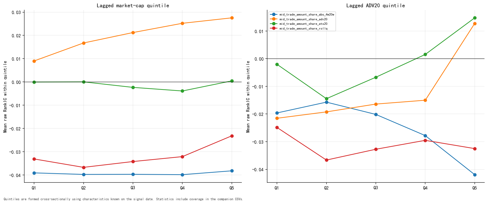
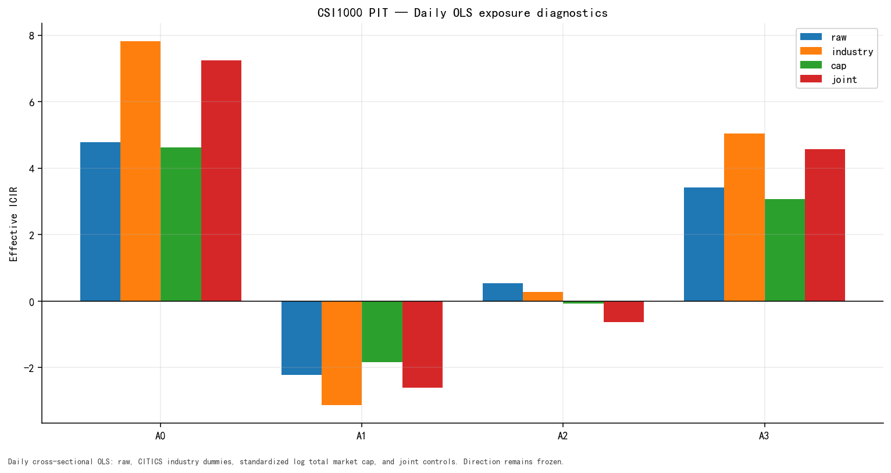

# 07 — Exposure Diagnostics

## CSI1000 market-cap quintiles

| Role | Cap quintile | RankIC | ICIR | Coverage | Avg names | Days |
| --- | --- | --- | --- | --- | --- | --- |
| A0 | Q1 | -3.91% | -4.83 | 100.00% | 196.8 | 865 |
| A0 | Q2 | -3.98% | -4.67 | 100.00% | 197.2 | 865 |
| A0 | Q3 | -3.97% | -4.48 | 100.00% | 197.2 | 865 |
| A0 | Q4 | -3.99% | -4.14 | 100.00% | 197.2 | 865 |
| A0 | Q5 | -3.82% | -3.34 | 100.00% | 197.6 | 865 |
| A1 | Q1 | 0.90% | 0.83 | 100.00% | 194.0 | 865 |
| A1 | Q2 | 1.67% | 1.42 | 100.00% | 194.5 | 865 |
| A1 | Q3 | 2.12% | 1.71 | 100.00% | 194.4 | 865 |
| A1 | Q4 | 2.52% | 1.98 | 100.00% | 194.5 | 865 |
| A1 | Q5 | 2.76% | 2.19 | 100.00% | 194.8 | 865 |
| A2 | Q1 | -0.00% | -0.00 | 100.00% | 194.0 | 865 |
| A2 | Q2 | 0.00% | 0.00 | 100.00% | 194.5 | 865 |
| A2 | Q3 | -0.23% | -0.21 | 100.00% | 194.4 | 865 |
| A2 | Q4 | -0.39% | -0.38 | 100.00% | 194.5 | 865 |
| A2 | Q5 | 0.05% | 0.04 | 100.00% | 194.8 | 865 |
| A3 | Q1 | -3.31% | -2.88 | 100.00% | 196.8 | 865 |
| A3 | Q2 | -3.67% | -3.21 | 100.00% | 197.2 | 865 |
| A3 | Q3 | -3.42% | -2.96 | 100.00% | 197.2 | 865 |
| A3 | Q4 | -3.21% | -3.13 | 100.00% | 197.2 | 865 |
| A3 | Q5 | -2.32% | -2.19 | 100.00% | 197.6 | 865 |

## CSI1000 lagged-ADV quintiles

| Role | ADV quintile | RankIC | ICIR | Coverage | Avg names | Days |
| --- | --- | --- | --- | --- | --- | --- |
| A0 | Q1 | -1.96% | -2.88 | 98.61% | 194.0 | 865 |
| A0 | Q2 | -1.57% | -2.31 | 98.61% | 194.5 | 865 |
| A0 | Q3 | -2.01% | -2.82 | 98.61% | 194.4 | 865 |
| A0 | Q4 | -2.78% | -3.66 | 98.61% | 194.5 | 865 |
| A0 | Q5 | -4.19% | -5.04 | 98.61% | 194.8 | 865 |
| A1 | Q1 | -2.15% | -3.10 | 100.00% | 194.0 | 865 |
| A1 | Q2 | -1.92% | -2.78 | 100.00% | 194.5 | 865 |
| A1 | Q3 | -1.64% | -2.26 | 100.00% | 194.4 | 865 |
| A1 | Q4 | -1.50% | -2.06 | 100.00% | 194.5 | 865 |
| A1 | Q5 | 1.27% | 1.53 | 100.00% | 194.8 | 865 |
| A2 | Q1 | -0.20% | -0.16 | 100.00% | 194.0 | 865 |
| A2 | Q2 | -1.45% | -1.10 | 100.00% | 194.5 | 865 |
| A2 | Q3 | -0.67% | -0.58 | 100.00% | 194.4 | 865 |
| A2 | Q4 | 0.15% | 0.15 | 100.00% | 194.5 | 865 |
| A2 | Q5 | 1.48% | 1.52 | 100.00% | 194.8 | 865 |
| A3 | Q1 | -2.49% | -1.97 | 98.61% | 194.0 | 865 |
| A3 | Q2 | -3.66% | -2.94 | 98.61% | 194.5 | 865 |
| A3 | Q3 | -3.27% | -2.85 | 98.61% | 194.4 | 865 |
| A3 | Q4 | -2.95% | -2.90 | 98.61% | 194.5 | 865 |
| A3 | Q5 | -3.25% | -3.61 | 98.61% | 194.8 | 865 |

Both characteristic sorts are daily cross-sectional quintiles. The tables
show actual per-stratum coverage and name counts; a missing stratum is a hard
input failure rather than an omitted row.

## OLS diagnostics: raw / industry / cap / joint

| Role | OLS method | RankIC | ICIR | t-stat | \|RankIC\| retained |
| --- | --- | --- | --- | --- | --- |
| A0 | raw | -4.24% | -4.79 | -8.91 | 100.00% |
| A0 | industry | -4.00% | -7.82 | -14.54 | 94.21% |
| A0 | cap | -3.67% | -4.62 | -8.60 | 86.48% |
| A0 | joint | -3.56% | -7.25 | -13.48 | 84.04% |
| A1 | raw | 2.70% | 2.22 | 4.13 | 100.00% |
| A1 | industry | 2.33% | 3.13 | 5.81 | 86.00% |
| A1 | cap | 2.05% | 1.84 | 3.43 | 75.85% |
| A1 | joint | 1.76% | 2.60 | 4.84 | 65.08% |
| A2 | raw | -0.58% | -0.54 | -1.01 | 100.00% |
| A2 | industry | -0.17% | -0.28 | -0.52 | 28.75% |
| A2 | cap | 0.06% | 0.07 | 0.12 | 11.06% |
| A2 | joint | 0.35% | 0.64 | 1.18 | 59.36% |
| A3 | raw | -3.60% | -3.42 | -6.36 | 100.00% |
| A3 | industry | -3.00% | -5.04 | -9.37 | 83.23% |
| A3 | cap | -3.01% | -3.07 | -5.70 | 83.78% |
| A3 | joint | -2.52% | -4.58 | -8.52 | 69.95% |

OLS rows are standalone residualization diagnostics. Residualization cannot
reclassify Tick executions and does not create alpha. Retention is measured
against each role's persisted raw RankIC.

## Exposure figures

### 06_cap_adv_quintiles — Market-cap and ADV quintiles

### 09_ols_diagnostics — Raw/industry/cap/joint OLS

