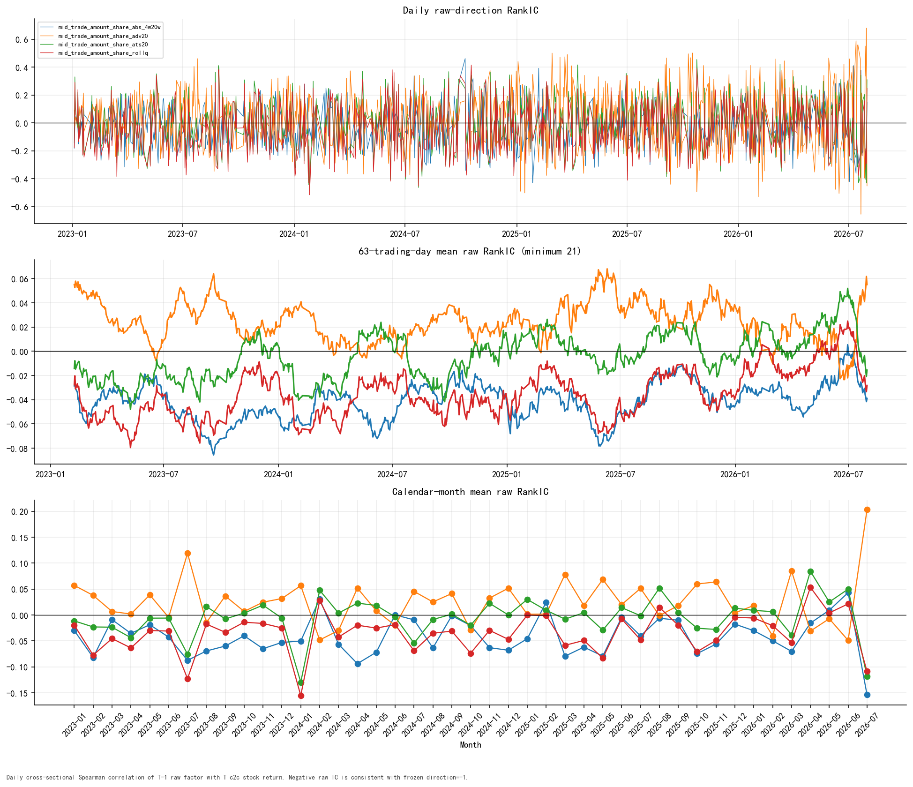
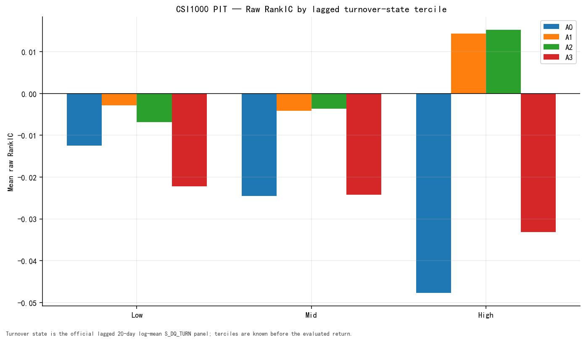
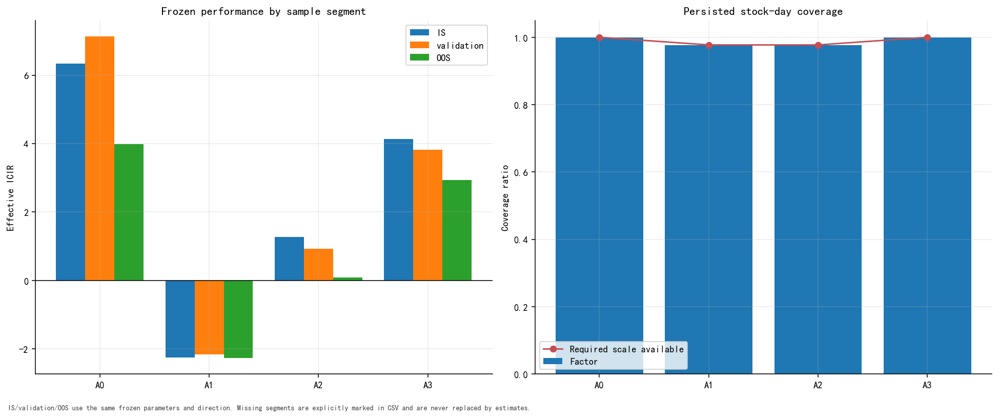

# 08 — Time and State Robustness

## Monthly raw RankIC

| Role | Month | RankIC | ICIR | Negative-IC days | Days |
| --- | --- | --- | --- | --- | --- |
| A0 | 2023-01 | -3.00% | -6.04 | 60.00% | 15 |
| A0 | 2023-02 | -8.19% | -13.13 | 85.00% | 20 |
| A0 | 2023-03 | -0.89% | -1.16 | 43.48% | 23 |
| A0 | 2023-04 | -3.55% | -3.80 | 57.89% | 19 |
| A0 | 2023-05 | -1.88% | -2.42 | 55.00% | 20 |
| A0 | 2023-06 | -4.27% | -5.09 | 65.00% | 20 |
| A0 | 2023-07 | -8.74% | -16.34 | 85.71% | 21 |
| A0 | 2023-08 | -6.94% | -9.95 | 78.26% | 23 |
| A0 | 2023-09 | -5.99% | -9.55 | 65.00% | 20 |
| A0 | 2023-10 | -4.01% | -7.50 | 82.35% | 17 |
| A0 | 2023-11 | -6.50% | -7.26 | 72.73% | 22 |
| A0 | 2023-12 | -5.29% | -7.26 | 71.43% | 21 |
| A0 | 2024-01 | -5.03% | -6.16 | 81.82% | 22 |
| A0 | 2024-02 | 3.10% | 2.63 | 40.00% | 15 |
| A0 | 2024-03 | -5.65% | -5.91 | 61.90% | 21 |
| A0 | 2024-04 | -9.39% | -14.52 | 80.00% | 20 |
| A0 | 2024-05 | -7.19% | -16.28 | 90.00% | 20 |
| A0 | 2024-06 | 0.02% | 0.03 | 36.84% | 19 |
| A0 | 2024-07 | -0.94% | -1.10 | 60.87% | 23 |
| A0 | 2024-08 | -6.35% | -6.61 | 72.73% | 22 |
| A0 | 2024-09 | -0.15% | -0.17 | 63.16% | 19 |
| A0 | 2024-10 | -2.03% | -1.36 | 61.11% | 18 |
| A0 | 2024-11 | -6.30% | -5.86 | 61.90% | 21 |
| A0 | 2024-12 | -6.80% | -7.24 | 68.18% | 22 |
| A0 | 2025-01 | -4.58% | -3.62 | 66.67% | 18 |
| A0 | 2025-02 | 2.45% | 1.95 | 44.44% | 18 |
| A0 | 2025-03 | -7.94% | -15.60 | 80.95% | 21 |
| A0 | 2025-04 | -6.19% | -8.82 | 76.19% | 21 |
| A0 | 2025-05 | -7.92% | -9.47 | 73.68% | 19 |
| A0 | 2025-06 | -0.46% | -0.65 | 60.00% | 20 |
| A0 | 2025-07 | -4.03% | -5.04 | 60.87% | 23 |
| A0 | 2025-08 | -0.62% | -0.67 | 57.14% | 21 |
| A0 | 2025-09 | -1.01% | -1.11 | 40.91% | 22 |
| A0 | 2025-10 | -7.45% | -9.63 | 64.71% | 17 |
| A0 | 2025-11 | -5.62% | -9.17 | 70.00% | 20 |
| A0 | 2025-12 | -1.76% | -2.41 | 47.83% | 23 |
| A0 | 2026-01 | -3.02% | -3.18 | 55.00% | 20 |
| A0 | 2026-02 | -4.96% | -6.05 | 64.29% | 14 |
| A0 | 2026-03 | -7.02% | -8.98 | 72.73% | 22 |
| A0 | 2026-04 | -1.56% | -2.72 | 61.90% | 21 |
| A0 | 2026-05 | 0.92% | 0.97 | 44.44% | 18 |
| A0 | 2026-06 | 4.31% | 3.29 | 47.62% | 21 |
| A0 | 2026-07 | -15.39% | -10.96 | 78.26% | 23 |
| A1 | 2023-01 | 5.71% | 11.96 | 33.33% | 15 |
| A1 | 2023-02 | 3.78% | 6.64 | 30.00% | 20 |
| A1 | 2023-03 | 0.67% | 0.86 | 47.83% | 23 |
| A1 | 2023-04 | 0.18% | 0.16 | 57.89% | 19 |
| A1 | 2023-05 | 3.88% | 3.99 | 35.00% | 20 |
| A1 | 2023-06 | -0.46% | -0.44 | 50.00% | 20 |
| A1 | 2023-07 | 11.92% | 10.91 | 38.10% | 21 |
| A1 | 2023-08 | -1.45% | -1.53 | 43.48% | 23 |
| A1 | 2023-09 | 3.67% | 4.66 | 30.00% | 20 |
| A1 | 2023-10 | 0.69% | 0.99 | 52.94% | 17 |
| A1 | 2023-11 | 2.47% | 3.16 | 54.55% | 22 |
| A1 | 2023-12 | 3.17% | 2.59 | 52.38% | 21 |
| A1 | 2024-01 | 5.67% | 6.77 | 27.27% | 22 |
| A1 | 2024-02 | -4.82% | -6.31 | 53.33% | 15 |
| A1 | 2024-03 | -2.98% | -2.80 | 47.62% | 21 |
| A1 | 2024-04 | 5.18% | 4.83 | 45.00% | 20 |
| A1 | 2024-05 | 0.82% | 1.21 | 55.00% | 20 |
| A1 | 2024-06 | -2.00% | -2.09 | 52.63% | 19 |
| A1 | 2024-07 | 4.55% | 3.94 | 43.48% | 23 |
| A1 | 2024-08 | 2.52% | 3.50 | 40.91% | 22 |
| A1 | 2024-09 | 4.14% | 7.75 | 31.58% | 19 |
| A1 | 2024-10 | -2.90% | -3.02 | 61.11% | 18 |
| A1 | 2024-11 | 3.26% | 2.71 | 38.10% | 21 |
| A1 | 2024-12 | 5.17% | 4.54 | 31.82% | 22 |
| A1 | 2025-01 | 0.15% | 0.09 | 44.44% | 18 |
| A1 | 2025-02 | 0.18% | 0.12 | 50.00% | 18 |
| A1 | 2025-03 | 7.82% | 4.97 | 47.62% | 21 |
| A1 | 2025-04 | 1.79% | 1.25 | 57.14% | 21 |
| A1 | 2025-05 | 6.86% | 6.14 | 31.58% | 19 |
| A1 | 2025-06 | 2.00% | 2.06 | 50.00% | 20 |
| A1 | 2025-07 | 5.13% | 4.89 | 34.78% | 23 |
| A1 | 2025-08 | -0.10% | -0.10 | 42.86% | 21 |
| A1 | 2025-09 | 1.81% | 1.11 | 54.55% | 22 |
| A1 | 2025-10 | 5.98% | 3.21 | 41.18% | 17 |
| A1 | 2025-11 | 6.38% | 4.67 | 30.00% | 20 |
| A1 | 2025-12 | 0.41% | 0.37 | 52.17% | 23 |
| A1 | 2026-01 | 1.84% | 1.47 | 55.00% | 20 |
| A1 | 2026-02 | -4.03% | -2.44 | 50.00% | 14 |
| A1 | 2026-03 | 8.51% | 6.15 | 31.82% | 22 |
| A1 | 2026-04 | -3.10% | -3.01 | 61.90% | 21 |
| A1 | 2026-05 | -0.72% | -0.48 | 55.56% | 18 |
| A1 | 2026-06 | -4.90% | -2.48 | 61.90% | 21 |
| A1 | 2026-07 | 20.34% | 8.47 | 21.74% | 23 |
| A2 | 2023-01 | -1.14% | -1.12 | 53.33% | 15 |
| A2 | 2023-02 | -2.30% | -3.04 | 55.00% | 20 |
| A2 | 2023-03 | -2.35% | -2.39 | 60.87% | 23 |
| A2 | 2023-04 | -4.38% | -5.52 | 63.16% | 19 |
| A2 | 2023-05 | -0.60% | -0.50 | 50.00% | 20 |
| A2 | 2023-06 | -0.60% | -0.70 | 55.00% | 20 |
| A2 | 2023-07 | -7.57% | -8.65 | 76.19% | 21 |
| A2 | 2023-08 | 1.63% | 1.38 | 56.52% | 23 |
| A2 | 2023-09 | -0.76% | -0.84 | 55.00% | 20 |
| A2 | 2023-10 | 0.38% | 0.37 | 52.94% | 17 |
| A2 | 2023-11 | 1.90% | 2.04 | 40.91% | 22 |
| A2 | 2023-12 | -0.61% | -0.68 | 61.90% | 21 |
| A2 | 2024-01 | -12.97% | -12.18 | 81.82% | 22 |
| A2 | 2024-02 | 4.77% | 4.95 | 40.00% | 15 |
| A2 | 2024-03 | 0.37% | 0.42 | 52.38% | 21 |
| A2 | 2024-04 | 2.29% | 2.09 | 35.00% | 20 |
| A2 | 2024-05 | 1.84% | 2.24 | 40.00% | 20 |
| A2 | 2024-06 | -0.37% | -0.27 | 52.63% | 19 |
| A2 | 2024-07 | -5.43% | -4.31 | 52.17% | 23 |
| A2 | 2024-08 | -0.87% | -1.07 | 50.00% | 22 |
| A2 | 2024-09 | 0.16% | 0.10 | 47.37% | 19 |
| A2 | 2024-10 | -1.97% | -1.85 | 61.11% | 18 |
| A2 | 2024-11 | 2.26% | 1.76 | 57.14% | 21 |
| A2 | 2024-12 | 0.01% | 0.01 | 59.09% | 22 |
| A2 | 2025-01 | 3.01% | 3.21 | 44.44% | 18 |
| A2 | 2025-02 | 0.91% | 0.94 | 50.00% | 18 |
| A2 | 2025-03 | -0.80% | -0.69 | 52.38% | 21 |
| A2 | 2025-04 | 0.44% | 0.36 | 52.38% | 21 |
| A2 | 2025-05 | -2.92% | -4.40 | 52.63% | 19 |
| A2 | 2025-06 | 1.42% | 1.56 | 55.00% | 20 |
| A2 | 2025-07 | -0.14% | -0.13 | 47.83% | 23 |
| A2 | 2025-08 | 5.19% | 5.58 | 33.33% | 21 |
| A2 | 2025-09 | 0.48% | 0.40 | 40.91% | 22 |
| A2 | 2025-10 | -2.55% | -2.04 | 58.82% | 17 |
| A2 | 2025-11 | -2.78% | -2.67 | 55.00% | 20 |
| A2 | 2025-12 | 1.32% | 1.24 | 47.83% | 23 |
| A2 | 2026-01 | 0.89% | 0.73 | 45.00% | 20 |
| A2 | 2026-02 | 0.65% | 0.63 | 57.14% | 14 |
| A2 | 2026-03 | -3.84% | -3.28 | 68.18% | 22 |
| A2 | 2026-04 | 8.44% | 8.48 | 33.33% | 21 |
| A2 | 2026-05 | 2.51% | 2.65 | 44.44% | 18 |
| A2 | 2026-06 | 4.99% | 4.49 | 42.86% | 21 |
| A2 | 2026-07 | -11.83% | -7.75 | 69.57% | 23 |
| A3 | 2023-01 | -1.95% | -1.90 | 60.00% | 15 |
| A3 | 2023-02 | -7.75% | -10.02 | 70.00% | 20 |
| A3 | 2023-03 | -4.54% | -4.65 | 60.87% | 23 |
| A3 | 2023-04 | -6.36% | -8.89 | 73.68% | 19 |
| A3 | 2023-05 | -2.99% | -2.65 | 60.00% | 20 |
| A3 | 2023-06 | -3.10% | -3.30 | 55.00% | 20 |
| A3 | 2023-07 | -12.29% | -14.10 | 85.71% | 21 |
| A3 | 2023-08 | -1.75% | -1.46 | 60.87% | 23 |
| A3 | 2023-09 | -3.34% | -3.53 | 55.00% | 20 |
| A3 | 2023-10 | -1.39% | -1.37 | 64.71% | 17 |
| A3 | 2023-11 | -1.63% | -1.74 | 50.00% | 22 |
| A3 | 2023-12 | -2.50% | -2.84 | 61.90% | 21 |
| A3 | 2024-01 | -15.55% | -13.31 | 86.36% | 22 |
| A3 | 2024-02 | 2.78% | 2.63 | 33.33% | 15 |
| A3 | 2024-03 | -4.26% | -4.05 | 66.67% | 21 |
| A3 | 2024-04 | -1.97% | -1.89 | 50.00% | 20 |
| A3 | 2024-05 | -2.52% | -3.02 | 50.00% | 20 |
| A3 | 2024-06 | -1.86% | -1.22 | 63.16% | 19 |
| A3 | 2024-07 | -6.91% | -5.71 | 60.87% | 23 |
| A3 | 2024-08 | -3.52% | -4.52 | 63.64% | 22 |
| A3 | 2024-09 | -3.10% | -2.11 | 52.63% | 19 |
| A3 | 2024-10 | -7.37% | -5.25 | 72.22% | 18 |
| A3 | 2024-11 | -2.96% | -2.16 | 61.90% | 21 |
| A3 | 2024-12 | -4.71% | -4.41 | 63.64% | 22 |
| A3 | 2025-01 | -0.02% | -0.03 | 44.44% | 18 |
| A3 | 2025-02 | -0.10% | -0.10 | 50.00% | 18 |
| A3 | 2025-03 | -5.84% | -5.72 | 57.14% | 21 |
| A3 | 2025-04 | -4.91% | -5.12 | 61.90% | 21 |
| A3 | 2025-05 | -8.31% | -11.22 | 68.42% | 19 |
| A3 | 2025-06 | -0.75% | -0.77 | 55.00% | 20 |
| A3 | 2025-07 | -4.78% | -4.37 | 52.17% | 23 |
| A3 | 2025-08 | 1.47% | 1.51 | 47.62% | 21 |
| A3 | 2025-09 | -2.00% | -1.82 | 59.09% | 22 |
| A3 | 2025-10 | -7.08% | -5.91 | 64.71% | 17 |
| A3 | 2025-11 | -4.90% | -5.00 | 60.00% | 20 |
| A3 | 2025-12 | -0.44% | -0.43 | 52.17% | 23 |
| A3 | 2026-01 | -0.59% | -0.50 | 40.00% | 20 |
| A3 | 2026-02 | -2.05% | -2.02 | 57.14% | 14 |
| A3 | 2026-03 | -5.32% | -5.30 | 72.73% | 22 |
| A3 | 2026-04 | 5.34% | 5.78 | 38.10% | 21 |
| A3 | 2026-05 | 0.40% | 0.47 | 44.44% | 18 |
| A3 | 2026-06 | 2.15% | 2.15 | 38.10% | 21 |
| A3 | 2026-07 | -10.87% | -9.96 | 73.91% | 23 |

## Rolling 63-trading-day RankIC

| Role | Latest date | Latest 63d | Minimum 63d | Maximum 63d | Frozen-direction windows | Latest count |
| --- | --- | --- | --- | --- | --- | --- |
| A0 | 2026-07-31 | -3.89% | -8.55% | 0.54% | 99.76% | 63 |
| A1 | 2026-07-31 | 5.50% | -2.35% | 6.80% | 6.39% | 63 |
| A2 | 2026-07-31 | -1.55% | -4.80% | 5.19% | 57.51% | 63 |
| A3 | 2026-07-31 | -2.82% | -7.95% | 2.49% | 95.15% | 63 |

The 63-day table is derived only from persisted rolling observations. Its
direction share is the fraction of finite windows matching frozen direction
`-1`.

## Lagged-turnover terciles

| Role | Turnover tercile | RankIC | ICIR | Negative-IC days | Days |
| --- | --- | --- | --- | --- | --- |
| A0 | Low | -1.25% | -2.05 | 55.85% | 795 |
| A0 | Mid | -2.46% | -4.21 | 61.01% | 795 |
| A0 | High | -4.77% | -6.04 | 65.41% | 795 |
| A1 | Low | -0.28% | -0.38 | 52.08% | 795 |
| A1 | Mid | -0.41% | -0.48 | 53.08% | 795 |
| A1 | High | 1.44% | 1.41 | 46.67% | 795 |
| A2 | Low | -0.69% | -0.58 | 51.32% | 795 |
| A2 | Mid | -0.37% | -0.32 | 51.07% | 795 |
| A2 | High | 1.52% | 1.58 | 46.29% | 795 |
| A3 | Low | -2.22% | -1.98 | 54.59% | 795 |
| A3 | Mid | -2.42% | -2.16 | 55.35% | 795 |
| A3 | High | -3.32% | -3.70 | 59.87% | 795 |

Low/Mid/High states use lagged turnover information. The direction is not
re-fitted within a state.

## Frozen IS / validation / OOS

| Role | Segment | Actual dates | RankIC | t-stat | ICIR | Sharpe | MDD | Turnover |
| --- | --- | --- | --- | --- | --- | --- | --- | --- |
| A0 | IS | 2023-01-04 to 2024-06-28 | -4.80% | -7.58 | -6.33 | 2.74 | -9.68% | 1.69 |
| A0 | validation | 2023-07-03 to 2024-06-28 | -5.39% | -7.00 | -7.13 | 3.46 | -9.68% | 1.66 |
| A0 | OOS | 2024-07-01 to 2026-07-31 | -3.84% | -5.67 | -3.98 | 0.85 | -30.12% | 1.59 |
| A1 | IS | 2023-01-04 to 2024-06-28 | 2.08% | 2.69 | 2.25 | -0.33 | -22.31% | 1.19 |
| A1 | validation | 2023-07-03 to 2024-06-28 | 2.05% | 2.12 | 2.16 | -0.51 | -17.49% | 1.20 |
| A1 | OOS | 2024-07-01 to 2026-07-31 | 3.15% | 3.22 | 2.26 | -0.71 | -44.28% | 1.11 |
| A2 | IS | 2023-01-04 to 2024-06-28 | -1.27% | -1.53 | -1.28 | 0.15 | -16.48% | 1.04 |
| A2 | validation | 2023-07-03 to 2024-06-28 | -0.96% | -0.91 | -0.93 | -0.03 | -16.48% | 1.05 |
| A2 | OOS | 2024-07-01 to 2026-07-31 | -0.09% | -0.12 | -0.08 | -0.87 | -62.82% | 1.15 |
| A3 | IS | 2023-01-04 to 2024-06-28 | -4.26% | -4.95 | -4.13 | 1.64 | -12.09% | 1.12 |
| A3 | validation | 2023-07-03 to 2024-06-28 | -4.12% | -3.75 | -3.82 | 1.53 | -12.09% | 1.14 |
| A3 | OOS | 2024-07-01 to 2026-07-31 | -3.13% | -4.18 | -2.94 | 0.26 | -40.16% | 1.22 |

IS, validation and OOS are shown separately. Parameters and direction remain
frozen in every segment; OOS raw RankIC and t-stat, rather than the segment's
highest Sharpe, drive the final decision.

## Time, state, segment and coverage figures

### 05_ic_stability — Daily, monthly, and 63-day RankIC

### 08_turnover_tercile — Lagged turnover-state terciles

### 10_segments_and_coverage — IS/validation/OOS and coverage

