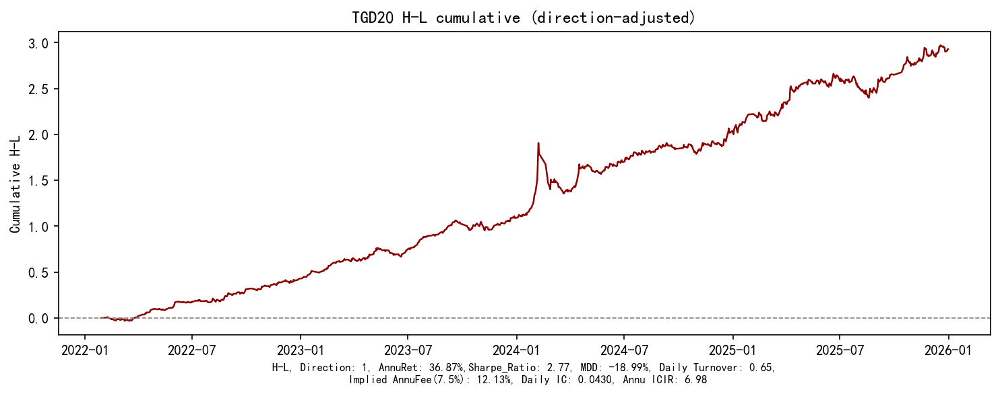

# TGD20 Factor Research Report

| | |
|--|--|
| **Document** | Internal factor research report (Alpha Factory · L2 Temporal Feature Layer) |
| **Factor** | `TGD20` |
| **Status** | Research-complete · Formula **frozen** · Production admission **deferred** |
| **Sample** | Confirmation 2022-01-28 → 2025-12-31 (951d); stability years 2020–2025 |
| **Universe** | ALL A-shares (0/3/6) |
| **Portfolio** | 10 groups + H-L · `signal_shift=1` |

> **Research presentation** ranks ICIR / Gross Sharpe / Monotonicity / MDD.  
> **Library admission** ranks Net Sharpe / Turnover / Capacity.  
> Both scores are first-class; neither replaces the other.

Machine-readable: [`replication/metrics.json`](replication/metrics.json) · [`replication/factor_summary.csv`](replication/factor_summary.csv)

---

## 1. Executive Summary

**Thesis:** TGD20 captures **abnormal downside timing information after return-structure controls** — not raw “when price rose vs fell.”

| Audience | Metric | Value |
|----------|--------|------:|
| Research | RankIC (raw) | 0.0430 |
| Research | ICIR (raw) | 6.98 |
| Research | ICIR (size+industry) | **11.29** |
| Research | H-L Sharpe (raw / SI) | 2.77 / **4.06** |
| Research | Monotonicity | **0.988** |
| Research | Yearly RankIC positive | **6/6** |
| Production | Daily TO (raw research book) | 0.65 |
| Production | Net Sharpe @15bp (SI, Stage-4) | 1.72 |
| Production | Exec best Net Sharpe (buffer 5/15) | **2.32** |

**Why this is a completed replication (not a lucky Sharpe):**

| Rejected primitive | ICIR | Verdict |
|--------------------|-----:|---------|
| \(\tau = G_d - G_u\) (MA20) | **−0.56** | time ordering ≠ alpha |
| \(\upsilon = \|G_d - G_u\|\) (MA20) | **−2.26** | temporal separation alone insufficient |
| **TGD20** | **6.98** | residual \(\varepsilon_d \perp \varepsilon_u\) + MA20 |

**One-sentence mechanism answer for the boss:**

> TGD20 is abnormal **downside pressure timing** after stripping amplitude and early-session structure — not a simple up/down time gap.

---

## 2. Motivation

### 2.1 Gap in classical factors

Most factors measure **magnitude**:

```
return · volume · volatility · turnover
```

They under-use **timing**:

> Within the trading day, *when* did buying vs selling concentrate?

### 2.2 Why Gu / Gd

Define return-weighted time centers of positive / negative minute returns. They are the natural language for “upside discovery clock” vs “downside discovery clock.”

Broker TGD research claims: after removing normal return structure, residual timing asymmetry predicts next-day cross-section (delayed absorption / reversal).

### 2.3 Positioning in Alpha Factory

```
Minute Return
      │
      ▼
Gu / Gd                    ← temporal primitive
      │
      ▼
Residualization (εu, εd)   ← strip structural noise
      │
      ▼
εd ~ εu → e                ← pure timing residual
      │
      ▼
MA20 → TGD20               ← investable smoother
      │
      ▼
Portfolio + Execution      ← net alpha
```

Parallel L2 primitive: **Flow Density** = money-arrival timing. TGD = return-timing residual. Combination is a later Information Layer task — **not** part of this replication close-out.

---

## 3. Factor Construction

### 3.1 Gu — upside time center

Trading-minute index \(t \in \{0,\ldots,239\}\) (lunch skipped). Minute return \(r_t = P_t/P_{t-1}-1\).

\[
G_u = \frac{\sum_{r_t>0} t\cdot r_t}{\sum_{r_t>0} r_t}
\]

Module: `core/l2_features/return_timing.py`

### 3.2 Gd — downside time center

\[
G_d = \frac{\sum_{r_t<0} t\cdot |r_t|}{\sum_{r_t<0} |r_t|}
\]

### 3.3 Residualization

Controls (研报 Table 4 style):

- \(\bar R_u = \mathrm{mean}(r\mid r>0)\), \(\bar R_d = \mathrm{mean}(r\mid r<0)\) — **conditional**, not all-minute means  
- \(R_1\) ≈ 09:31–10:00, \(R_2\) ≈ 10:01–10:30  
- Overnight \(R_{\mathrm{ovn}}\)

Daily **cross-sectional** OLS → \(\varepsilon_u,\varepsilon_d\).

Modules: `return_distribution.py`, `timing_residual.py`

### 3.4 TGD20

\[
\varepsilon_{d,i} = \alpha + \beta\,\varepsilon_{u,i} + e_i,\qquad
\mathrm{TGD20}_{i,t} = \frac{1}{20}\sum_{k=0}^{19} e_{i,t-k}
\]

Module: `core/l2_features/tgd.py` — **do not retune window / Gu weights / residual model** (replication closed).

---

## 4. Replication Integrity

*Artifacts:* [`replication/mechanism_decomposition.csv`](replication/mechanism_decomposition.csv) · [`replication/primitive_family.csv`](replication/primitive_family.csv) · [`replication/REPLICATION_INTEGRITY.md`](replication/REPLICATION_INTEGRITY.md)

### 4.1 \(\tau = G_d - G_u\)

| | |
|--|--|
| Object | Relative location of down vs up time centers |
| Result | `tau_MA20` ICIR = **−0.56** |
| Read | **Time ordering ≠ alpha.** Relative clocks ignore amplitude and return-structure noise. |

### 4.2 \(\upsilon = |G_d - G_u|\)

| | |
|--|--|
| Object | Temporal separation of up vs down activity |
| Result | `upsilon_MA20` ICIR = **−2.26** |
| Read | **Separation alone is insufficient.** Large distance can mean gentle afternoon drift or violent two-way swings — opposite economics. |

### 4.3 \(\varepsilon_u\)

| | |
|--|--|
| Result | ICIR = **1.62** (weak; direction unstable) |
| Read | Abnormal *upside* timing residual is not the main driver. |

### 4.4 \(\varepsilon_d\)

| | |
|--|--|
| Result | ICIR = **5.80**, mono ≈ 0.75 |
| Read | **Primary information: abnormal downside timing** after controls — consistent with informed selling / liquidity shock / delayed reaction narratives. |

### 4.5 TGD20 vs daily residual

| | Daily `tgd_eps` | TGD20 |
|--|----------------:|------:|
| ICIR | **8.53** | 6.98 |
| H-L Sharpe | 4.33 | 2.77 |
| Turnover | ~3.4 / day | **0.65** |
| Net Sharpe | deeply negative | **+1.58** (raw book) |
| Role | noisy high-freq residual | **stable / investable** |

Daily \(\varepsilon\) has higher ICIR but destroys net PnL. MA20 is the research→trade translation layer — same logic as Execution Optimization later.

**Integrity verdict:** Alpha comes from **controlled downside timing residual**, not Gu/Gd clocks or \(\tau/\upsilon\).

---

## 5. Predictive Performance

Confirmation sample · raw TGD20 · shift-1.

| Metric | Value | Purpose |
|--------|------:|---------|
| RankIC / Daily IC | 0.0430 | Predictive power |
| Annu IC | 0.680 | Annualized IC magnitude |
| ICIR | **6.98** | IC stability |
| Monotonicity | **0.988** | Decile ordering quality |

Schema (reusable for all future 研报 factors): [`replication/factor_metrics_schema.csv`](replication/factor_metrics_schema.csv)

---

## 6. Portfolio Performance

### 6.1 Ten groups + H-L cumulative


*Figure 1.* Strong monotonic stack; H-L cumulative ≈ +1.4 over confirmation. AnnuRet **36.87%**, Sharpe **2.77**, MDD **−18.99%**, Daily TO **0.65**, Implied AnnuFee(7.5bps) **12.13%**.

### 6.2 Decile mean return


*Figure 2.* Cross-sectional discrimination rises with factor exposure.

### 6.3 H-L path



*Figure 3.* Early-2024 drawdown episode then resumed upward trend.

| Metric | Raw confirmation |
|--------|-----------------:|
| Annual return | 36.87% |
| Sharpe | 2.77 |
| MDD | −18.99% |
| Daily turnover | 0.65 |

---

## 7. Robustness

### 7.1 Neutralization

| Mode | RankIC | ICIR | H-L Sharpe | Net@15bp | TO |
|------|-------:|-----:|-----------:|---------:|---:|
| raw | 0.0430 | 6.98 | 2.77 | 1.00 | 0.65 |
| size | 0.0443 | 8.67 | 3.52 | 1.51 | 0.65 |
| industry | 0.0408 | 8.90 | 3.19 | 1.16 | 0.64 |
| size+industry | 0.0415 | **11.29** | **4.06** | **1.72** | 0.65 |

Neutralization **improves** ICIR/HL → not a disguised size/industry bet.  
Source: [`neutralization/neut_summary.csv`](neutralization/neut_summary.csv)

### 7.2 Period split

Yearly mean RankIC **6/6 positive**. Softest: 2024 (ICIR 4.25) still &gt; 0.  
Source: [`stability/yearly_ic.csv`](stability/yearly_ic.csv)

### 7.3 Paper vs framework (do not hard-match IR)

| Item | Paper | Ours |
|------|-------|------|
| Gu/Gd + residual + MA20 | √ | √ |
| Groups | often 5 | **10 + H-L** |
| Neutral / cost / shift | limited | size+ind · 15bp · **shift-1** |

---

## 8. Execution Optimization

High research TO is largely **rank crossing** at the 10% boundary — implementation waste, not proof that the signal is “too fast.”

| Version | Gross | TO | Net Sharpe |
|---------|------:|---:|-----------:|
| SI daily | 4.06 | 0.65 | 1.28† |
| SI every 5d | 3.43 | 0.31 | 2.06 |
| **SI daily + buffer 5/15** | 3.51 | **0.30** | **2.32** |

† Execution LS = top/bottom 10% (aligned to decile book).

**Investable starting point (candidate, not production go-live):**  
`size+industry` · daily signal · **buffer entry 5% / exit 15%** · Net Sharpe ≈ 2.32.

Detail: [`execution/execution_summary.md`](execution/execution_summary.md)

**Deferred (Production readiness):** capacity / CSI300–1000 ladder / ADV caps.

---

## 9. Final Recommendation

### For research presentation (老板)

Lead with:

1. Mechanism: \(\tau/\upsilon\) fail · \(\varepsilon_d\) drives · TGD20 wins  
2. ICIR 6.98 → 11.29 after size+industry  
3. Mono 0.99 · Figures 1–3  
4. 6/6 yearly positive RankIC  

### For factor library admission

Require Net Sharpe + TO narrative:

- Research book Net ≈ 1.0–1.7 depending on neut / book definition  
- Execution buffer lifts Net to **≈ 2.32** at TO ≈ 0.30  

### Status tags

| Tag | Value |
|-----|-------|
| Replication | **CLOSED** |
| Formula | **FROZEN** |
| Research satellite | **READY** (see library YAML) |
| Production / stack | **NOT YET** — capacity + Flow Density orthogonality next |

### Explicit non-goals (do not reopen)

- ❌ MA10/30/60 retune  
- ❌ ML residual  
- ❌ TGD × Flow Density composite inside this report  

---

## Appendix A — Metrics dual-score table

| Factor / mode | RankIC | ICIR | Sharpe | MDD | TO | NetSharpe |
|---------------|-------:|-----:|-------:|----:|---:|----------:|
| TGD20 raw | 4.30% | 6.98 | 2.77 | −18.99% | 0.65 | 1.00 |
| TGD20 size+ind | 4.15% | **11.29** | **4.06** | −6.04% | 0.65 | 1.72 |
| TGD20_exec (buffer 5/15) | 4.15% | 11.28 | 3.51 | — | **0.297** | **2.32** |

Full: [`replication/factor_summary.csv`](replication/factor_summary.csv)

## Appendix B — Artifact index

| Path | Content |
|------|---------|
| `portfolio/cumulative_long_short.png` | Fig 1 |
| `portfolio/decile_return.png` | Fig 2 |
| `portfolio/hml_curve.png` | Fig 3 |
| `neutralization/neut_summary.csv` | Neut ladder |
| `stability/yearly_ic.csv` | Year / block IC |
| `cost/turnover_cost.csv` | Cost |
| `execution/` | Execution Optimization v1 |
| `replication/` | Schema · metrics · mechanism · family |

## Appendix C — Code map (frozen)

| Stage | Module |
|-------|--------|
| Gu/Gd | `return_timing.py` |
| Rū/Rd̄ | `return_distribution.py` |
| Residual | `timing_residual.py` |
| TGD20 | `tgd.py` |
| Metrics schema | `factor_eval_metrics.py` |
| Integrity | `run_tgd_replication_integrity.py` |
| Validation | `run_tgd_validation_v1.py` |
| Execution | `execution_layer.py` / `run_tgd_execution_opt_v1.py` |

## Appendix D — Library card

Research satellite YAML (not production freeze):  
[`../../alpha_library_v1/research_satellites/TGD20.yaml`](../../alpha_library_v1/research_satellites/TGD20.yaml)

---

*Replication closed. Next higher-value work: capacity gate or TGD ⊥ Flow Density — not TGD formula changes.*
