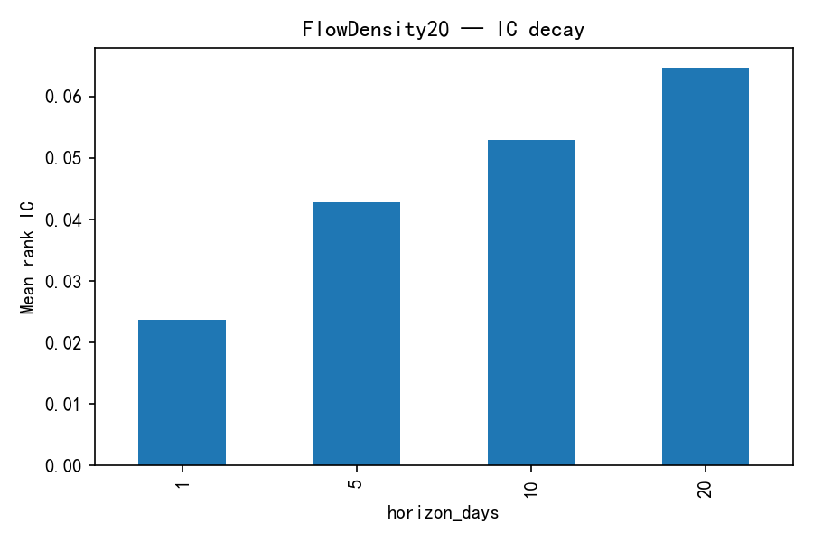
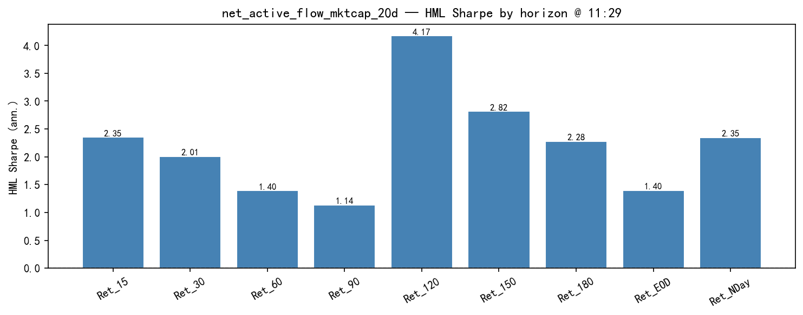
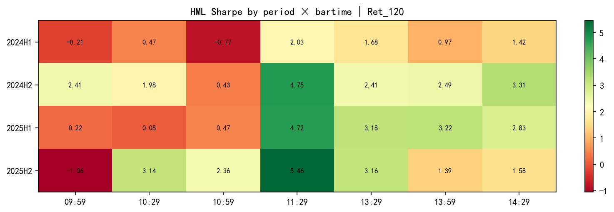

# FlowDensity20 Factor Research Report

> 主动资金流密度 × 流动性状态因子｜Junior QR / Quant Intern 交付版  
> 作者：量化研究实习生工作产出｜报告日期：2026-07-22  
> 公式状态：未冻结｜样本：确认窗口 2022-01-28 → 2025-12-31（951 日）  
> 文档定位：**研究尽职调查（research due diligence）**，不是投委会立项决议

---

# 0. Executive Summary

FlowDensity20 是一个基于 L2 主动买卖金额、流通市值与 20 日累积的横截面候选 alpha。它衡量净主动资金流相对公司规模的到达强度，但机制检验表明，现有预测力与低成交活跃度紧密纠缠，因此更准确的定位是 **Flow × Liquidity interaction**，而不是“纯聪明钱流向”。

### 主要发现

1. **有稳定的截面预测力**：raw RankIC 1.78%、ICIR 2.07；size+industry 后 RankIC 2.36%、ICIR 4.85，2022–2025 年度 RankIC 全为正。
2. **规模与行业控制改善稳定性**：size 单独中性化后 ICIR 4.41，size+industry 后 ICIR 4.85；但 industry 单独处理的纯多头超额仍为负，说明处理顺序和风险暴露不可忽略。
3. **H-L 强、纯多头弱**：size+industry H-L 费前 Sharpe 3.38、年化 29.23%；但 G10 相对精确有效股票池等权的 Excess Sharpe 仅 0.50、年化超额 3.98%、最大回撤 −16.77%。
4. **不是纯流向 alpha**：Flow 与 Amount 日均截面相关 −0.617；Flow⊥Amount 后 ICIR 从 +4.85 翻为 −2.49，而 Amount⊥Flow 仍为 −8.49。正向 alpha 依赖流向与低活跃度的交互。
5. **全市场依赖明显**：确认口径下 CSI300 / CSI500 RankIC 为负，CSI1000 ICIR 仅 1.47，ALL ICIR 为 4.85。不能把全 A 结果外推为大盘或标准指数增强结论。
6. **执行优化有效但不可混用口径**：`daily|buffer_10_30` 将 H-L 日换手从约 0.463 降至 0.165，15bp Net Sharpe 提升到 2.88；这是多空执行网格结果，不是纯多头相对基准 headline。
7. **与 TGD20 有部分重叠**：平均截面相关 0.217；Flow⊥TGD 后只保留约 35% ICIR。50/50 等权合成 ICIR 8.50，低于 TGD20 单因子 11.28，不支持机械等权。

### 研究结论（非投决）

> **研究状态：Candidate / Satellite Enhancer。**  
> 证据支持保留在 alpha library 中做组合层增量测试；在公式冻结、CSI1000 Production Track、完整可成交回放和流动性风险约束完成前，不建议直接配置生产资金。

---

# 1. Research Motivation

传统资金流因子通常回答：

> 主动买入是否大于主动卖出？

FlowDensity20 进一步追问：

> 同样规模的净流入，相对公司的承载能力和近期成交活跃度，是否代表不同的信息强度？

高净流入发生在低活跃股票中，可能对应持续性信息或有限流动性下的价格压力；同样的净流入发生在高成交金额股票中，也可能只是高换手噪声。因此本报告不预设“净流入就是聪明钱”，而是检验四个问题：

1. 信号是否稳定可复现？  
2. 是否只是规模、行业或低成交活跃度的马甲？  
3. 在全市场与主要指数股票池中是否一致？  
4. 在成本、换手与真实执行约束下是否仍有研究价值？

---

# 2. Factor Definition & Construction

## 2.1 一句话定义

> FlowDensity20 = 主动买入金额减主动卖出金额，除以流通市值后做 20 日滚动累积，并在每日横截面标准化。

它不是单日资金净流入，也不是主动买入占比。

## 2.2 数学公式

个股 \(i\) 在交易日 \(t\) 的净主动资金流密度：

\[
f_{i,t}=
\frac{\mathrm{ActiveBuyAmt}_{i,t}-\mathrm{ActiveSellAmt}_{i,t}}
{\mathrm{FloatMktCap}_{i,t}}
\]

20 日累积及横截面标准化：

\[
\mathrm{FlowDensity20}_{i,t}
=
\mathrm{CSZScore}_{t}
\left(
\sum_{k=0}^{19} f_{i,t-k}
\right)
\]

实现使用 `rolling(20, min_periods=10).sum()`；交易时点强制 `signal_shift=1`，即 \(t\) 日完整 L2 数据只预测下一交易日收益。


## 2.3 机制拆解

| 信号 | RankIC | ICIR | H-L Sharpe | 结论 |
|---|---:|---:|---:|---|
| FlowDensity20，size+industry | +2.36% | +4.85 | 3.38 | canonical 候选信号 |
| Amount / mktcap 20d | −4.75% | −8.66 | 3.95 | 强反向低活跃度通道 |
| GrossActive / mktcap 20d | −4.76% | −8.67 | 3.99 | 与 Amount 结论一致 |
| Flow⊥Amount | −0.88% | −2.49 | 0.13 | 剥离 Amount 后符号翻转 |
| Amount⊥Flow | −3.71% | −8.49 | 2.53 | 流动性通道仍保留 |

这组结果拒绝“纯方向资金流”解释。更稳妥的经济标签是 **liquidity-conditioned flow**：净流向与低成交活跃状态共同决定信号。

## 2.4 公式与治理说明

| 项目 | 当前口径 |
|---|---|
| Registry ID | `FlowDensity20` |
| 正式实现 | `CSZScore(rolling_sum_20((active_buy-active_sell)/float_mktcap))` |
| 研究样本 | 2022-01-28 → 2025-12-31 |
| 收益 | 复权日度 C2C，`signal_shift=1` |
| 风险处理 | 每日截面 size / industry 中性化 |
| 状态 | `candidate`，`frozen_formula: false` |
| Production Track | CSI1000、行业+规模中性、15bp；尚未正式重跑 |

部分旧文档写作 `MA20`。由于最终还做横截面 z-score，均值与求和只差常数 \(1/20\)，排序不变；但源码定义仍应统一写作 **rolling sum**，避免实现与文档漂移。

---

# 3. Data & Methodology

| 项目 | 口径 |
|---|---|
| L2 数据 | 日度聚合 `active_buy_amt`、`active_sell_amt` |
| 规模变量 | Wind / EOD 流通市值 |
| 日收益 | 复权 C2C |
| 股票池 | 全 A（代码首位 0/3/6）；补充 CSI300/500/1000 |
| 确认样本 | 2022-01-28 → 2025-12-31，951 交易日 |
| 日均有效股票 | 约 4,988；G10 约 499 |
| 分组 | 每日横截面十分组、组内等权，正向 G10−G1 |
| 精确长端基准 | 当日同时具有有效信号与有效收益的全部测试股票等权 |
| 年化天数 | 250 |
| 信号滞后 | `signal_shift=1` |

### 证据边界

- 当前报告是 Legacy ALL / confirmation harvest，不是 CSI1000 Production Track。
- 暂无独立冻结的 FlowDensity20 宽表交付快照；底层 L2 缓存仍位于全局 research cache。
- 现有资料未完成 ST、停牌、涨跌停买卖方向、受阻订单、现金残留及次日开盘成交回放。
- 行业内 IC、行业主动权重、市场状态、beta stripping 与持仓级容量分析尚无同口径专属结果。

---

# 4. Signal Evaluation

## 4.1 RankIC / ICIR

| 模式 | Mean RankIC | ICIR | H-L Sharpe | H-L MDD |
|---|---:|---:|---:|---:|
| Raw | 1.78% | 2.07 | 1.52 | −19.03% |
| Size | **2.71%** | 4.41 | 2.95 | −10.29% |
| Industry | 1.52% | 2.69 | 1.90 | −12.93% |
| Size+industry | 2.36% | **4.85** | **3.38** | **−9.51%** |

规模和行业处理后，平均 RankIC 与 ICIR 均高于 raw。这里不能简单解读为“中性化创造 alpha”：更可能是原始信号同时带有不利规模 / 行业结构，处理后提高了横截面可比性。

## 4.2 每日与滚动 RankIC


20 日滚动 IC 大部分时间位于零轴上方，但 2024 年初出现明显负区间；2025 年末也回落至零附近。年度均值为正不代表任意短窗口都稳定。

## 4.3 IC 衰减



| 预测期 | Mean RankIC | 相对 1 日 |
|---:|---:|---:|
| 1D | 2.37% | 100% |
| 5D | 4.28% | 181% |
| 10D | 5.29% | 223% |
| 20D | 6.46% | 273% |

多期累计 RankIC 上升，说明信号信息寿命不止一个交易日，也为降频和 buffer 提供依据。由于 5/10/20 日收益高度重叠，不能把这些 horizon 当作独立样本进行显著性比较。

## 4.4 十分组与 H-L


十分组整体从 G1 向 G9 上升，G10 相对 G9 有局部回落；Protocol 图层单调性约 0.90，机制表 canonical 口径约 0.879。因此应表述为“高单调性但非严格逐组递增”。


该图来自 Protocol chart harvest，给出 RankIC 2.50%、ICIR 4.88、H-L Sharpe 4.28；canonical validation 同期 headline 为 RankIC 2.36%、ICIR 4.85、H-L Sharpe 3.38。两者使用不同评估/过滤链，不应混写。本文所有决策表默认采用 canonical validation；Protocol 图仅用于形态诊断。

---

# 5. Robustness

## 5.1 风险中性化阶梯

| 模式 | RankIC | ICIR | H-L Sharpe | 15bp Net Sharpe | 日换手 |
|---|---:|---:|---:|---:|---:|
| Raw | 1.78% | 2.07 | 1.52 | −0.18 | 0.515 |
| Size | 2.71% | 4.41 | 2.95 | 1.60 | 0.474 |
| Industry | 1.52% | 2.69 | 1.90 | 0.08 | 0.480 |
| Size+industry | **2.36%** | **4.85** | **3.38** | **1.85** | **0.463** |

Size 单独处理改善最大，industry 单独处理有限；size+industry 组合在 ICIR、回撤与成本后指标上最稳健。由于 Amount 本身与规模、流动性高度相关，仍需在正式风险模型中检验 Residual Liquidity 暴露。

## 5.2 纯多头相对精确股票池等权

Headline 超额定义：

\[
r^{excess}_t
=
r^{G10}_t
-
\frac{1}{N_t}\sum_{i\in U_{t,\mathrm{valid}}}r_{i,t}
\]

| 实现 | Excess Sharpe | 年化超额 | 最大超额回撤 |
|---|---:|---:|---:|
| Raw G10 | −0.046 | −0.46% | −20.55% |
| Size G10 | **0.765** | **6.17%** | −17.46% |
| Industry G10 | −0.137 | −1.10% | **−11.99%** |
| Size+industry G10 | 0.501 | 3.98% | −16.77% |


H-L 的强表现没有一比一转化为纯多头超额。对买方长端产品而言，0.50 的费前 Excess Sharpe 才是更接近真实的 headline；3.38 的 H-L Sharpe 是研究诊断。

## 5.3 分年度稳定性

| 年度 | RankIC | ICIR | SI G10 年化超额 | Excess Sharpe | 最大回撤 |
|---:|---:|---:|---:|---:|---:|
| 2022* | 2.06% | 4.53 | −0.37% | −0.05 | −5.52% |
| 2023 | 2.31% | 4.81 | 5.59% | 0.96 | −2.77% |
| 2024 | 2.34% | 4.21 | −1.99% | −0.17 | **−16.39%** |
| 2025 | 2.68% | 6.05 | **12.33%** | **2.27** | −2.98% |

\* 2022 从 1 月 28 日起。年度 RankIC 全正，但纯多头超额在 2022、2024 为负，说明 IC 稳定不等于长端相对基准稳定。


## 5.4 分股票池

| 股票池 | RankIC | ICIR | 结论 |
|---|---:|---:|---|
| CSI300 | −2.43% | −2.21 | 大盘池失效 |
| CSI500 | −0.46% | −0.63 | 中盘池未验证 |
| CSI1000 | +0.83% | +1.47 | 弱正 |
| ALL | +2.36% | +4.85 | 主要有效范围 |

结论对广义全市场 / 中小票覆盖有明显依赖。Production benchmark 虽登记为 CSI1000，但现有证据不足以认定已经通过 CSI1000 生产门槛。

## 5.5 日内 horizon 辅助诊断



11:29 时点、CSI1000 五组辅助模板中，Ret_120 Sharpe 为 4.17，2024H1–2025H2 四个半年度均为正。



该结果是最后 504 日、五组、日内收益的辅助诊断，与日频 ALL 十分组主回测不是同一投资组合。热力图中其他形成时点存在负值，11:29 的高值不能被当作稳定的全时段执行结论。

## 5.6 参数窗口敏感性

| 窗口 | RankIC | ICIR |
|---:|---:|---:|
| 14 日 | 2.30% | 4.76 |
| 20 日 | 2.36% | 4.85 |
| 26 日 | 2.42% | 5.01 |

邻近窗口均保持正 IC，表明结果不是单一 20 日参数点偶然；但 26 日同样本略优，也说明 20 日尚不具备“统计最优并冻结”的资格。任何改窗应建立新版本并使用新的确认样本。

---

# 6. Alpha Independence

## 6.1 与成交活跃度的纠缠

| 信号 | 与 Flow 的截面相关 | ICIR | 相对基线 |
|---|---:|---:|---:|
| FlowDensity20 | 1.000 | +4.85 | 100% |
| Amount | −0.617 | −8.66 | 独立强反向通道 |
| Flow⊥Amount | — | −2.49 | 符号翻转 |
| Amount⊥Flow | — | −8.49 | Amount 通道保留约 98% |

Flow 与 Amount 的强负相关及正交后的符号翻转，是本报告最重要的机制风险。因子不能命名或营销为“纯主动买入”；更合理的标签是 **净流向 × 低活跃度**。

## 6.2 与 TGD20 的双向正交


| 正交方向 | 原 ICIR | 残差 ICIR | 保留率 | 判断 |
|---|---:|---:|---:|---|
| TGD20⊥FlowDensity20 | 11.28 | 9.12 | 80.8% | TGD mostly independent |
| FlowDensity20⊥TGD20 | 4.85 | 1.68 | 34.7% | Flow partial overlap |
| TGD20⊥Amount | 11.28 | 7.66 | 67.9% | TGD 未被流动性吸收 |
| FlowDensity20⊥Amount | 4.85 | −1.66 | −34.3% | Flow 与 Amount 纠缠 |

TGD20 能保留大部分信息，而 FlowDensity20 被 TGD20 吸收较多。50/50 等权 rank composite 的 ICIR 为 8.50，低于 TGD20 单因子 11.28；组合层应采用约束优化或增量 IC 权重，而不是默认等权。

## 6.3 独立性结论

- 相对 size / industry：预测力保留并改善。  
- 相对 Amount / GrossActive：独立性不通过。  
- 相对 TGD20：有部分独立信息，但不是对称关系。  
- 相对其他流动性质量因子：现有相似度研究提示可能被进一步吸收，尚需正式风险模型归因。

---

# 7. Trading Analysis

## 7.1 基线换手与成本

| 实现 | Gross Sharpe | 日换手 | Net Sharpe@15bp |
|---|---:|---:|---:|
| Raw daily H-L | 1.52 | 0.515 | −0.18 |
| Size+industry daily H-L | 3.38 | 0.463 | 1.85 |
| Size+industry daily buffer 10/30 | **3.71** | **0.165** | **2.88** |

15bp 下，raw 信号无法覆盖换手成本；size+industry 基线仍为正，buffer 进一步显著降低换手。成本结果全部来自 H-L 诊断，不能替代纯多头超额回测。

## 7.2 执行网格

| 实现 | Gross Sharpe | 日换手 | Net Sharpe@15bp |
|---|---:|---:|---:|
| Daily | 3.38 | 0.463 | 1.37 |
| Every 5d | 3.68 | 0.234 | 2.61 |
| Every 10d | 3.53 | 0.179 | 2.69 |
| Daily buffer 5/15 | 3.37 | 0.222 | 2.47 |
| Daily buffer 10/20 | 3.75 | 0.220 | 2.69 |
| **Daily buffer 10/30** | **3.71** | **0.165** | **2.88** |


`buffer_10_30` 是同一样本历史网格最优解，存在选择偏差。建议将它与 every-10d 作为预注册 A/B，而不是继续在同一确认窗口调参。

## 7.3 可交易性与容量

确认摘要给出约 212 亿元的 `capacity_cny_approx`，但当前交付物没有完整方法说明、持仓级 ADV 分布或订单簿冲击模型。该值只能视作历史静态筛查，不能作为产品容量承诺。

生产前仍需补齐：

1. ST、停牌、涨停买入、跌停卖出的方向性判断；  
2. 受阻订单、现金残留和下一交易日递延成交；  
3. close-T 信号到 open-(T+1) 或 VWAP 的真实成交时点；  
4. 分股票 ADV 参与率、冲击成本和组合 AUM 压力测试；  
5. 纯多头 buffer / 降频后的精确股票池净超额，而非只看 H-L。

---

# 8. Risk Analysis

## 8.1 纯多头最差区间

| 窗口 | 起止 | 复合超额 |
|---:|---|---:|
| 最差 20D | 2024-01-11 → 2024-02-07 | **−16.18%** |
| 最差 60D | 2023-11-15 → 2024-02-07 | **−14.77%** |
| 最差 120D | 2023-08-15 → 2024-02-07 | **−11.95%** |

最差区间集中在 2024 年初，且 2024 全年 RankIC 仍为 +2.34%。这再次说明横截面排序有效不等于纯多头相对等权基准持续盈利；长端组合会受到市场结构、尾部股票与基准共同波动影响。

## 8.2 结构性风险

1. **机制风险**：Flow⊥Amount 后 ICIR 翻负，因子可能主要是低活跃度条件下的资金流交互。  
2. **股票池风险**：CSI300 / CSI500 为负，CSI1000 仅弱正，alpha 依赖 ALL 全市场覆盖。  
3. **长端转化风险**：H-L Sharpe 3.38，但精确长端 Excess Sharpe 仅 0.50。  
4. **回撤风险**：2024 年纯多头超额最大回撤 −16.39%，显著高于 H-L MDD −9.51%。  
5. **执行风险**：尚无受阻订单和次日开盘成交回放；15bp 只是统一成本假设。  
6. **参数与治理风险**：26 日窗口同样本略优，公式尚未冻结。  
7. **组合重叠风险**：Flow⊥TGD 仅保留约 35%，机械混合可能稀释更强信号。  
8. **数据风险**：正式覆盖从 2022 年开始，未覆盖完整 2018–2025 目标期。

### 建议监控阈值（研究跟踪用）

- 60 日 RankIC 连续 20 日 < 0  
- 120 日精确股票池 Excess Sharpe < 0  
- CSI1000 120 日 ICIR < 0  
- 日换手高于预注册方案历史中位数 1.5 倍  
- Flow 与 Amount 绝对相关持续高于历史 90% 分位  
- 实盘滑点超过 15bp 假设 2 倍

阈值需在冻结生产回测后按历史分布重新标定；当前只用于研究预警。

---

# 9. Conclusion & Next Steps

## 9.1 初步结论

FlowDensity20 通过了“可复现、有正 RankIC、年度 IC 为正、size+industry 后仍有效、执行 buffer 可显著降换手”的初级门槛；但没有通过“纯资金流机制”“标准指数股票池一致性”“强纯多头超额”和“完整可成交回放”四项更高门槛。

**推荐研究状态：Candidate / Satellite Enhancer（保留 library，暂不冻结公式）。**

## 9.2 待解决问题

1. 对 Amount、ADV、Residual Liquidity 做联合风险约束后，增量 IC 是否仍为正？  
2. CSI1000 Production Track 下 RankIC、纯多头 IR 与 15bp 净超额能否通过？  
3. 在完整 ST/涨跌停/停牌受阻订单回放下，buffer 10/30 是否仍最优？  
4. 2024 年初长端大回撤来自行业、规模尾部、微盘暴露还是基准结构？  
5. 20 日与 26 日窗口应如何通过新确认样本冻结，而不是在旧样本内选择？  
6. 在已有 TGD20 和流动性质量因子后，FlowDensity20 的组合边际贡献是否稳定？

## 9.3 建议后续工作（按优先级）

| 优先级 | 工作 | 目的 |
|---|---|---|
| 高 | CSI1000 Production Track + 精确纯多头净超额 | 验证产品适配 |
| 高 | Amount / ADV / Liquidity 联合正交与风险约束 | 回答机制是否可独立 |
| 高 | 涨跌停 / 停牌受阻订单状态回放 | 回答能否真实交易 |
| 中 | 复盘 2024 年初最差区间与行业 / 规模暴露 | 定位长端回撤来源 |
| 中 | 预注册 buffer 10/30 vs every-10d A/B | 固定执行方案 |
| 中 | 新确认样本比较 20 日与 26 日窗口 | 冻结公式 |
| 低 | 与 TGD20 做增量 IC / 约束权重组合 | 避免机械 50/50 |

---

# Appendix

## A. 证据索引

| 内容 | 文件 |
|---|---|
| 因子治理卡 | `research/reports/factors/FlowDensity20/factor_card.yaml` |
| 公式实现 | `factor_formulas_l2_flow_p2.py` |
| 核心指标 | `research/reports/factors/FlowDensity20/factor_summary.csv` |
| 中性化与精确长端 | `research/reports/l2_flow_density_v1/validation_v1/neutralization_ladder.csv` |
| 精确长端日收益 | `research/reports/l2_flow_density_v1/validation_v1/long_book_excess_daily_size_industry.csv` |
| 年度稳定性 | `research/reports/l2_flow_density_v1/confirmation_yearly_ic.csv` |
| 股票池检验 | `research/reports/l2_flow_density_v1/confirmation_universe.csv` |
| 参数敏感性 | `research/reports/l2_flow_density_v1/confirmation_param_stability.csv` |
| IC 衰减与分组 | `research/reports/l2_flow_density_v1/protocol_charts_1d7/FlowDensity20/report/` |
| 机制归因 | `research/reports/l2_flow_density_v1/mechanism/mechanism_amount_neutral.csv` |
| 执行网格 | `research/reports/l2_flow_density_v1/execution/all_experiments.csv` |
| TGD 正交 | `research/reports/factor_orthogonality/TGD20_FlowDensity20/` |
| 交付 headline | `research_delivery/factors/FlowDensity20/metrics.csv` |

## B. 复现命令

```bash
OMP_NUM_THREADS=1 OPENBLAS_NUM_THREADS=1 MKL_NUM_THREADS=1 \
/opt/conda/anaconda3/envs/base_93/bin/python \
run_l2_flow_density_validation_v1.py

OMP_NUM_THREADS=1 OPENBLAS_NUM_THREADS=1 MKL_NUM_THREADS=1 \
/opt/conda/anaconda3/envs/base_93/bin/python \
run_flow_density_mechanism_v1.py

OMP_NUM_THREADS=1 OPENBLAS_NUM_THREADS=1 MKL_NUM_THREADS=1 \
/opt/conda/anaconda3/envs/base_93/bin/python \
run_flow_density_amount_orth_v1.py

OMP_NUM_THREADS=1 OPENBLAS_NUM_THREADS=1 MKL_NUM_THREADS=1 \
/opt/conda/anaconda3/envs/base_93/bin/python \
run_flow_density_execution_opt_v1.py

/opt/conda/anaconda3/envs/base_93/bin/python \
research_delivery/scripts/render_flowdensity20_report_html.py
```

## C. 口径提醒

- `Excess Sharpe 0.50`：费前 size+industry G10 相对精确有效股票池等权，买方长端 headline。  
- `H-L Sharpe 3.38`：canonical size+industry 多空研究诊断。  
- `Net Sharpe 1.85`：canonical daily H-L @15bp。  
- `Net Sharpe 2.88`：同样本 buffer 执行网格最优，仍是 H-L，且存在参数选择偏差。  
- Protocol 图中的 `H-L Sharpe 4.28` 来自不同评估链，仅用于形态诊断。  

以上指标不可混用。
