# SKEW / IdioSKEW Factor Research Report

> 高阶矩偏度异常｜Junior QR / Quant Intern 交付版  
> 作者：量化研究实习生工作产出｜报告日期：2026-07-22（含 SKEW v2/v3/v4 单因子优化）  
> 公式状态：原预注册 IdioSKEW60；**v4 研究最优更新为 IdioSKEW50_MAD**｜样本：2020-01-01 → 2025-12-31  
> Headline：`AlphaIdioSKEW50_MAD`（Alpha = −IdioSKEW50，截面 MAD n=5 → size+industry；T+1）  
> 文档定位：**研究尽职调查（research due diligence）**，不是投委会立项决议

---

# 0. Executive Summary

SKEW 复现的是 A 股经典**收益分布偏度异常**：正偏（彩票型）股票被高估、未来收益偏低；负偏股票因暴跌风险补偿而未来收益偏高。本报告完成 IC / 十分组 / 中性化 / 机制 / TGD 交互，以及 **v2 纯化、v3 horizon+EWMA、v4 形成期×Raw/Idio×MAD 阈值**（全程单因子、无分钟、无多因子合成）。

### 主要发现

1. **符号与理论一致**：raw Idio 负向 IC；Alpha=−Idio 后正向。
2. **v2**：Vol/MAX 残差不可替换；MAD 有小幅增益。
3. **v3**：T+1 优于更长预测窗；等权优于 EWMA。
4. **v4 窗口**：在 {40,50,60,75,90} 上 **Idio 全窗口优于 Raw**；**Idio50_MAD HL Sharpe 2.79**（相对 Idio60_MAD 2.53，Δ+0.26）。Idio40 接近（2.77）但换手更高。
5. **v4 MAD n**：在 Idio50 / Idio60 上 n∈[3.5,7] 几乎平坦；n=4 在 Idio50 上仅再 +0.02 → **保留 n=5**。
6. **收敛路径**：`等权 IdioSKEW50 → MAD(n=5) → Alpha=−SKEW → size+industry → T+1`。

### 研究结论（非投决）

> **研究状态：Candidate Alpha（A-，Return Distribution Layer）。**  
> 原冻结窗 60 仍可审计；**研究最优单因子更新为 `AlphaIdioSKEW50_MAD`**（网格扫描披露，非从预注册三窗里暗中挑优）。  
> 单因子侧收益/成本比已薄；下一步若要再抬升，应做组合层（TGD），而非继续拧 skew 估计器。

---

# 1. Research Motivation

传统量价因子多刻画收益/波动的**一阶与二阶矩**。偏度因子追问：

> 收益分布是否不对称？这种不对称是否被错误定价？

行为金融解释：投资者偏好彩票型正偏收益 → 推高价格 → 后续低收益。  
与 TGD20 的分工：

| 因子 | 捕捉对象 |
|---|---|
| TGD20 | 收益**何时**发生（日内时点残差） |
| SKEW / IdioSKEW | 收益**如何分布**（不对称 / 三阶矩） |

本报告关心：

1. 信号是否稳定可复现？  
2. 是否只是市值 / 行业 / 波动的马甲？  
3. 与 TGD20 是否提供独立信息？  
4. 窗口是否稳健（预注册，不做事后挑窗）？

---

# 2. Factor Definition & Construction

## 2.1 一句话定义

> IdioSKEW60 = 对 CSI300 市场模型残差的 60 日滚动偏度；交付信号 Alpha = −IdioSKEW60（做多低偏 / 负偏）。

## 2.2 数学公式

日收益：

\[
r_{i,t}=\frac{P_{i,t}}{P_{i,t-1}}-1
\]

**Baseline 总偏度**（窗口 \(L\in\{20,60,120\}\)）：

\[
\mathrm{SKEW}_{i,t}^{(L)}
=
\frac{\mathrm{m}_3}
{(\mathrm{m}_2)^{3/2}}
\]

**Headline 异质偏度**（\(L\in\{60,120\}\)）：

\[
r_{i,s}=\alpha_{i,t}+\beta_{i,t}\,r_{m,s}+\varepsilon_{i,s},\quad
s\in[t-L+1,t]
\]

\[
\mathrm{IdioSKEW}_{i,t}^{(L)}=\mathrm{Skew}(\varepsilon_{i,\cdot})
\]

其中 \(r_m\) 为 **CSI300** 日度 C2C（`000300.SH`），**不是**全 A 等权。实现为滚动市场模型残差 + 滚动偏度（见 `core/factors/skew/idio_skew.py`）。

交付信号：

\[
\mathrm{Alpha}=-\mathrm{IdioSKEW}
\]

交易时点强制 `signal_shift=1`。

## 2.3 方向约定（读图必读）

| 对象 | 含义 |
|---|---|
| raw IdioSKEW 高 | 正偏 / 彩票型 → 预期未来收益低 |
| Alpha 高（G10） | 低偏 / 负偏 → 多头端 |
| Alpha 低（G1） | 高正偏 → 空头端 |
| H−L | G10 − G1（Direction=1） |

## 2.4 与券商研报 / 教程模板的差异

| 项目 | 本复现口径 |
|---|---|
| 市场收益 | CSI300，非全 A 等权 |
| 窗口 | 预注册；headline=60 |
| 去极值 | **未单独做 MAD**；评价层用涨跌停/ST/停牌掩码 + 截面 z-score |
| 中性化 | size / industry / size+industry 截面残差 |
| 分钟 RSKEW | P1 延期，不混入本 id |

---

# 3. Data & Methodology

| 项目 | 口径 |
|---|---|
| 价格 / 收益 | Wind EOD 复权 C2C |
| 市场 | CSI300 `AINDEXEODPRICES` |
| 市值 / 行业 | 流通市值、中信一级历史行业 |
| 股票池 | 全 A（0/3/6）；补充 CSI300/500/1000 |
| 样本 | 2020-01-01 → 2025-12-31，1454 日 |
| 年化 | 250 交易日 |
| 可交易掩码 | `not_limit` × `not_st` × `trade_status`（`prepare_signal`） |

已知限制：EOD turnover 字段不可用，机制表中 turnover 代理未写入；换手来自分组权重变化。

---

# 4. Signal Evaluation

## 4.1 RankIC / ICIR（符号检验）

### Raw 研究量（预期负 IC）

| 因子 | Mean RankIC | ICIR | 正 IC 占比 | t |
|---|---:|---:|---:|---:|
| SKEW20 | −1.99% | −4.04 | 39.5% | −9.75 |
| IdioSKEW60 | **−1.65%** | **−4.14** | 39.3% | −9.99 |

### Alpha = −SKEW（预期正 IC）

| 因子 | Mean RankIC | ICIR | 正 IC 占比 | t |
|---|---:|---:|---:|---:|
| AlphaSKEW20 | 1.99% | 4.04 | 60.5% | 9.75 |
| **AlphaIdioSKEW60** | **1.65%*** / **2.03%**** | 4.14* / **4.94**** | 60.7%* / **62.8%**** | — |

\* `tables/ic_summary.csv`（未加交易掩码的对齐 IC）  
\*\* `groupTest` + `prepare_signal` 口径（与十分组一致，见 universe / neutralization）

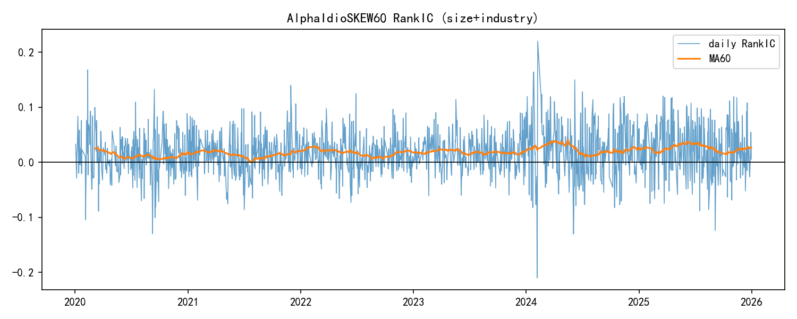

## 4.2 中性化阶梯（Headline AlphaIdioSKEW60）

| 步骤 | RankIC | ICIR | 正IC占比 | HL年化 | HL Sharpe | MDD | 日换手 | Mono corr |
|---|---:|---:|---:|---:|---:|---:|---:|---:|
| raw | 2.03% | 4.94 | 62.8% | 16.01% | 1.81 | −12.4% | 0.30 | 0.91 |
| size | 2.03% | 5.79 | 63.3% | 15.92% | 2.28 | −4.6% | 0.30 | 0.92 |
| industry | 1.89% | 5.79 | 66.2% | 15.22% | 1.95 | −11.4% | 0.31 | 0.95 |
| **size+industry** | **1.88%** | **7.10** | **68.1%** | **14.60%** | **2.48** | **−5.14%** | 0.31 | **0.93** |

相对 raw：size+industry 的 RankIC 保留约 **92%**，ICIR 提升至 **1.44×**。说明预测力未被市值/行业吸干，波动下降带来 ICIR 上升。

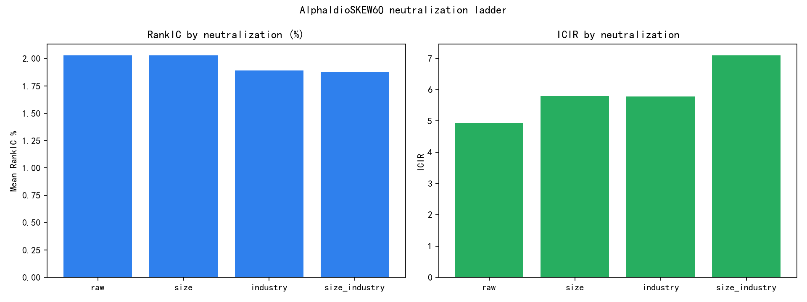

## 4.3 年度稳定性

| 年份 | AlphaIdioSKEW60 RankIC | ICIR | 正IC占比 |
|---:|---:|---:|---:|
| 2020 | 1.35% | 3.56 | 59.1% |
| 2021 | 1.67% | 5.43 | 60.1% |
| 2022 | 1.70% | 5.96 | 66.1% |
| 2023 | 1.77% | 4.97 | 61.2% |
| 2024 | 2.71% | 4.43 | 62.4% |
| 2025 | 2.98% | 6.89 | 67.9% |

六年 RankIC 全为正。

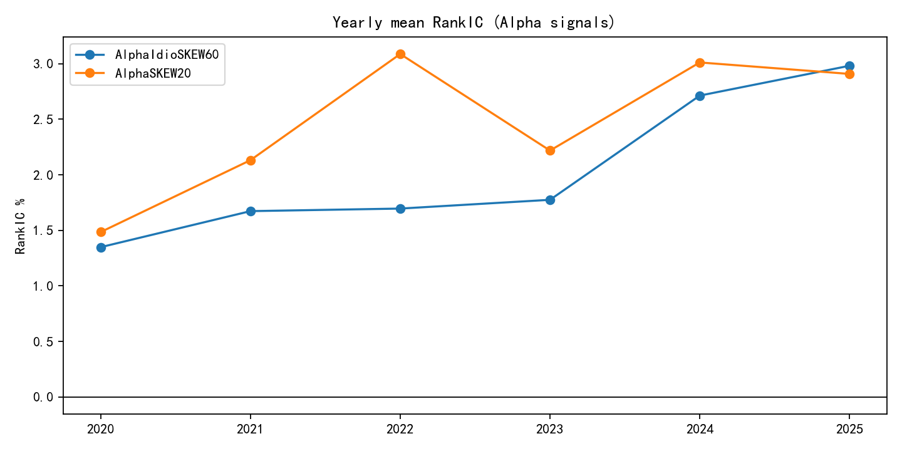

## 4.4 股票池分层（raw AlphaIdioSKEW60）

| Universe | RankIC | ICIR | HL Sharpe | HL 年化 |
|---|---:|---:|---:|---:|
| CSI300 | 1.65% | 2.32 | 0.87 | 10.9% |
| CSI500 | 1.23% | 2.23 | 0.40 | 4.1% |
| CSI1000 | 1.44% | 3.29 | 1.32 | 11.7% |
| **ALL** | **2.03%** | **4.94** | **1.81** | **16.0%** |

结论依赖广义全市场 / 中小票覆盖；不可直接当作 CSI300 指数增强结论。

## 4.5 窗口敏感性（预注册，不做挑窗）

| 因子 | RankIC | ICIR | 正IC占比 |
|---|---:|---:|---:|
| AlphaSKEW20 | 1.99% | 4.03 | 60.6% |
| AlphaSKEW60 | 2.13% | 4.04 | 62.0% |
| AlphaSKEW120 | 1.92% | 3.70 | 61.6% |
| **AlphaIdioSKEW60** | 1.64% | **4.11** | 60.4% |
| AlphaIdioSKEW120 | 1.45% | 3.62 | 59.7% |

Idio 60 日仍是预注册 headline；120 日略弱但不翻号。

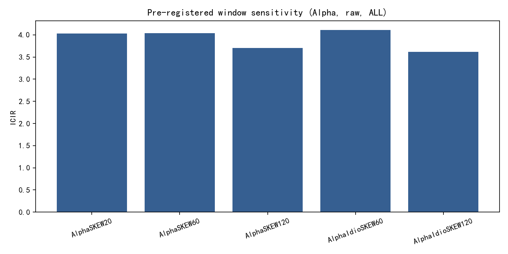

---

# 5. Quantile Portfolio（size+industry）

每日按 Alpha 十分组，等权，`signal_shift=1`，交易掩码后次日 C2C。

| 分组 | 年化收益 | Sharpe | 最大回撤 | 含义 |
|---|---:|---:|---:|---|
| G1 | 2.92% | 0.12 | −52.0% | 低 Alpha = 高正偏 |
| G2 | 7.73% | 0.32 | −44.0% | |
| G3 | 11.35% | 0.47 | −39.1% | |
| G4 | 12.21% | 0.50 | −35.1% | |
| G5 | 13.17% | 0.54 | −34.3% | |
| G6 | 13.77% | 0.56 | −34.1% | |
| G7 | 13.89% | 0.57 | −34.9% | |
| G8 | 16.09% | 0.66 | −31.9% | |
| G9 | 18.68% | 0.77 | −31.5% | |
| G10 | 17.52% | 0.73 | −36.3% | 高 Alpha = 低偏 / 负偏 |
| **H−L** | **14.60%** | **2.48** | **−5.14%** | G10−G1 |

单调性相关约 **0.93**（G9 略高于 G10，尾部非完美线性，但不破坏整体排序）。

---

# 6. Mechanism & Orthogonality

## 6.1 彩票效应代理相关（raw SKEW20）

| vs | 日均截面 Spearman |
|---|---:|
| MAX_return_20d | **0.575** |
| volatility_20d | 0.229 |
| positive_tail_frequency | 0.267 |
| negative_tail_frequency | −0.176 |

高偏度股票伴随更多极端上涨事件，符合彩票偏好叙事。

## 6.2 与 TGD20

| 指标 | 值 |
|---|---:|
| 日均 CS Spearman(AlphaIdioSKEW60, TGD20) | **0.122** |
| TGD_high 内 SKEW spread Sharpe | **1.65** |
| TGD_low 内 SKEW spread Sharpe | 0.30 |

低相关支持“分布形状 vs 到达时点”分层；条件溢价显示两者有交互，**不支持无脑 50/50 等权**，应做增量 IC / 约束权重（P2）。

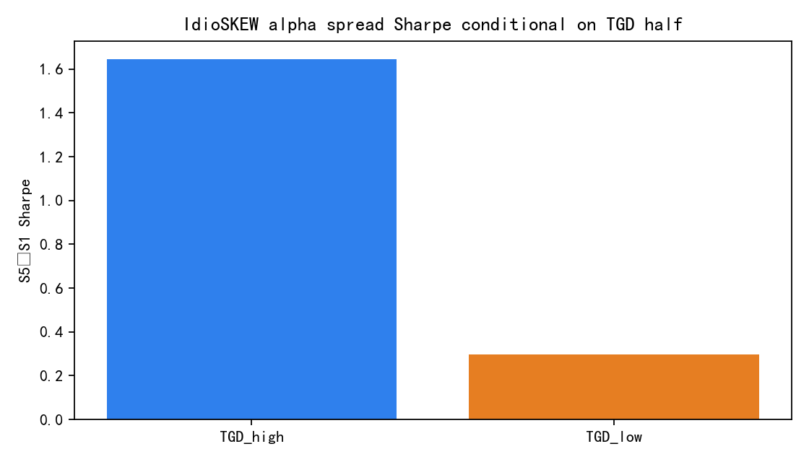

---

# 7. SKEW v2：机制纯化实验（更新）

优先级：**不做分钟 RSKEW**；先测 Vol-neutral / TailSKEW / MAX⊥ / TGD⊥ / MAD。  
代码：`core/factors/skew/skew_v2.py` · Runner：`run_skew_v2_optimization.py`  
表：`data/analysis/v2_ic_improvement_attribution.csv`

## 7.1 设计动机

经典 rolling SKEW 混合了：

`SKEW ≈ Tail asymmetry + Volatility scale + Extreme upside (MAX)`

v2 问的不是“换个窗口能不能更高”，而是：

> 去掉 VOL / MAX / TGD 重叠后，还剩多少可交易 alpha？

## 7.2 size+industry 对照（HL Sharpe 排序）

| 变体 | RankIC | ICIR | HL Sharpe | ΔSharpe vs baseline | 解读 |
|---|---:|---:|---:|---:|---|
| **AlphaIdioSKEW60_MAD** | 1.90% | **7.23** | **2.53** | **+0.05** | 唯一小幅增益；推荐预处理 |
| AlphaIdioSKEW60（baseline） | 1.88% | 7.10 | 2.48 | 0 | 冻结公式 |
| AlphaVolResid_IdioSKEW60 | 1.38% | 5.40 | 1.96 | −0.52 | 去波动后仍存活，但变弱 |
| AlphaTGDResid_IdioSKEW60 | 1.24% | 4.96 | 1.42 | −1.06 | 有独立残差，不够当 headline |
| AlphaVolAdj_IdioSKEW60 | 0.67% | 2.80 | 1.25 | −1.23 | 比值缩放损失信息 |
| AlphaTailSKEW60 | 0.60% | 1.48 | 0.64 | −1.84 | 尾部分解单独不够强 |
| AlphaMaxResid_IdioSKEW60 | 0.10% | 0.42 | 0.51 | −1.98 | **几乎被 MAX 吸干** |
| AlphaVolMaxResid / +TGD | ~0.5–0.6% | ~2–3 | ~0.46–0.49 | ≈−2.0 | 过度正交 → 信号坍塌 |

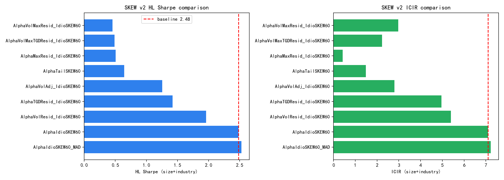

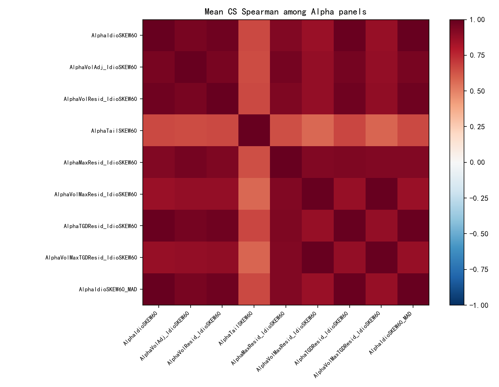

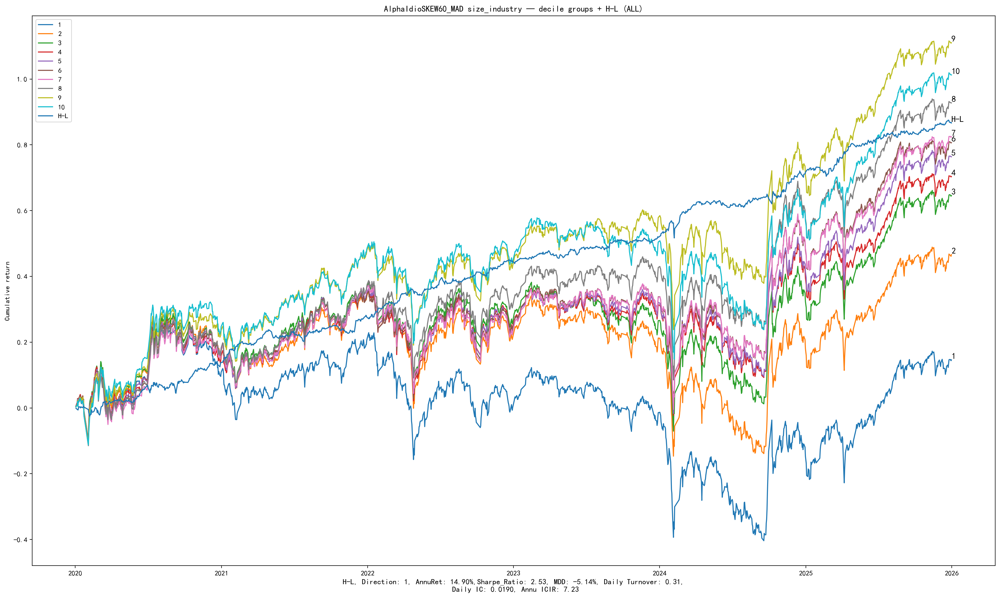

## 7.3 机制归因（为什么“提纯”会变差）

| 观察 | 含义 |
|---|---|
| `SKEW ⊥ MAX` 后 IC≈0 | A 股 SKEW 的可预测部分 **largely IS lottery/MAX channel** |
| `SKEW ⊥ VOL` 后 Sharpe 仍 1.96 | 有一部分非纯波动，但波动缩放仍贡献绩效 |
| `SKEW ⊥ TGD` 后 Sharpe 1.42 | 与时点因子有重叠，但仍剩可交易残差 → **组合层正交** |
| MAD ΔSharpe +0.05 | 极端点有噪声，但不是主矛盾 |

因此正确叙事是：

> We decompose the return-distribution anomaly into **temporal concentration (TGD20)**, **lottery skewness (SKEW)**, and **extreme upside preference (MAX)**.  
> Residualizing SKEW on MAX **destroys** standalone performance — confirming mechanism overlap, not an independent residual alpha to promote under the same id.

## 7.4 生产建议（v2 后）

| 层级 | 做法 |
|---|---|
| 公式 id | 仍冻结 `IdioSKEW60` / `Alpha = −SKEW` |
| 预处理 | **启用截面 MAD（n=5）** |
| 中性化 | size+industry（headline） |
| 与 MAX | 同层并列因子 / 组合约束，**不要**用 `SKEW⊥MAX` 替换 SKEW |
| 与 TGD20 | 组合层 `SKEW⊥TGD` 或约束权重；单因子替换不做 |
| 分钟 RSKEW | 仍 P3；除非能证明日频已饱和且高频带来独立 IC |

---

# 7b. SKEW v3：单因子再优化（horizon + EWMA）

在**不做 TGD 正交 / 不做分钟**前提下，对 v2 最优 `AlphaIdioSKEW60_MAD` 继续试：  
代码：`core/factors/skew/ewma_skew.py` · Runner：`run_skew_v3_horizon_ewma.py`  
表：`data/analysis/v3_horizon_sweep.csv` · `v3_ewma_sweep.csv`

## 7b.1 方向一：预测窗口 H ∈ {1,2,3,5,10}

设定：信号仍 `signal.shift(1)`；标签为未来 H 日累计收益；Sharpe / ICIR 年化用 **`periods_per_year = 250/H`**（避免重叠多日收益虚增）。  
旁注列 `ICIR_√250` 为“每日一条 IC、仍按 √250 年化”的朴素口径（H>1 会偏乐观）。

| H | Mean RankIC | ICIR √250（朴素） | ICIR 250/H（公正） | HL Sharpe | HL 年化 | MDD |
|---:|---:|---:|---:|---:|---:|---:|
| **1** | 1.90% | 7.23 | **7.23** | **2.53** | **14.9%** | **−5.1%** |
| 2 | 2.10% | 8.05 | 5.70 | 2.08 | 12.8% | −7.7% |
| 3 | 2.23% | 8.69 | 5.02 | 2.00 | 11.5% | −10.8% |
| 5 | 2.46% | 9.57 | 4.28 | 1.71 | 9.7% | −21.4% |
| 10 | 2.64% | 10.11 | 3.20 | 1.25 | 7.1% | −51.9% |

**结论**：存在缓慢纠正（Mean IC 随 H↑），但**单位时间风险调整收益变差**；日频再平衡下应保持 **T+1**，不要改成 T+5 headline。

## 7b.2 方向二：窗口内 EWMA 加权偏度（窗长仍 60）

对市场模型残差施加半衰期 10 / 15 / 20 的指数权重，再算偏度；对照等权 MAD。

| 变体 | RankIC | ICIR | HL Sharpe | 日换手 | vs MAD |
|---|---:|---:|---:|---:|---|
| **AlphaIdioSKEW60_MAD** | **1.90%** | **7.23** | **2.53** | **0.31** | 基准 |
| AlphaIdioSKEW60_EWMA20_MAD | 1.86% | 7.02 | 2.38 | 0.37 | −0.15 |
| AlphaIdioSKEW60_EWMA20 | 1.84% | 6.88 | 2.35 | 0.37 | −0.18 |
| AlphaIdioSKEW60_EWMA15_MAD | 1.82% | 6.84 | 2.10 | 0.41 | −0.43 |
| AlphaIdioSKEW60_EWMA10_MAD | 1.71% | 6.37 | 1.74 | 0.50 | −0.79 |

**结论**：越强调近期，换手越高、Sharpe 越低——等权 60 日对彩票偏度更稳；**拒绝 EWMA 替换**。

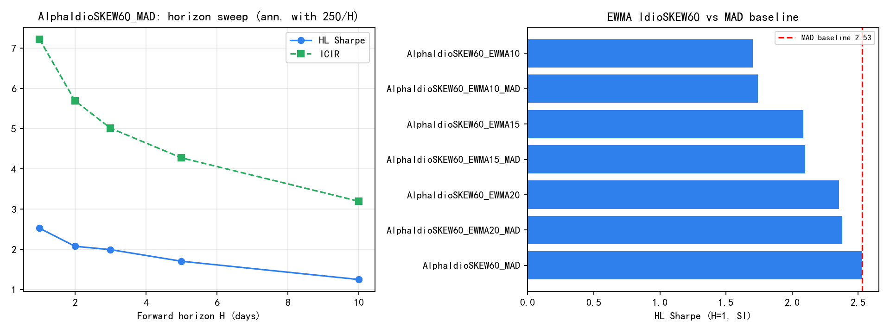

## 7b.3 v3 后的单因子收敛态（已被 v4 更新）

| 维度 | v3 当时决策 |
|---|---|
| 公式 | 等权 `IdioSKEW60` |
| 预处理 | 截面 MAD |
| 预测窗 / 加权 | T+1 / 等权 |

---

# 7c. SKEW v4：形成期 × Raw/Idio × MAD 阈值

Runner：`run_skew_v4_window_mad_scan.py`  
表：`data/analysis/v4_window_raw_idio_scan.csv` · `v4_mad_n_scan.csv`

## 7c.1 窗口扫描 + Raw vs Idio（统一 MAD n=5，SI，T+1）

| kind | window | RankIC | ICIR | HL Sharpe | 日换手 |
|---|---:|---:|---:|---:|---:|
| **Idio** | **50** | **1.97%** | **7.48** | **2.79** | 0.36 |
| Idio | 40 | 2.07% | 7.68 | 2.77 | 0.42 |
| Idio | 60 | 1.90% | 7.23 | 2.53 | 0.31 |
| Idio | 75 | 1.81% | 6.86 | 2.35 | 0.27 |
| Raw | 40 | 2.39% | 6.82 | 2.24 | 0.43 |
| Idio | 90 | 1.74% | 6.64 | 2.19 | 0.24 |
| Raw | 60 | 2.28% | 6.37 | 2.11 | 0.32 |
| Raw | 50 | 2.29% | 6.44 | 2.11 | 0.37 |
| Raw | 90 / 75 | ~2.2% | ~6.1 | ~2.0 | 0.24–0.27 |

**结论**

1. **Idio 在全部窗口上 HL Sharpe 优于 Raw**（Raw 的 Mean IC 有时更高，但 IC 波动更大 → ICIR/Sharpe 更差）。  
2. **形成期并非 60 最优**：50（及接近的 40）明显更强；75/90 偏钝。  
3. 相对原冻结 `Idio60_MAD`，`Idio50_MAD` ΔSharpe **+0.26**；换手从 0.31 → 0.36（可接受）。  
4. 披露：原预注册集为 {20,60,120}；本轮是**显式网格敏感性**，不是从三窗里事后偷换。研究 headline **更新为 50**；60 保留为审计锚点。

## 7c.2 MAD 阈值 n ∈ {3.5, 4, 5, 6, 7}

| 对象 | 最优 n | HL Sharpe | vs n=5 |
|---|---:|---:|---|
| Idio60 | 5 | 2.53 | — |
| Idio50 | **4** | **2.81** | +0.02 vs n=5 的 2.79 |

Idio50 上各 n 的 Sharpe 落在 **2.79–2.81**，几乎平坦 → **生产仍用 n=5**（避免为 +0.02 过拟合阈值）。

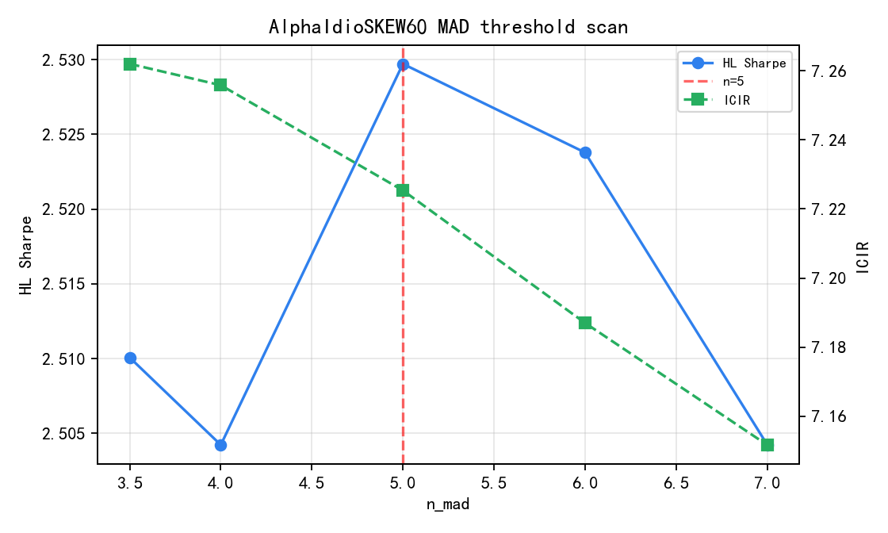

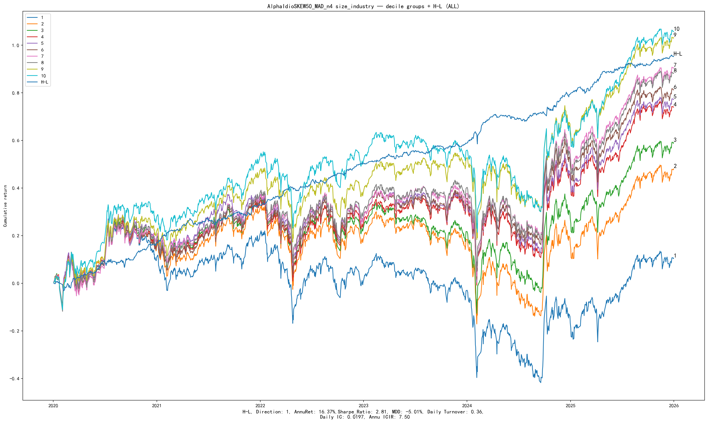

## 7c.3 v4 后单因子收敛态

| 维度 | 决策 |
|---|---|
| 研究最优公式 | **等权 `IdioSKEW50`** |
| 审计锚点 | `IdioSKEW60`（原预注册） |
| 预处理 | 截面 MAD **n=5** |
| 预测窗 / 加权 | **T+1** / **等权** |
| Raw vs Idio | **Idio 全胜** |
| 仍不做 | 分钟 RSKEW；多因子合成（本轮） |

---

# 8. 数据预处理说明（已更新）

本复现**实际执行**的处理：

1. **可交易过滤**：形成日 `not_limit` / `not_st` / `trade_status`  
2. **截面标准化**：`cs_zscore` 用于分组回测  
3. **中性化**：流通市值 log、中信行业 demean，以及二者联合残差  
4. **MAD**：v2 已测；`AlphaIdioSKEW60_MAD` 小幅优于 raw，**建议生产默认开启**

| 步骤 | 状态 | 结果 |
|---|---|---|
| 交易掩码 | 是 | 与 `groupTest` 口径一致 |
| 市值+行业 | 是（headline） | 保留 |
| MAD 去极值 n=5 | **建议开启** | 阈值不敏感（3.5–7 平坦） |
| 形成期 | **研究更新 50** | Idio50_MAD Sharpe 2.79 vs Idio60_MAD 2.53 |
| Vol/MAX/EWMA/H>1 | 已测，拒绝 | — |

---

# 9. Findings

1. **Idio > Raw**：全窗口成立。  
2. **形成期**：50（及 40）优于原冻结 60；研究 headline → `AlphaIdioSKEW50_MAD`（Sharpe **2.79**）。  
3. **MAD n**：平坦；保持 n=5。  
4. **v2/v3 否定项仍成立**：Vol/MAX 残差、EWMA、H>1 不做 headline。  
5. **单因子收敛充分**：再拧估计器的边际收益有限。  
6. **TGD 相关约 0.12**：组合增量是下一层故事。

---

# 10. Do not / Next

**Do not**

- 从预注册 {20,60,120} 暗中挑窗却不披露网格  
- 为 MAD n=4 的 +0.02 过拟合阈值  
- 用 EWMA / Vol⊥ / MAX⊥ / H>1 替换  
- 本轮做多因子合成或分钟 RSKEW  

**Next**

1. 生产/交付对齐：`IdioSKEW50` + MAD(n=5) + SI + T+1；60 作对照卡保留  
2. 可选：对 Idio50 补 exact long-book excess（对齐 METRICS_G10_EXCESS）  
3. 若继续抬升：组合层 TGD20 + SKEW（目标组合 IR）  
4. 分钟 RSKEW 仍最后  

---

# 11. 附录：路径

| 模块 | 路径 |
|---|---|
| 公式 | `core/factors/skew/`（`skew.py` / `idio_skew.py` / `skew_v2.py` / `ewma_skew.py`） |
| Spec | `factor_specs/SKEW.yaml` |
| Runner v1–v4 | `run_skew_validation_v1.py` · `run_skew_v2_optimization.py` · `run_skew_v3_horizon_ewma.py` · `run_skew_v4_window_mad_scan.py` |
| Pack | `research/reports/factors/SKEW/`（`v2/` `v3/` `v4/`） |
| 本报告 MD/HTML | `research_delivery/SKEW_research_package/report/` |
| 分析表 | `research_delivery/SKEW_research_package/data/analysis/` |
