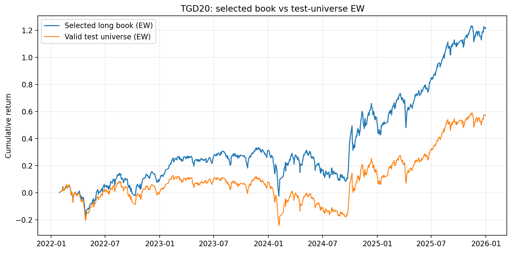
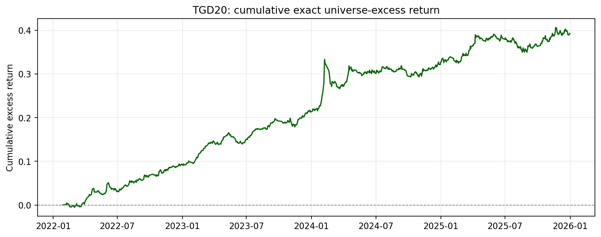

# TGD20 selected bundle

TGD20 is a selected, validated temporal-microstructure factor.

- Exact identity and direction: [`factor.yaml`](factor.yaml)
- Complete workflow and artifact map: [`workflow.yaml`](workflow.yaml)
- Complete standalone package: `research_delivery/TGD20_research_package/`
- Buy-side research report:
  `research_delivery/TGD20_research_package/report/TGD20_买方因子研究报告.md`
- Canonical Pack: `research/reports/factors/TGD20/`

This selected bundle remains a compact pointer. The standalone package contains
code snapshots, canonical caches, all validation artifacts, new diagnostics,
plots, report, and a SHA256 source manifest.

## Exact market-relative result (size/industry neutralized)

- Group10 excess Sharpe: **2.16**
- Excess annual return: **8.81%**
- Excess MDD: **−5.04%**

