# TGD20 Factor Research Report

> 日内收益时点残差因子｜Junior QR / Quant Intern 交付版  
> 作者：量化研究实习生工作产出｜报告日期：2026-07-22  
> 公式状态：冻结｜样本：确认窗口 2022-01-28 → 2025-12-31（951 日）  
> 文档定位：**研究尽职调查（research due diligence）**，不是投委会立项决议

---

# 0. Executive Summary

TGD20 是一个基于分钟收益**发生时点结构**的横截面候选 alpha。本报告复现开源证券《日内分钟收益率的时序特征》核心思路，并在 A 股全市场确认样本上做 IC、分组、独立性、成本与稳健性检验。

### 主要发现

1. **有稳定的截面预测力**：raw RankIC 4.32%、ICIR 6.99；size+industry 后 RankIC 4.17%、ICIR 11.29，正 IC 占比 76.9%。
2. **不是单纯规模/行业收益**：中性化后 ICIR 上升、H-L 回撤下降；十分组单调性约 0.988。
3. **不是简单当日收益或隔日反转**：对当日收益 / 前日收益做截面正交后，RankIC 保留 98.8% / 99.6%。
4. **与 adapted APM 有重叠但不等价**：日均截面相关 0.411；TGD20 对 `APM_SessionResidual` 正交后仍保留 77.0% RankIC、ICIR 8.16。
5. **与低波有明显重叠**：逐步剥离 Momentum20、Volatility20、Liquidity 后，RankIC 从 4.17% 降至 0.97%；因此不能宣称“完全独立 temporal alpha”。
6. **跨行业为正但强弱不均**：29 个中信一级行业 RankIC 均为正，钢铁最低 2.24%、房地产最高 5.33%；G10 平均超配机械和基础化工。
7. **可交易性有约束**：形成日过滤后次日 C2C 费前 Sharpe 2.69，但 close-T 到 open-(T+1) 的 O2O 时点诊断仅 0.95；在每日约 0.36 换手及 15bp 成本下净值为负。

### 研究结论（非投决）

> **研究状态：Candidate Alpha。**  
> 证据支持进入 alpha library 做组合层集成测试；在完整可成交过滤、真实滑点与风格约束完成前，不建议直接配置生产资金。

---

# 1. Research Motivation

传统量价因子主要回答：

> 价格/成交量 **变化了多少**（magnitude）

较少系统回答：

> 这些变化 **发生在一天的什么时点**（timing）

分钟收益序列同时包含幅度信息与时序信息。研报主张：在剥离正常收益结构后，**下跌时点残差**仍可能携带次日横截面信息。TGD20 正是对该主张的复现与压力测试。

本报告关心的不是“夏普够不够高”，而是四个问题：

1. 信号是否稳定可复现？  
2. 是否只是已知风格的马甲？  
3. 在什么环境有效 / 失效？  
4. 扣成本后是否仍有研究价值？

---

# 2. Factor Definition & Construction

## 2.1 一句话定义

> TGD20 = 控制收益幅度与开盘结构后，下跌时点残差相对上涨时点残差的截面创新，再做 20 日平滑。

它**不是** \(G_d-G_u\)，也不是 \(|G_d-G_u|\)。

## 2.2 数学公式

连续竞价分钟索引（跳过午休）：

\[
t\in\{0,\ldots,239\},\qquad r_{i,t}=\frac{P_{i,t}}{P_{i,t-1}}-1
\]

上涨 / 下跌时间重心：

\[
G_{u,i}=
\frac{\sum_{r_{i,t}>0}t\,r_{i,t}}
{\sum_{r_{i,t}>0}r_{i,t}},
\qquad
G_{d,i}=
\frac{\sum_{r_{i,t}<0}t\,|r_{i,t}|}
{\sum_{r_{i,t}<0}|r_{i,t}|}
\]

每日截面控制条件上涨/下跌均值、开盘前两个半小时收益与隔夜收益，得到 \(\varepsilon_u,\varepsilon_d\)；再做：

\[
\varepsilon_{d,i}=\alpha+\beta\varepsilon_{u,i}+e_i
\]

\[
\mathrm{TGD20}_{i,T}=\frac{1}{20}\sum_{k=0}^{19}e_{i,T-k}
\]

交易时点强制 `signal_shift=1`：当日完整分钟数据只预测下一交易日。


## 2.3 机制拆解（为何不是随便一个时间差）

| 候选表达 | RankICIR | 结果 |
|---|---:|---|
| \(G_d-G_u\)，MA20 | −0.56 | 简单时间差无效 |
| \(|G_d-G_u|\)，MA20 | −2.26 | 绝对距离无效 |
| 未平滑 \(\varepsilon_u\) | 1.62 | 上涨时点非主通道 |
| 未平滑 \(\varepsilon_d\) | 5.80 | 下跌时点是主通道 |
| 未平滑 `tgd_eps` | 8.53 | 预测强但日换手约 3.45 |
| **TGD20** | **6.98 raw / 11.29 SI** | 平滑后进入可研究区间 |

这组结果支持“残差化下跌时点”而非“任意时点差”。经济叙事（尾盘知情抛售等）目前没有逐笔证据，本报告只将其视为假说，不作已验证结论。

## 2.4 与原研报的差异说明

| 项目 | 本复现口径 |
|---|---|
| 核心身份 | `MA20(CS residual of εd on εu)`，公式冻结 |
| 正式确认样本 | 2022-01-28 起（分钟 Gu/Gd 血缘覆盖约束） |
| 收益 | Wind 复权 C2C，`Close/PreClose-1` |
| 生产 Dual Benchmark | 尚未重跑；本报告为 legacy harvest + 买方诊断 |
| ST/涨跌停/停牌 | 已补形成日与事后执行日过滤诊断；尚无受阻订单状态回放 |

---

# 3. Data & Methodology

| 项目 | 口径 |
|---|---|
| 分钟数据 | DolphinDB `Stock_one_minute` 连续竞价 Close |
| 日收益 | Wind EOD 复权 C2C |
| 市值 / 行业 | 流通市值、中信历史行业 |
| 股票池 | 全 A（0/3/6）；补充 CSI300/500/1000 历史动态成分 |
| 确认样本 | 2022-01-28 → 2025-12-31，951 交易日 |
| 稳定性样本 | 2020–2025 年 RankIC |
| 年化天数 | 250 |
| 信号滞后 | `signal_shift=1` |

已知限制：EOD turnover 字段不可用，历史可投资性层用 `amount/float_mktcap` 代理；组合换手来自权重变化。

---

# 4. Signal Evaluation

## 4.1 RankIC / ICIR / 胜率

| 模式 | Mean RankIC | ICIR | 正 IC 占比 | t 值 | 天数 |
|---|---:|---:|---:|---:|---:|
| Raw | 4.32% | 6.99 | 69.6% | 13.63 | 950 |
| Size+industry | **4.17%** | **11.29** | **76.9%** | 22.01 | 950 |

Size+industry 后平均 IC 略降，但 IC 波动显著下降，因此 ICIR 上升。这是“预测力更干净”，不是“预测力更强”的同义反复。

## 4.2 滚动 IC（时效性）

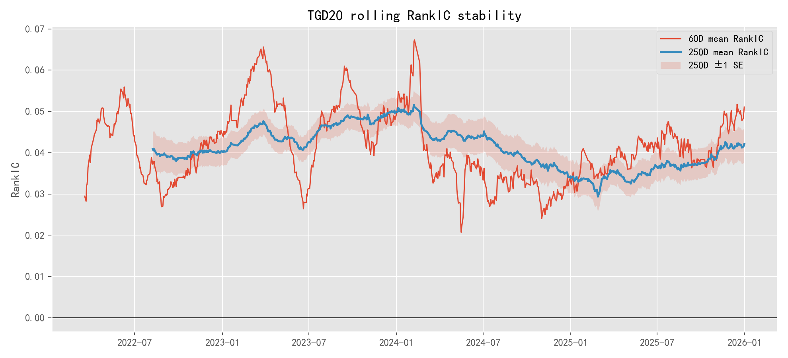

图中同时给出 60 日与 250 日滚动 RankIC，并对 250 日均值附加 ±1 标准误带。大部分时间位于零轴上方；2024–2025 年均值仍为正但走弱。这支持“样本内有效、近期边际衰减”，不支持“稳定性没有变化”。

## 4.3 IC 衰减 / 持有期

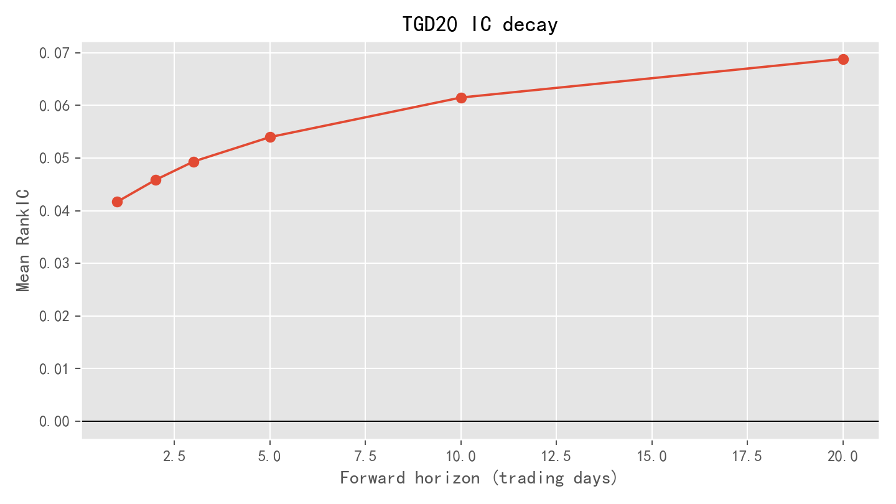

| 预测期 | Mean RankIC | 相对 1 日保留 |
|---:|---:|---:|
| 1D | 4.17% | 100% |
| 5D | 5.40% | 130% |
| 10D | 6.15% | 148% |
| 20D | 6.88% | 165% |

20 日内累计 RankIC 继续上升，说明信息寿命至少覆盖中频持有期。注意：累计收益高度重叠，不能把多期 t 值当作独立样本统计量。执行层上，every-5d / buffer 比纯日频更合理。

## 4.4 十分组与 H-L（`groupTest` 原生输出）

`Factor_Dev_Lib.groupTest` 原生只产两张图：累计曲线与均值柱状图。以下为 raw、`shift=1`、全 A 确认样本。

### 图一：十分组 + H-L 累计收益


H-L 年化 36.87%、Sharpe 2.77、MDD −18.99%、日换手 0.65、RankIC 4.30%、ICIR 6.98。该图是各组日收益的**算术累计和**，不是复利净值；高换手下费前曲线不能直接代表可交易收益。

### 图二：十分组平均日收益


Group1 约 −0.05%/日，Group10 约 +0.10%/日，整体随排序上升。Group7 略低于 Group6，因此表述为“高单调性（0.988）但存在局部扰动”，不宜写成“严格逐组递增”。

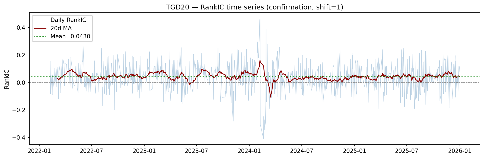

---

# 5. Robustness

## 5.1 风险中性化瀑布

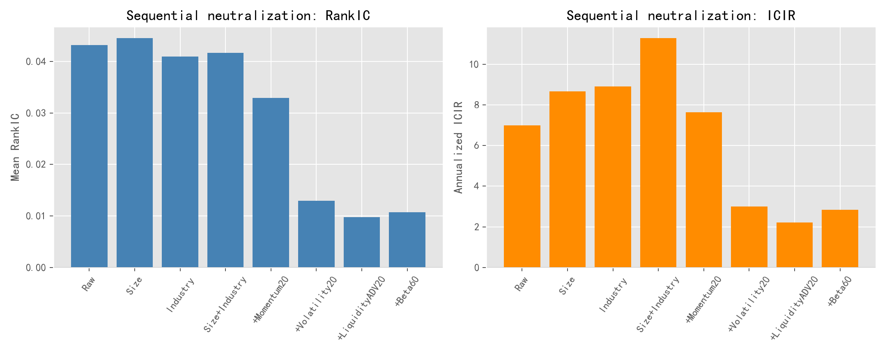

| 顺序处理 | RankIC | ICIR | 正 IC 占比 |
|---|---:|---:|---:|
| Raw | 4.32% | 6.99 | 69.6% |
| Size | 4.45% | 8.68 | 72.2% |
| Industry | 4.09% | 8.91 | 74.9% |
| Size+industry | 4.17% | **11.29** | **76.9%** |
| +Momentum20 | 3.29% | 7.64 | 69.1% |
| +Volatility20 | 1.29% | 3.00 | 58.1% |
| +LiquidityADV20 | 0.97% | 2.22 | 56.0% |
| +Beta60 | 1.07% | 2.84 | 55.6% |

Size+industry 后 ICIR 上升，说明规模和行业配置不是主要来源；但加入动量、波动率和流动性后 IC 大幅收缩。该“顺序瀑布”依赖控制变量加入顺序，不应解读为唯一的因果分解。

## 5.2 纯多头相对精确股票池等权

Headline 超额定义：

\[
r^{excess}_t=r^{G10}_t-\frac{1}{N_t}\sum_{i\in U_t,valid}r_{i,t}
\]

| 实现 | Excess Sharpe | 年化超额 | 最大超额回撤 |
|---|---:|---:|---:|
| Raw G10 | 1.24 | 9.29% | −13.08% |
| Size+industry G10 | **2.16** | **8.81%** | **−5.04%** |
| Industry-matched G10 | 2.08 | 8.54% | −5.73% |

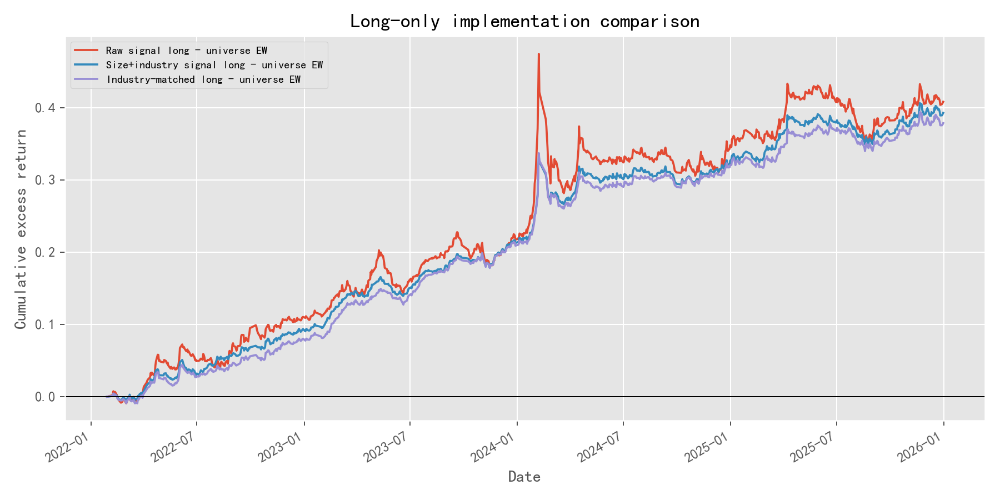

Size+industry G10 的市场 \(\beta\) 约 0.943；剥离市场后残差 Sharpe 约 2.53。说明纯多头仍有接近 1 的市场暴露，横截面 alpha 需要在组合层单独管理。

## 5.3 分年度

| 年度 | SI 年化超额 | Excess Sharpe | 最大回撤 |
|---:|---:|---:|---:|
| 2022* | 10.10% | 3.03 | −1.98% |
| 2023 | 10.72% | 3.88 | −2.22% |
| 2024 | 9.43% | 1.68 | −5.04% |
| 2025 | 5.09% | 1.27 | −2.98% |

\* 2022 从 1 月 28 日起。2024–2025 仍为正，但强度下降；这是需要持续跟踪的衰减信号。

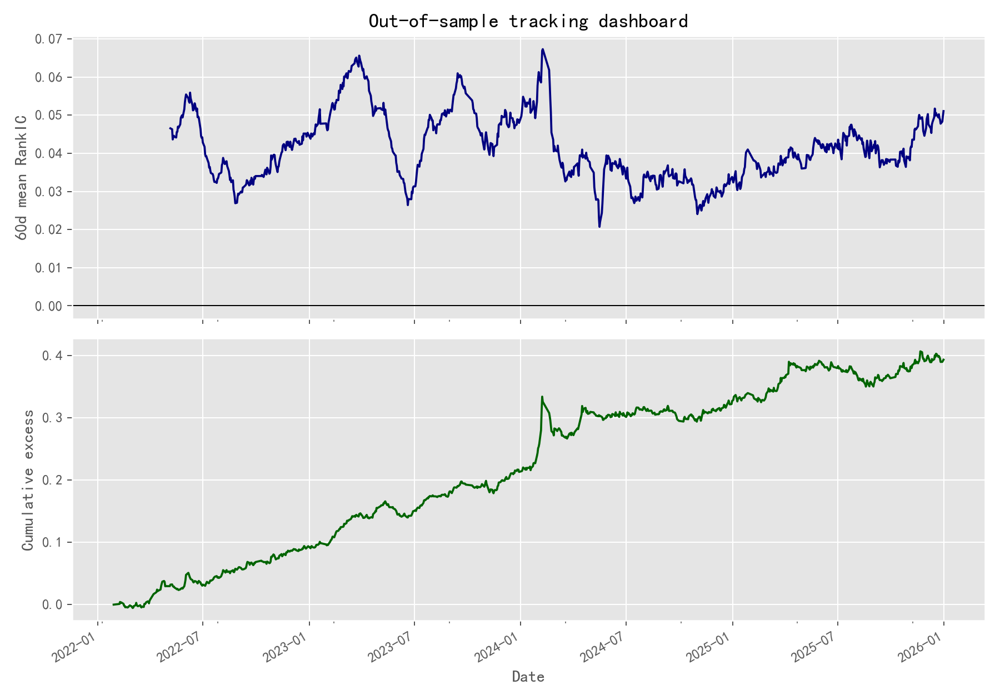

年 RankIC（稳定性样本，raw）：2020–2025 全部为正，2024 最低（3.17%）。

## 5.4 分股票池

| 股票池 | Excess Sharpe | 年化超额 | 最大回撤 | 平均持仓 |
|---|---:|---:|---:|---:|
| CSI300 | 1.20 | 8.48% | −11.39% | 30 |
| **CSI500** | **1.73** | **9.47%** | −6.55% | 50 |
| CSI1000 | 1.46 | 7.45% | **−4.93%** | 98 |

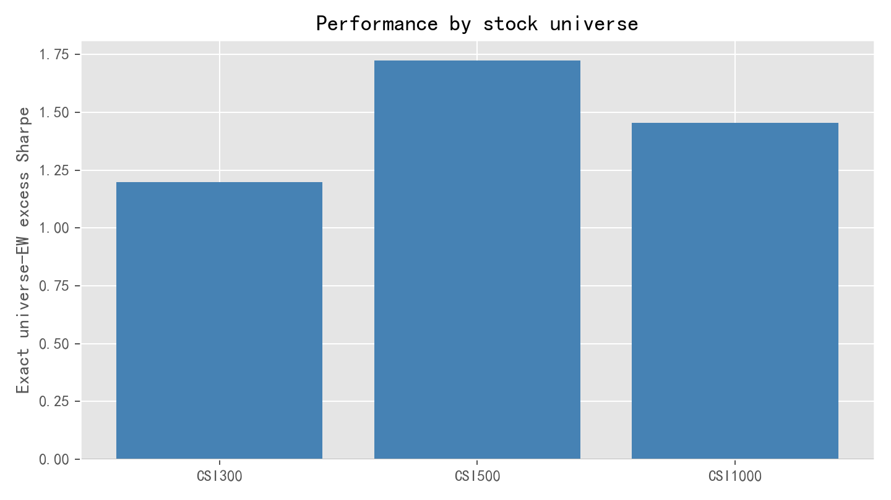

初步观察：中盘（CSI500）风险收益比最好；大盘池更弱、回撤更大。分钟时序差异在大票上可能被稀释。

## 5.5 市场状态

| 状态 | 天数 | Excess Sharpe | 年化超额 |
|---|---:|---:|---:|
| Bear | 117 | 2.34 | 17.11% |
| Bull | 234 | 1.28 | 4.44% |
| Sideways | 599 | 2.66 | 8.89% |
| High vol | 468 | 1.98 | 9.72% |
| Low vol | 482 | 2.60 | 7.91% |

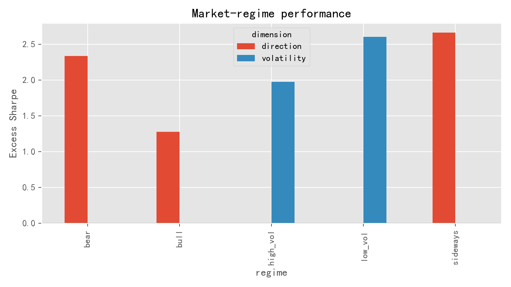

震荡 / 下跌 / 低波更强，单边上涨最弱。Bear 仅 117 日，不宜过度外推。

## 5.6 行业内 IC 与 G10 行业偏离

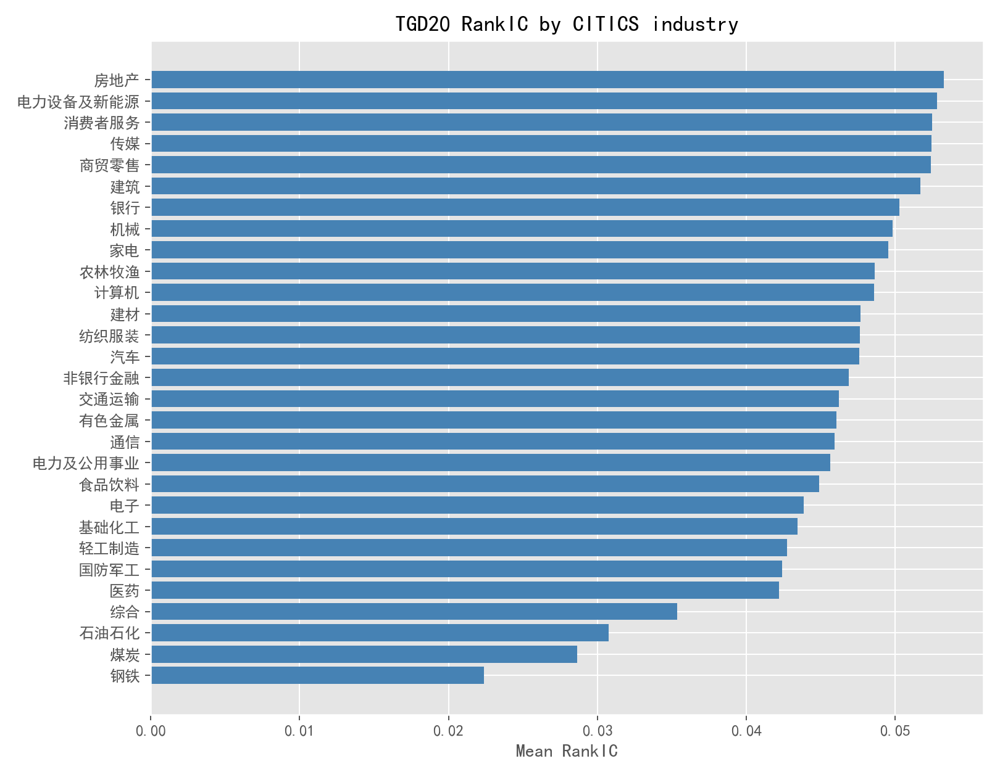

29 个中信一级行业的平均 RankIC 均为正，但离散度明显：钢铁 2.24%、煤炭 2.86%、石油石化 3.07% 位于低端；房地产 5.33%、电力设备及新能源 5.28%、消费者服务 5.25% 位于高端。小行业的 ICIR 受样本数量影响，不能只按点估计排序。

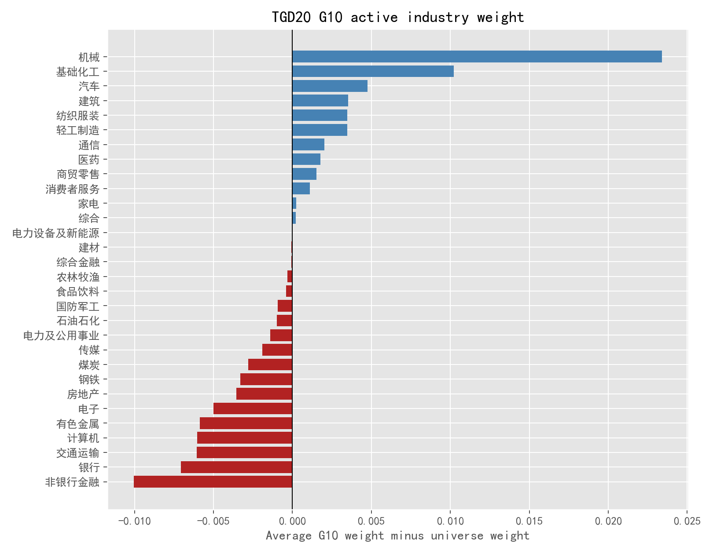

未经行业匹配的 G10 平均超配机械约 2.34pct、基础化工约 1.02pct，低配非银行金融约 1.00pct、银行约 0.71pct。因而 raw G10 的一部分收益可能来自行业选择；正式产品回测应优先采用 size+industry 或 industry-matched 组合。

## 5.7 MA 窗口敏感性

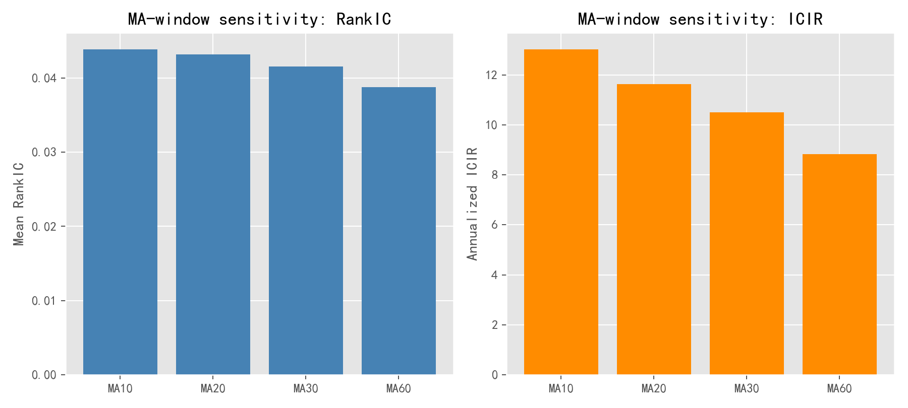

| 窗口 | RankIC | ICIR | 正 IC 占比 |
|---:|---:|---:|---:|
| MA10 | 4.39% | 13.03 | 80.8% |
| **MA20（冻结）** | **4.32%** | **11.64** | **77.1%** |
| MA30 | 4.16% | 10.51 | 74.9% |
| MA60 | 3.88% | 8.83 | 71.8% |

邻近窗口均保持正 IC，支持信号不是单一参数点偶然；MA10 在同一样本上更高，不构成改公式依据。若改用 MA10，应建立新因子 ID 并重新划分确认样本。

---

# 6. Alpha Independence

## 6.1 与风格代理的截面相关

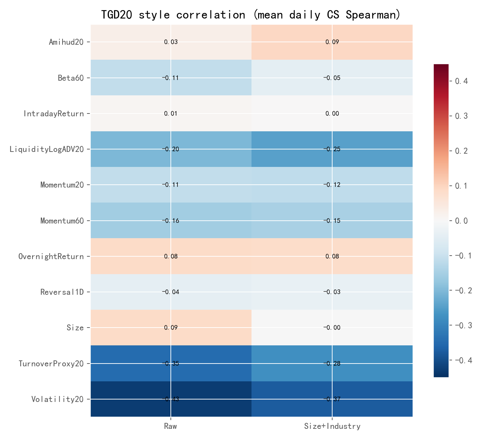

| 风格代理 | Raw corr | Size+industry corr |
|---|---:|---:|
| Size | +0.088 | −0.001 |
| Momentum20 | −0.110 | −0.115 |
| Volatility20 | **−0.426** | **−0.374** |
| log ADV20 | −0.201 | −0.246 |
| Beta60 | −0.112 | −0.045 |

规模暴露已被去掉，但低波、低流动性、反动量暴露仍显著。这是独立性章节的核心风险点。

## 6.2 残差归因：剥离已知效应后 IC 还剩多少？

方法：对 size+industry TGD20 每日做截面 OLS，分别对以下控制变量取残差，再计算次日 RankIC。

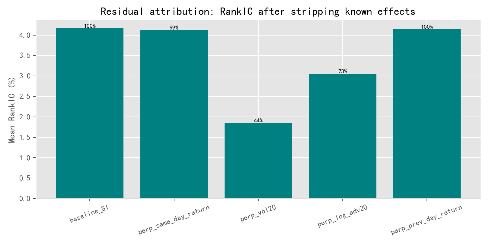

| 控制后信号 | Mean RankIC | ICIR | 正 IC 占比 | 相对 baseline 保留 |
|---|---:|---:|---:|---:|
| Baseline SI | 4.17% | 11.29 | 76.9% | 100% |
| ⊥ 当日收益 | 4.12% | 11.49 | 76.3% | **98.8%** |
| ⊥ 前日收益 | 4.15% | 11.55 | 76.4% | **99.6%** |
| ⊥ log ADV20 | 3.05% | 8.10 | 70.7% | **73.2%** |
| ⊥ Vol20 | 1.85% | 4.12 | 62.2% | **44.3%** |

### 解读

- **不是尾盘收益马甲**：剥离当日收益后几乎不衰减。  
- **不是简单隔日反转**：剥离前日收益后几乎不衰减。  
- **部分是低流动性相关**：剥离 ADV 后保留约 73%。  
- **与低波高度重叠**：剥离 Vol20 后只保留 44%。ICIR 仍 >4，说明并非“全部都是低波”，但独立性主张必须降级。

后续组合集成时，应显式约束 ResidualVolatility / Liquidity 暴露，并观察增量 IC 是否仍保留。

## 6.3 与 adapted APM / 午后收益

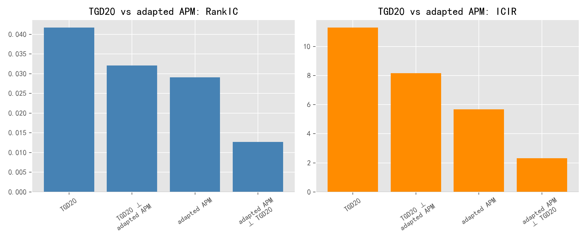

| 信号 | RankIC | ICIR | 正 IC 占比 | 相对自身保留 |
|---|---:|---:|---:|---:|
| TGD20 | 4.17% | 11.29 | 76.9% | 100% |
| TGD20 ⊥ `APM_SessionResidual` | 3.21% | 8.16 | 71.5% | **77.0%** |
| `APM_SessionResidual` | 2.91% | 5.68 | 65.6% | 100% |
| `APM_SessionResidual` ⊥ TGD20 | 1.27% | 2.33 | 56.4% | **43.7%** |

这里的 APM 是现有 `APM_SessionResidual (adapted)`：个股午后收益来自 DolphinDB 13:01–15:00 真实分钟端点，但指数腿使用 EOD `Close/Open` 日内代理，并非严格匹配的指数午后收益。两者日均截面 Spearman 相关约 0.411；TGD20 正交后保留更高，且 adapted APM 被 TGD20 解释得更多。结论应表述为“有重叠、TGD20 信息更宽”，不能外推成对原始 APM 定义的最终结论。

两类信号都使用 T 日 15:00 信息，只能评估 T+1 或更晚收益；若按 T 日收盘成交会有操作性前视。本报告的次日开盘 O2O 诊断用于约束这一问题。

## 6.4 与 FlowDensity20

TGD 与 FlowDensity 平均截面相关 0.217。TGD⊥Flow 后 ICIR 9.12（保留 81%）；Flow⊥TGD 仅保留约 35%。50/50 等权合成 ICIR 8.50，低于 TGD 单因子，故不建议机械等权。

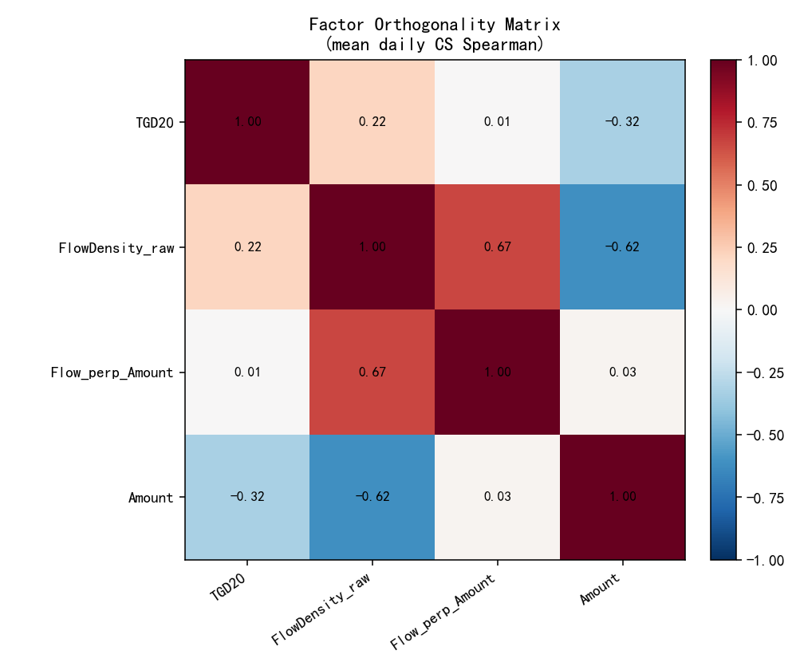

---

# 7. Trading Analysis

## 7.1 换手与成本（纯多头）

无 buffer 的 size+industry G10，平均日换手约 0.354：

| 往返成本 | Net Excess Sharpe | 年化净超额 |
|---:|---:|---:|
| 0bp | 2.160 | 8.81% |
| 5bp | 1.074 | 4.38% |
| 10bp | −0.013 | −0.05% |
| 15bp | −1.101 | −4.48% |

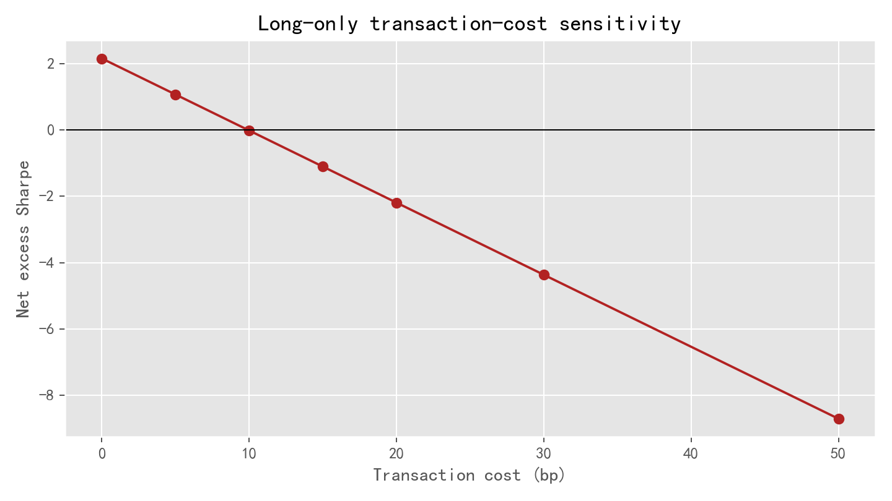

**关键结论**：无换手控制的纯多头在约 10bp 成本下研究超额基本消失。任何生产路径都必须带 buffer / 降频。

## 7.2 执行网格（多空诊断，非纯多头 headline）

| 实现 | Gross Sharpe | 日换手 | Net Sharpe@15bp |
|---|---:|---:|---:|
| Daily | 4.06 | 0.646 | 1.28 |
| Every 5d | 3.43 | 0.310 | 2.06 |
| Daily buffer 10%/30% | 3.36 | 0.217 | 2.21 |
| **Daily buffer 5%/15%** | **3.51** | **0.297** | **2.32** |

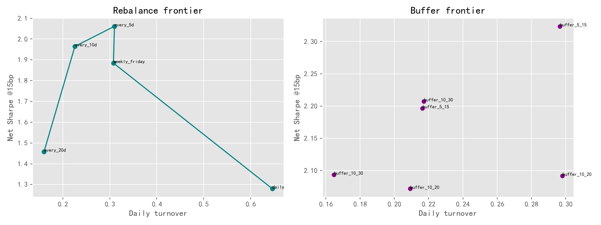

`entry 5% / exit 15%` 是历史网格最优候选，但仍是同一样本上的执行搜索，应预注册为 A/B，而不是继续调参。

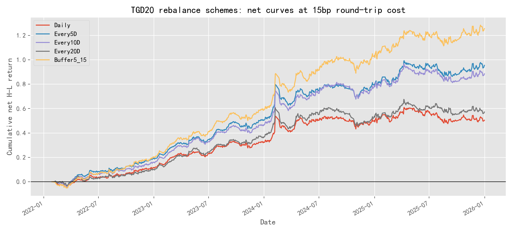

独立重算显示，15bp 假设下 every-5d 净 Sharpe 2.06、buffer 5/15 为 2.32，均高于 daily 的 1.28。该结果用于执行方案筛选，不改变因子定义。

## 7.3 可交易过滤与次日开盘时点

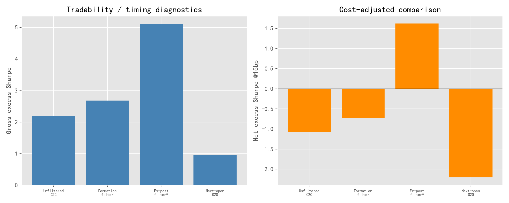

| 诊断口径 | RankIC | 费前超额 Sharpe | Net Sharpe@15bp | 覆盖率 |
|---|---:|---:|---:|---:|
| 未过滤 C2C，lag 1 | 4.18% | 2.18 | −1.08 | 100.0% |
| 形成日过滤 C2C，lag 1 | 4.38% | 2.69 | −0.72 | 91.6% |
| 事后执行日过滤 C2C，lag 1 | 4.92% | 5.11 | 1.62 | 91.5% |
| close-T → open-(T+1) O2O，lag 2 | 3.14% | **0.95** | **−2.21** | 91.6% |

“事后执行日过滤”使用收益实现日的收盘涨跌停状态，含事后信息，只用于说明结果对不可交易样本很敏感，**不能作为可实现绩效**。O2O 行严格按收盘 T 形成信号、开盘 T+1 建仓、赚取 open T+1→open T+2 收益；它是更接近真实时点的压力测试，但仍未处理买入涨停、卖出跌停、延迟成交和现金残留。

目前代码库没有完整的受阻订单回放器。生产前需要维护实际持仓与目标持仓，按买卖方向分别判断成交，并只对实际成交量计成本；不能通过简单删除不可交易股票后对其余标的重新归一化来替代。

## 7.4 容量粗估

| ADV 参与率 | AUM 中位数 | AUM 25% 分位 |
|---:|---:|---:|
| 1% | 15.25 亿 | 12.29 亿 |
| 3% | 45.75 亿 | 36.88 亿 |
| 5% | 76.25 亿 | 61.47 亿 |

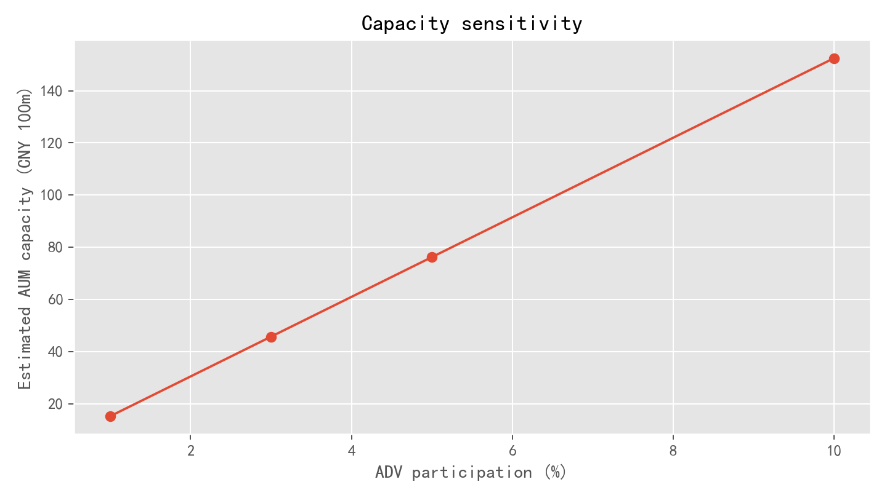

这是 ADV × 参与率 / 换手的静态筛查，不是订单簿冲击模型。保守压力测试可从约 6 亿元起步，不作容量承诺。

---

# 8. Risk Analysis

## 8.1 最差区间

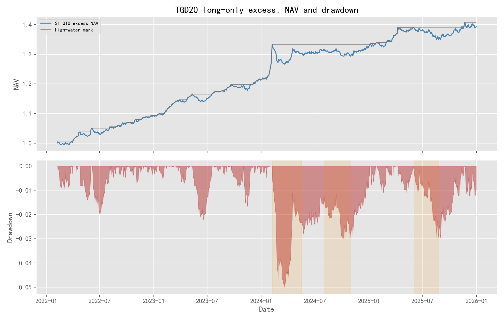

| 窗口 | 起止 | 复合超额 |
|---:|---|---:|
| 最差 20D | 2024-02-08 → 2024-03-14 | **−4.69%** |
| 次差 20D | 2025-07-23 → 2025-08-19 | −2.36% |
| 最差 60D | 2025-06-03 → 2025-08-25 | **−2.95%** |
| 最差 120D | 2025-04-09 → 2025-09-29 | **−1.77%** |

最差 20 日窗口与 2024 年回撤重合；2025 年则表现为持续时间更长、幅度较缓的衰减。窗口由同一样本事后筛选，只用于风险复盘和设定监控阈值，不能当作可预知 regime。

## 8.2 结构性风险

1. **风格风险**：低波、低流动性与反动量暴露显著；逐步剥离后 RankIC 只剩约 1%。  
2. **成本风险**：无 buffer 长多在约 10bp 失效；开盘时点诊断在 15bp 下明显为负。  
3. **样本风险**：正式确认窗口自 2022 起，未覆盖完整 2018–2025。  
4. **执行风险**：目前没有涨跌停/停牌导致的受阻订单与现金残留状态回放。  
5. **近期衰减**：2024–2025 Excess Sharpe 从 3–4 降至约 1.3–1.7。  
6. **行业偏离**：raw G10 长期超配机械、基础化工，需防止把行业选择误归因为因子。  
7. **拥挤度**：目前只有分散度 / 换手 / 滚动超额等代理指标，尚无完整同业因子拥挤网络。

### 建议监控阈值（研究跟踪用）

- 60 日 RankIC 连续 20 日 < 0  
- 120 日 exact EW Excess Sharpe < 0  
- P90−P10 连续 20 日低于历史 10% 分位附近  
- 实盘滑点超过回测假设 2 倍  

---

# 9. Conclusion & Next Steps

## 9.1 初步结论

TGD20 通过了“可复现、有 IC、有单调性、不完全是规模/行业/当日收益马甲”的初级研究门槛；但在低波重叠、成本敏感、样本覆盖和可成交回放上仍有明确缺口。

**推荐研究状态：Candidate Alpha（进入 library，做组合集成测试）。**

## 9.2 待解决问题

1. 对 ResidualVolatility / Liquidity 做正式风险模型约束后，增量 IC 还剩多少？  
2. 在完整 ST/涨跌停/停牌受阻订单回放下，Net Excess 是否仍为正？当前过滤诊断不能回答。  
3. CSI500 指增约束下，相对基准的信息比率与风格偏离如何？  
4. TGD20⊥`APM_SessionResidual (adapted)` 后的 77% RankIC，在严格匹配指数午后腿后能否保持？  
5. MA10 的样本内优势是否能在新确认样本复现？在此之前不改 MA20 冻结公式。

## 9.3 建议后续工作（按优先级）

| 优先级 | 工作 | 目的 |
|---|---|---|
| 高 | 组合层 vol/liquidity 约束 + 增量 IC | 回答“是不是低波马甲” |
| 高 | 买卖方向涨跌停 + 受阻订单状态回放 | 回答“能不能交易” |
| 中 | CSI500/1000 基准约束回测 | 产品适配 |
| 中 | 预注册 buffer 5/15 vs every-5d A/B | 固定执行方案 |
| 中 | 严格 PM 指数腿后复核 TGD20⊥APM，并更新 MA10/20 样本 | 防止代理误差与同样本选择 |
| 低 | 与 Flow 残差的 ICIR 加权合成 | 组合层增量，而非单因子调参 |

---

# Appendix

## A. 证据索引

| 内容 | 文件 |
|---|---|
| 冻结公式 | `specification/factor_specs/TGD20.yaml` |
| 数据血缘 | `data/DATA_LINEAGE.md` |
| IC 汇总 | `data/analysis/ic_summary.csv` |
| 滚动 IC | `data/analysis/rolling_ic.csv` / `figures/rolling_ic.png` |
| 残差归因 | `data/analysis/residual_attribution.csv` / `figures/residual_attribution.png` |
| 中性化瀑布 | `data/analysis/neutralization_waterfall.csv` |
| 风格暴露 | `data/analysis/style_exposure_matrix.csv` |
| 扩展风格相关 | `data/analysis/expanded_style_correlation.csv` / `figures/expanded_style_correlation.png` |
| 分行业 IC / 主动权重 | `data/analysis/industry_rank_ic.csv` / `data/analysis/g10_industry_active_weight.csv` |
| Adapted APM 正交 | `data/analysis/tgd20_apm_comparison.csv` / `figures/tgd20_apm_independence.png` |
| MA 窗口敏感性 | `data/analysis/ma_window_sensitivity.csv` |
| 最差区间 | `data/analysis/worst_excess_windows.csv` / `figures/worst_periods_drawdown.png` |
| 可交易/开盘时点 | `data/analysis/tradability_execution_summary.csv` / `figures/tradability_execution_comparison.png` |
| 成本敏感性 | `data/analysis/long_only_cost_sensitivity.csv` |
| 执行网格 | `artifacts/research/reports/tgd_v1/execution/all_experiments.csv` |
| 原复现报告 | `artifacts/research/reports/tgd_v1/日内分钟收益率时序特征_TGD20因子研究报告.md` |

## B. 复现命令

```bash
OMP_NUM_THREADS=1 OPENBLAS_NUM_THREADS=1 MKL_NUM_THREADS=1 \
/opt/conda/anaconda3/envs/base_93/bin/python \
research_delivery/scripts/build_tgd20_buyside_diagnostics.py

/opt/conda/anaconda3/envs/base_93/bin/python \
research_delivery/scripts/build_tgd20_junior_qr_diagnostics.py

/opt/conda/anaconda3/envs/base_93/bin/python \
research_delivery/scripts/render_tgd20_report_html.py
```

## C. 口径提醒

- `Excess Sharpe 2.16`：费前纯多头相对精确有效股票池等权  
- `Net Sharpe 1.72`：size+industry H-L @15bp  
- `Net Sharpe 2.32`：buffer 执行网格最优，**不是**纯多头 headline  
三者不可混用。
