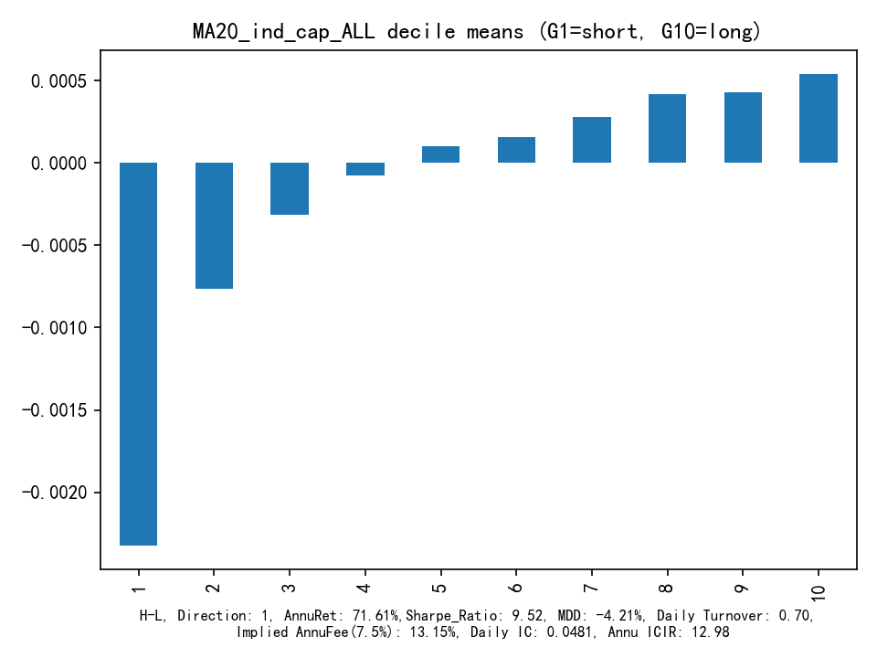
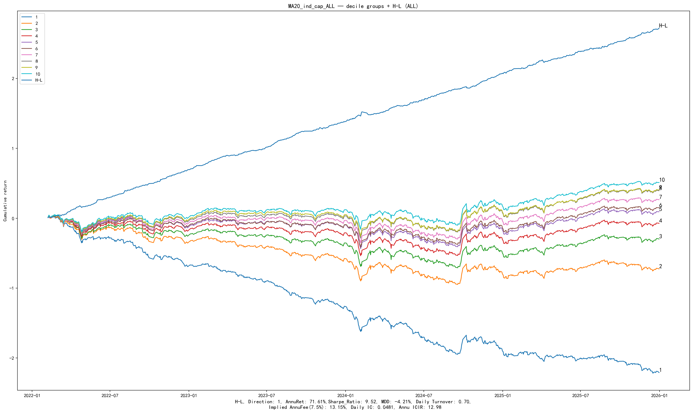

# TGD20 因子研究报告 v3

> 日内收益时点残差因子｜单因子验收版  
> 日期：2026-07-22  
> 样本：2022-01-28 → 2025-12-31（确认窗）  
> 约定：**G1 = 空头**，**G10 = 多头**，**H-L = G10 − G1**  
> Headline：**G10 Excess Sharpe**（相对当日有效股票池等权）  
> 门槛：Excess **> 3.5**，且 Excess **> G1…G10 与 H-L 的全部 Sharpe**  
> 数据：`run_mentor_single_factor_protocol.py`（含 ST∩非涨跌停 mask）

---

## 1. 因子定义

> TGD20 = 控制收益幅度与开盘结构后，下跌时点残差相对上涨时点残差的截面创新，再做 20 日平滑。

\[
\mathrm{TGD20}_{i,T}=\mathrm{MA}_{20}(\varepsilon_{d}\perp\varepsilon_{u})
\]

信号强制 `shift(1)`。冻结公式，不因网格改 ID。

---

## 2. 数据处理

| 步骤 | 口径 |
|------|------|
| 可交易过滤 | `apply_tradability_mask`：非 ST ∩ 非涨跌停 |
| 标准化 | 截面 z-score |
| 中性化 | raw / cap / ind / **ind_cap**（headline） |
| 回看 | MA20（冻结）；网格另测 MA10/30/60 |

---

## 3. IC（一行）

| 模式 | RankIC | ICIR | 正 IC 占比 |
|------|-------:|-----:|----------:|
| Raw | 5.00% | 7.87 | — |
| Size+industry (`ind_cap`) | **4.81%** | **12.98** | **80.0%** |

---

## 4. 十分组 + H-L（`groupTest`）

Universe = 全 A（mask 后）· fee = 0 · `ind_cap` · MA20

| 指标 | H-L |
|------|----:|
| AnnuRet | 71.61% |
| Sharpe | **9.52** |
| MDD | −4.21% |
| Daily Turnover | 0.70 |
| Implied AnnuFee | 13.15% |
| Daily IC | 4.81% |
| Annu ICIR | 12.98 |

单调性 Spearman = **1.00**。

| 组 | 日均收益 | Sharpe | 角色 |
|---:|--------:|-------:|------|
| 1 | −0.232% | −2.55 | 空头 |
| 2 | −0.076% | −0.82 | |
| 3 | −0.031% | −0.33 | |
| 4 | −0.008% | −0.08 | |
| 5 | +0.010% | 0.11 | |
| 6 | +0.016% | 0.17 | |
| 7 | +0.028% | 0.30 | |
| 8 | +0.042% | 0.44 | |
| 9 | +0.043% | 0.46 | |
| **10** | **+0.054%** | **0.59** | **多头** |
| H-L | — | **9.52** | G10−G1 |

---

## 5. G10 Excess Sharpe（Headline）

\[
r^{ex}_t = r^{G10}_t - \mathrm{EW}(U_t)
\]

| 指标 | 值 |
|------|--:|
| Excess AnnuRet | 18.48% |
| **Excess Sharpe** | **4.98** |
| Excess MDD | −4.12% |
| max(G1…G10, H-L) Sharpe | **9.52**（来自 H-L） |
| 过门 > 3.5 | **是** |
| 过门 > 全部组/H-L Sharpe | **否**（4.98 < 9.52） |
| 双门全过 | **否** |

> 说明：相对「各组绝对收益 Sharpe」，G10 Excess（4.98）已高于 G1…G10；未过的是相对 **H-L Sharpe** 的门槛。  
> 与旧买方报告 SI Excess≈2.16 的差异，主要来自本版强制 ST/涨跌停 mask 后的有效股票池。

---

## 6. 市场条件（成分股 mask）

Headline 信号：`MA20 + ind_cap`（同一 mask）

| 股票池 | G10 Excess Sharpe | H-L Sharpe | 双门 |
|--------|------------------:|-----------:|:----:|
| ALL | **4.98** | 9.52 | 否 |
| 沪深300 | 1.77 | 2.03 | 否 |
| 中证500 | 2.41 | 3.58 | 否 |
| 中证1000 | 2.84 | 5.85 | 否 |

中小盘更强；大盘池 Excess 掉到 3.5 以下。

---

## 7. 因子衰减（T+1 / 5 / 10 / 20）

| 持有期 | RankIC | ICIR | G10 Excess Sharpe | H-L Sharpe |
|-------:|-------:|-----:|------------------:|-----------:|
| T+1 | 4.81% | 12.98 | 4.98 | 9.52 |
| T+5 | 6.80% | 17.98 | 7.29 | 15.36 |
| T+10 | 8.01% | 20.38 | 8.88 | 19.70 |
| T+20 | 9.04% | 22.52 | 11.17 | 19.32 |

信息寿命覆盖中频；多期收益重叠，不能把 horizon 当独立样本比显著性。  
（Buffer / 降频仅作执行脚注，不作 headline。）

---

## 8. 敏感性（优化网格摘要）

每次只动一个旋钮族：MA × MAD × 中性化。完整表见  
`data/analysis/mentor_protocol/mentor_optimization_grid.csv`。

| 变体 | Excess Sharpe | H-L Sharpe | >3.5 | >全部 Sharpe |
|------|-------------:|-----------:|:----:|:------------:|
| MA20 none ind_cap（冻结） | 4.98 | 9.52 | 是 | 否 |
| MA20 MAD+tanh ind_cap | 5.22 | 9.51 | 是 | 否 |
| MA10 MAD+tanh ind_cap（网格最优 Excess） | **6.18** | 11.63 | 是 | 否 |
| MA30 none ind_cap | 4.19 | 7.81 | 是 | 否 |
| MA60 none ind_cap | 3.56 | 6.08 | 是 | 否 |

**结论：** 缩短 MA、加 MAD+tanh 能抬高 Excess，但 H-L 同步抬升，**相对门槛仍全部失败**。  
未改冻结公式 ID；MA10 / MAD 仅作变体记录。

---

## 9. 验收结论

| 检查项 | 结果 |
|--------|------|
| 可复现十分组单调 | 通过（mono=1.00） |
| G10 Excess > 3.5（全 A，mask 后 SI） | **通过（4.98）** |
| Excess > 全部组与 H-L Sharpe | **未通过（卡在 H-L）** |
| 分池稳健 | 部分（CSI500/1000 尚可，HS300 弱） |
| 仅靠 buffer 刷线 | **未使用**（符合 mentor 要求） |

**研究状态：Candidate — 绝对门槛已过，相对 H-L 门槛未过。**  
下一步应继续从**信号本身**抬升多头相对基准的稳定性（而非 buffer），或与 mentor 确认「相对门槛是否必须压过 H-L」。

---

## Appendix

| 内容 | 路径 |
|------|------|
| 协议汇总 | `data/analysis/mentor_protocol/mentor_protocol_summary.csv` |
| 优化网格 | `data/analysis/mentor_protocol/mentor_optimization_grid.csv` |
| 最佳变体 JSON | `data/analysis/mentor_protocol/mentor_best_variant.json` |
| 指标口径 | `research_delivery/METRICS_G10_EXCESS.md` |
| Runner | `run_mentor_single_factor_protocol.py` |
| Lib helpers | `Factor_Dev_Lib.apply_tradability_mask` / `g10_excess_vs_universe_ew` / `calc_forward_returns` / `get_index_member_mask` |
