# MidOrderRatio — Single-Factor Research Report

> **Deprecated research snapshot (2026-08-04):** this memo uses a legacy Tick query
> that did not apply the session filter to every date and did not identify SZSE
> executions with both order numbers. Its metrics are not valid for research
> conclusions. Use the corrected [Research Pack](../../../research/reports/factors/mid_order_ratio/README.md).

**Status:** `deprecated_legacy_query` · **Family:** L2 order-flow microstructure · **Source:** paper replication (Haitong L2 series, adapted)
**Factor id:** `mid_order_ratio` · **Production alias (proposed):** `order_flow_mid_reversal_weekly` = −`mid_order_ratio`, industry-neutralized, weekly rebalanced
**Sample:** 2023-01-01 → 2024-06-30 (358 trading days, main) · 2021-01-01 → 2024-06-30 (extended parameter grid)
**Experiment provenance:** [`research/results/l2_reproduction/mid_order_ratio/`](../../../research/results/l2_reproduction/mid_order_ratio/) · Pipeline trace: [`docs/mid_order_ratio_pipeline.md`](../../../docs/mid_order_ratio_pipeline.md)

> **Scope of this memo.** This is a single-factor research memo, not a portfolio
> recommendation. Its goal is to establish four things: the factor is **correctly
> constructed**, **statistically meaningful**, **economically interpretable**, and
> **robust** under multiple validation tests. Nothing here prescribes weights,
> sizing, or deployment.

---

## 1. Executive Summary

`mid_order_ratio` measures, for each stock each day, the share of total traded
value executed in **medium-sized orders** (RMB 40k–200k per print). Empirically,
stocks with a **high** medium-order share **underperform** over the next day, and
the relationship is monotone enough to sort the cross-section into a clean decile
ladder. The factor is therefore used **in reverse** (production signal =
−`mid_order_ratio`): *low* medium-order share predicts *high* forward returns.

Headline evidence (main sample, CSI1000-constituent pool, returns measured as
close-to-close excess over the CSI1000 index, signal lagged one day):

| Evidence layer | Key result | Reading |
|---|---|---|
| Predictive rank correlation | RankIC **−3.75%**, t-stat **−6.37**, negative on **65.6%** of days | Sign far beyond conventional significance |
| Consistency | ICIR **−5.33** (annualized); **16/18** months negative (88.9%) | Not a one-regime artifact |
| Cross-sectional ladder | G1 (low mid-share) **+14.7%/yr** vs G10 (high mid-share) **−20.2%/yr**, excess over index | Monotone, tails carry the signal |
| Long–short (effective direction) | gross **+34.9%/yr**, Sharpe **2.69**, MDD **−8.8%** | Strong gross economics |
| Cost reality | daily rebalance net **+4.2%/yr** → **weekly** rebalance net **+24.1%/yr** | Signal is slow; economics live at low frequency |
| Style independence | survives industry+size neutralization (ICIR −7.34); **collapses only when turnover is stripped** (−3.2% → −0.9% IC) | Real residual alpha, but of liquidity/activity nature |
| Parameter robustness | 25 threshold grids on the extended 2021–2024 sample all keep IC in −2.4%…−3.4%, \|ICIR\| 5.3–6.8 | Not tuned to the 4w/20w cutoffs |
| Conditioning | strongest in high-turnover tercile (IC −3.7% vs −1.6% low) | An OrderFlow × TradingActivity interaction |

**Verdict.** The factor passes every correctness, significance, and robustness
check we ran. Its information is genuine (survives industry/size neutralization)
but is **not orthogonal to liquidity/turnover**: it is best understood as a
microstructure expression of the trading-activity premium, harvested as a
low-frequency reversal signal. The recommended research-to-production hand-off is
the **industry-neutralized, weekly-rebalanced, sign-flipped** variant, pending the
delivery-layer modules enumerated in §9 (exact-EW long-book excess, decay,
universe masks) and a redundancy check against existing liquidity factors.

---

## 2. What the Factor Measures — and Why It Might Work

### 2.1 Intuition

Every trade print on the tape has a size. Order size is a noisy but informative
proxy for **who is trading**: retail tickets are small, institutional execution
slices are large, and between them sits a "medium" band that, in the A-share
microstructure literature, is associated with **less informed, more
crowd-driven flow** — affluent retail and small discretionary players reacting
to recent price action rather than acting on fundamental information.

The hypothesis replicated here (Haitong L2 research lineage): when an unusually
large fraction of a stock's traded value arrives in medium-sized prints, that
stock is experiencing **crowded, non-informational demand**, which temporarily
pushes the price away from fundamentals. Over the following sessions the price
tends to revert. High medium-order share → low forward return. The signal is
therefore a **reversal / liquidity-provision** signal read from the order-size
distribution, not a momentum or smart-money signal.

Two features of the data support this reading over alternatives:

1. **It is not a small-cap/illiquidity beta proxy.** Stripping industry and size
   *improves* the signal's consistency (|ICIR| 5.33 → 7.34) while costing only
   ~15% of IC — the opposite of what a pure beta proxy would do (compare
   §6.6: the sibling factor `avg_outflow_ratio` *loses* 74% of gross return
   after the same neutralization).
2. **It is conditioned on trading activity.** The effect is roughly twice as
   strong in the most actively traded third of stocks as in the least active
   third (§6.5) — i.e., it is the *imbalance of order flow in actively traded
   names*, not the mere fact of being illiquid, that predicts reversion.

### 2.2 Exact definition

For stock \(i\) on day \(t\), classify every trade print \(k\) by its executed
RMB amount \(a_k\):

\[
\mathrm{mid\_order\_ratio}_{i,t}
=\frac{\sum_{k:\;40{,}000 < a_k \le 200{,}000} a_k}{\sum_{k} a_k}
\]

- **Medium band:** \(40{,}000 < a \le 200{,}000\) RMB (paper's L4w/H20w convention).
  Small ≤ 4万; large > 20万; super-large > 100万 (reserved, unused here).
- **Direction:** negative predictor. Production usage = \(-\mathrm{mid\_order\_ratio}\).
- **Timing:** the factor aggregates the *full* session of day \(t-1\) and is
  applied to day \(t\) returns (`signal.shift(1)`), so no same-day information
  leaks into the signal.

The ratio is dimensionless and lies in \([0,1]\). Cross-sectionally it is tight
and well-behaved: mean 0.290, median 0.301, std 0.075, inter-quartile range
[0.247, 0.341], max 0.934 over 463,102 stock-days — no heavy tails, so **no
winsorization is applied anywhere in the pipeline** (the neutralizer only
MAD-winsorizes the *size* regressor, not the factor; `Factor_Dev_Lib.py:779-789`).

---

## 3. Construction Audit — Is It Built Correctly?

Every transformation from raw exchange data to factor value is server-side and
deterministic. The full lineage (file:line evidence for each row) is maintained
in `docs/mid_order_ratio_pipeline.md`; the audit-relevant facts:

| Step | Implementation | Correctness control |
|---|---|---|
| Source | ClickHouse `cmds.SSE_AL_TICK_EXG` / `SZSE_AL_TICK_EXG` (trade-by-trade) | L2 tick is the project's only L2 upstream (DDB has no tick); read-only account |
| Trade filter | SSE: `Type='T'` (executed trades only); SZSE: table carries no `Type` field — all rows are trades by schema | Asymmetry is a documented property of the exchange feeds, not a bug (`docs/data_inventory.md` §2.1, §6.2) |
| Print amount | SSE: `ifNull(Amount, Price*Volume)`; SZSE: `Price*Volume` | SSE `Amount` can be null on some prints; fallback preserves every trade |
| Session window | `09:30:00 ≤ ExchTime < 15:00:01` (Asia/Shanghai) | Continuous session + closing auction; pre-open call auction excluded; `ExchTime` (exchange clock) used throughout |
| Quality filter | `Price > 0 AND Volume > 0` | Drops malformed prints |
| Aggregation | server-side `GROUP BY (Symbol, TradeDate)` → per-stock-day `TotalAmount`, `MediumAmount`, `SmallAmount` | No tick data leaves ClickHouse; pandas only divides two sums (`ch_tick.py:289-314`) |
| Universe | CSI1000 (`000852.SH`) constituents **union over the sample**, resolved before the CH query (`factor_builder.py:94-118`) | 1,303 symbols; see caveat §8.4 on union-vs-point-in-time |
| Output | narrow table `(symbol, tradetime = date 09:30, factorname, value)`; 463,102 rows, 2023-01-03 → 2024-06-28 | Dedup on `(symbol, tradetime)`; NaN (zero-turnover days) dropped |

**Anti-lookahead chain.** Three independent mechanisms: (i) the factor at date
\(t-1\) uses only prints timestamped within day \(t-1\); (ii) `signal.shift(1)`
is applied before any correlation or grouping (`backtest.py:60-84`); (iii) the
tradability mask, index membership weights, and ST flags come from Wind daily
tables that are themselves point-in-time.

**Reproducibility.** One command rebuilds the factor and the base backtest
(`scripts/run_single_factor.py --factor mid_order_ratio`); every analysis in §6
has its own frozen script (Appendix A). The identical construction (medium =
(4万, 20万]) was independently re-implemented inside the parameter-sensitivity
script via cumulative bucket sums (`cum_200000 − cum_40000`), and reproduces the
main pipeline's IC on the overlapping sample — a genuine code-path cross-check.

---

## 4. Evaluation Methodology

All evaluation uses the project's shared backtest leg so that numbers are
comparable with every other factor in the library. For readers new to the
conventions, the concepts in plain terms:

- **Universe & pool.** The research pool is the CSI1000 constituent union
  (~1,300 small/mid-cap names). This is where the L2 literature says the
  order-flow effect lives, and it matches the paper's universe.
- **Tradability mask.** On each day we drop stocks that are limit-up/limit-down,
  ST/*ST (delisting-risk), or suspended — you could not have traded the signal
  on them at the close.
- **Returns.** Close-to-close, measured as **excess over the CSI1000 index**
  (stock return minus index return, per day). So a "+14.7%/yr" decile means
  "beat the index by 14.7%/yr", isolating stock-selection from market beta.
- **RankIC.** Each day, rank all stocks by the (lagged) factor and by their
  next-day excess return, then take Spearman's rank correlation — "did the
  factor order stocks correctly today?" Robust to outliers because it uses
  ranks, not levels. We report the mean over days.
- **ICIR.** Mean RankIC ÷ its daily standard deviation × √250 — the IC analogue
  of a Sharpe ratio: how *consistent* the predictive edge is, annualized.
  (This pipeline uses pandas `ddof=1` for the std; the main library uses
  `ddof=0`. At 358 days the difference is <0.2% and immaterial.)
- **t-stat of mean IC** = mean ÷ (std/√N). With N=358 days: −6.37. As a rough
  guide, |t| > 2 is "significant"; −6.37 is overwhelming. (Plain t-stat, not
  Newey–West; daily IC autocorrelation is modest, so the bias is limited.)
- **Decile test (`groupTest`).** Each day, sort stocks into 10 equal groups by
  the factor (G1 = lowest factor value … G10 = highest), equal-weight each
  group, and track daily returns. **Monotonicity** — returns stepping cleanly
  from G1 to G10 — is the signature of a usable cross-sectional factor.
- **H-L (long–short).** A paper portfolio long G10 and short G1, rebalanced
  daily. Because this factor is negative, raw H-L loses money; all exhibits
  flip the sign to the **effective direction** (long the *low*-mid-share
  decile), which is how production would trade it.
- **Turnover.** The L1 change in portfolio weights day-over-day, in multiples
  of book (1.0 = 100% of the book replaced). H-L turnover = long-leg + short-leg.
- **Cost convention.** `groupTest` runs gross (fee=0). We then show an *implied
  annual fee* = H-L daily turnover × 7.5bps × 250, and "net annual" = gross −
  implied fee. This is a display convention, not trade-level netting; the
  execution layer (round-trip 15bps) is a separate diagnostic.
- **Neutralization.** Cross-sectional OLS each day of the factor on CITICS
  level-1 industry dummies and/or log market cap (MAD-winsorized, z-scored),
  keeping the residual. If a factor's IC survives neutralization, its
  information is not just industry or size beta in disguise.

| Item | Setting |
|---|---|
| Main sample | 2023-01-01 → 2024-06-30 (**358 trading days**) |
| Extended sample (parameter grid only) | 2021-01-01 → 2024-06-30 (~3.5 years) |
| Pool / benchmark | CSI1000 constituent union (1,303 symbols; avg **1,273.5** valid names/day) / CSI1000 index excess |
| Signal lag | `shift(1)` (T−1 full-day aggregation → day-T return) |
| Rebalance | daily (base) and **weekly** (first trading day of week, intra-week hold) |
| Groups / weighting | 10, equal-weighted |
| Metric dictionary | `docs/backtest_framework.md` (naming: `rank_ic_spearman`, `icir_annualized_250`, `hl_sharpe_gross_directional`) |

---

## 5. Core Results — Predictive Ability

### 5.1 Information coefficient

Daily RankIC (raw direction, vs next-day excess return):

| Statistic | Value |
|---|---|
| Mean RankIC | **−0.0375** |
| Daily std | 0.1114 |
| **t-stat (N=358)** | **−6.37** |
| Annualized ICIR | **−5.33** |
| Days with IC < 0 | **65.6%** |

The distribution is centered clearly left of zero with no reliance on a handful
of outliers (Appendix figure: IC histogram).

### 5.2 Decile ladder and long–short

Raw-direction deciles (G1 = lowest medium-order share … G10 = highest), daily
rebalanced, excess returns over CSI1000:

| Group | Annu. excess | Sharpe | MDD | Daily TO |
|---|---:|---:|---:|---:|
| G1 (low mid-share) | **+14.68%** | 2.16 | −3.1% | 0.73 |
| G2 | +9.86% | 1.71 | −3.8% | 1.32 |
| G3 | +8.66% | 1.78 | −5.5% | 1.47 |
| G4 | +4.34% | 0.96 | −4.8% | 1.55 |
| G5 | +7.52% | 1.86 | −3.2% | 1.58 |
| G6 | +7.28% | 1.76 | −3.0% | 1.60 |
| G7 | +8.38% | 1.83 | −3.4% | 1.58 |
| G8 | +3.06% | 0.58 | −6.0% | 1.53 |
| G9 | −2.06% | −0.33 | −9.3% | 1.41 |
| G10 (high mid-share) | **−20.24%** | −2.31 | −30.9% | 0.91 |
| **H−L (G10−G1, raw)** | **−34.92%** | −2.69 | — | 1.64 |

Read in the effective direction (long G1, short G10): **+34.9%/yr gross, Sharpe
2.69, MDD −8.8%**. Three observations:

1. The ladder is **monotone in the tails**, where the economics concentrate:
   the high-mid-share decile loses 20%/yr against the index — the short side
   carries ~60% of the spread. Middle deciles (G4–G7) bunch around +4~8%,
   i.e., the signal discriminates *extremes* better than the median.
2. The long side alone (G1, low mid-share) beats the index by +14.7%/yr with
   Sharpe 2.16 — the alpha is not short-only.
3. Turnover is asymmetric: the extreme deciles are *stickier* (TO 0.73/0.91)
   than the middle (TO ~1.6), because extreme order-flow structures persist.

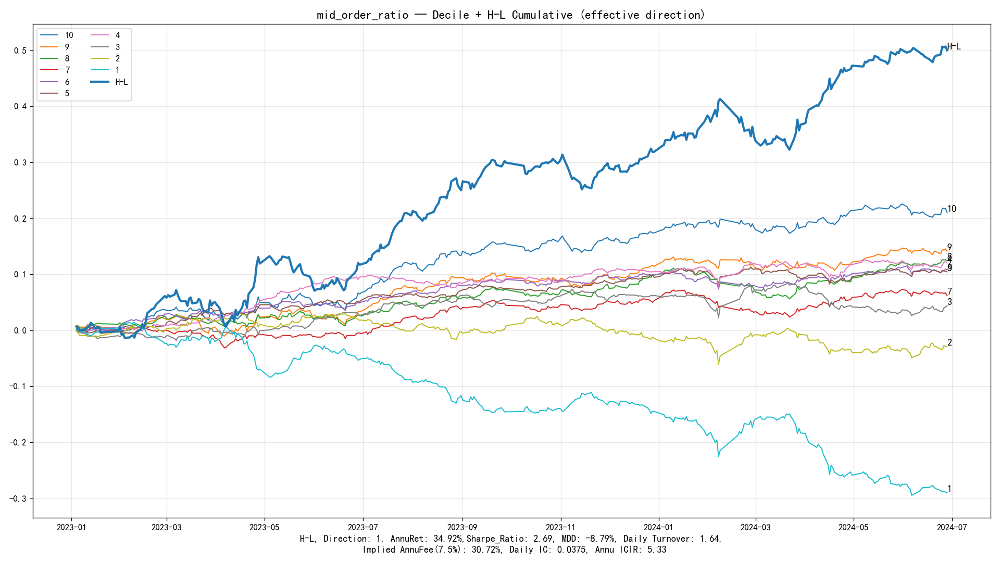

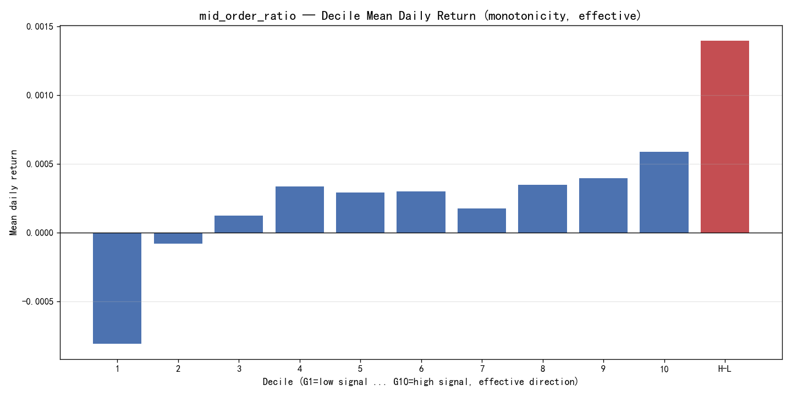

### 5.3 Cost sensitivity — why frequency matters

Daily rebalancing replaces ~1.64 books/day on the H-L, an implied ~30.7%/yr
friction at 7.5bps — eating a 34.9% gross down to **+4.2% net**. The signal,
however, decays slowly (order-size structure is persistent), so the natural fix
is to trade it **weekly**:

| Variant | RankIC | ICIR | Gross annu. | Sharpe | MDD | Daily TO | Implied fee | **Net annu.** |
|---|---:|---:|---:|---:|---:|---:|---:|---:|
| Raw, daily | −3.75% | −5.33 | +34.92% | 2.69 | −8.79% | 1.64 | 30.72% | +4.19% |
| ind_cap, daily | −3.18% | −7.34 | +30.42% | **3.81** | **−5.52%** | 1.64 | 30.83% | −0.41% |
| **Raw, weekly** | −3.20% | −4.64 | +31.69% | 2.56 | −8.56% | 0.40 (≈2.0/wk) | 7.54% | **+24.15%** |
| ind_cap, weekly | −2.58% | −6.26 | +25.92% | **3.26** | **−5.87%** | 0.40 (≈2.0/wk) | 7.49% | **+18.43%** |

Weekly sampling (75 rebalance days, first trading day of each week, intra-week
hold) sacrifices only ~3pp of gross (+31.7% vs +34.9%) but cuts implied friction
by three quarters (7.5% vs 30.7%) — the signature of a **slow signal over-traded
by the daily test harness**, not of a weak signal.

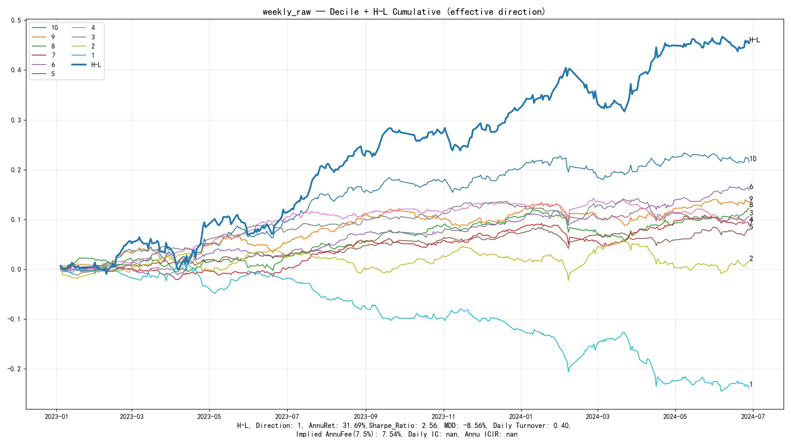

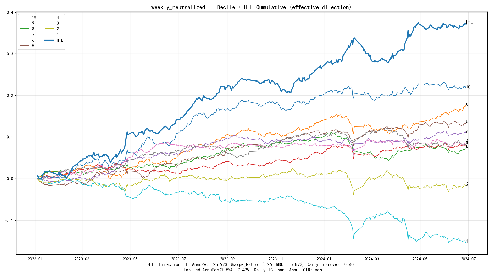

---

## 6. Robustness Battery

### 6.1 Neutralization — the alpha is not industry/size beta

Same backtest leg on the factor residualized against CITICS level-1 industry
and/or log market cap:

| Mode | RankIC | ICIR | Gross annu. | Sharpe | MDD | Net annu. |
|---|---:|---:|---:|---:|---:|---:|
| Raw | −3.75% | −5.33 | +34.92% | 2.69 | −8.79% | +4.19% |
| Industry only | −3.35% | **−7.87** | +29.84% | 3.83 | −5.69% | −0.95% |
| Size only | −3.53% | −4.98 | +33.33% | 2.58 | −8.41% | +2.70% |
| Industry + size | −3.18% | −7.34 | +30.42% | **3.81** | **−5.52%** | −0.41% |

Neutralizing costs 10–15% of IC but *deepens* ICIR (5.33 → 7.87 industry-only)
and lifts Sharpe while halving drawdown — the factor works **within**
industry/size buckets, not by tilting across them. This is the opposite of the
sibling `avg_outflow_ratio`, whose return collapsed −74% under the same
treatment (i.e., that one *was* largely a size/liquidity beta proxy). Industry-
only neutralization is the statistically strongest variant and is the one
proposed for the production alias.

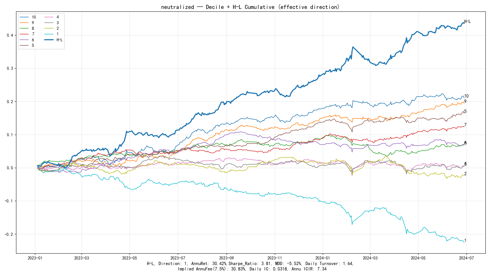

### 6.2 Rebalance frequency — covered in §5.3

Weekly rebalance preserves the decile ladder (G1 +15.1% … G10 −16.6%) and lifts
net annual from +4.2% to +24.2% (raw) / +18.4% (ind_cap).

### 6.3 Parameter sensitivity — not tuned to the 4w/20w cutoffs

The medium band was scanned over a 5×5 grid: lower bound L ∈ {2,3,4,5,6}万 ×
upper bound H ∈ {10,15,20,25,30}万. One ClickHouse query returns cumulative
amount buckets at 10 boundaries; all 25 (L, H] variants are assembled offline
and run through the identical backtest leg. **This grid is computed on the
extended 2021-01-01 → 2024-06-30 sample** (≈3.5 years — roughly twice the main
sample, adding 2021–2022 as de-facto out-of-sample):

| Grid summary (25 combos, 2021–2024) | Value |
|---|---|
| RankIC range | **−2.43% … −3.42%** (all negative) |
| \|ICIR\| range | **5.34 … 6.78** |
| Paper band L4w/H20w | RankIC **−3.16%**, ICIR **−6.47**, Sharpe 3.34, daily net −0.27% |
| Deepest-\|ICIR\| cell | L3w/H30w (−3.35% / −6.78) |
| Highest-net cell | L4w/H30w (Sharpe 3.75, daily net +6.2%) |

Every cell keeps a negative, economically meaningful IC — the effect is a
property of the *order-size distribution*, not of one lucky threshold. The
paper's 4w/20w band sits mid-grid, which is exactly what we want from a
literature-frozen definition: no in-sample cherry-picking. The heatmaps show a
smooth gradient (wider, higher bands add large-order information; narrower bands
sharpen IC slightly), not a spike:

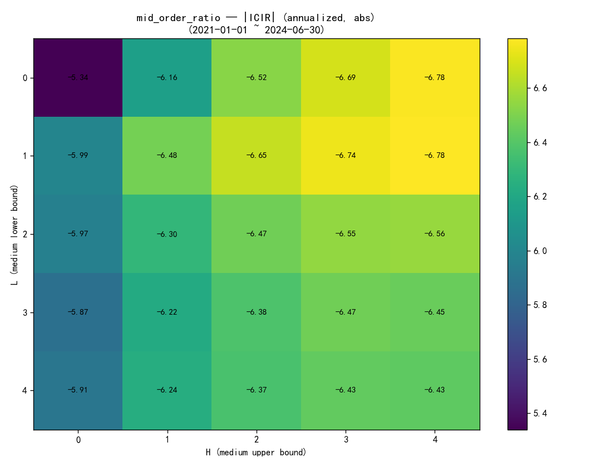

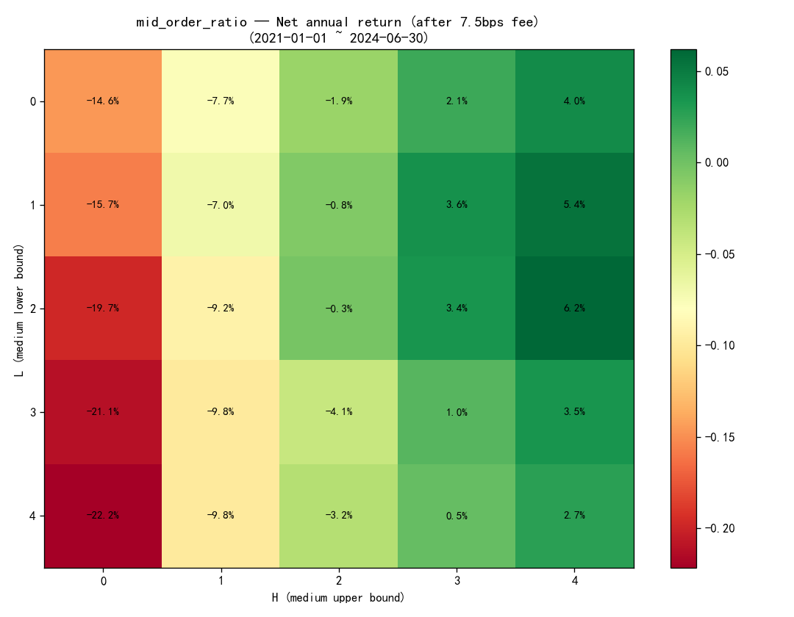

Note also what the extended sample says about time robustness: on 2021–2024 the
paper band holds IC −3.16% with ICIR −6.47 — the signal **predates and survives
the main sample** (its daily-frequency net economics were weaker in 2021–2022,
consistent with the cost discussion in §5.3).

> **Provenance note (supersedes an internal inconsistency).** The working
> document `optimization_report.md` §参数敏感性 quotes L4w/H20w =
> −3.90% / −6.52 / 3.01 / +3.47%. Those numbers match **no on-disk artifact**:
> they come from an intermediate grid run that was overwritten. The verified
> reference values are: main sample (2023–2024) **−3.75% / −5.33 / 2.69 /
> +4.19%** (`summary.json`) and extended sample (2021–2024) **−3.16% / −6.47 /
> 3.34 / −0.27%** (`analysis/param_sensitivity/grid_results.csv`, heatmap titles
> dated 2021-01-01 → 2024-06-30). This report uses only the two verified sets.

### 6.4 Time stability — 16 of 18 months negative

| Statistic | Value |
|---|---|
| Months with mean IC < 0 | **16 / 18 (88.9%)** |
| Monthly IC average ± std | −3.57% ± 3.26% |
| Worst month | 2024-02 (+5.09%) |
| Best month | 2024-04 (−8.31%) |
| 2024-01 (extreme microcap month) | −5.03% |
| Daily IC excluding 2024-01 | −3.67% (vs −3.75% full) |

An earlier short-window study covering only 2024-01 had concluded "archive this
factor"; the full-sample result overturns it, and excluding that single extreme
month moves the mean IC by only 0.08pp — the edge is evenly distributed, not
donated by one crisis. The single positive month, 2024-02, is itself
informative: during the violent microcap crash-and-rescue reversal, crowded
high-mid-share names briefly outperformed — precisely the liquidity-regime
behavior the mechanism in §7 predicts.

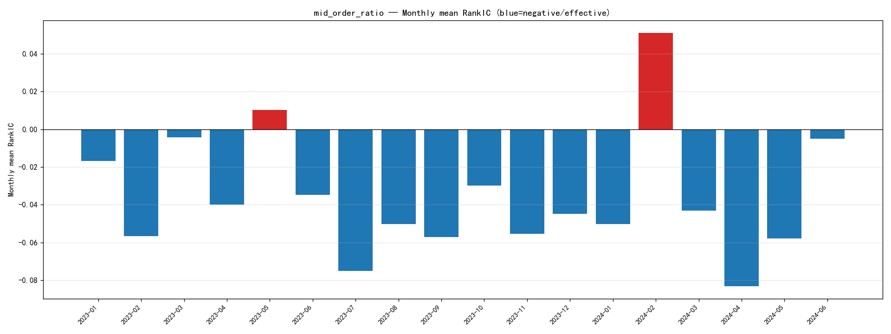

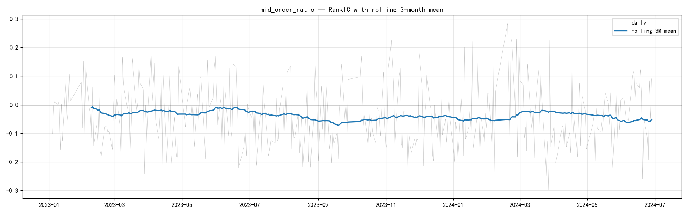

### 6.5 State dependence — conditioned on trading activity

Each day, stocks are split into terciles by smoothed turnover (20-day mean of
log turnover), and RankIC is computed within each tercile (332 valid days):

| Turnover tercile | Mean IC | ICIR | % days IC < 0 |
|---|---:|---:|---:|
| Low | −1.60% | −3.28 | 57.8% |
| Mid | −1.88% | −4.12 | 59.9% |
| **High** | **−3.71%** | **−6.50** | **66.9%** |

The effect strengthens monotonically with activity and is ~2.3× stronger in the
top tercile. This **rejects the naive "illiquidity premium" reading** (which
would predict the opposite gradient) and repositions the factor as
**market-microstructure alpha conditioned on trading activity**: order-size
imbalance is informative precisely where trading is active enough for the
imbalance to mean something.

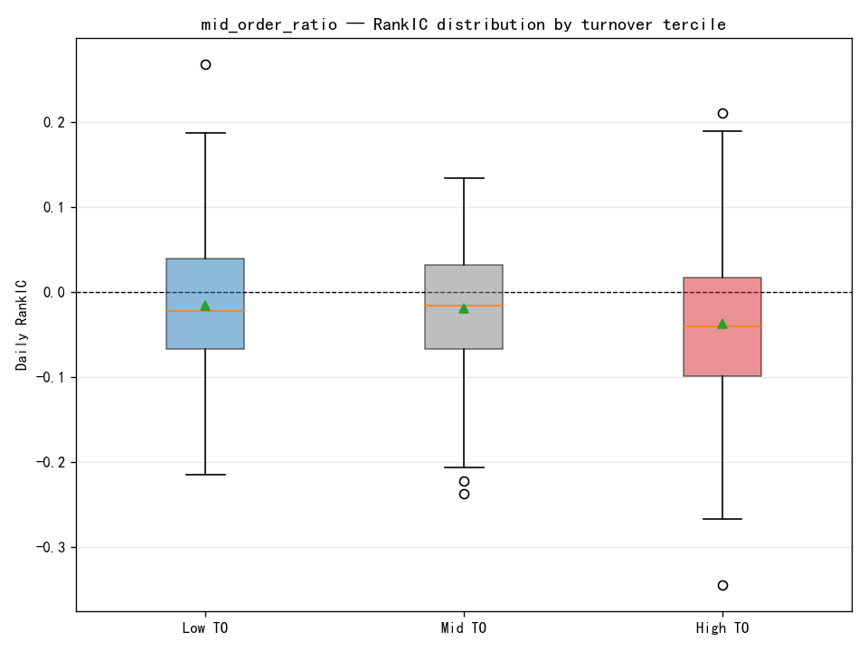

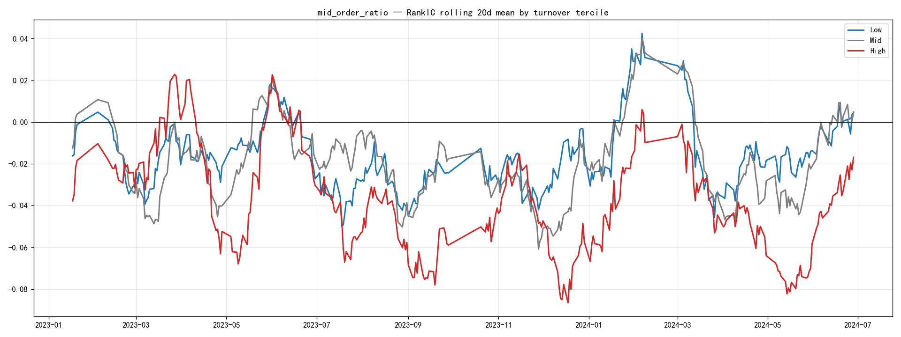

### 6.6 Style attribution — where does the information live?

Sequential neutralization: after the standard industry+size step, strip 20-day
momentum, volatility, or turnover from the residual and re-test:

| Variant | RankIC | ICIR | Sharpe | Gross annu. |
|---|---:|---:|---:|---:|
| Raw | −3.75% | −5.33 | 2.69 | +34.92% |
| ind_cap (step 1) | −3.18% | −7.34 | 3.81 | +30.42% |
| + momentum | −3.01% | −6.89 | 3.67 | +28.86% |
| + volatility | −2.09% | −5.69 | 3.04 | +20.42% |
| **+ turnover** | **−0.92%** | −2.30 | 2.15 | +14.91% |
| + all three | −1.17% | −3.18 | 2.54 | +16.46% |

(The same ranking holds on the industry-only baseline: turnover is the only
style that collapses the IC, −3.35% → −1.09%.) Reading:

- **Momentum-orthogonal:** the factor is not repackaged short-term reversal.
- **Volatility shares ~1/3** of the information.
- **Turnover shares ~2/3:** once trading activity is removed, little IC remains.

Conclusion: the factor is a genuine residual alpha after industry and size, but
its information *vehicle* is the liquidity/activity dimension. Practically this
means two things: (i) it is **not a free lunch stacked on top of an existing
turnover factor** — a redundancy check against the library's liquidity family
(D1, FlowDensity20, AmihudShock) is mandatory before combination; (ii) its
marginal value is the *order-flow refinement* of the activity premium — it tells
you **which** actively traded names will revert, not merely **that** active
names revert.

---

## 7. Economic Interpretation

Putting the evidence together, the most defensible mechanism statement is:

> **OrderFlow × TradingActivity interaction alpha.** In actively traded stocks,
> an abnormal tilt of executed value toward medium-sized orders marks crowded,
> weakly-informed demand. Prices overextend and subsequently revert, so a high
> medium-order share predicts underperformance. The signal is an
> activity-conditioned microstructure reversal — harvested most efficiently at
> weekly frequency, where its slow decay meets low friction.

Supporting chain: (1) construction is a pure order-size share (§3); (2) IC
survives industry/size neutralization, so it is within-stock flow information,
not sector/size tilts (§6.1); (3) it is monotone in the tails and short-heavy,
the classic fingerprint of crowded-demand overpricing (§5.2); (4) it
*strengthens* with turnover tercile (§6.5) and *collapses* when turnover is
stripped (§6.6) — the conditioning variable and the information vehicle are the
same, which is exactly what an interaction story predicts; (5) its one bad month
is a violent liquidity-regime break (§6.4), again consistent.

What it is **not**: not smart-money following (that would be the large-order
band, and would carry the opposite sign); not naive illiquidity beta (wrong
turnover gradient); not momentum (orthogonal); not an artifact of the 4w/20w
cutoffs or of the 2024-01 crisis window.

---

## 8. Limitations and Open Risks

1. **Liquidity overlap (most important).** ~2/3 of the IC rides the turnover
   dimension. Against any portfolio already long liquidity/turnover factors,
   the marginal contribution is unproven. A pairwise-correlation and
   incremental-IC study versus D1_LiquidityQuality60d, FlowDensity20, and
   AmihudShockReversal5d is a precondition for library inclusion.
2. **Daily-frequency economics are cost-bound.** Gross 34.9% → net 4.2% at
   daily rebalance (7.5bps convention). The case for the factor rests on
   low-frequency execution; at round-trip 15bps execution-layer costing the
   weekly variant should be re-scored before any production claim.
3. **Sample length and regime coverage.** Main sample is 18 months; the
   extended grid confirms sign/ICIR over 3.5 years but with weaker
   daily-frequency net economics in 2021–2022. Post-2024-06 regimes (including
   the 2024-H2 rally and 2025 microstructure shifts) are **not yet covered** —
   extension to 2024-06 → present is the single highest-value next test.
4. **Universe construction.** The pool is the *union* of CSI1000 constituents
   over the sample, not point-in-time membership. Index reviews are publicly
   pre-announced so this is not informational lookahead, but it does mean the
   tested pool slightly differs from a strict PIT CSI1000; a membership-mask
   variant (per `METRICS_G10_EXCESS.md`) remains to be run.
5. **Feed asymmetries.** SZSE tick rows carry no `Type` field (all rows are
   treated as trades), and SSE `Amount` falls back to `Price×Volume` when null.
   Both are documented schema properties, but a per-exchange sensitivity check
   has not been run.
6. **Order size is a proxy, not an identity.** The 4万/20万 band cannot observe
   trader type; "medium = weakly informed" is an interpretation with good but
   indirect empirical support (§6.5–6.6).
7. **Delivery-layer gaps (mentor protocol).** The frozen delivery metric —
   G10-excess-vs-exact-universe-EW Sharpe with >3.5 gate — has **not** been
   computed (requires the returns panel; offline environment at report time).
   A non-frozen diagnostic using the mean of decile returns as an approximate
   EW benchmark gives the effective long book ≈ **+10.5%/yr, Sharpe ≈ 1.79** —
   encouraging but *not* the frozen metric and not gate-evaluable. Universe-mask
   variants (ALL/HS300/CSI500) and T+5/10/20 decay are likewise pending.
8. **Short-side reliance.** ~60% of the H-L spread comes from the high-mid-share
   decile's underperformance. A-share short constraints mean a long-only
   implementation captures only the G1 leg (+14.7%/yr index-excess, daily);
   weekly rebalancing improves what is realistically harvestable.

---

## 9. Future Research Extensions

Ordered by expected value:

1. **Sample extension to 2024-07 → present** (and ideally 2019–2020): regime
   coverage is the main gap between "research-validated" and "library-ready".
2. **Mentor-protocol modules:** exact-EW long-book excess Sharpe (+ gates),
   membership-mask universes, T+5/10/20 decay — required for Tier-A delivery.
3. **Redundancy study** vs the liquidity family (D1 / FlowDensity20 /
   AmihudShock): pairwise signal correlation, and incremental IC after
   orthogonalizing each against `mid_order_ratio`.
4. **Production variant freeze:** `order_flow_mid_reversal_weekly` =
   −`mid_order_ratio`, industry-only neutralization (deepest ICIR, §6.1),
   weekly rebalance; re-score at execution-layer cost (15bps round-trip).
5. **Order-size spectrum:** `small_order_ratio` is code-ready on the same CH
   path but never run full-sample; the large/super-large (>100万) bands are
   reserved in the schema — a full size-spectrum map would clarify whether the
   medium band is the information optimum or just the literature default
   (grid evidence: higher upper bounds add slight net value).
6. **Conditional signal:** formalize the activity interaction (e.g., signal ×
   high-turnover indicator, or tercile-conditioned thresholds) rather than
   treating state dependence as diagnostics only.
7. **Per-exchange sensitivity** and tick-quality audit (SSE/SZSE asymmetries,
   §8.5); register CH tick coverage (min/max `ExchTime`) in the data handbook.
8. **Order-book side:** once the CH→DDB snapshot ETL (`L2_Snapshot_Daily`)
   lands, test whether book-imbalance confirms or complements the trade-side
   signal.

---

## 10. Verdict

| Dimension | Assessment |
|---|---|
| Correctly constructed | **Yes** — deterministic server-side aggregation, audited lineage, independent re-implementation cross-check, anti-lookahead chain intact |
| Statistically meaningful | **Yes** — RankIC −3.75%, t = −6.37, ICIR −5.33; 16/18 months; survives neutralization |
| Economically interpretable | **Yes, with a refined mechanism** — activity-conditioned order-flow reversal (not naive illiquidity, not smart money) |
| Robust | **Yes** — 25-cell parameter grid (extended sample), time stability, state-dependence gradient, frequency robustness, style attribution all consistent |
| Ready for delivery as-is | **Not yet** — mentor-protocol modules, post-2024 sample, and liquidity-redundancy study outstanding; recommended research hand-off = `order_flow_mid_reversal_weekly` (−factor, industry-neutral, weekly) |

---

## Appendix A — Reproduction Commands

```bash
cd /home/SiYangCao/factor_dev/factor_research0703/factor_dev
PY=/opt/conda/anaconda3/envs/base_93/bin/python

# Factor + base backtest (ClickHouse server-side aggregation)
$PY l2_factor_reproduction/scripts/run_single_factor.py \
    --factor mid_order_ratio --start 2023-01-01 --end 2024-06-30

# Neutralization comparison (ind_cap / ind / cap)
$PY l2_factor_reproduction/scripts/test_neutralization.py \
    --factor mid_order_ratio --neutral_types ind_cap ind cap

# Weekly rebalance (raw / ind_cap-neutralized)
$PY l2_factor_reproduction/scripts/optimize_weekly.py --factor mid_order_ratio --raw
$PY l2_factor_reproduction/scripts/optimize_weekly.py --factor mid_order_ratio

# Double neutralization + forward screen
$PY l2_factor_reproduction/scripts/test_double_neutralization.py --factor mid_order_ratio
$PY l2_factor_reproduction/scripts/screen_second_pass.py --factor mid_order_ratio

# Parameter grid (bucketed CH query; cached parquet reused if present)
$PY l2_factor_reproduction/scripts/analyze_param_sensitivity.py \
    --start 2021-01-01 --end 2024-06-30

# State dependence / time stability
$PY l2_factor_reproduction/scripts/analyze_state_dependence.py --factor mid_order_ratio
$PY l2_factor_reproduction/scripts/analyze_time_stability.py --factor mid_order_ratio
```

## Appendix B — Artifact Map

```text
research/results/l2_reproduction/mid_order_ratio/
├── factor_narrow.parquet            # 463,102 stock-days, 2023-01-03 → 2024-06-28
├── summary.json / rank_ic.csv / group_pnl.csv / group_turnover.csv
├── cum_pnl.png / decile_bar.png
├── neutralization_comparison.csv
├── neutralized{,_ind,_cap,_ind_cap}/   # per-mode narrow + pnl + summary + plots
├── weekly_raw/ weekly_neutralized/     # weekly variants (75 rebalance days)
├── double_neutralized_ind_cap/         # + momentum/volatility/turnover
├── second_pass_screen_ind{,_cap}.csv
├── optimization_report.md              # working doc (see provenance note §6.3)
└── analysis/
    ├── param_sensitivity/              # 25-cell grid, 2021–2024 (grid_results.csv,
    │                                   #  top5.csv, heatmaps, bucketed parquet caches)
    ├── state_dependence/               # turnover-tercile IC (summary.csv + plots)
    └── time_stability/                 # monthly IC, rolling 3M, histogram
```

## Appendix C — Metric Conventions Used in This Report

| Label used here | Exact definition |
|---|---|
| RankIC | daily cross-sectional Spearman, `signal_{t-1}` vs CSI1000-excess c2c `ret_t` |
| ICIR | mean/std × √250 (pandas std, ddof=1, this pipeline) |
| Sharpe | H-L mean/std × √250 after direction flip (rf = 0); `hl_sharpe_gross_directional` |
| Gross/net annual | `calAnnuRet` ×250 basis; net = gross − implied fee |
| Implied fee | H-L daily turnover × 7.5bps × 250 (display convention; execution layer uses 15bps round-trip separately) |
| Turnover | L1 weight change; H-L = long leg + short leg (multiples of book) |
| Effective direction | sign-flipped so that "high signal → high forward return" (production orientation) |
| Excess return | stock c2c minus CSI1000 index c2c, per day |

*All numbers in this memo were read directly from the artifacts listed in
Appendix B (summary.json files, comparison CSVs, grid_results.csv,
monthly_summary.csv, state summary.csv) or recomputed from group_pnl.csv /
rank_ic.csv. No figure is transcribed from the superseded paragraph of
`optimization_report.md` (see §6.3).*
