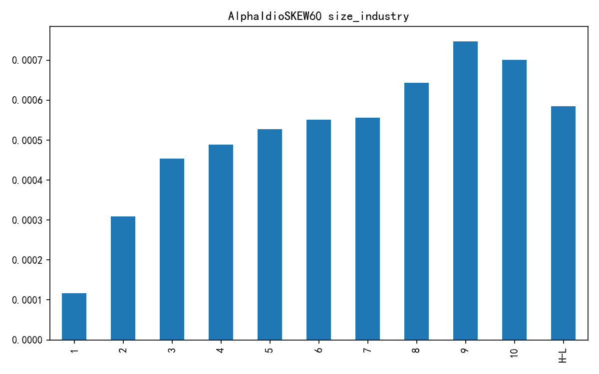
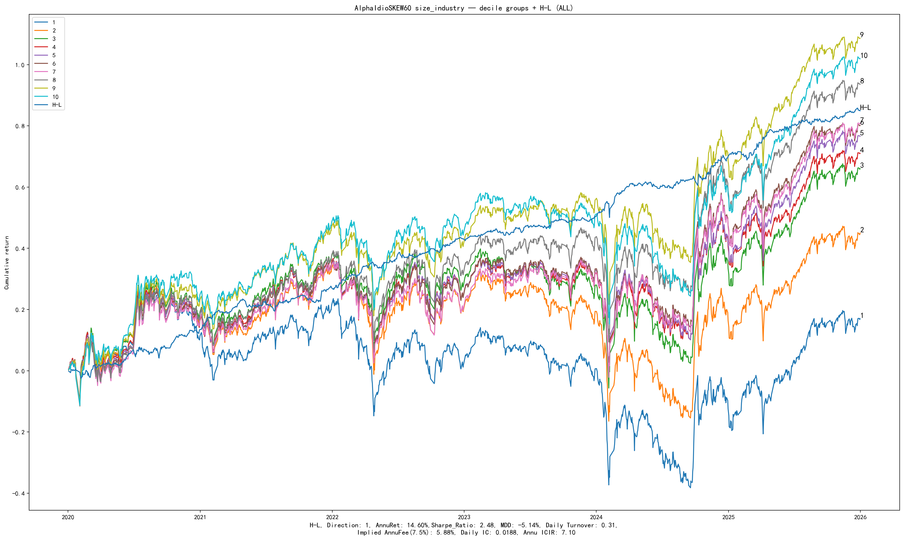

# SKEW selected bundle

SKEW / IdioSKEW is a research-candidate higher-moment factor in the
**Return Distribution Information Layer** (alongside TGD20 timing).

- Exact identity: [`../../factor_specs/SKEW.yaml`](../../factor_specs/SKEW.yaml)
- Canonical Pack: `research/reports/factors/SKEW/`
- Delivery report: [`report.md`](report.md)
- Runner: `run_skew_validation_v1.py`

## Headline (size/industry neutralized AlphaIdioSKEW60)

| Metric | Value |
|--------|------:|
| RankIC | 0.0188 |
| ICIR | 7.10 |
| HL Sharpe | **2.48** |
| HL ann. return | 14.6% |
| HL MDD | −5.1% |
| Corr vs TGD20 | 0.122 |

