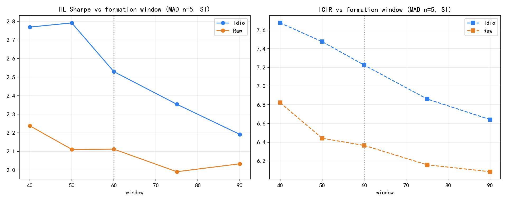

# SKEW / IdioSKEW — Delivery Card

**Status:** `research_candidate` · **Tier:** A-  
**Full buyside report (v2–v4):**  
[`../../SKEW_research_package/report/SKEW_买方因子研究报告.md`](../../SKEW_research_package/report/SKEW_买方因子研究报告.md)

## Headline (size+industry, T+1, MAD n=5)

| Variant | RankIC | ICIR | HL Sharpe | Turnover |
|---------|-------:|-----:|----------:|---------:|
| **AlphaIdioSKEW50_MAD** | **1.97%** | **7.48** | **2.79** | 0.36 |
| AlphaIdioSKEW40_MAD | 2.07% | 7.68 | 2.77 | 0.42 |
| AlphaIdioSKEW60_MAD (audit anchor) | 1.90% | 7.23 | 2.53 | 0.31 |
| Best Raw (Raw40_MAD) | 2.39% | 6.82 | 2.24 | 0.43 |

v4: Idio dominates Raw at all windows; formation 50 > 60; MAD n flat → keep n=5.

## Key plots

