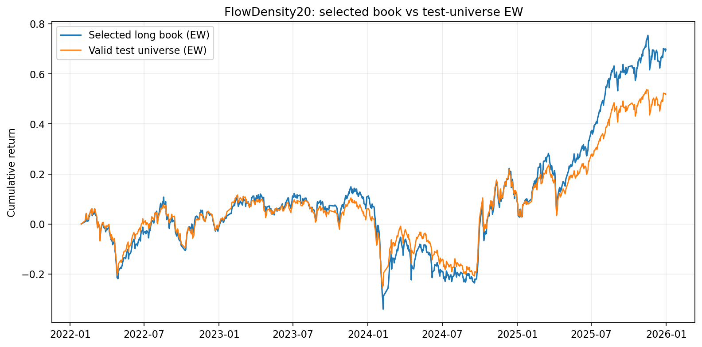
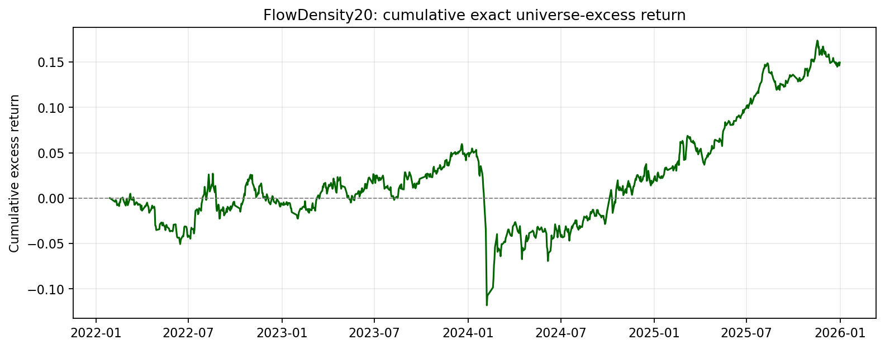

# FlowDensity20 selected bundle

## Identity confirmation

`FlowDensity20` is the delivery/Pack name for the engine signal
`net_active_flow_mktcap_20d`.

The exact raw signal is:

\[
\operatorname{CSZ}\left(
  \sum_{j=0}^{19}
  \frac{\mathrm{ActiveBuyAmt}_{t-j}-\mathrm{ActiveSellAmt}_{t-j}}
       {\mathrm{FloatMktCap}_{t-j}}
\right)
\]

The headline validation variant is size-and-industry neutralized. Therefore
`FlowDensity20` is not a different base formula, but headline metrics may refer
to the neutralized form of the same engine signal.

- Exact identity and caveats: [`factor.yaml`](factor.yaml)
- Complete workflow and artifact map: [`workflow.yaml`](workflow.yaml)
- Delivery report: `research_delivery/factors/FlowDensity20/report.md`
- Canonical Pack: `research/reports/factors/FlowDensity20/`

## Exact market-relative result

| Variant | Group10 excess Sharpe | Excess annual return | Excess MDD |
|---|---:|---:|---:|
| raw | −0.05 | −0.45% | −20.55% |
| size/industry | **0.50** | **3.98%** | −16.77% |

This is materially weaker than the H–L Net Sharpe suggested. FlowDensity20
remains a useful flow candidate, but TGD20 is currently the stronger standalone
long-book research asset.

